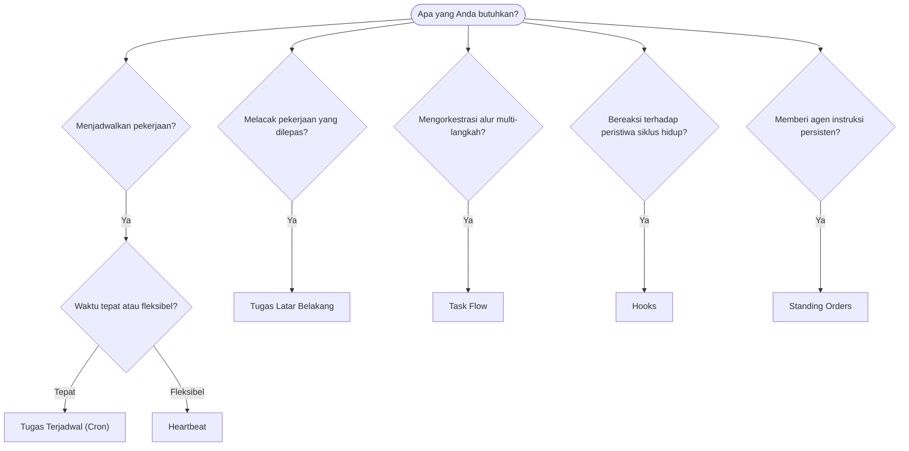

---
read_when:
    - Menentukan cara mengotomatisasi pekerjaan dengan OpenClaw
    - Memilih antara heartbeat, cron, hooks, dan standing orders
    - Mencari titik masuk otomatisasi yang tepat
summary: 'Gambaran umum mekanisme otomatisasi: tugas, cron, hooks, standing orders, dan Task Flow'
title: Otomatisasi & Tugas
x-i18n:
    generated_at: "2026-04-05T13:42:19Z"
    model: gpt-5.4
    provider: openai
    source_hash: 13cd05dcd2f38737f7bb19243ad1136978bfd727006fd65226daa3590f823afe
    source_path: automation/index.md
    workflow: 15
---

# Otomatisasi & Tugas

OpenClaw menjalankan pekerjaan di latar belakang melalui tugas, pekerjaan terjadwal, event hook, dan instruksi tetap. Halaman ini membantu Anda memilih mekanisme yang tepat dan memahami bagaimana semuanya saling terkait.

## Panduan keputusan cepat

| Kasus penggunaan                         | Rekomendasi           | Alasan                                          |
| --------------------------------------- | --------------------- | ----------------------------------------------- |
| Kirim laporan harian tepat pukul 9 pagi | Tugas Terjadwal (Cron) | Waktu tepat, eksekusi terisolasi               |
| Ingatkan saya dalam 20 menit            | Tugas Terjadwal (Cron) | Sekali jalan dengan waktu yang presisi (`--at`) |
| Jalankan analisis mendalam mingguan     | Tugas Terjadwal (Cron) | Tugas mandiri, dapat menggunakan model berbeda  |
| Periksa inbox setiap 30 menit           | Heartbeat             | Digabungkan dengan pemeriksaan lain, sadar konteks |
| Pantau kalender untuk acara mendatang   | Heartbeat             | Cocok secara alami untuk kesadaran berkala      |
| Periksa status subagent atau eksekusi ACP | Tugas Latar Belakang | Buku besar tugas melacak semua pekerjaan yang dilepas |
| Audit apa yang dijalankan dan kapan     | Tugas Latar Belakang  | `openclaw tasks list` dan `openclaw tasks audit` |
| Riset multi-langkah lalu rangkum        | Task Flow             | Orkestrasi tahan lama dengan pelacakan revisi   |
| Jalankan skrip saat reset sesi          | Hooks                 | Berbasis peristiwa, dipicu pada peristiwa siklus hidup |
| Jalankan kode pada setiap pemanggilan tool | Hooks               | Hooks dapat memfilter berdasarkan jenis peristiwa |
| Selalu periksa kepatuhan sebelum membalas | Standing Orders     | Disuntikkan ke setiap sesi secara otomatis      |

### Tugas Terjadwal (Cron) vs Heartbeat

| Dimensi         | Tugas Terjadwal (Cron)              | Heartbeat                            |
| --------------- | ----------------------------------- | ------------------------------------ |
| Waktu           | Tepat (ekspresi cron, sekali jalan) | Perkiraan (default setiap 30 menit)  |
| Konteks sesi    | Baru (terisolasi) atau bersama      | Konteks sesi utama penuh             |
| Catatan tugas   | Selalu dibuat                       | Tidak pernah dibuat                  |
| Penyampaian     | Channel, webhook, atau senyap       | Inline di sesi utama                 |
| Paling cocok untuk | Laporan, pengingat, pekerjaan latar belakang | Pemeriksaan inbox, kalender, notifikasi |

Gunakan Tugas Terjadwal (Cron) saat Anda membutuhkan waktu yang presisi atau eksekusi terisolasi. Gunakan Heartbeat saat pekerjaan mendapat manfaat dari konteks sesi penuh dan waktu perkiraan sudah memadai.

## Konsep inti

### Tugas terjadwal (cron)

Cron adalah penjadwal bawaan Gateway untuk waktu yang presisi. Cron menyimpan pekerjaan, membangunkan agen pada waktu yang tepat, dan dapat mengirimkan output ke channel obrolan atau endpoint webhook. Mendukung pengingat sekali jalan, ekspresi berulang, dan pemicu webhook masuk.

Lihat [Tugas Terjadwal](/automation/cron-jobs).

### Tugas

Buku besar tugas latar belakang melacak semua pekerjaan yang dilepas: eksekusi ACP, spawn subagent, eksekusi cron terisolasi, dan operasi CLI. Tugas adalah catatan, bukan penjadwal. Gunakan `openclaw tasks list` dan `openclaw tasks audit` untuk memeriksanya.

Lihat [Tugas Latar Belakang](/automation/tasks).

### Task Flow

Task Flow adalah substrat orkestrasi alur di atas tugas latar belakang. Task Flow mengelola alur multi-langkah yang tahan lama dengan mode sinkronisasi terkelola dan tercermin, pelacakan revisi, serta `openclaw tasks flow list|show|cancel` untuk inspeksi.

Lihat [Task Flow](/automation/taskflow).

### Standing orders

Standing orders memberi agen wewenang operasional permanen untuk program yang ditentukan. Standing orders disimpan dalam file workspace (biasanya `AGENTS.md`) dan disuntikkan ke setiap sesi. Gabungkan dengan cron untuk penegakan berbasis waktu.

Lihat [Standing Orders](/automation/standing-orders).

### Hooks

Hooks adalah skrip berbasis peristiwa yang dipicu oleh peristiwa siklus hidup agen (`/new`, `/reset`, `/stop`), pemadatan sesi, startup gateway, alur pesan, dan pemanggilan tool. Hooks ditemukan secara otomatis dari direktori dan dapat dikelola dengan `openclaw hooks`.

Lihat [Hooks](/automation/hooks).

### Heartbeat

Heartbeat adalah giliran sesi utama berkala (default setiap 30 menit). Heartbeat menggabungkan beberapa pemeriksaan (inbox, kalender, notifikasi) dalam satu giliran agen dengan konteks sesi penuh. Giliran heartbeat tidak membuat catatan tugas. Gunakan `HEARTBEAT.md` untuk daftar periksa kecil, atau blok `tasks:` saat Anda menginginkan pemeriksaan berkala hanya-saat-jatuh-tempo di dalam heartbeat itu sendiri. File heartbeat kosong dilewati sebagai `empty-heartbeat-file`; mode tugas hanya-saat-jatuh-tempo dilewati sebagai `no-tasks-due`.

Lihat [Heartbeat](/gateway/heartbeat).

## Cara kerjanya bersama-sama

- **Cron** menangani jadwal presisi (laporan harian, tinjauan mingguan) dan pengingat sekali jalan. Semua eksekusi cron membuat catatan tugas.
- **Heartbeat** menangani pemantauan rutin (inbox, kalender, notifikasi) dalam satu giliran gabungan setiap 30 menit.
- **Hooks** bereaksi terhadap peristiwa tertentu (pemanggilan tool, reset sesi, pemadatan) dengan skrip kustom.
- **Standing orders** memberi agen konteks persisten dan batas wewenang.
- **Task Flow** mengoordinasikan alur multi-langkah di atas tugas individual.
- **Tugas** secara otomatis melacak semua pekerjaan yang dilepas sehingga Anda dapat memeriksa dan mengauditnya.

## Terkait

- [Tugas Terjadwal](/automation/cron-jobs) — penjadwalan presisi dan pengingat sekali jalan
- [Tugas Latar Belakang](/automation/tasks) — buku besar tugas untuk semua pekerjaan yang dilepas
- [Task Flow](/automation/taskflow) — orkestrasi alur multi-langkah yang tahan lama
- [Hooks](/automation/hooks) — skrip siklus hidup berbasis peristiwa
- [Standing Orders](/automation/standing-orders) — instruksi agen persisten
- [Heartbeat](/gateway/heartbeat) — giliran sesi utama berkala
- [Referensi Konfigurasi](/gateway/configuration-reference) — semua kunci konfigurasi
