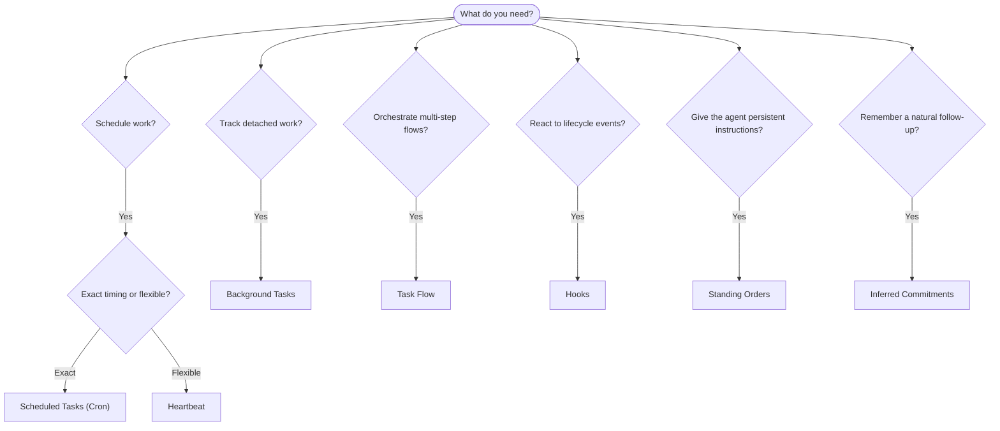

OpenClaw menjalankan pekerjaan di latar belakang melalui tugas, pekerjaan terjadwal, komitmen tersirat, hook peristiwa, dan instruksi tetap. Halaman ini membantu Anda memilih mekanisme yang tepat dan memahami bagaimana semuanya saling terhubung.

## Panduan keputusan cepat

| Kasus penggunaan                                   | Direkomendasikan       | Alasan                                             |
| -------------------------------------------------- | ---------------------- | -------------------------------------------------- |
| Kirim laporan harian tepat pukul 09.00             | Tugas Terjadwal (Cron) | Waktu tepat, eksekusi terisolasi                   |
| Ingatkan saya dalam 20 menit                       | Tugas Terjadwal (Cron) | Sekali jalan dengan waktu presisi (`--at`)         |
| Jalankan analisis mendalam mingguan                | Tugas Terjadwal (Cron) | Tugas mandiri, dapat menggunakan model berbeda     |
| Periksa kotak masuk setiap 30 menit                | Heartbeat              | Dikelompokkan dengan pemeriksaan lain, sadar konteks |
| Pantau kalender untuk acara mendatang              | Heartbeat              | Cocok alami untuk kesadaran berkala                |
| Tindak lanjuti setelah wawancara yang disebutkan   | Komitmen Tersirat      | Tindak lanjut seperti memori, tanpa permintaan pengingat tepat |
| Pemeriksaan perhatian ringan setelah konteks pengguna | Komitmen Tersirat    | Dicakup ke agen dan kanal yang sama                |
| Periksa status subagen atau eksekusi ACP           | Tugas Latar Belakang   | Buku besar tugas melacak semua pekerjaan terlepas  |
| Audit apa yang berjalan dan kapan                  | Tugas Latar Belakang   | `openclaw tasks list` dan `openclaw tasks audit`   |
| Riset multi-langkah lalu ringkas                   | Task Flow              | Orkestrasi tahan lama dengan pelacakan revisi      |
| Jalankan skrip saat sesi direset                   | Hook                   | Berbasis peristiwa, aktif pada peristiwa siklus hidup |
| Eksekusi kode pada setiap pemanggilan alat         | Hook Plugin            | Hook dalam proses dapat mencegat pemanggilan alat  |
| Selalu periksa kepatuhan sebelum membalas          | Perintah Tetap         | Disuntikkan otomatis ke setiap sesi                |

### Tugas Terjadwal (Cron) vs Heartbeat

| Dimensi         | Tugas Terjadwal (Cron)              | Heartbeat                             |
| --------------- | ----------------------------------- | ------------------------------------- |
| Waktu           | Tepat (ekspresi cron, sekali jalan) | Perkiraan (bawaan setiap 30 menit)    |
| Konteks sesi    | Baru (terisolasi) atau bersama      | Konteks sesi utama penuh              |
| Catatan tugas   | Selalu dibuat                       | Tidak pernah dibuat                   |
| Pengiriman      | Kanal, webhook, atau senyap         | Sebaris dalam sesi utama              |
| Paling cocok untuk | Laporan, pengingat, pekerjaan latar belakang | Pemeriksaan kotak masuk, kalender, notifikasi |

Gunakan Tugas Terjadwal (Cron) saat Anda membutuhkan waktu presisi atau eksekusi terisolasi. Gunakan Heartbeat saat pekerjaan diuntungkan oleh konteks sesi penuh dan waktu perkiraan sudah memadai.

## Konsep inti

### Tugas terjadwal (cron)

Cron adalah penjadwal bawaan Gateway untuk waktu presisi. Cron menyimpan pekerjaan, membangunkan agen pada waktu yang tepat, dan dapat mengirim keluaran ke kanal chat atau endpoint webhook. Mendukung pengingat sekali jalan, ekspresi berulang, dan pemicu webhook masuk.

Lihat [Tugas Terjadwal](/id/automation/cron-jobs).

### Tugas

Buku besar tugas latar belakang melacak semua pekerjaan terlepas: eksekusi ACP, pemunculan subagen, eksekusi cron terisolasi, dan operasi CLI. Tugas adalah catatan, bukan penjadwal. Gunakan `openclaw tasks list` dan `openclaw tasks audit` untuk memeriksanya.

Lihat [Tugas Latar Belakang](/id/automation/tasks).

### Komitmen tersirat

Komitmen adalah memori tindak lanjut yang ikut serta dan berumur pendek. OpenClaw menyimpulkannya dari percakapan normal, mencakupnya ke agen dan kanal yang sama, dan mengirim pemeriksaan saat jatuh tempo melalui heartbeat. Pengingat tepat yang diminta pengguna tetap menjadi ranah cron.

Lihat [Komitmen Tersirat](/id/concepts/commitments).

### Task Flow

Task Flow adalah substrat orkestrasi alur di atas tugas latar belakang. Task Flow mengelola alur multi-langkah yang tahan lama dengan mode sinkronisasi terkelola dan tercermin, pelacakan revisi, serta `openclaw tasks flow list|show|cancel` untuk inspeksi.

Lihat [Task Flow](/id/automation/taskflow).

### Perintah tetap

Perintah tetap memberi agen otoritas operasi permanen untuk program yang ditentukan. Perintah ini berada di file workspace (biasanya `AGENTS.md`) dan disuntikkan ke setiap sesi. Gabungkan dengan cron untuk penegakan berbasis waktu.

Lihat [Perintah Tetap](/id/automation/standing-orders).

### Hook

Hook internal adalah skrip berbasis peristiwa yang dipicu oleh peristiwa siklus hidup agen (`/new`, `/reset`, `/stop`), Compaction sesi, startup gateway, dan alur pesan. Hook ditemukan otomatis dari direktori dan dapat dikelola dengan `openclaw hooks`. Untuk intersepsi pemanggilan alat dalam proses, gunakan [Hook Plugin](/id/plugins/hooks).

Lihat [Hook](/id/automation/hooks).

### Heartbeat

Heartbeat adalah giliran sesi utama berkala (bawaan setiap 30 menit). Heartbeat mengelompokkan beberapa pemeriksaan (kotak masuk, kalender, notifikasi) dalam satu giliran agen dengan konteks sesi penuh. Giliran heartbeat tidak membuat catatan tugas dan tidak memperpanjang kesegaran reset sesi harian/menganggur. Gunakan `HEARTBEAT.md` untuk checklist kecil, atau blok `tasks:` saat Anda menginginkan pemeriksaan berkala hanya yang jatuh tempo di dalam heartbeat itu sendiri. File heartbeat kosong dilewati sebagai `empty-heartbeat-file`; mode tugas hanya jatuh tempo dilewati sebagai `no-tasks-due`. Heartbeat ditunda saat pekerjaan cron aktif atau mengantre, dan `heartbeat.skipWhenBusy` juga dapat menunda agen saat subagen atau jalur bertingkat berkunci sesi milik agen yang sama sedang sibuk.

Lihat [Heartbeat](/id/gateway/heartbeat).

## Cara semuanya bekerja bersama

- **Cron** menangani jadwal presisi (laporan harian, tinjauan mingguan) dan pengingat sekali jalan. Semua eksekusi cron membuat catatan tugas.
- **Heartbeat** menangani pemantauan rutin (kotak masuk, kalender, notifikasi) dalam satu giliran berkelompok setiap 30 menit.
- **Hook** bereaksi terhadap peristiwa tertentu (reset sesi, Compaction, alur pesan) dengan skrip khusus. Hook Plugin mencakup pemanggilan alat.
- **Perintah tetap** memberi agen konteks persisten dan batas otoritas.
- **Task Flow** mengoordinasikan alur multi-langkah di atas tugas individual.
- **Tugas** otomatis melacak semua pekerjaan terlepas agar Anda dapat memeriksa dan mengauditnya.

## Terkait

- [Tugas Terjadwal](/id/automation/cron-jobs) — penjadwalan presisi dan pengingat sekali jalan
- [Komitmen Tersirat](/id/concepts/commitments) — pemeriksaan tindak lanjut seperti memori
- [Tugas Latar Belakang](/id/automation/tasks) — buku besar tugas untuk semua pekerjaan terlepas
- [Task Flow](/id/automation/taskflow) — orkestrasi alur multi-langkah yang tahan lama
- [Hook](/id/automation/hooks) — skrip siklus hidup berbasis peristiwa
- [Hook Plugin](/id/plugins/hooks) — hook alat, prompt, pesan, dan siklus hidup dalam proses
- [Perintah Tetap](/id/automation/standing-orders) — instruksi agen persisten
- [Heartbeat](/id/gateway/heartbeat) — giliran sesi utama berkala
- [Referensi Konfigurasi](/id/gateway/configuration-reference) — semua kunci konfigurasi
