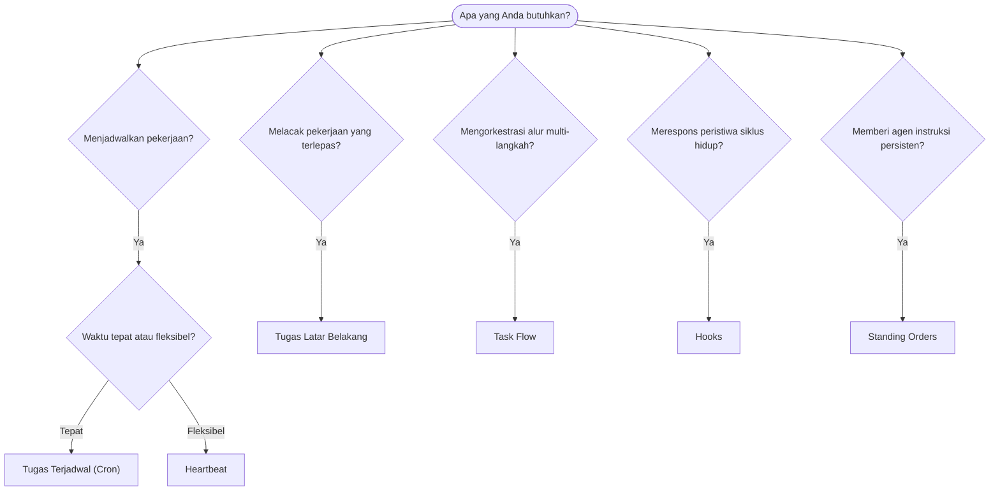

---
read_when:
    - Menentukan cara mengotomatisasi pekerjaan dengan OpenClaw
    - Memilih antara Heartbeat, Cron, hook, dan standing order
    - Mencari titik masuk otomatisasi yang tepat
summary: 'Ikhtisar mekanisme otomatisasi: tugas, cron, hook, standing order, dan TaskFlow'
title: Otomatisasi & tugas
x-i18n:
    generated_at: "2026-04-26T11:23:01Z"
    model: gpt-5.4
    provider: openai
    source_hash: 6d2a2d3ef58830133e07b34f33c611664fc1032247e9dd81005adf7fc0c43cdb
    source_path: automation/index.md
    workflow: 15
---

OpenClaw menjalankan pekerjaan di latar belakang melalui tugas, job terjadwal, hook peristiwa, dan instruksi tetap. Halaman ini membantu Anda memilih mekanisme yang tepat dan memahami bagaimana semuanya saling terhubung.

## Panduan keputusan cepat

| Kasus penggunaan                       | Rekomendasi           | Alasan                                           |
| -------------------------------------- | --------------------- | ------------------------------------------------ |
| Kirim laporan harian tepat pukul 9 AM  | Tugas Terjadwal (Cron) | Waktu presisi, eksekusi terisolasi               |
| Ingatkan saya dalam 20 menit           | Tugas Terjadwal (Cron) | Sekali jalan dengan waktu presisi (`--at`)       |
| Jalankan analisis mendalam mingguan    | Tugas Terjadwal (Cron) | Tugas mandiri, dapat menggunakan model berbeda   |
| Periksa kotak masuk setiap 30 menit    | Heartbeat             | Digabungkan dengan pemeriksaan lain, sadar konteks |
| Pantau kalender untuk acara mendatang  | Heartbeat             | Cocok secara alami untuk awareness berkala       |
| Periksa status subagen atau ACP run    | Tugas Latar Belakang  | Ledger tugas melacak semua pekerjaan terlepas    |
| Audit apa yang dijalankan dan kapan    | Tugas Latar Belakang  | `openclaw tasks list` dan `openclaw tasks audit` |
| Riset multi-langkah lalu rangkum       | Task Flow             | Orkestrasi tahan lama dengan pelacakan revisi    |
| Jalankan skrip saat reset sesi         | Hooks                 | Berbasis peristiwa, dipicu pada peristiwa siklus hidup |
| Eksekusi kode pada setiap pemanggilan tool | Plugin hooks       | Hook dalam proses dapat mencegat pemanggilan tool |
| Selalu periksa kepatuhan sebelum menjawab | Standing Orders    | Disuntikkan ke setiap sesi secara otomatis       |

### Tugas Terjadwal (Cron) vs Heartbeat

| Dimensi         | Tugas Terjadwal (Cron)              | Heartbeat                            |
| --------------- | ----------------------------------- | ------------------------------------ |
| Waktu           | Tepat (ekspresi cron, sekali jalan) | Perkiraan (default setiap 30 menit)  |
| Konteks sesi    | Baru (terisolasi) atau dibagikan    | Konteks sesi utama penuh             |
| Catatan tugas   | Selalu dibuat                       | Tidak pernah dibuat                  |
| Pengiriman      | Channel, Webhook, atau senyap       | Inline di sesi utama                 |
| Paling cocok untuk | Laporan, pengingat, job latar belakang | Pemeriksaan kotak masuk, kalender, notifikasi |

Gunakan Tugas Terjadwal (Cron) saat Anda memerlukan waktu presisi atau eksekusi terisolasi. Gunakan Heartbeat saat pekerjaan mendapat manfaat dari konteks sesi penuh dan waktu perkiraan sudah memadai.

## Konsep inti

### Tugas terjadwal (cron)

Cron adalah penjadwal bawaan Gateway untuk waktu yang presisi. Ini menyimpan job, membangunkan agen pada waktu yang tepat, dan dapat mengirimkan output ke channel chat atau endpoint Webhook. Mendukung pengingat sekali jalan, ekspresi berulang, dan pemicu Webhook masuk.

Lihat [Tugas Terjadwal](/id/automation/cron-jobs).

### Tugas

Ledger tugas latar belakang melacak semua pekerjaan yang terlepas: ACP run, spawn subagen, eksekusi cron terisolasi, dan operasi CLI. Tugas adalah catatan, bukan penjadwal. Gunakan `openclaw tasks list` dan `openclaw tasks audit` untuk memeriksanya.

Lihat [Tugas Latar Belakang](/id/automation/tasks).

### Task Flow

Task Flow adalah lapisan orkestrasi alur di atas tugas latar belakang. Ini mengelola alur multi-langkah yang tahan lama dengan mode sinkronisasi managed dan mirrored, pelacakan revisi, dan `openclaw tasks flow list|show|cancel` untuk inspeksi.

Lihat [Task Flow](/id/automation/taskflow).

### Standing orders

Standing order memberi agen otoritas operasional permanen untuk program yang ditentukan. Ini berada dalam file workspace (biasanya `AGENTS.md`) dan disuntikkan ke setiap sesi. Gabungkan dengan Cron untuk penegakan berbasis waktu.

Lihat [Standing Orders](/id/automation/standing-orders).

### Hooks

Hook internal adalah skrip berbasis peristiwa yang dipicu oleh peristiwa siklus hidup agen
(`/new`, `/reset`, `/stop`), Compaction sesi, startup gateway, dan alur
pesan. Hook ini secara otomatis ditemukan dari direktori dan dapat dikelola
dengan `openclaw hooks`. Untuk intersepsi pemanggilan tool dalam proses, gunakan
[Plugin hooks](/id/plugins/hooks).

Lihat [Hooks](/id/automation/hooks).

### Heartbeat

Heartbeat adalah giliran sesi utama berkala (default setiap 30 menit). Ini menggabungkan beberapa pemeriksaan (kotak masuk, kalender, notifikasi) dalam satu giliran agen dengan konteks sesi penuh. Giliran Heartbeat tidak membuat catatan tugas dan tidak memperpanjang kesegaran reset sesi harian/idle. Gunakan `HEARTBEAT.md` untuk checklist kecil, atau blok `tasks:` saat Anda menginginkan pemeriksaan berkala hanya-saat-jatuh-tempo di dalam heartbeat itu sendiri. File heartbeat kosong dilewati sebagai `empty-heartbeat-file`; mode tugas hanya-saat-jatuh-tempo dilewati sebagai `no-tasks-due`.

Lihat [Heartbeat](/id/gateway/heartbeat).

## Cara kerjanya bersama

- **Cron** menangani jadwal presisi (laporan harian, tinjauan mingguan) dan pengingat sekali jalan. Semua eksekusi cron membuat catatan tugas.
- **Heartbeat** menangani pemantauan rutin (kotak masuk, kalender, notifikasi) dalam satu giliran gabungan setiap 30 menit.
- **Hooks** merespons peristiwa tertentu (reset sesi, Compaction, alur pesan) dengan skrip kustom. Plugin hooks mencakup pemanggilan tool.
- **Standing orders** memberi agen konteks persisten dan batas otoritas.
- **Task Flow** mengoordinasikan alur multi-langkah di atas tugas individual.
- **Tasks** secara otomatis melacak semua pekerjaan yang terlepas sehingga Anda dapat memeriksa dan mengauditnya.

## Terkait

- [Tugas Terjadwal](/id/automation/cron-jobs) — penjadwalan presisi dan pengingat sekali jalan
- [Tugas Latar Belakang](/id/automation/tasks) — ledger tugas untuk semua pekerjaan yang terlepas
- [Task Flow](/id/automation/taskflow) — orkestrasi alur multi-langkah yang tahan lama
- [Hooks](/id/automation/hooks) — skrip siklus hidup berbasis peristiwa
- [Plugin hooks](/id/plugins/hooks) — hook tool, prompt, pesan, dan siklus hidup dalam proses
- [Standing Orders](/id/automation/standing-orders) — instruksi agen persisten
- [Heartbeat](/id/gateway/heartbeat) — giliran sesi utama berkala
- [Referensi Konfigurasi](/id/gateway/configuration-reference) — semua kunci konfigurasi
