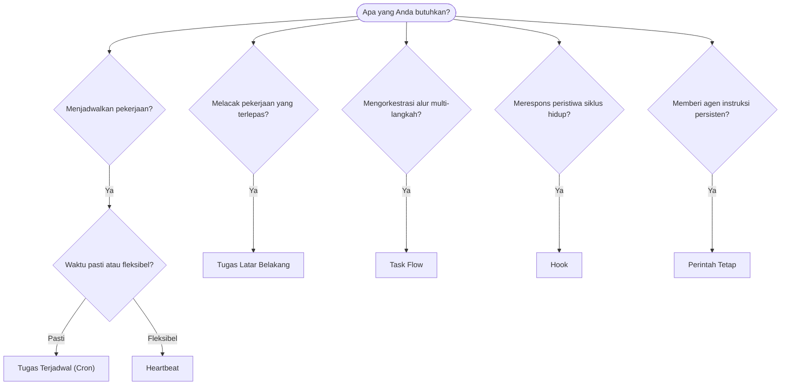

---
read_when:
    - Menentukan cara mengotomatisasi pekerjaan dengan OpenClaw
    - Memilih antara Heartbeat, Cron, hook, dan perintah tetap
    - Mencari titik masuk otomatisasi yang tepat
summary: 'Ikhtisar mekanisme otomatisasi: tugas, Cron, hook, perintah tetap, dan TaskFlow'
title: Otomatisasi & tugas
x-i18n:
    generated_at: "2026-04-24T08:57:11Z"
    model: gpt-5.4
    provider: openai
    source_hash: 1b4615cc05a6d0ef7c92f44072d11a2541bc5e17b7acb88dc27ddf0c36b2dcab
    source_path: automation/index.md
    workflow: 15
---

OpenClaw menjalankan pekerjaan di latar belakang melalui tugas, pekerjaan terjadwal, hook peristiwa, dan instruksi tetap. Halaman ini membantu Anda memilih mekanisme yang tepat dan memahami bagaimana semuanya saling terhubung.

## Panduan keputusan cepat

| Kasus penggunaan                         | Rekomendasi           | Alasan                                           |
| ---------------------------------------- | --------------------- | ------------------------------------------------ |
| Kirim laporan harian tepat pukul 9 pagi  | Tugas Terjadwal (Cron) | Waktu tepat, eksekusi terisolasi                 |
| Ingatkan saya dalam 20 menit             | Tugas Terjadwal (Cron) | Sekali jalan dengan waktu presisi (`--at`)       |
| Jalankan analisis mendalam mingguan      | Tugas Terjadwal (Cron) | Tugas mandiri, dapat menggunakan model berbeda   |
| Periksa kotak masuk setiap 30 menit      | Heartbeat             | Digabung dengan pemeriksaan lain, sadar konteks  |
| Pantau kalender untuk acara mendatang    | Heartbeat             | Cocok secara alami untuk kesadaran berkala       |
| Periksa status subagen atau eksekusi ACP | Tugas Latar Belakang  | Buku besar tugas melacak semua pekerjaan terlepas |
| Audit apa yang dijalankan dan kapan      | Tugas Latar Belakang  | `openclaw tasks list` dan `openclaw tasks audit` |
| Riset multi-langkah lalu rangkum         | Task Flow             | Orkestrasi tahan lama dengan pelacakan revisi    |
| Jalankan skrip saat sesi direset         | Hook                  | Berbasis peristiwa, dipicu pada peristiwa siklus hidup |
| Jalankan kode pada setiap pemanggilan alat | Hook                | Hook dapat memfilter berdasarkan jenis peristiwa |
| Selalu periksa kepatuhan sebelum membalas | Perintah Tetap       | Disisipkan ke setiap sesi secara otomatis        |

### Tugas Terjadwal (Cron) vs Heartbeat

| Dimensi        | Tugas Terjadwal (Cron)              | Heartbeat                            |
| -------------- | ----------------------------------- | ------------------------------------ |
| Waktu          | Tepat (ekspresi cron, sekali jalan) | Perkiraan (default setiap 30 menit)  |
| Konteks sesi   | Baru (terisolasi) atau dibagikan    | Konteks sesi utama penuh             |
| Catatan tugas  | Selalu dibuat                       | Tidak pernah dibuat                  |
| Pengiriman     | Kanal, Webhook, atau senyap         | Inline di sesi utama                 |
| Paling cocok untuk | Laporan, pengingat, pekerjaan latar belakang | Pemeriksaan kotak masuk, kalender, notifikasi |

Gunakan Tugas Terjadwal (Cron) saat Anda membutuhkan waktu yang presisi atau eksekusi terisolasi. Gunakan Heartbeat saat pekerjaan mendapat manfaat dari konteks sesi penuh dan waktu perkiraan sudah memadai.

## Konsep inti

### Tugas terjadwal (cron)

Cron adalah penjadwal bawaan Gateway untuk waktu yang presisi. Cron menyimpan pekerjaan, membangunkan agen pada waktu yang tepat, dan dapat mengirimkan output ke kanal obrolan atau endpoint Webhook. Mendukung pengingat sekali jalan, ekspresi berulang, dan pemicu Webhook masuk.

Lihat [Tugas Terjadwal](/id/automation/cron-jobs).

### Tugas

Buku besar tugas latar belakang melacak semua pekerjaan yang terlepas: eksekusi ACP, pemunculan subagen, eksekusi cron terisolasi, dan operasi CLI. Tugas adalah catatan, bukan penjadwal. Gunakan `openclaw tasks list` dan `openclaw tasks audit` untuk memeriksanya.

Lihat [Tugas Latar Belakang](/id/automation/tasks).

### Task Flow

Task Flow adalah substrat orkestrasi alur di atas tugas latar belakang. Task Flow mengelola alur multi-langkah yang tahan lama dengan mode sinkronisasi terkelola dan tercermin, pelacakan revisi, serta `openclaw tasks flow list|show|cancel` untuk pemeriksaan.

Lihat [Task Flow](/id/automation/taskflow).

### Perintah tetap

Perintah tetap memberi agen kewenangan operasional permanen untuk program yang ditentukan. Perintah tetap berada di file workspace (biasanya `AGENTS.md`) dan disisipkan ke setiap sesi. Kombinasikan dengan cron untuk penegakan berbasis waktu.

Lihat [Perintah Tetap](/id/automation/standing-orders).

### Hook

Hook adalah skrip berbasis peristiwa yang dipicu oleh peristiwa siklus hidup agen (`/new`, `/reset`, `/stop`), Compaction sesi, startup gateway, alur pesan, dan pemanggilan alat. Hook ditemukan secara otomatis dari direktori dan dapat dikelola dengan `openclaw hooks`.

Lihat [Hook](/id/automation/hooks).

### Heartbeat

Heartbeat adalah giliran sesi utama berkala (default setiap 30 menit). Heartbeat menggabungkan beberapa pemeriksaan (kotak masuk, kalender, notifikasi) dalam satu giliran agen dengan konteks sesi penuh. Giliran Heartbeat tidak membuat catatan tugas. Gunakan `HEARTBEAT.md` untuk daftar periksa kecil, atau blok `tasks:` saat Anda menginginkan pemeriksaan berkala hanya-saat-jatuh-tempo di dalam heartbeat itu sendiri. File heartbeat yang kosong dilewati sebagai `empty-heartbeat-file`; mode tugas hanya-saat-jatuh-tempo dilewati sebagai `no-tasks-due`.

Lihat [Heartbeat](/id/gateway/heartbeat).

## Cara semuanya bekerja bersama

- **Cron** menangani jadwal presisi (laporan harian, tinjauan mingguan) dan pengingat sekali jalan. Semua eksekusi cron membuat catatan tugas.
- **Heartbeat** menangani pemantauan rutin (kotak masuk, kalender, notifikasi) dalam satu giliran gabungan setiap 30 menit.
- **Hook** merespons peristiwa tertentu (pemanggilan alat, reset sesi, Compaction) dengan skrip kustom.
- **Perintah tetap** memberi agen konteks persisten dan batas kewenangan.
- **Task Flow** mengoordinasikan alur multi-langkah di atas tugas individual.
- **Tugas** secara otomatis melacak semua pekerjaan yang terlepas sehingga Anda dapat memeriksa dan mengauditnya.

## Terkait

- [Tugas Terjadwal](/id/automation/cron-jobs) — penjadwalan presisi dan pengingat sekali jalan
- [Tugas Latar Belakang](/id/automation/tasks) — buku besar tugas untuk semua pekerjaan yang terlepas
- [Task Flow](/id/automation/taskflow) — orkestrasi alur multi-langkah yang tahan lama
- [Hook](/id/automation/hooks) — skrip siklus hidup berbasis peristiwa
- [Perintah Tetap](/id/automation/standing-orders) — instruksi agen persisten
- [Heartbeat](/id/gateway/heartbeat) — giliran sesi utama berkala
- [Referensi Konfigurasi](/id/gateway/configuration-reference) — semua kunci konfigurasi
