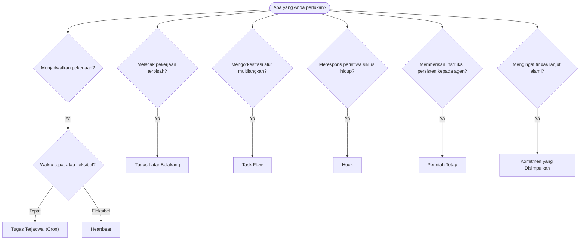

OpenClaw menjalankan pekerjaan di latar belakang melalui tugas, pekerjaan terjadwal, komitmen yang disimpulkan, hook peristiwa, dan instruksi tetap. Gunakan halaman ini untuk memilih mekanisme yang tepat.

## Panduan keputusan cepat

| Kasus penggunaan                                      | Rekomendasi                    | Alasan                                                     |
| ----------------------------------------------------- | ------------------------------ | ---------------------------------------------------------- |
| Kirim laporan harian tepat pukul 09.00                | Tugas Terjadwal (Cron)         | Waktu tepat, eksekusi terisolasi                           |
| Ingatkan saya dalam 20 menit                          | Tugas Terjadwal (Cron)         | Sekali jalan dengan waktu yang presisi (`--at`)            |
| Jalankan analisis mendalam mingguan                   | Tugas Terjadwal (Cron)         | Tugas mandiri, dapat menggunakan model berbeda             |
| Periksa kotak masuk setiap 30 menit                   | Heartbeat                      | Digabungkan dengan pemeriksaan lain, sadar konteks         |
| Pantau kalender untuk acara mendatang                 | Heartbeat                      | Cocok secara alami untuk pemantauan berkala                |
| Tindak lanjuti setelah wawancara yang disebutkan      | Komitmen yang Disimpulkan      | Tindak lanjut seperti memori, tanpa permintaan pengingat tepat |
| Tindak lanjut perhatian ringan setelah konteks pengguna | Komitmen yang Disimpulkan    | Dibatasi pada agen dan kanal yang sama                      |
| Periksa status subagen atau proses ACP                | Tugas Latar Belakang           | Buku besar tugas melacak semua pekerjaan terpisah          |
| Audit apa yang berjalan dan kapan                     | Tugas Latar Belakang           | `openclaw tasks list` dan `openclaw tasks audit`           |
| Riset multilangkah lalu rangkum                       | Task Flow                      | Orkestrasi persisten dengan pelacakan revisi               |
| Jalankan skrip saat sesi diatur ulang                 | Hook                           | Berbasis peristiwa, dipicu pada peristiwa siklus hidup     |
| Eksekusi kode pada setiap pemanggilan alat            | Hook Plugin                    | Hook dalam proses dapat mencegat pemanggilan alat          |
| Selalu periksa kepatuhan sebelum membalas             | Perintah Tetap                 | Disuntikkan ke setiap sesi secara otomatis                 |

### Tugas Terjadwal (Cron) dibandingkan dengan Heartbeat

| Dimensi         | Tugas Terjadwal (Cron)                 | Heartbeat                                  |
| --------------- | -------------------------------------- | ------------------------------------------ |
| Waktu           | Tepat (ekspresi cron, sekali jalan)     | Perkiraan (bawaan setiap 30 menit)          |
| Konteks sesi    | Baru (terisolasi) atau bersama          | Konteks lengkap sesi utama                 |
| Catatan tugas   | Selalu dibuat                           | Tidak pernah dibuat                        |
| Pengiriman      | Kanal, webhook, atau tanpa keluaran     | Langsung di sesi utama                     |
| Paling cocok untuk | Laporan, pengingat, pekerjaan latar belakang | Pemeriksaan kotak masuk, kalender, notifikasi |

Gunakan Tugas Terjadwal (Cron) saat Anda memerlukan waktu yang presisi atau eksekusi terisolasi. Gunakan Heartbeat saat pekerjaan memperoleh manfaat dari konteks sesi lengkap dan waktu perkiraan sudah memadai.

## Konsep inti

### Tugas terjadwal (cron)

Cron adalah penjadwal bawaan Gateway untuk waktu yang presisi. Cron menyimpan pekerjaan, membangunkan agen pada waktu yang tepat, dan dapat mengirimkan keluaran ke kanal percakapan atau endpoint webhook. Mendukung pengingat sekali jalan, ekspresi berulang, dan pemicu webhook masuk.

Lihat [Tugas Terjadwal](/id/automation/cron-jobs).

### Tugas

Buku besar tugas latar belakang melacak semua pekerjaan terpisah: proses ACP, pembuatan subagen, eksekusi cron terisolasi, dan operasi CLI. Tugas adalah catatan, bukan penjadwal. Gunakan `openclaw tasks list` dan `openclaw tasks audit` untuk memeriksanya.

Lihat [Tugas Latar Belakang](/id/automation/tasks).

### Komitmen yang disimpulkan

Komitmen adalah memori tindak lanjut jangka pendek yang harus diaktifkan secara eksplisit. OpenClaw menyimpulkannya dari percakapan biasa, membatasinya pada agen dan kanal yang sama, serta menyampaikan tindak lanjut yang jatuh tempo melalui Heartbeat. Pengingat dengan waktu tepat yang diminta pengguna tetap menjadi ranah cron.

Lihat [Komitmen yang Disimpulkan](/id/concepts/commitments).

### Task Flow

Task Flow adalah landasan orkestrasi alur di atas tugas latar belakang. Task Flow mengelola alur multilangkah persisten dengan mode sinkronisasi terkelola dan tercermin, pelacakan revisi, serta `openclaw tasks flow list|show|cancel` untuk pemeriksaan.

Lihat [Task Flow](/id/automation/taskflow).

### Perintah tetap

Perintah tetap memberikan wewenang operasional permanen kepada agen untuk program yang ditentukan. Perintah tersebut berada dalam berkas ruang kerja (biasanya `AGENTS.md`) dan disuntikkan ke setiap sesi. Gabungkan dengan cron untuk penerapan berbasis waktu.

Lihat [Perintah Tetap](/id/automation/standing-orders).

### Hook

Hook internal adalah skrip berbasis peristiwa yang dipicu oleh peristiwa siklus hidup agen (`/new`, `/reset`, `/stop`), Compaction sesi, startup Gateway, dan alur pesan. Hook ditemukan dari direktori hook dan dikelola dengan `openclaw hooks`. Untuk pencegatan pemanggilan alat dalam proses, gunakan [hook Plugin](/id/plugins/hooks).

Lihat [Hook](/id/automation/hooks).

### Heartbeat

Heartbeat adalah giliran sesi utama berkala (bawaan setiap 30 menit). Heartbeat menggabungkan beberapa pemeriksaan (kotak masuk, kalender, notifikasi) dalam satu giliran agen dengan konteks sesi lengkap. Giliran Heartbeat tidak membuat catatan tugas dan tidak memperpanjang kebaruan pengaturan ulang sesi harian/tidak aktif. Gunakan `HEARTBEAT.md` untuk daftar periksa singkat, atau blok `tasks:` jika Anda menginginkan pemeriksaan berkala yang hanya dijalankan saat jatuh tempo di dalam Heartbeat itu sendiri. Berkas Heartbeat kosong dilewati sebagai `empty-heartbeat-file`; mode tugas khusus jatuh tempo dilewati sebagai `no-tasks-due`. Heartbeat ditunda saat pekerjaan cron aktif atau mengantre, dan `heartbeat.skipWhenBusy` juga dapat menunda agen saat lajur subagen berbasis kunci sesi atau lajur bertingkat milik agen yang sama sedang sibuk.

Lihat [Heartbeat](/id/gateway/heartbeat).

## Cara semuanya bekerja bersama

- **Cron** menangani jadwal presisi (laporan harian, tinjauan mingguan) dan pengingat sekali jalan. Semua eksekusi cron membuat catatan tugas.
- **Heartbeat** menangani pemantauan rutin (kotak masuk, kalender, notifikasi) dalam satu giliran gabungan setiap 30 menit.
- **Hook** merespons peristiwa tertentu (pengaturan ulang sesi, Compaction, alur pesan) dengan skrip khusus. Hook Plugin mencakup pemanggilan alat.
- **Perintah tetap** memberikan konteks persisten dan batas wewenang kepada agen.
- **Task Flow** mengoordinasikan alur multilangkah di atas tugas individual.
- **Tugas** secara otomatis melacak semua pekerjaan terpisah agar Anda dapat memeriksa dan mengauditnya.

## Terkait

- [Tugas Terjadwal](/id/automation/cron-jobs) — penjadwalan presisi dan pengingat sekali jalan
- [Komitmen yang Disimpulkan](/id/concepts/commitments) — tindak lanjut seperti memori
- [Tugas Latar Belakang](/id/automation/tasks) — buku besar tugas untuk semua pekerjaan terpisah
- [Task Flow](/id/automation/taskflow) — orkestrasi alur multilangkah persisten
- [Hook](/id/automation/hooks) — skrip siklus hidup berbasis peristiwa
- [Hook Plugin](/id/plugins/hooks) — hook alat, prompt, pesan, dan siklus hidup dalam proses
- [Perintah Tetap](/id/automation/standing-orders) — instruksi agen persisten
- [Heartbeat](/id/gateway/heartbeat) — giliran sesi utama berkala
- [Referensi Konfigurasi](/id/gateway/configuration-reference) — semua kunci konfigurasi
