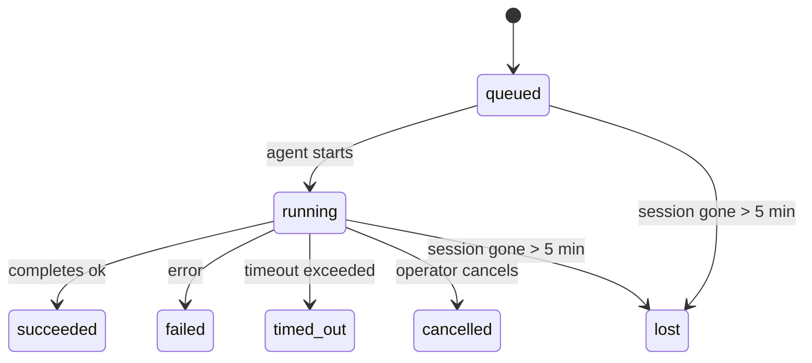

---
read_when:
    - Memeriksa pekerjaan latar belakang yang sedang berlangsung atau baru saja selesai
    - Men-debug kegagalan pengiriman untuk proses agen terlepas
    - Memahami bagaimana proses latar belakang berkaitan dengan sesi, cron, dan heartbeat
summary: Pelacakan tugas latar belakang untuk proses ACP, subagen, job cron terisolasi, dan operasi CLI
title: Tugas Latar Belakang
x-i18n:
    generated_at: "2026-04-05T13:42:46Z"
    model: gpt-5.4
    provider: openai
    source_hash: 6c95ccf4388d07e60a7bb68746b161793f4bb5ff2ba3d5ce9e51f2225dab2c4d
    source_path: automation/tasks.md
    workflow: 15
---

# Tugas Latar Belakang

> **Mencari penjadwalan?** Lihat [Otomasi & Tugas](/automation) untuk memilih mekanisme yang tepat. Halaman ini membahas **pelacakan** pekerjaan latar belakang, bukan penjadwalannya.

Tugas latar belakang melacak pekerjaan yang berjalan **di luar sesi percakapan utama Anda**:
proses ACP, pemunculan subagen, eksekusi job cron terisolasi, dan operasi yang dimulai dari CLI.

Tugas **tidak** menggantikan sesi, job cron, atau heartbeat — tugas adalah **buku besar aktivitas** yang mencatat pekerjaan terlepas apa yang terjadi, kapan terjadi, dan apakah berhasil.

<Note>
Tidak setiap proses agen membuat tugas. Giliran heartbeat dan chat interaktif normal tidak membuat tugas. Semua eksekusi cron, pemunculan ACP, pemunculan subagen, dan perintah agen CLI membuat tugas.
</Note>

## Ringkasan

- Tugas adalah **catatan**, bukan penjadwal — cron dan heartbeat menentukan _kapan_ pekerjaan berjalan, tugas melacak _apa yang terjadi_.
- ACP, subagen, semua job cron, dan operasi CLI membuat tugas. Giliran heartbeat tidak membuat tugas.
- Setiap tugas berpindah melalui `queued → running → terminal` (`succeeded`, `failed`, `timed_out`, `cancelled`, atau `lost`).
- Tugas cron tetap aktif selama runtime cron masih memiliki job tersebut; tugas CLI berbasis chat tetap aktif hanya selama konteks proses pemiliknya masih aktif.
- Penyelesaian didorong oleh push: pekerjaan terlepas dapat memberi tahu secara langsung atau membangunkan sesi/heartbeat peminta saat selesai, jadi loop polling status biasanya bukan pola yang tepat.
- Proses cron terisolasi dan penyelesaian subagen sebisa mungkin membersihkan tab/proses browser yang dilacak untuk sesi anaknya sebelum pembukuan pembersihan akhir.
- Pengiriman cron terisolasi menekan balasan perantara induk yang sudah usang saat pekerjaan subagen turunan masih dikuras, dan memprioritaskan output akhir turunan jika output itu tiba sebelum pengiriman.
- Notifikasi penyelesaian dikirim langsung ke channel atau diantrikan untuk heartbeat berikutnya.
- `openclaw tasks list` menampilkan semua tugas; `openclaw tasks audit` menampilkan masalah.
- Rekaman terminal disimpan selama 7 hari, lalu dipangkas secara otomatis.

## Mulai cepat

```bash
# Daftar semua tugas (terbaru terlebih dahulu)
openclaw tasks list

# Filter berdasarkan runtime atau status
openclaw tasks list --runtime acp
openclaw tasks list --status running

# Tampilkan detail untuk tugas tertentu (berdasarkan ID, ID proses, atau kunci sesi)
openclaw tasks show <lookup>

# Batalkan tugas yang sedang berjalan (menghentikan sesi anak)
openclaw tasks cancel <lookup>

# Ubah kebijakan notifikasi untuk suatu tugas
openclaw tasks notify <lookup> state_changes

# Jalankan audit kesehatan
openclaw tasks audit

# Pratinjau atau terapkan pemeliharaan
openclaw tasks maintenance
openclaw tasks maintenance --apply

# Periksa status Task Flow
openclaw tasks flow list
openclaw tasks flow show <lookup>
openclaw tasks flow cancel <lookup>
```

## Apa yang membuat tugas

| Sumber                 | Jenis runtime | Kapan rekaman tugas dibuat                           | Kebijakan notifikasi default |
| ---------------------- | ------------- | ---------------------------------------------------- | ---------------------------- |
| Proses latar belakang ACP | `acp`      | Memunculkan sesi anak ACP                            | `done_only`                  |
| Orkestrasi subagen     | `subagent`    | Memunculkan subagen melalui `sessions_spawn`         | `done_only`                  |
| Job cron (semua jenis) | `cron`        | Setiap eksekusi cron (sesi utama dan terisolasi)     | `silent`                     |
| Operasi CLI            | `cli`         | Perintah `openclaw agent` yang berjalan melalui gateway | `silent`                  |

Tugas cron sesi utama menggunakan kebijakan notifikasi `silent` secara default — tugas ini membuat rekaman untuk pelacakan tetapi tidak menghasilkan notifikasi. Tugas cron terisolasi juga default ke `silent` tetapi lebih terlihat karena berjalan dalam sesinya sendiri.

**Yang tidak membuat tugas:**

- Giliran heartbeat — sesi utama; lihat [Heartbeat](/gateway/heartbeat)
- Giliran chat interaktif normal
- Respons `/command` langsung

## Siklus hidup tugas



| Status      | Artinya                                                                      |
| ----------- | ---------------------------------------------------------------------------- |
| `queued`    | Dibuat, menunggu agen memulai                                                |
| `running`   | Giliran agen sedang dieksekusi secara aktif                                  |
| `succeeded` | Selesai dengan sukses                                                        |
| `failed`    | Selesai dengan error                                                         |
| `timed_out` | Melebihi batas waktu yang dikonfigurasi                                      |
| `cancelled` | Dihentikan oleh operator melalui `openclaw tasks cancel`                     |
| `lost`      | Runtime kehilangan status dukungan yang otoritatif setelah masa tenggang 5 menit |

Transisi terjadi secara otomatis — saat proses agen terkait berakhir, status tugas diperbarui agar sesuai.

`lost` bergantung pada runtime:

- Tugas ACP: metadata sesi anak ACP pendukung menghilang.
- Tugas subagen: sesi anak pendukung menghilang dari penyimpanan agen target.
- Tugas cron: runtime cron tidak lagi melacak job tersebut sebagai aktif.
- Tugas CLI: tugas sesi anak terisolasi menggunakan sesi anak; tugas CLI berbasis chat menggunakan konteks proses langsung, sehingga baris sesi channel/grup/langsung yang tersisa tidak membuatnya tetap aktif.

## Pengiriman dan notifikasi

Saat sebuah tugas mencapai status terminal, OpenClaw memberi tahu Anda. Ada dua jalur pengiriman:

**Pengiriman langsung** — jika tugas memiliki target channel (`requesterOrigin`), pesan penyelesaian langsung dikirim ke channel tersebut (Telegram, Discord, Slack, dll.). Untuk penyelesaian subagen, OpenClaw juga mempertahankan perutean thread/topik yang terikat saat tersedia dan dapat mengisi `to` / akun yang hilang dari rute tersimpan sesi peminta (`lastChannel` / `lastTo` / `lastAccountId`) sebelum menyerah pada pengiriman langsung.

**Pengiriman melalui antrean sesi** — jika pengiriman langsung gagal atau tidak ada origin yang ditetapkan, pembaruan diantrikan sebagai peristiwa sistem dalam sesi peminta dan akan muncul pada heartbeat berikutnya.

<Tip>
Penyelesaian tugas memicu kebangkitan heartbeat segera sehingga Anda dapat melihat hasilnya dengan cepat — Anda tidak perlu menunggu tick heartbeat terjadwal berikutnya.
</Tip>

Artinya, alur kerja yang umum bersifat berbasis push: mulai pekerjaan terlepas sekali, lalu biarkan runtime membangunkan atau memberi tahu Anda saat selesai. Poll status tugas hanya saat Anda memerlukan debugging, intervensi, atau audit eksplisit.

### Kebijakan notifikasi

Kendalikan seberapa banyak Anda menerima kabar tentang setiap tugas:

| Kebijakan              | Yang dikirim                                                           |
| ---------------------- | ---------------------------------------------------------------------- |
| `done_only` (default)  | Hanya status terminal (`succeeded`, `failed`, dll.) — **ini adalah default** |
| `state_changes`        | Setiap transisi status dan pembaruan progres                           |
| `silent`               | Tidak ada sama sekali                                                  |

Ubah kebijakan saat tugas sedang berjalan:

```bash
openclaw tasks notify <lookup> state_changes
```

## Referensi CLI

### `tasks list`

```bash
openclaw tasks list [--runtime <acp|subagent|cron|cli>] [--status <status>] [--json]
```

Kolom output: ID Tugas, Jenis, Status, Pengiriman, ID Proses, Sesi Anak, Ringkasan.

### `tasks show`

```bash
openclaw tasks show <lookup>
```

Token lookup menerima ID tugas, ID proses, atau kunci sesi. Menampilkan rekaman lengkap termasuk waktu, status pengiriman, error, dan ringkasan terminal.

### `tasks cancel`

```bash
openclaw tasks cancel <lookup>
```

Untuk tugas ACP dan subagen, ini menghentikan sesi anak. Status bertransisi ke `cancelled` dan notifikasi pengiriman dikirim.

### `tasks notify`

```bash
openclaw tasks notify <lookup> <done_only|state_changes|silent>
```

### `tasks audit`

```bash
openclaw tasks audit [--json]
```

Menampilkan masalah operasional. Temuan juga muncul di `openclaw status` saat masalah terdeteksi.

| Temuan                    | Tingkat keparahan | Pemicu                                                |
| ------------------------- | ----------------- | ----------------------------------------------------- |
| `stale_queued`            | peringatan        | Berada di antrean lebih dari 10 menit                 |
| `stale_running`           | error             | Berjalan lebih dari 30 menit                          |
| `lost`                    | error             | Kepemilikan tugas berbasis runtime menghilang         |
| `delivery_failed`         | peringatan        | Pengiriman gagal dan kebijakan notifikasi bukan `silent` |
| `missing_cleanup`         | peringatan        | Tugas terminal tanpa stempel waktu pembersihan        |
| `inconsistent_timestamps` | peringatan        | Pelanggaran linimasa (misalnya berakhir sebelum dimulai) |

### `tasks maintenance`

```bash
openclaw tasks maintenance [--json]
openclaw tasks maintenance --apply [--json]
```

Gunakan ini untuk mempratinjau atau menerapkan rekonsiliasi, penandaan pembersihan, dan pemangkasan untuk tugas dan status Task Flow.

Rekonsiliasi bergantung pada runtime:

- Tugas ACP/subagen memeriksa sesi anak pendukungnya.
- Tugas cron memeriksa apakah runtime cron masih memiliki job tersebut.
- Tugas CLI berbasis chat memeriksa konteks proses langsung milik pemiliknya, bukan hanya baris sesi chat.

Pembersihan penyelesaian juga bergantung pada runtime:

- Penyelesaian subagen sebisa mungkin menutup tab/proses browser yang dilacak untuk sesi anak sebelum pembersihan pengumuman dilanjutkan.
- Penyelesaian cron terisolasi sebisa mungkin menutup tab/proses browser yang dilacak untuk sesi cron sebelum proses sepenuhnya dibongkar.
- Pengiriman cron terisolasi menunggu tindak lanjut subagen turunan bila perlu dan menekan teks pengakuan induk yang sudah usang alih-alih mengumumkannya.
- Pengiriman penyelesaian subagen memprioritaskan teks asisten terbaru yang terlihat; jika kosong, pengiriman akan menggunakan cadangan berupa teks tool/toolResult terbaru yang telah disanitasi, dan proses panggilan tool yang hanya timeout dapat diringkas menjadi ringkasan progres parsial yang singkat.
- Kegagalan pembersihan tidak menutupi hasil tugas yang sebenarnya.

### `tasks flow list|show|cancel`

```bash
openclaw tasks flow list [--status <status>] [--json]
openclaw tasks flow show <lookup> [--json]
openclaw tasks flow cancel <lookup>
```

Gunakan ini saat Task Flow pengorkestrasi adalah hal yang Anda pedulikan, bukan satu rekaman tugas latar belakang individual.

## Papan tugas chat (`/tasks`)

Gunakan `/tasks` di sesi chat mana pun untuk melihat tugas latar belakang yang ditautkan ke sesi tersebut. Papan ini menampilkan tugas aktif dan yang baru saja selesai beserta runtime, status, waktu, dan detail progres atau error.

Saat sesi saat ini tidak memiliki tugas tertaut yang terlihat, `/tasks` akan menggunakan cadangan berupa jumlah tugas lokal agen sehingga Anda tetap mendapatkan gambaran umum tanpa membocorkan detail sesi lain.

Untuk buku besar operator lengkap, gunakan CLI: `openclaw tasks list`.

## Integrasi status (tekanan tugas)

`openclaw status` menyertakan ringkasan tugas sekilas:

```
Tasks: 3 queued · 2 running · 1 issues
```

Ringkasan ini melaporkan:

- **active** — jumlah `queued` + `running`
- **failures** — jumlah `failed` + `timed_out` + `lost`
- **byRuntime** — perincian berdasarkan `acp`, `subagent`, `cron`, `cli`

Baik `/status` maupun tool `session_status` menggunakan snapshot tugas yang sadar pembersihan: tugas aktif diprioritaskan, baris selesai yang basi disembunyikan, dan kegagalan terbaru hanya muncul saat tidak ada pekerjaan aktif yang tersisa. Ini menjaga kartu status tetap fokus pada hal yang penting saat ini.

## Penyimpanan dan pemeliharaan

### Tempat tugas disimpan

Rekaman tugas disimpan secara persisten di SQLite pada:

```
$OPENCLAW_STATE_DIR/tasks/runs.sqlite
```

Registri dimuat ke memori saat gateway dimulai dan menyinkronkan penulisan ke SQLite untuk ketahanan di seluruh restart.

### Pemeliharaan otomatis

Sebuah sweeper berjalan setiap **60 detik** dan menangani tiga hal:

1. **Rekonsiliasi** — memeriksa apakah tugas aktif masih memiliki dukungan runtime otoritatif. Tugas ACP/subagen menggunakan status sesi anak, tugas cron menggunakan kepemilikan job aktif, dan tugas CLI berbasis chat menggunakan konteks proses milik pemiliknya. Jika status dukungan itu hilang selama lebih dari 5 menit, tugas ditandai sebagai `lost`.
2. **Penandaan pembersihan** — menetapkan stempel waktu `cleanupAfter` pada tugas terminal (`endedAt + 7 days`).
3. **Pemangkasan** — menghapus rekaman yang telah melewati tanggal `cleanupAfter`.

**Retensi**: rekaman tugas terminal disimpan selama **7 hari**, lalu dipangkas secara otomatis. Tidak perlu konfigurasi.

## Bagaimana tugas terkait dengan sistem lain

### Tugas dan Task Flow

[Task Flow](/automation/taskflow) adalah lapisan orkestrasi alur di atas tugas latar belakang. Satu alur dapat mengoordinasikan beberapa tugas selama masa hidupnya menggunakan mode sinkronisasi terkelola atau tercermin. Gunakan `openclaw tasks` untuk memeriksa rekaman tugas individual dan `openclaw tasks flow` untuk memeriksa alur pengorkestrasi.

Lihat [Task Flow](/automation/taskflow) untuk detailnya.

### Tugas dan cron

Sebuah **definisi** job cron disimpan di `~/.openclaw/cron/jobs.json`. **Setiap** eksekusi cron membuat rekaman tugas — baik sesi utama maupun terisolasi. Tugas cron sesi utama default ke kebijakan notifikasi `silent` sehingga tetap terlacak tanpa menghasilkan notifikasi.

Lihat [Job Cron](/automation/cron-jobs).

### Tugas dan heartbeat

Proses heartbeat adalah giliran sesi utama — proses ini tidak membuat rekaman tugas. Saat sebuah tugas selesai, tugas itu dapat memicu kebangkitan heartbeat agar Anda segera melihat hasilnya.

Lihat [Heartbeat](/gateway/heartbeat).

### Tugas dan sesi

Sebuah tugas dapat merujuk ke `childSessionKey` (tempat pekerjaan berjalan) dan `requesterSessionKey` (siapa yang memulainya). Sesi adalah konteks percakapan; tugas adalah pelacakan aktivitas di atas konteks itu.

### Tugas dan proses agen

`runId` sebuah tugas terhubung ke proses agen yang melakukan pekerjaan. Peristiwa siklus hidup agen (mulai, selesai, error) secara otomatis memperbarui status tugas — Anda tidak perlu mengelola siklus hidupnya secara manual.

## Terkait

- [Otomasi & Tugas](/automation) — semua mekanisme otomasi secara sekilas
- [Task Flow](/automation/taskflow) — orkestrasi alur di atas tugas
- [Tugas Terjadwal](/automation/cron-jobs) — penjadwalan pekerjaan latar belakang
- [Heartbeat](/gateway/heartbeat) — giliran sesi utama berkala
- [CLI: Tasks](/cli/index#tasks) — referensi perintah CLI
