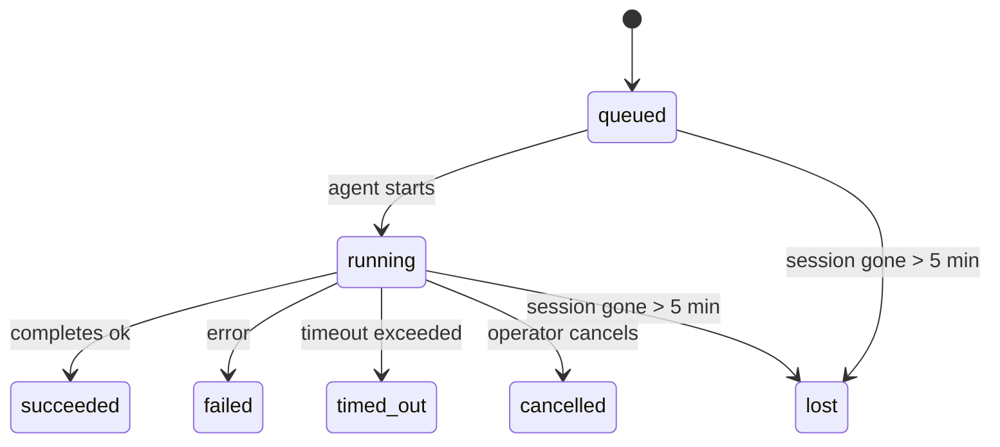

---
read_when:
    - Memeriksa pekerjaan di latar belakang yang sedang berlangsung atau baru saja selesai
    - Mendiagnosis kegagalan pengiriman untuk eksekusi agen terpisah
    - Memahami bagaimana proses berjalan di latar belakang terkait dengan sesi, Cron, dan Heartbeat
sidebarTitle: Background tasks
summary: Pelacakan tugas latar belakang untuk eksekusi ACP, subagen, pekerjaan Cron terisolasi, dan operasi CLI
title: Tugas latar belakang
x-i18n:
    generated_at: "2026-05-10T19:21:03Z"
    model: gpt-5.5
    provider: openai
    source_hash: 5764a89634f90181d826ff3990ec8dac9538239074934d30fd446c1eb4564869
    source_path: automation/tasks.md
    workflow: 16
---

<Note>
Mencari penjadwalan? Lihat [Automasi dan tugas](/id/automation) untuk memilih mekanisme yang tepat. Halaman ini adalah buku besar aktivitas untuk pekerjaan latar belakang, bukan penjadwal.
</Note>

Tugas latar belakang melacak pekerjaan yang berjalan **di luar sesi percakapan utama Anda**: proses ACP, spawn subagen, eksekusi tugas cron terisolasi, dan operasi yang dimulai oleh CLI.

Tugas **tidak** menggantikan sesi, tugas cron, atau Heartbeat - tugas adalah **buku besar aktivitas** yang mencatat pekerjaan terlepas apa yang terjadi, kapan, dan apakah berhasil.

<Note>
Tidak setiap proses agen membuat tugas. Giliran Heartbeat dan chat interaktif normal tidak. Semua eksekusi cron, spawn ACP, spawn subagen, dan perintah agen CLI membuat tugas.
</Note>

## Ringkasan

- Tugas adalah **rekaman**, bukan penjadwal - cron dan Heartbeat menentukan _kapan_ pekerjaan berjalan, tugas melacak _apa yang terjadi_.
- ACP, subagen, semua tugas cron, dan operasi CLI membuat tugas. Giliran Heartbeat tidak.
- Setiap tugas bergerak melalui `queued → running → terminal` (succeeded, failed, timed_out, cancelled, atau lost).
- Tugas cron tetap aktif selama runtime cron masih memiliki pekerjaan tersebut; jika
  status runtime dalam memori hilang, pemeliharaan tugas terlebih dahulu memeriksa riwayat
  proses cron yang tahan lama sebelum menandai tugas sebagai hilang.
- Penyelesaian didorong push: pekerjaan terlepas dapat memberi tahu secara langsung atau membangunkan
  sesi peminta/Heartbeat saat selesai, sehingga loop polling status
  biasanya bukan bentuk yang tepat.
- Proses cron terisolasi dan penyelesaian subagen melakukan upaya terbaik untuk membersihkan tab/proses browser yang dilacak untuk sesi anaknya sebelum pembukuan pembersihan akhir.
- Pengiriman cron terisolasi menekan balasan induk sementara yang basi saat pekerjaan subagen turunan masih selesai diproses, dan lebih memilih output akhir turunan ketika output tersebut tiba sebelum pengiriman.
- Notifikasi penyelesaian dikirim langsung ke kanal atau diantrekan untuk Heartbeat berikutnya.
- `openclaw tasks list` menampilkan semua tugas; `openclaw tasks audit` memunculkan masalah.
- Rekaman terminal disimpan selama 7 hari, lalu dipangkas otomatis.

## Mulai cepat

<Tabs>
  <Tab title="Daftar dan filter">
    ```bash
    # List all tasks (newest first)
    openclaw tasks list

    # Filter by runtime or status
    openclaw tasks list --runtime acp
    openclaw tasks list --status running
    ```

  </Tab>
  <Tab title="Periksa">
    ```bash
    # Show details for a specific task (by ID, run ID, or session key)
    openclaw tasks show <lookup>
    ```
  </Tab>
  <Tab title="Batalkan dan beri tahu">
    ```bash
    # Cancel a running task (kills the child session)
    openclaw tasks cancel <lookup>

    # Change notification policy for a task
    openclaw tasks notify <lookup> state_changes
    ```

  </Tab>
  <Tab title="Audit dan pemeliharaan">
    ```bash
    # Run a health audit
    openclaw tasks audit

    # Preview or apply maintenance
    openclaw tasks maintenance
    openclaw tasks maintenance --apply
    ```

  </Tab>
  <Tab title="Alur tugas">
    ```bash
    # Inspect TaskFlow state
    openclaw tasks flow list
    openclaw tasks flow show <lookup>
    openclaw tasks flow cancel <lookup>
    ```
  </Tab>
</Tabs>

## Apa yang membuat tugas

| Sumber                 | Jenis runtime | Kapan rekaman tugas dibuat                            | Kebijakan notifikasi default |
| ---------------------- | ------------ | ------------------------------------------------------ | --------------------- |
| Proses latar belakang ACP | `acp`        | Men-spawn sesi ACP anak                                | `done_only`           |
| Orkestrasi subagen | `subagent`   | Men-spawn subagen melalui `sessions_spawn`             | `done_only`           |
| Tugas cron (semua jenis) | `cron`       | Setiap eksekusi cron (sesi utama dan terisolasi)       | `silent`              |
| Operasi CLI         | `cli`        | Perintah `openclaw agent` yang berjalan melalui Gateway | `silent`              |
| Pekerjaan media agen       | `cli`        | Proses `music_generate`/`video_generate` berbasis sesi | `silent`              |

<AccordionGroup>
  <Accordion title="Default notifikasi untuk cron dan media">
    Tugas cron sesi utama menggunakan kebijakan notifikasi `silent` secara default - tugas tersebut membuat rekaman untuk pelacakan tetapi tidak menghasilkan notifikasi. Tugas cron terisolasi juga default ke `silent` tetapi lebih terlihat karena berjalan di sesinya sendiri.

    Proses `music_generate` dan `video_generate` berbasis sesi juga menggunakan kebijakan notifikasi `silent`. Proses tersebut tetap membuat rekaman tugas, tetapi penyelesaian dikembalikan ke sesi agen asal sebagai wake internal agar agen dapat menulis pesan lanjutan dan melampirkan media yang selesai sendiri. Penyelesaian grup/kanal mengikuti kebijakan balasan terlihat yang normal, sehingga agen menggunakan alat pesan ketika pengiriman sumber memerlukannya. Jika agen penyelesaian gagal menghasilkan bukti pengiriman alat pesan dalam rute hanya alat, OpenClaw mengirim fallback penyelesaian langsung ke kanal asal alih-alih membiarkan media tetap privat.

  </Accordion>
  <Accordion title="Guardrail video_generate bersamaan">
    Saat tugas `video_generate` berbasis sesi masih aktif, alat ini juga bertindak sebagai guardrail: panggilan `video_generate` berulang dalam sesi yang sama mengembalikan status tugas aktif alih-alih memulai pembuatan kedua secara bersamaan. Gunakan `action: "status"` saat Anda menginginkan pencarian progres/status eksplisit dari sisi agen.
  </Accordion>
  <Accordion title="Yang tidak membuat tugas">
    - Giliran Heartbeat - sesi utama; lihat [Heartbeat](/id/gateway/heartbeat)
    - Giliran chat interaktif normal
    - Respons `/command` langsung

  </Accordion>
</AccordionGroup>

## Siklus hidup tugas



| Status      | Artinya                                                              |
| ----------- | -------------------------------------------------------------------------- |
| `queued`    | Dibuat, menunggu agen dimulai                                    |
| `running`   | Giliran agen sedang aktif dieksekusi                                           |
| `succeeded` | Selesai dengan sukses                                                     |
| `failed`    | Selesai dengan error                                                    |
| `timed_out` | Melebihi timeout yang dikonfigurasi                                            |
| `cancelled` | Dihentikan oleh operator melalui `openclaw tasks cancel`                        |
| `lost`      | Runtime kehilangan status pendukung otoritatif setelah masa tenggang 5 menit |

Transisi terjadi otomatis - saat proses agen terkait berakhir, status tugas diperbarui agar sesuai.

Penyelesaian proses agen bersifat otoritatif untuk rekaman tugas aktif. Proses terlepas yang sukses difinalisasi sebagai `succeeded`, error proses biasa difinalisasi sebagai `failed`, dan hasil timeout atau abort difinalisasi sebagai `timed_out`. Jika operator sudah membatalkan tugas, atau runtime sudah mencatat status terminal yang lebih kuat seperti `failed`, `timed_out`, atau `lost`, sinyal sukses belakangan tidak menurunkan status terminal tersebut.

`lost` sadar runtime:

- Tugas ACP: metadata sesi anak ACP pendukung menghilang.
- Tugas subagen: sesi anak pendukung menghilang dari penyimpanan agen target.
- Tugas cron: runtime cron tidak lagi melacak pekerjaan sebagai aktif dan riwayat
  proses cron tahan lama tidak menunjukkan hasil terminal untuk proses tersebut. Audit CLI
  offline tidak memperlakukan status runtime cron dalam prosesnya sendiri yang kosong sebagai otoritas.
- Tugas CLI: tugas dengan id proses/id sumber menggunakan konteks proses langsung, sehingga
  baris sesi anak atau sesi chat yang tersisa tidak membuatnya tetap hidup setelah
  proses milik Gateway menghilang. Tugas CLI lama tanpa identitas proses masih melakukan
  fallback ke sesi anak. Proses `openclaw agent` yang didukung Gateway juga difinalisasi
  dari hasil prosesnya, sehingga proses yang selesai tidak tetap aktif sampai sweeper
  menandainya `lost`.

## Pengiriman dan notifikasi

Saat tugas mencapai status terminal, OpenClaw memberi tahu Anda. Ada dua jalur pengiriman:

**Pengiriman langsung** - jika tugas memiliki target kanal (`requesterOrigin`), pesan penyelesaian langsung masuk ke kanal tersebut (Telegram, Discord, Slack, dll.). Penyelesaian tugas grup dan kanal sebaliknya dirutekan melalui sesi peminta agar agen induk dapat menulis balasan terlihat. Untuk penyelesaian subagen, OpenClaw juga mempertahankan perutean thread/topik terikat jika tersedia dan dapat mengisi `to` / akun yang hilang dari rute tersimpan sesi peminta (`lastChannel` / `lastTo` / `lastAccountId`) sebelum menyerah pada pengiriman langsung.

**Pengiriman antrean sesi** - jika pengiriman langsung gagal atau tidak ada asal yang disetel, pembaruan diantrekan sebagai event sistem dalam sesi peminta dan muncul pada Heartbeat berikutnya.

<Tip>
Penyelesaian tugas memicu wake Heartbeat langsung sehingga Anda melihat hasil dengan cepat - Anda tidak perlu menunggu tick Heartbeat terjadwal berikutnya.
</Tip>

Artinya alur kerja biasanya berbasis push: mulai pekerjaan terlepas sekali, lalu biarkan runtime membangunkan atau memberi tahu Anda saat selesai. Poll status tugas hanya saat Anda membutuhkan debugging, intervensi, atau audit eksplisit.

### Kebijakan notifikasi

Kontrol seberapa banyak yang Anda dengar tentang setiap tugas:

| Kebijakan                | Yang dikirim                                                       |
| --------------------- | ----------------------------------------------------------------------- |
| `done_only` (default) | Hanya status terminal (succeeded, failed, dll.) - **ini adalah default** |
| `state_changes`       | Setiap transisi status dan pembaruan progres                              |
| `silent`              | Tidak ada sama sekali                                                          |

Ubah kebijakan saat tugas berjalan:

```bash
openclaw tasks notify <lookup> state_changes
```

## Referensi CLI

<AccordionGroup>
  <Accordion title="tasks list">
    ```bash
    openclaw tasks list [--runtime <acp|subagent|cron|cli>] [--status <status>] [--json]
    ```

    Kolom output: ID Tugas, Jenis, Status, Pengiriman, ID Proses, Sesi Anak, Ringkasan.

  </Accordion>
  <Accordion title="tasks show">
    ```bash
    openclaw tasks show <lookup>
    ```

    Token pencarian menerima ID tugas, ID proses, atau kunci sesi. Menampilkan rekaman lengkap termasuk timing, status pengiriman, error, dan ringkasan terminal.

  </Accordion>
  <Accordion title="tasks cancel">
    ```bash
    openclaw tasks cancel <lookup>
    ```

    Untuk tugas ACP dan subagen, ini mematikan sesi anak. Untuk tugas yang dilacak CLI, pembatalan dicatat dalam registry tugas (tidak ada handle runtime anak terpisah). Status bertransisi ke `cancelled` dan notifikasi pengiriman dikirim jika berlaku.

  </Accordion>
  <Accordion title="tasks notify">
    ```bash
    openclaw tasks notify <lookup> <done_only|state_changes|silent>
    ```
  </Accordion>
  <Accordion title="tasks audit">
    ```bash
    openclaw tasks audit [--json]
    ```

    Memunculkan masalah operasional. Temuan juga muncul di `openclaw status` saat masalah terdeteksi.

    | Temuan                   | Tingkat keparahan   | Pemicu                                                                                                      |
    | ------------------------- | ---------- | ------------------------------------------------------------------------------------------------------------ |
    | `stale_queued`            | warn       | Diantrekan selama lebih dari 10 menit                                                                              |
    | `stale_running`           | error      | Berjalan selama lebih dari 30 menit                                                                             |
    | `lost`                    | warn/error | Kepemilikan tugas yang didukung runtime menghilang; tugas hilang yang dipertahankan memberi peringatan hingga `cleanupAfter`, lalu menjadi error |
    | `delivery_failed`         | warn       | Pengiriman gagal dan kebijakan notifikasi bukan `silent`                                                            |
    | `missing_cleanup`         | warn       | Tugas terminal tanpa stempel waktu pembersihan                                                                      |
    | `inconsistent_timestamps` | warn       | Pelanggaran lini masa (misalnya selesai sebelum dimulai)                                                        |

  </Accordion>
  <Accordion title="tasks maintenance">
    ```bash
    openclaw tasks maintenance [--json]
    openclaw tasks maintenance --apply [--json]
    ```

    Gunakan ini untuk mempratinjau atau menerapkan rekonsiliasi, pemberian stempel pembersihan, dan pemangkasan untuk tugas, status Task Flow, serta baris registri sesi eksekusi cron yang usang.

    Rekonsiliasi sadar runtime:

    - Tugas ACP/subagent memeriksa sesi anak yang mendukungnya.
    - Tugas subagent yang sesi anaknya memiliki tombstone pemulihan mulai ulang ditandai hilang, bukan diperlakukan sebagai sesi pendukung yang dapat dipulihkan.
    - Tugas Cron memeriksa apakah runtime cron masih memiliki job, lalu memulihkan status terminal dari log eksekusi cron/status job yang dipersist sebelum kembali ke `lost`. Hanya proses Gateway yang otoritatif untuk set job aktif cron dalam memori; audit CLI offline menggunakan riwayat tahan lama tetapi tidak menandai tugas cron hilang hanya karena Set lokal itu kosong.
    - Tugas CLI dengan identitas eksekusi memeriksa konteks eksekusi langsung yang memilikinya, bukan hanya baris sesi anak atau sesi chat.

    Pembersihan penyelesaian juga sadar runtime:

    - Penyelesaian subagent berupaya sebisa mungkin menutup tab browser/proses yang dilacak untuk sesi anak sebelum pembersihan pengumuman dilanjutkan.
    - Penyelesaian cron terisolasi berupaya sebisa mungkin menutup tab browser/proses yang dilacak untuk sesi cron sebelum eksekusi sepenuhnya dibongkar.
    - Pengiriman cron terisolasi menunggu tindak lanjut subagent turunan bila perlu dan menekan teks pengakuan induk yang usang alih-alih mengumumkannya.
    - Pengiriman penyelesaian subagent mengutamakan teks asisten terbaru yang terlihat; jika kosong, ia kembali ke teks alat/toolResult terbaru yang telah disanitasi, dan eksekusi panggilan alat yang hanya timeout dapat diringkas menjadi ringkasan kemajuan parsial singkat. Eksekusi terminal yang gagal mengumumkan status kegagalan tanpa memutar ulang teks balasan yang ditangkap.
    - Kegagalan pembersihan tidak menutupi hasil tugas yang sebenarnya.

    Saat menerapkan pemeliharaan, OpenClaw juga menghapus baris registri sesi `cron:<jobId>:run:<uuid>` usang yang lebih lama dari 7 hari, sambil mempertahankan baris untuk job cron yang sedang berjalan dan membiarkan baris sesi non-cron tidak tersentuh.

  </Accordion>
  <Accordion title="tasks flow list | show | cancel">
    ```bash
    openclaw tasks flow list [--status <status>] [--json]
    openclaw tasks flow show <lookup> [--json]
    openclaw tasks flow cancel <lookup>
    ```

    Gunakan ini ketika Task Flow yang mengorkestrasi adalah hal yang Anda pedulikan, bukan satu catatan tugas latar belakang individual.

  </Accordion>
</AccordionGroup>

## Papan tugas chat (`/tasks`)

Gunakan `/tasks` di sesi chat mana pun untuk melihat tugas latar belakang yang ditautkan ke sesi tersebut. Papan menampilkan tugas aktif dan yang baru saja selesai dengan runtime, status, waktu, serta detail kemajuan atau error.

Ketika sesi saat ini tidak memiliki tugas tertaut yang terlihat, `/tasks` kembali ke jumlah tugas lokal agen sehingga Anda tetap mendapatkan gambaran umum tanpa membocorkan detail sesi lain.

Untuk ledger operator lengkap, gunakan CLI: `openclaw tasks list`.

## Integrasi status (tekanan tugas)

`openclaw status` menyertakan ringkasan tugas sekilas:

```
Tasks: 3 queued · 2 running · 1 issues
```

Ringkasan melaporkan:

- **active** - jumlah `queued` + `running`
- **failures** - jumlah `failed` + `timed_out` + `lost`
- **byRuntime** - rincian menurut `acp`, `subagent`, `cron`, `cli`

Baik `/status` maupun alat `session_status` menggunakan snapshot tugas yang sadar pembersihan: tugas aktif diutamakan, baris selesai yang usang disembunyikan, dan kegagalan terbaru hanya muncul ketika tidak ada pekerjaan aktif yang tersisa. Ini menjaga kartu status tetap berfokus pada hal yang penting saat ini.

## Penyimpanan dan pemeliharaan

### Tempat tugas berada

Catatan tugas dipersist di SQLite pada:

```
$OPENCLAW_STATE_DIR/tasks/runs.sqlite
```

Registri dimuat ke memori saat Gateway dimulai dan menyinkronkan penulisan ke SQLite untuk ketahanan lintas mulai ulang.
Gateway menjaga log write-ahead SQLite tetap terbatas dengan menggunakan ambang autocheckpoint default SQLite ditambah checkpoint `TRUNCATE` berkala dan saat shutdown.

### Pemeliharaan otomatis

Sweeper berjalan setiap **60 detik** dan menangani empat hal:

<Steps>
  <Step title="Reconciliation">
    Memeriksa apakah tugas aktif masih memiliki dukungan runtime otoritatif. Tugas ACP/subagent menggunakan status sesi anak, tugas cron menggunakan kepemilikan job aktif, dan tugas CLI dengan identitas eksekusi menggunakan konteks eksekusi yang memilikinya. Jika status pendukung itu hilang selama lebih dari 5 menit, tugas ditandai `lost`.
  </Step>
  <Step title="ACP session repair">
    Menutup sesi ACP one-shot milik induk yang terminal atau yatim, dan menutup sesi ACP persisten yang terminal usang atau yatim hanya ketika tidak ada binding percakapan aktif yang tersisa.
  </Step>
  <Step title="Cleanup stamping">
    Menetapkan stempel waktu `cleanupAfter` pada tugas terminal (endedAt + 7 hari). Selama retensi, tugas hilang masih muncul dalam audit sebagai peringatan; setelah `cleanupAfter` kedaluwarsa atau ketika metadata pembersihan hilang, tugas tersebut menjadi error.
  </Step>
  <Step title="Pruning">
    Menghapus catatan yang melewati tanggal `cleanupAfter`.
  </Step>
</Steps>

<Note>
**Retensi:** catatan tugas terminal disimpan selama **7 hari**, lalu dipangkas secara otomatis. Tidak perlu konfigurasi.
</Note>

## Bagaimana tugas terkait dengan sistem lain

<AccordionGroup>
  <Accordion title="Tasks and Task Flow">
    [Task Flow](/id/automation/taskflow) adalah lapisan orkestrasi flow di atas tugas latar belakang. Satu flow dapat mengoordinasikan beberapa tugas sepanjang masa hidupnya menggunakan mode sinkronisasi terkelola atau tercermin. Gunakan `openclaw tasks` untuk memeriksa catatan tugas individual dan `openclaw tasks flow` untuk memeriksa flow yang mengorkestrasi.

    Lihat [Task Flow](/id/automation/taskflow) untuk detail.

  </Accordion>
  <Accordion title="Tasks and cron">
    **Definisi** job cron berada di `~/.openclaw/cron/jobs.json`; status eksekusi runtime berada di sampingnya di `~/.openclaw/cron/jobs-state.json`. **Setiap** eksekusi cron membuat catatan tugas - baik sesi utama maupun terisolasi. Tugas cron sesi utama secara default menggunakan kebijakan notifikasi `silent` sehingga tugas tersebut terlacak tanpa menghasilkan notifikasi.

    Lihat [Cron Jobs](/id/automation/cron-jobs).

  </Accordion>
  <Accordion title="Tasks and heartbeat">
    Eksekusi Heartbeat adalah giliran sesi utama - eksekusi tersebut tidak membuat catatan tugas. Ketika tugas selesai, tugas dapat memicu wake Heartbeat sehingga Anda segera melihat hasilnya.

    Lihat [Heartbeat](/id/gateway/heartbeat).

  </Accordion>
  <Accordion title="Tasks and sessions">
    Tugas dapat mereferensikan `childSessionKey` (tempat pekerjaan berjalan) dan `requesterSessionKey` (siapa yang memulainya). Sesi adalah konteks percakapan; tugas adalah pelacakan aktivitas di atasnya.
  </Accordion>
  <Accordion title="Tasks and agent runs">
    `runId` milik tugas menautkan ke eksekusi agen yang melakukan pekerjaan. Peristiwa siklus hidup agen (mulai, selesai, error) otomatis memperbarui status tugas - Anda tidak perlu mengelola siklus hidup secara manual.
  </Accordion>
</AccordionGroup>

## Terkait

- [Automation & Tasks](/id/automation) - semua mekanisme otomatisasi sekilas
- [CLI: Tasks](/id/cli/tasks) - referensi perintah CLI
- [Heartbeat](/id/gateway/heartbeat) - giliran sesi utama berkala
- [Scheduled Tasks](/id/automation/cron-jobs) - menjadwalkan pekerjaan latar belakang
- [Task Flow](/id/automation/taskflow) - orkestrasi flow di atas tugas
