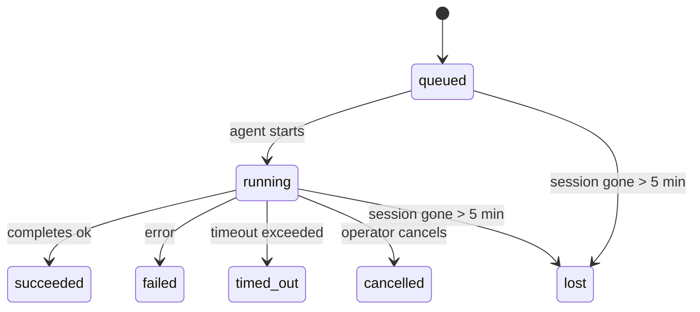

---
read_when:
    - Memeriksa pekerjaan latar belakang yang sedang berlangsung atau baru saja selesai
    - Melakukan debug kegagalan pengiriman untuk eksekusi agen terpisah
    - Memahami hubungan eksekusi latar belakang dengan sesi, Cron, dan Heartbeat
sidebarTitle: Background tasks
summary: Pelacakan tugas latar belakang untuk eksekusi ACP, subagen, pekerjaan Cron terisolasi, dan operasi CLI
title: Tugas latar belakang
x-i18n:
    generated_at: "2026-05-05T01:44:27Z"
    model: gpt-5.5
    provider: openai
    source_hash: 60d6ea6178535b19b95d761b8e8b05a665234584ae69852fd21097988aa32991
    source_path: automation/tasks.md
    workflow: 16
---

<Note>
Mencari penjadwalan? Lihat [Otomatisasi dan tugas](/id/automation) untuk memilih mekanisme yang tepat. Halaman ini adalah catatan aktivitas untuk pekerjaan latar belakang, bukan penjadwal.
</Note>

Tugas latar belakang melacak pekerjaan yang berjalan **di luar sesi percakapan utama Anda**: eksekusi ACP, pemunculan subagen, eksekusi tugas cron terisolasi, dan operasi yang dimulai dari CLI.

Tugas **tidak** menggantikan sesi, tugas cron, atau heartbeat — tugas adalah **catatan aktivitas** yang merekam pekerjaan terpisah apa yang terjadi, kapan, dan apakah berhasil.

<Note>
Tidak setiap eksekusi agen membuat tugas. Giliran Heartbeat dan obrolan interaktif normal tidak. Semua eksekusi cron, pemunculan ACP, pemunculan subagen, dan perintah agen CLI melakukannya.
</Note>

## Ringkasan

- Tugas adalah **catatan**, bukan penjadwal — cron dan heartbeat menentukan _kapan_ pekerjaan berjalan, tugas melacak _apa yang terjadi_.
- ACP, subagen, semua tugas cron, dan operasi CLI membuat tugas. Giliran Heartbeat tidak.
- Setiap tugas bergerak melalui `queued → running → terminal` (succeeded, failed, timed_out, cancelled, atau lost).
- Tugas cron tetap aktif selama runtime cron masih memiliki tugas tersebut; jika
  status runtime dalam memori hilang, pemeliharaan tugas terlebih dahulu memeriksa
  riwayat eksekusi cron yang tahan lama sebelum menandai tugas sebagai hilang.
- Penyelesaian didorong secara push: pekerjaan terpisah dapat memberi tahu secara langsung atau membangunkan
  sesi/heartbeat peminta saat selesai, sehingga loop polling status
  biasanya bukan bentuk yang tepat.
- Eksekusi cron terisolasi dan penyelesaian subagen melakukan upaya terbaik untuk membersihkan tab/proses browser yang dilacak untuk sesi anaknya sebelum pembukuan pembersihan akhir.
- Pengiriman cron terisolasi menekan balasan induk sementara yang sudah basi saat pekerjaan subagen turunan masih dikuras, dan lebih memilih output turunan akhir saat output itu tiba sebelum pengiriman.
- Notifikasi penyelesaian dikirim langsung ke saluran atau diantrekan untuk heartbeat berikutnya.
- `openclaw tasks list` menampilkan semua tugas; `openclaw tasks audit` memunculkan masalah.
- Catatan terminal disimpan selama 7 hari, lalu dipangkas secara otomatis.

## Mulai cepat

<Tabs>
  <Tab title="List and filter">
    ```bash
    # List all tasks (newest first)
    openclaw tasks list

    # Filter by runtime or status
    openclaw tasks list --runtime acp
    openclaw tasks list --status running
    ```

  </Tab>
  <Tab title="Inspect">
    ```bash
    # Show details for a specific task (by ID, run ID, or session key)
    openclaw tasks show <lookup>
    ```
  </Tab>
  <Tab title="Cancel and notify">
    ```bash
    # Cancel a running task (kills the child session)
    openclaw tasks cancel <lookup>

    # Change notification policy for a task
    openclaw tasks notify <lookup> state_changes
    ```

  </Tab>
  <Tab title="Audit and maintenance">
    ```bash
    # Run a health audit
    openclaw tasks audit

    # Preview or apply maintenance
    openclaw tasks maintenance
    openclaw tasks maintenance --apply
    ```

  </Tab>
  <Tab title="Task flow">
    ```bash
    # Inspect TaskFlow state
    openclaw tasks flow list
    openclaw tasks flow show <lookup>
    openclaw tasks flow cancel <lookup>
    ```
  </Tab>
</Tabs>

## Apa yang membuat tugas

| Sumber                 | Jenis runtime | Kapan catatan tugas dibuat                            | Kebijakan notifikasi default |
| ---------------------- | ------------ | ------------------------------------------------------ | ---------------------------- |
| Eksekusi latar belakang ACP | `acp`        | Memunculkan sesi ACP anak                              | `done_only`                  |
| Orkestrasi subagen | `subagent`   | Memunculkan subagen melalui `sessions_spawn`           | `done_only`                  |
| Tugas cron (semua jenis) | `cron`       | Setiap eksekusi cron (sesi utama dan terisolasi)       | `silent`                     |
| Operasi CLI         | `cli`        | Perintah `openclaw agent` yang berjalan melalui gateway | `silent`                    |
| Tugas media agen       | `cli`        | Eksekusi `music_generate`/`video_generate` berbasis sesi | `silent`                  |

<AccordionGroup>
  <Accordion title="Notify defaults for cron and media">
    Tugas cron sesi utama menggunakan kebijakan notifikasi `silent` secara default — tugas membuat catatan untuk pelacakan tetapi tidak menghasilkan notifikasi. Tugas cron terisolasi juga default ke `silent` tetapi lebih terlihat karena berjalan dalam sesi mereka sendiri.

    Eksekusi `music_generate` dan `video_generate` berbasis sesi juga menggunakan kebijakan notifikasi `silent`. Eksekusi tersebut tetap membuat catatan tugas, tetapi penyelesaian dikembalikan ke sesi agen asli sebagai wake internal sehingga agen dapat menulis pesan tindak lanjut dan melampirkan media yang sudah selesai itu sendiri. Penyelesaian grup/saluran mengikuti kebijakan balasan terlihat yang normal, sehingga agen menggunakan alat pesan saat pengiriman sumber memerlukannya.

  </Accordion>
  <Accordion title="Concurrent video_generate guardrail">
    Saat tugas `video_generate` berbasis sesi masih aktif, alat tersebut juga bertindak sebagai pembatas: panggilan `video_generate` berulang dalam sesi yang sama mengembalikan status tugas aktif, bukan memulai generasi konkuren kedua. Gunakan `action: "status"` saat Anda menginginkan pencarian progres/status eksplisit dari sisi agen.
  </Accordion>
  <Accordion title="What does not create tasks">
    - Giliran Heartbeat — sesi utama; lihat [Heartbeat](/id/gateway/heartbeat)
    - Giliran obrolan interaktif normal
    - Respons langsung `/command`

  </Accordion>
</AccordionGroup>

## Siklus hidup tugas



| Status      | Artinya                                                                    |
| ----------- | -------------------------------------------------------------------------- |
| `queued`    | Dibuat, menunggu agen dimulai                                             |
| `running`   | Giliran agen sedang aktif dieksekusi                                      |
| `succeeded` | Selesai dengan sukses                                                     |
| `failed`    | Selesai dengan kesalahan                                                  |
| `timed_out` | Melebihi timeout yang dikonfigurasi                                       |
| `cancelled` | Dihentikan oleh operator melalui `openclaw tasks cancel`                  |
| `lost`      | Runtime kehilangan status pendukung otoritatif setelah masa tenggang 5 menit |

Transisi terjadi secara otomatis — saat eksekusi agen terkait berakhir, status tugas diperbarui agar sesuai.

Penyelesaian eksekusi agen bersifat otoritatif untuk catatan tugas aktif. Eksekusi terpisah yang berhasil diselesaikan sebagai `succeeded`, kesalahan eksekusi biasa diselesaikan sebagai `failed`, dan hasil timeout atau abort diselesaikan sebagai `timed_out`. Jika operator sudah membatalkan tugas, atau runtime sudah mencatat status terminal yang lebih kuat seperti `failed`, `timed_out`, atau `lost`, sinyal sukses yang datang kemudian tidak menurunkan status terminal tersebut.

`lost` sadar runtime:

- Tugas ACP: metadata sesi anak ACP pendukung menghilang.
- Tugas subagen: sesi anak pendukung menghilang dari penyimpanan agen target.
- Tugas cron: runtime cron tidak lagi melacak pekerjaan sebagai aktif dan riwayat
  eksekusi cron yang tahan lama tidak menunjukkan hasil terminal untuk eksekusi tersebut. Audit CLI
  offline tidak memperlakukan status runtime cron dalam prosesnya yang kosong sebagai otoritas.
- Tugas CLI: tugas sesi anak terisolasi menggunakan sesi anak; tugas CLI
  berbasis obrolan menggunakan konteks eksekusi langsung sebagai gantinya, sehingga baris sesi
  saluran/grup/langsung yang tersisa tidak membuatnya tetap hidup. Eksekusi
  `openclaw agent` berbasis Gateway juga diselesaikan dari hasil eksekusinya, sehingga eksekusi yang selesai
  tidak tetap aktif sampai sweeper menandainya `lost`.

## Pengiriman dan notifikasi

Saat tugas mencapai status terminal, OpenClaw memberi tahu Anda. Ada dua jalur pengiriman:

**Pengiriman langsung** — jika tugas memiliki target saluran (`requesterOrigin`), pesan penyelesaian langsung masuk ke saluran tersebut (Telegram, Discord, Slack, dll.). Untuk penyelesaian subagen, OpenClaw juga mempertahankan perutean thread/topik terikat saat tersedia dan dapat mengisi `to` / akun yang hilang dari rute tersimpan sesi peminta (`lastChannel` / `lastTo` / `lastAccountId`) sebelum menyerah pada pengiriman langsung.

**Pengiriman antrean sesi** — jika pengiriman langsung gagal atau tidak ada origin yang ditetapkan, pembaruan diantrekan sebagai peristiwa sistem dalam sesi peminta dan muncul pada heartbeat berikutnya.

<Tip>
Penyelesaian tugas memicu wake heartbeat langsung sehingga Anda melihat hasilnya dengan cepat — Anda tidak perlu menunggu tick heartbeat terjadwal berikutnya.
</Tip>

Artinya alur kerja biasa berbasis push: mulai pekerjaan terpisah sekali, lalu biarkan runtime membangunkan atau memberi tahu Anda saat selesai. Poll status tugas hanya saat Anda perlu debugging, intervensi, atau audit eksplisit.

### Kebijakan notifikasi

Kontrol seberapa banyak yang Anda dengar tentang setiap tugas:

| Kebijakan             | Yang dikirim                                                           |
| --------------------- | ----------------------------------------------------------------------- |
| `done_only` (default) | Hanya status terminal (succeeded, failed, dll.) — **ini adalah default** |
| `state_changes`       | Setiap transisi status dan pembaruan progres                            |
| `silent`              | Tidak ada sama sekali                                                   |

Ubah kebijakan saat tugas sedang berjalan:

```bash
openclaw tasks notify <lookup> state_changes
```

## Referensi CLI

<AccordionGroup>
  <Accordion title="tasks list">
    ```bash
    openclaw tasks list [--runtime <acp|subagent|cron|cli>] [--status <status>] [--json]
    ```

    Kolom output: ID Tugas, Jenis, Status, Pengiriman, ID Eksekusi, Sesi Anak, Ringkasan.

  </Accordion>
  <Accordion title="tasks show">
    ```bash
    openclaw tasks show <lookup>
    ```

    Token pencarian menerima ID tugas, ID eksekusi, atau kunci sesi. Menampilkan catatan lengkap termasuk waktu, status pengiriman, kesalahan, dan ringkasan terminal.

  </Accordion>
  <Accordion title="tasks cancel">
    ```bash
    openclaw tasks cancel <lookup>
    ```

    Untuk tugas ACP dan subagen, ini mematikan sesi anak. Untuk tugas yang dilacak CLI, pembatalan dicatat dalam registri tugas (tidak ada handle runtime anak terpisah). Status berubah menjadi `cancelled` dan notifikasi pengiriman dikirim jika berlaku.

  </Accordion>
  <Accordion title="tasks notify">
    ```bash
    openclaw tasks notify <lookup> <done_only|state_changes|silent>
    ```
  </Accordion>
  <Accordion title="tasks audit">
    ```bash
    openclaw tasks audit [--json]
    ```

    Memunculkan masalah operasional. Temuan juga muncul di `openclaw status` saat masalah terdeteksi.

    | Temuan                    | Tingkat Keparahan | Pemicu                                                                                                                  |
    | ------------------------- | ---------- | ------------------------------------------------------------------------------------------------------------ |
    | `stale_queued`            | warn       | Dalam antrean lebih dari 10 menit                                                                                        |
    | `stale_running`           | error      | Berjalan lebih dari 30 menit                                                                                             |
    | `lost`                    | warn/error | Kepemilikan tugas yang didukung runtime menghilang; tugas hilang yang dipertahankan memberi peringatan hingga `cleanupAfter`, lalu menjadi error |
    | `delivery_failed`         | warn       | Pengiriman gagal dan kebijakan notifikasi bukan `silent`                                                                 |
    | `missing_cleanup`         | warn       | Tugas terminal tanpa stempel waktu pembersihan                                                                            |
    | `inconsistent_timestamps` | warn       | Pelanggaran linimasa (misalnya berakhir sebelum dimulai)                                                                  |

  </Accordion>
  <Accordion title="pemeliharaan tugas">
    ```bash
    openclaw tasks maintenance [--json]
    openclaw tasks maintenance --apply [--json]
    ```

    Gunakan ini untuk mempratinjau atau menerapkan rekonsiliasi, penandaan pembersihan, dan pemangkasan untuk tugas dan status Task Flow.

    Rekonsiliasi sadar runtime:

    - Tugas ACP/subagen memeriksa sesi anak yang mendukungnya.
    - Tugas subagen yang sesi anaknya memiliki tombstone pemulihan-mulai-ulang ditandai hilang, bukan diperlakukan sebagai sesi pendukung yang dapat dipulihkan.
    - Tugas Cron memeriksa apakah runtime cron masih memiliki pekerjaan tersebut, lalu memulihkan status terminal dari log eksekusi cron/status pekerjaan yang dipersistenkan sebelum kembali ke `lost`. Hanya proses Gateway yang otoritatif untuk set pekerjaan aktif cron dalam memori; audit CLI offline menggunakan riwayat tahan lama tetapi tidak menandai tugas cron sebagai hilang hanya karena Set lokal itu kosong.
    - Tugas CLI yang didukung chat memeriksa konteks live run pemiliknya, bukan hanya baris sesi chat.

    Pembersihan penyelesaian juga sadar runtime:

    - Penyelesaian subagen menutup tab/proses browser yang dilacak untuk sesi anak secara best-effort sebelum pembersihan pengumuman berlanjut.
    - Penyelesaian cron terisolasi menutup tab/proses browser yang dilacak untuk sesi cron secara best-effort sebelum eksekusi sepenuhnya dibongkar.
    - Pengiriman cron terisolasi menunggu tindak lanjut subagen turunan bila perlu dan menekan teks pengakuan induk yang basi alih-alih mengumumkannya.
    - Pengiriman penyelesaian subagen memilih teks asisten terlihat terbaru; jika kosong, ia kembali ke teks tool/toolResult terbaru yang telah disanitasi, dan eksekusi panggilan alat yang hanya timeout dapat diringkas menjadi ringkasan progres parsial singkat. Eksekusi terminal yang gagal mengumumkan status kegagalan tanpa memutar ulang teks balasan yang tertangkap.
    - Kegagalan pembersihan tidak menutupi hasil tugas yang sebenarnya.

  </Accordion>
  <Accordion title="daftar | tampilkan | batalkan alur tugas">
    ```bash
    openclaw tasks flow list [--status <status>] [--json]
    openclaw tasks flow show <lookup> [--json]
    openclaw tasks flow cancel <lookup>
    ```

    Gunakan ini ketika Task Flow pengorkestrasi adalah hal yang Anda pedulikan, bukan satu catatan tugas latar belakang individual.

  </Accordion>
</AccordionGroup>

## Papan tugas chat (`/tasks`)

Gunakan `/tasks` di sesi chat mana pun untuk melihat tugas latar belakang yang ditautkan ke sesi tersebut. Papan menampilkan tugas aktif dan yang baru saja selesai beserta runtime, status, waktu, dan detail progres atau error.

Ketika sesi saat ini tidak memiliki tugas tertaut yang terlihat, `/tasks` kembali ke jumlah tugas lokal agen sehingga Anda tetap mendapatkan ikhtisar tanpa membocorkan detail sesi lain.

Untuk ledger operator lengkap, gunakan CLI: `openclaw tasks list`.

## Integrasi status (tekanan tugas)

`openclaw status` menyertakan ringkasan tugas sekilas:

```
Tasks: 3 queued · 2 running · 1 issues
```

Ringkasan melaporkan:

- **aktif** — jumlah `queued` + `running`
- **kegagalan** — jumlah `failed` + `timed_out` + `lost`
- **byRuntime** — perincian menurut `acp`, `subagent`, `cron`, `cli`

Baik `/status` maupun alat `session_status` menggunakan snapshot tugas yang sadar pembersihan: tugas aktif diprioritaskan, baris selesai yang basi disembunyikan, dan kegagalan terbaru hanya ditampilkan ketika tidak ada pekerjaan aktif yang tersisa. Ini menjaga kartu status tetap fokus pada hal yang penting saat ini.

## Penyimpanan dan pemeliharaan

### Tempat tugas berada

Catatan tugas dipersistenkan di SQLite pada:

```
$OPENCLAW_STATE_DIR/tasks/runs.sqlite
```

Registry dimuat ke memori saat Gateway dimulai dan menyinkronkan penulisan ke SQLite untuk ketahanan lintas mulai ulang.
Gateway menjaga log write-ahead SQLite tetap terbatas dengan menggunakan ambang batas autocheckpoint default SQLite ditambah checkpoint `TRUNCATE` berkala dan saat shutdown.

### Pemeliharaan otomatis

Sweeper berjalan setiap **60 detik** dan menangani empat hal:

<Steps>
  <Step title="Rekonsiliasi">
    Memeriksa apakah tugas aktif masih memiliki dukungan runtime otoritatif. Tugas ACP/subagen menggunakan status sesi anak, tugas cron menggunakan kepemilikan pekerjaan aktif, dan tugas CLI yang didukung chat menggunakan konteks eksekusi pemilik. Jika status pendukung itu hilang selama lebih dari 5 menit, tugas ditandai `lost`.
  </Step>
  <Step title="Perbaikan sesi ACP">
    Menutup sesi ACP one-shot terminal atau yatim milik induk, dan menutup sesi ACP persisten terminal atau yatim yang basi hanya ketika tidak ada binding percakapan aktif yang tersisa.
  </Step>
  <Step title="Penandaan pembersihan">
    Menetapkan stempel waktu `cleanupAfter` pada tugas terminal (endedAt + 7 hari). Selama retensi, tugas hilang masih muncul dalam audit sebagai peringatan; setelah `cleanupAfter` kedaluwarsa atau ketika metadata pembersihan hilang, tugas tersebut menjadi error.
  </Step>
  <Step title="Pemangkasan">
    Menghapus catatan yang melewati tanggal `cleanupAfter`.
  </Step>
</Steps>

<Note>
**Retensi:** catatan tugas terminal disimpan selama **7 hari**, lalu dipangkas otomatis. Tidak perlu konfigurasi.
</Note>

## Bagaimana tugas terkait dengan sistem lain

<AccordionGroup>
  <Accordion title="Tugas dan Task Flow">
    [Task Flow](/id/automation/taskflow) adalah lapisan orkestrasi alur di atas tugas latar belakang. Satu alur dapat mengoordinasikan beberapa tugas selama masa pakainya menggunakan mode sinkronisasi terkelola atau tercermin. Gunakan `openclaw tasks` untuk memeriksa catatan tugas individual dan `openclaw tasks flow` untuk memeriksa alur pengorkestrasi.

    Lihat [Task Flow](/id/automation/taskflow) untuk detail.

  </Accordion>
  <Accordion title="Tugas dan cron">
    **Definisi** pekerjaan cron berada di `~/.openclaw/cron/jobs.json`; status eksekusi runtime berada di sebelahnya dalam `~/.openclaw/cron/jobs-state.json`. **Setiap** eksekusi cron membuat catatan tugas — baik sesi utama maupun terisolasi. Tugas cron sesi utama secara default menggunakan kebijakan notifikasi `silent` sehingga tugas tersebut dilacak tanpa menghasilkan notifikasi.

    Lihat [Cron Jobs](/id/automation/cron-jobs).

  </Accordion>
  <Accordion title="Tugas dan heartbeat">
    Eksekusi Heartbeat adalah giliran sesi utama — eksekusi tersebut tidak membuat catatan tugas. Ketika tugas selesai, tugas dapat memicu pembangkitan heartbeat sehingga Anda melihat hasilnya dengan segera.

    Lihat [Heartbeat](/id/gateway/heartbeat).

  </Accordion>
  <Accordion title="Tugas dan sesi">
    Tugas dapat mereferensikan `childSessionKey` (tempat pekerjaan berjalan) dan `requesterSessionKey` (yang memulainya). Sesi adalah konteks percakapan; tugas adalah pelacakan aktivitas di atasnya.
  </Accordion>
  <Accordion title="Tugas dan eksekusi agen">
    `runId` milik tugas ditautkan ke eksekusi agen yang melakukan pekerjaan. Peristiwa siklus hidup agen (mulai, selesai, error) secara otomatis memperbarui status tugas — Anda tidak perlu mengelola siklus hidup secara manual.
  </Accordion>
</AccordionGroup>

## Terkait

- [Otomasi & Tugas](/id/automation) — semua mekanisme otomasi sekilas
- [CLI: Tugas](/id/cli/tasks) — referensi perintah CLI
- [Heartbeat](/id/gateway/heartbeat) — giliran sesi utama berkala
- [Tugas Terjadwal](/id/automation/cron-jobs) — menjadwalkan pekerjaan latar belakang
- [Task Flow](/id/automation/taskflow) — orkestrasi alur di atas tugas
