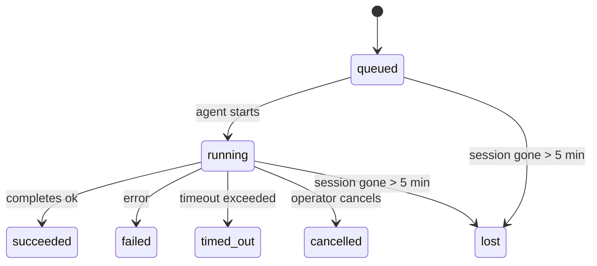

---
read_when:
    - Memeriksa pekerjaan latar belakang yang sedang berlangsung atau baru saja selesai
    - Men-debug kegagalan pengiriman untuk proses agen terlepas
    - Memahami bagaimana proses latar belakang terkait dengan sesi, Cron, dan Heartbeat
summary: Pelacakan tugas latar belakang untuk proses ACP, subagen, tugas Cron terisolasi, dan operasi CLI
title: Tugas latar belakang
x-i18n:
    generated_at: "2026-04-24T08:57:24Z"
    model: gpt-5.4
    provider: openai
    source_hash: 10f16268ab5cce8c3dfd26c54d8d913c0ac0f9bfb4856ed1bb28b085ddb78528
    source_path: automation/tasks.md
    workflow: 15
---

> **Mencari penjadwalan?** Lihat [Automation & Tasks](/id/automation) untuk memilih mekanisme yang tepat. Halaman ini membahas **pelacakan** pekerjaan latar belakang, bukan penjadwalannya.

Tugas latar belakang melacak pekerjaan yang berjalan **di luar sesi percakapan utama Anda**:
proses ACP, pemanggilan subagen, eksekusi tugas Cron terisolasi, dan operasi yang dimulai dari CLI.

Tugas **tidak** menggantikan sesi, tugas Cron, atau Heartbeat — tugas adalah **catatan aktivitas** yang merekam pekerjaan terlepas apa yang terjadi, kapan terjadinya, dan apakah berhasil.

<Note>
Tidak setiap proses agen membuat tugas. Putaran Heartbeat dan chat interaktif normal tidak membuat tugas. Semua eksekusi Cron, pemanggilan ACP, pemanggilan subagen, dan perintah agen CLI membuat tugas.
</Note>

## Ringkasnya

- Tugas adalah **catatan**, bukan penjadwal — Cron dan Heartbeat menentukan _kapan_ pekerjaan dijalankan, tugas melacak _apa yang terjadi_.
- ACP, subagen, semua tugas Cron, dan operasi CLI membuat tugas. Putaran Heartbeat tidak.
- Setiap tugas bergerak melalui `queued → running → terminal` (`succeeded`, `failed`, `timed_out`, `cancelled`, atau `lost`).
- Tugas Cron tetap aktif selama runtime Cron masih memiliki tugas tersebut; tugas CLI berbasis chat tetap aktif hanya selama konteks proses pemiliknya masih aktif.
- Penyelesaian bersifat push-driven: pekerjaan terlepas dapat memberi notifikasi secara langsung atau membangunkan sesi/Heartbeat peminta saat selesai, sehingga loop polling status biasanya bukan pendekatan yang tepat.
- Proses Cron terisolasi dan penyelesaian subagen melakukan pembersihan best-effort pada tab/proses browser yang dilacak untuk sesi anaknya sebelum pembukuan pembersihan akhir.
- Pengiriman Cron terisolasi menekan balasan sementara induk yang usang saat pekerjaan subagen turunan masih dalam proses selesai, dan lebih mengutamakan output turunan final jika output itu tiba sebelum pengiriman.
- Notifikasi penyelesaian dikirim langsung ke channel atau diantrikan untuk Heartbeat berikutnya.
- `openclaw tasks list` menampilkan semua tugas; `openclaw tasks audit` menampilkan masalah.
- Catatan terminal disimpan selama 7 hari, lalu dipangkas secara otomatis.

## Mulai cepat

```bash
# Daftar semua tugas (terbaru lebih dulu)
openclaw tasks list

# Filter berdasarkan runtime atau status
openclaw tasks list --runtime acp
openclaw tasks list --status running

# Tampilkan detail untuk tugas tertentu (berdasarkan ID, run ID, atau session key)
openclaw tasks show <lookup>

# Batalkan tugas yang sedang berjalan (menghentikan sesi anak)
openclaw tasks cancel <lookup>

# Ubah kebijakan notifikasi untuk sebuah tugas
openclaw tasks notify <lookup> state_changes

# Jalankan audit kesehatan
openclaw tasks audit

# Pratinjau atau terapkan pemeliharaan
openclaw tasks maintenance
openclaw tasks maintenance --apply

# Periksa status TaskFlow
openclaw tasks flow list
openclaw tasks flow show <lookup>
openclaw tasks flow cancel <lookup>
```

## Apa yang membuat tugas

| Sumber                 | Jenis runtime | Kapan catatan tugas dibuat                           | Kebijakan notifikasi default |
| ---------------------- | ------------- | ---------------------------------------------------- | ---------------------------- |
| Proses latar belakang ACP | `acp`      | Saat membuat sesi ACP anak                           | `done_only`                  |
| Orkestrasi subagen     | `subagent`    | Saat membuat subagen melalui `sessions_spawn`        | `done_only`                  |
| Tugas Cron (semua jenis) | `cron`      | Setiap eksekusi Cron (sesi utama dan terisolasi)     | `silent`                     |
| Operasi CLI            | `cli`         | Perintah `openclaw agent` yang berjalan melalui Gateway | `silent`                  |
| Tugas media agen       | `cli`         | Proses `video_generate` berbasis sesi                | `silent`                     |

Tugas Cron sesi utama menggunakan kebijakan notifikasi `silent` secara default — mereka membuat catatan untuk pelacakan tetapi tidak menghasilkan notifikasi. Tugas Cron terisolasi juga default ke `silent`, tetapi lebih terlihat karena berjalan di sesinya sendiri.

Proses `video_generate` berbasis sesi juga menggunakan kebijakan notifikasi `silent`. Proses ini tetap membuat catatan tugas, tetapi penyelesaiannya dikembalikan ke sesi agen asal sebagai wake internal sehingga agen dapat menulis pesan lanjutan dan melampirkan video yang selesai sendiri. Jika Anda memilih `tools.media.asyncCompletion.directSend`, penyelesaian asinkron `music_generate` dan `video_generate` akan mencoba pengiriman channel langsung terlebih dahulu sebelum kembali ke jalur wake sesi peminta.

Selama tugas `video_generate` berbasis sesi masih aktif, tool ini juga berfungsi sebagai guardrail: panggilan `video_generate` berulang dalam sesi yang sama akan mengembalikan status tugas aktif alih-alih memulai generasi serentak kedua. Gunakan `action: "status"` saat Anda menginginkan pencarian progres/status yang eksplisit dari sisi agen.

**Yang tidak membuat tugas:**

- Putaran Heartbeat — sesi utama; lihat [Heartbeat](/id/gateway/heartbeat)
- Putaran chat interaktif normal
- Respons `/command` langsung

## Siklus hidup tugas



| Status      | Artinya                                                                  |
| ----------- | ------------------------------------------------------------------------ |
| `queued`    | Dibuat, menunggu agen mulai                                              |
| `running`   | Putaran agen sedang dieksekusi secara aktif                              |
| `succeeded` | Selesai dengan berhasil                                                  |
| `failed`    | Selesai dengan kesalahan                                                 |
| `timed_out` | Melebihi batas waktu yang dikonfigurasi                                  |
| `cancelled` | Dihentikan oleh operator melalui `openclaw tasks cancel`                 |
| `lost`      | Runtime kehilangan status pendukung yang otoritatif setelah masa tenggang 5 menit |

Transisi terjadi secara otomatis — saat proses agen terkait berakhir, status tugas diperbarui agar sesuai.

`lost` bersifat runtime-aware:

- Tugas ACP: metadata sesi anak ACP pendukung menghilang.
- Tugas subagen: sesi anak pendukung menghilang dari store agen target.
- Tugas Cron: runtime Cron tidak lagi melacak tugas sebagai aktif.
- Tugas CLI: tugas sesi anak terisolasi menggunakan sesi anak; tugas CLI berbasis chat menggunakan konteks proses langsung, sehingga baris sesi channel/grup/direct yang masih ada tidak membuatnya tetap aktif.

## Pengiriman dan notifikasi

Saat tugas mencapai status terminal, OpenClaw memberi tahu Anda. Ada dua jalur pengiriman:

**Pengiriman langsung** — jika tugas memiliki target channel (`requesterOrigin`), pesan penyelesaian dikirim langsung ke channel tersebut (Telegram, Discord, Slack, dll.). Untuk penyelesaian subagen, OpenClaw juga mempertahankan routing thread/topik yang terikat jika tersedia dan dapat mengisi `to` / akun yang hilang dari rute tersimpan sesi peminta (`lastChannel` / `lastTo` / `lastAccountId`) sebelum menyerah pada pengiriman langsung.

**Pengiriman yang diantrikan ke sesi** — jika pengiriman langsung gagal atau tidak ada origin yang disetel, pembaruan akan diantrikan sebagai peristiwa sistem dalam sesi peminta dan muncul pada Heartbeat berikutnya.

<Tip>
Penyelesaian tugas memicu wake Heartbeat segera sehingga Anda dapat melihat hasilnya dengan cepat — Anda tidak perlu menunggu tick Heartbeat terjadwal berikutnya.
</Tip>

Artinya, alur kerja yang umum bersifat berbasis push: mulai pekerjaan terlepas satu kali, lalu biarkan runtime membangunkan atau memberi tahu Anda saat selesai. Poll status tugas hanya saat Anda memerlukan debugging, intervensi, atau audit eksplisit.

### Kebijakan notifikasi

Kendalikan seberapa banyak Anda menerima informasi tentang tiap tugas:

| Kebijakan             | Yang dikirim                                                            |
| --------------------- | ----------------------------------------------------------------------- |
| `done_only` (default) | Hanya status terminal (`succeeded`, `failed`, dll.) — **ini adalah default** |
| `state_changes`       | Setiap transisi status dan pembaruan progres                            |
| `silent`              | Tidak ada sama sekali                                                   |

Ubah kebijakan saat tugas sedang berjalan:

```bash
openclaw tasks notify <lookup> state_changes
```

## Referensi CLI

### `tasks list`

```bash
openclaw tasks list [--runtime <acp|subagent|cron|cli>] [--status <status>] [--json]
```

Kolom output: ID Tugas, Jenis, Status, Pengiriman, Run ID, Sesi Anak, Ringkasan.

### `tasks show`

```bash
openclaw tasks show <lookup>
```

Token lookup menerima task ID, run ID, atau session key. Menampilkan catatan lengkap termasuk waktu, status pengiriman, error, dan ringkasan terminal.

### `tasks cancel`

```bash
openclaw tasks cancel <lookup>
```

Untuk tugas ACP dan subagen, ini menghentikan sesi anak. Untuk tugas yang dilacak CLI, pembatalan dicatat dalam registri tugas (tidak ada handle runtime anak yang terpisah). Status berpindah ke `cancelled` dan notifikasi pengiriman dikirim jika berlaku.

### `tasks notify`

```bash
openclaw tasks notify <lookup> <done_only|state_changes|silent>
```

### `tasks audit`

```bash
openclaw tasks audit [--json]
```

Menampilkan masalah operasional. Temuan juga muncul di `openclaw status` saat masalah terdeteksi.

| Temuan                    | Tingkat keparahan | Pemicu                                               |
| ------------------------- | ----------------- | ---------------------------------------------------- |
| `stale_queued`            | warn              | Dalam antrean selama lebih dari 10 menit             |
| `stale_running`           | error             | Berjalan selama lebih dari 30 menit                  |
| `lost`                    | error             | Kepemilikan tugas yang didukung runtime menghilang   |
| `delivery_failed`         | warn              | Pengiriman gagal dan kebijakan notifikasi bukan `silent` |
| `missing_cleanup`         | warn              | Tugas terminal tanpa timestamp pembersihan           |
| `inconsistent_timestamps` | warn              | Pelanggaran linimasa (misalnya selesai sebelum dimulai) |

### `tasks maintenance`

```bash
openclaw tasks maintenance [--json]
openclaw tasks maintenance --apply [--json]
```

Gunakan ini untuk melihat pratinjau atau menerapkan rekonsiliasi, penandaan pembersihan, dan pemangkasan untuk tugas dan status TaskFlow.

Rekonsiliasi bersifat runtime-aware:

- Tugas ACP/subagen memeriksa sesi anak pendukungnya.
- Tugas Cron memeriksa apakah runtime Cron masih memiliki tugas tersebut.
- Tugas CLI berbasis chat memeriksa konteks proses langsung milik pemiliknya, bukan hanya baris sesi chat.

Pembersihan penyelesaian juga bersifat runtime-aware:

- Penyelesaian subagen melakukan best-effort untuk menutup tab/proses browser yang dilacak untuk sesi anak sebelum pembersihan pengumuman dilanjutkan.
- Penyelesaian Cron terisolasi melakukan best-effort untuk menutup tab/proses browser yang dilacak untuk sesi Cron sebelum proses benar-benar dihentikan.
- Pengiriman Cron terisolasi menunggu tindak lanjut subagen turunan bila perlu dan menekan teks pengakuan induk yang usang alih-alih mengumumkannya.
- Pengiriman penyelesaian subagen lebih mengutamakan teks asisten terlihat terbaru; jika kosong, akan kembali ke teks tool/toolResult terbaru yang telah disanitasi, dan proses pemanggilan tool yang hanya timeout dapat dipadatkan menjadi ringkasan progres parsial singkat. Proses terminal gagal mengumumkan status kegagalan tanpa memutar ulang teks balasan yang ditangkap.
- Kegagalan pembersihan tidak menutupi hasil tugas yang sebenarnya.

### `tasks flow list|show|cancel`

```bash
openclaw tasks flow list [--status <status>] [--json]
openclaw tasks flow show <lookup> [--json]
openclaw tasks flow cancel <lookup>
```

Gunakan ini saat TaskFlow yang mengorkestrasi adalah hal yang Anda pedulikan, bukan satu catatan tugas latar belakang individual.

## Papan tugas chat (`/tasks`)

Gunakan `/tasks` di sesi chat mana pun untuk melihat tugas latar belakang yang terhubung ke sesi tersebut. Papan ini menampilkan tugas aktif dan yang baru selesai beserta runtime, status, waktu, serta detail progres atau error.

Saat sesi saat ini tidak memiliki tugas tertaut yang terlihat, `/tasks` akan kembali ke jumlah tugas lokal agen
sehingga Anda tetap mendapatkan gambaran umum tanpa membocorkan detail sesi lain.

Untuk buku besar operator lengkap, gunakan CLI: `openclaw tasks list`.

## Integrasi status (tekanan tugas)

`openclaw status` menyertakan ringkasan tugas yang dapat dilihat sekilas:

```
Tasks: 3 queued · 2 running · 1 issues
```

Ringkasan tersebut melaporkan:

- **active** — jumlah `queued` + `running`
- **failures** — jumlah `failed` + `timed_out` + `lost`
- **byRuntime** — perincian berdasarkan `acp`, `subagent`, `cron`, `cli`

Baik `/status` maupun tool `session_status` menggunakan snapshot tugas yang sadar-pembersihan: tugas aktif
lebih diprioritaskan, baris selesai yang usang disembunyikan, dan kegagalan terbaru hanya ditampilkan saat tidak ada pekerjaan aktif
yang tersisa. Ini menjaga kartu status tetap fokus pada hal yang penting saat ini.

## Penyimpanan dan pemeliharaan

### Tempat tugas disimpan

Catatan tugas disimpan secara persisten di SQLite pada:

```
$OPENCLAW_STATE_DIR/tasks/runs.sqlite
```

Registri dimuat ke memori saat Gateway dimulai dan menyinkronkan penulisan ke SQLite untuk ketahanan lintas restart.

### Pemeliharaan otomatis

Sweeper berjalan setiap **60 detik** dan menangani tiga hal:

1. **Rekonsiliasi** — memeriksa apakah tugas aktif masih memiliki status pendukung runtime yang otoritatif. Tugas ACP/subagen menggunakan status sesi anak, tugas Cron menggunakan kepemilikan tugas aktif, dan tugas CLI berbasis chat menggunakan konteks proses pemilik. Jika status pendukung itu hilang selama lebih dari 5 menit, tugas ditandai sebagai `lost`.
2. **Penandaan pembersihan** — menetapkan timestamp `cleanupAfter` pada tugas terminal (`endedAt` + 7 hari).
3. **Pemangkasan** — menghapus catatan yang telah melewati tanggal `cleanupAfter` miliknya.

**Retensi**: catatan tugas terminal disimpan selama **7 hari**, lalu dipangkas secara otomatis. Tidak perlu konfigurasi.

## Bagaimana tugas terkait dengan sistem lain

### Tugas dan TaskFlow

[TaskFlow](/id/automation/taskflow) adalah lapisan orkestrasi flow di atas tugas latar belakang. Satu flow dapat mengoordinasikan beberapa tugas sepanjang masa hidupnya menggunakan mode sinkronisasi terkelola atau tercermin. Gunakan `openclaw tasks` untuk memeriksa catatan tugas individual dan `openclaw tasks flow` untuk memeriksa flow yang mengorkestrasi.

Lihat [TaskFlow](/id/automation/taskflow) untuk detailnya.

### Tugas dan Cron

**Definisi** tugas Cron berada di `~/.openclaw/cron/jobs.json`; status eksekusi runtime berada di sebelahnya di `~/.openclaw/cron/jobs-state.json`. **Setiap** eksekusi Cron membuat catatan tugas — baik sesi utama maupun terisolasi. Tugas Cron sesi utama menggunakan kebijakan notifikasi `silent` secara default sehingga tetap terlacak tanpa menghasilkan notifikasi.

Lihat [Tugas Cron](/id/automation/cron-jobs).

### Tugas dan Heartbeat

Proses Heartbeat adalah putaran sesi utama — putaran ini tidak membuat catatan tugas. Saat sebuah tugas selesai, tugas itu dapat memicu wake Heartbeat agar Anda segera melihat hasilnya.

Lihat [Heartbeat](/id/gateway/heartbeat).

### Tugas dan sesi

Sebuah tugas dapat mereferensikan `childSessionKey` (tempat pekerjaan dijalankan) dan `requesterSessionKey` (siapa yang memulainya). Sesi adalah konteks percakapan; tugas adalah pelacakan aktivitas di atasnya.

### Tugas dan proses agen

`runId` sebuah tugas terhubung ke proses agen yang melakukan pekerjaan. Peristiwa siklus hidup agen (mulai, selesai, error) secara otomatis memperbarui status tugas — Anda tidak perlu mengelola siklus hidupnya secara manual.

## Terkait

- [Automation & Tasks](/id/automation) — semua mekanisme otomasi secara sekilas
- [TaskFlow](/id/automation/taskflow) — orkestrasi flow di atas tugas
- [Tugas Terjadwal](/id/automation/cron-jobs) — menjadwalkan pekerjaan latar belakang
- [Heartbeat](/id/gateway/heartbeat) — putaran sesi utama berkala
- [CLI: Tasks](/id/cli/tasks) — referensi perintah CLI
