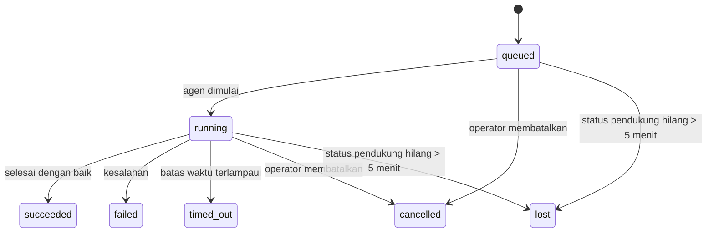

---
read_when:
    - Memeriksa pekerjaan latar belakang yang sedang berlangsung atau baru saja selesai
    - Men-debug kegagalan pengiriman untuk proses agen terpisah
    - Memahami hubungan proses latar belakang dengan sesi, cron, dan heartbeat
sidebarTitle: Background tasks
summary: Pelacakan tugas latar belakang untuk eksekusi ACP, subagen, eksekusi cron, dan operasi CLI
title: Tugas latar belakang
x-i18n:
    generated_at: "2026-07-19T04:48:49Z"
    model: gpt-5.6
    postprocess_version: locale-links-v1
    prompt_version: 32
    provider: openai
    source_hash: dbdc5ced133764fec0c8b9ae7b1957e24272dc9c1c86099de81f6923955d6b5a
    source_path: automation/tasks.md
    workflow: 16
---

<Note>
Mencari penjadwalan? Lihat [Otomatisasi](/id/automation) untuk memilih mekanisme yang tepat. Halaman ini adalah buku besar aktivitas untuk pekerjaan latar belakang, bukan penjadwal.
</Note>

Tugas latar belakang melacak pekerjaan yang berjalan **di luar sesi percakapan utama Anda**: eksekusi ACP, pembuatan subagen, eksekusi tugas cron, dan operasi yang dimulai melalui CLI.

Tugas **tidak** menggantikan sesi, tugas cron, atau heartbeat—tugas adalah **buku besar aktivitas** yang mencatat pekerjaan terpisah apa yang terjadi, kapan terjadinya, dan apakah berhasil.

<Note>
Tidak setiap eksekusi agen membuat tugas. Giliran heartbeat dan percakapan interaktif biasa tidak membuatnya. Semua eksekusi cron, pembuatan ACP, pembuatan subagen, perintah agen CLI yang dikirim oleh Gateway, dan perintah latar belakang `exec` yang dimulai agen membuatnya.
</Note>

## Ringkasannya

- Tugas adalah **catatan**, bukan penjadwal—cron dan heartbeat menentukan _kapan_ pekerjaan berjalan, sedangkan tugas melacak _apa yang terjadi_.
- ACP, subagen, semua tugas cron, dan operasi CLI membuat tugas. Giliran heartbeat tidak.
- Setiap tugas bergerak melalui `queued → running → terminal` (berhasil, gagal, kehabisan waktu, dibatalkan, atau hilang).
- Tugas cron tetap aktif selama runtime cron masih memiliki tugas tersebut; jika status runtime dalam memori telah hilang, pemeliharaan tugas terlebih dahulu memeriksa riwayat eksekusi cron yang persisten sebelum menandai tugas sebagai hilang.
- Penyelesaian didorong melalui pengiriman: pekerjaan terpisah dapat memberi tahu secara langsung atau membangunkan sesi pemohon/heartbeat saat selesai, sehingga perulangan polling status biasanya bukan pola yang tepat.
- Eksekusi cron terisolasi dan penyelesaian subagen berupaya semaksimal mungkin membersihkan tab/proses browser terlacak milik sesi turunannya sebelum pembukuan pembersihan akhir.
- Pengiriman cron terisolasi menekan balasan sementara induk yang sudah usang saat pekerjaan subagen turunan masih dituntaskan, dan memprioritaskan keluaran akhir turunan jika keluaran tersebut tiba sebelum pengiriman.
- Notifikasi penyelesaian dikirim langsung ke saluran atau dimasukkan ke antrean untuk heartbeat berikutnya.
- `openclaw tasks list` menampilkan semua tugas; `openclaw tasks audit` menampilkan masalah.
- Catatan terminal disimpan selama 7 hari (catatan `lost` selama 24 jam), lalu dipangkas secara otomatis.

## Mulai cepat

<Tabs>
  <Tab title="Cantumkan dan filter">
    ```bash
    # Cantumkan semua tugas (yang terbaru terlebih dahulu)
    openclaw tasks list

    # Filter berdasarkan runtime atau status
    openclaw tasks list --runtime acp
    openclaw tasks list --status running
    ```

  </Tab>
  <Tab title="Periksa">
    ```bash
    # Tampilkan detail tugas tertentu (berdasarkan ID tugas, ID eksekusi, atau kunci sesi)
    openclaw tasks show <lookup>
    ```
  </Tab>
  <Tab title="Batalkan dan beri tahu">
    ```bash
    # Batalkan tugas yang sedang berjalan (menghentikan sesi turunan)
    openclaw tasks cancel <lookup>

    # Ubah kebijakan notifikasi untuk tugas
    openclaw tasks notify <lookup> state_changes
    ```

  </Tab>
  <Tab title="Audit dan pemeliharaan">
    ```bash
    # Jalankan audit kesehatan
    openclaw tasks audit

    # Pratinjau atau terapkan pemeliharaan
    openclaw tasks maintenance
    openclaw tasks maintenance --apply
    ```

  </Tab>
  <Tab title="Alur tugas">
    ```bash
    # Periksa status TaskFlow
    openclaw tasks flow list
    openclaw tasks flow show <lookup>
    openclaw tasks flow cancel <lookup>
    ```
  </Tab>
</Tabs>

## Hal yang membuat tugas

| Sumber                 | Jenis runtime | Kapan catatan tugas dibuat                                          | Kebijakan notifikasi default |
| ---------------------- | ------------ | ---------------------------------------------------------------------- | --------------------- |
| Eksekusi latar belakang ACP    | `acp`        | Saat membuat sesi ACP turunan                                           | `done_only`           |
| Orkestrasi subagen | `subagent`   | Saat membuat subagen melalui `sessions_spawn`                               | `done_only`           |
| Tugas cron (semua jenis)  | `cron`       | Setiap eksekusi cron (sesi utama dan terisolasi)                       | `silent`              |
| Operasi CLI         | `cli`        | Perintah `openclaw agent` yang dijalankan melalui Gateway                 | `silent`              |
| Tugas media agen       | `cli`        | Eksekusi `image_generate`/`music_generate`/`video_generate` berbasis sesi | `silent`              |

<AccordionGroup>
  <Accordion title="Default notifikasi untuk cron dan media">
    Tugas cron (sesi utama dan terisolasi) menggunakan kebijakan notifikasi `silent`—tugas tersebut membuat catatan untuk pelacakan, tetapi tidak menghasilkan notifikasi tugas sendiri; cron memiliki jalur pengirimannya.

    Eksekusi `image_generate`, `music_generate`, dan `video_generate` berbasis sesi juga menggunakan kebijakan notifikasi `silent`. Eksekusi tersebut tetap membuat catatan tugas, tetapi penyelesaiannya dikembalikan ke sesi agen asal sebagai pembangkitan internal agar agen dapat menulis pesan tindak lanjut dan melampirkan sendiri media yang telah selesai. Agen pemohon mengikuti kontrak balasan terlihat yang biasa: balasan akhir otomatis jika dikonfigurasi, atau `message(action="send")` beserta `NO_REPLY` ketika sesi mewajibkan balasan melalui alat pesan. Jika sesi pemohon tidak lagi aktif atau pembangkitan aktifnya gagal, dan agen penyelesaian melewatkan sebagian atau seluruh media yang dihasilkan, OpenClaw mengirim fallback langsung yang idempoten hanya dengan media yang hilang ke target saluran asal.

  </Accordion>
  <Accordion title="Pembatas untuk pembuatan media serentak">
    Selama tugas pembuatan media berbasis sesi masih aktif, `image_generate`, `music_generate`, dan `video_generate` mencegah percobaan ulang yang tidak disengaja: mengulangi panggilan untuk prompt/permintaan yang sama akan mengembalikan status tugas aktif yang cocok alih-alih memulai duplikat, sedangkan prompt yang berbeda dapat memulai tugasnya sendiri. Gunakan `action: "status"` saat Anda menginginkan pencarian kemajuan/status secara eksplisit dari sisi agen.
  </Accordion>
  <Accordion title="Hal yang tidak membuat tugas">
    - Giliran heartbeat—sesi utama; lihat [Heartbeat](/id/gateway/heartbeat)
    - Giliran percakapan interaktif biasa
    - Respons langsung `/command`

  </Accordion>
</AccordionGroup>

## Siklus hidup tugas



| Status      | Artinya                                                               |
| ----------- | --------------------------------------------------------------------------- |
| `queued`    | Dibuat, menunggu agen dimulai                                     |
| `running`   | Giliran agen sedang aktif dieksekusi                                            |
| `succeeded` | Selesai dengan sukses                                                      |
| `failed`    | Selesai dengan kesalahan                                                     |
| `timed_out` | Melampaui batas waktu yang dikonfigurasi                                             |
| `cancelled` | Dihentikan oleh operator melalui `openclaw tasks cancel`, atau eksekusi diaborsi |
| `lost`      | Runtime kehilangan status pendukung otoritatif setelah masa tenggang 5 menit  |

Transisi terjadi secara otomatis—peristiwa siklus hidup eksekusi agen (mulai, selesai, kesalahan) memperbarui status tugas; Anda tidak mengelolanya secara manual.

Penyelesaian eksekusi agen bersifat otoritatif untuk catatan tugas aktif. Eksekusi terpisah yang berhasil diselesaikan sebagai `succeeded`, kesalahan eksekusi biasa diselesaikan sebagai `failed`, kehabisan waktu diselesaikan sebagai `timed_out`, dan hasil pembatalan/aborsi diselesaikan sebagai `cancelled`. Setelah tugas berstatus terminal, sinyal siklus hidup berikutnya tidak menurunkan statusnya—tugas yang dibatalkan operator atau sudah berstatus `failed`/`timed_out`/`lost` tetap demikian meskipun sinyal keberhasilan tiba setelahnya.

`lost` memperhitungkan runtime:

- Tugas ACP: hanya giliran ACP dalam proses yang aktif di Gateway yang membuktikan bahwa eksekusi masih berjalan; metadata sesi persisten saja tidak cukup. Audit CLI luring tetap konservatif dan tidak pernah mengambil alih tugas ACP.
- Tugas subagen: sesi turunan pendukung menghilang dari penyimpanan agen target (atau membawa batu nisan pemulihan setelah mulai ulang).
- Tugas cron: runtime cron tidak lagi melacak tugas sebagai aktif dan riwayat eksekusi cron yang persisten tidak menunjukkan hasil terminal untuk eksekusi tersebut. Audit CLI luring tidak menganggap status runtime cron dalam proses miliknya yang kosong sebagai sumber otoritatif.
- Tugas CLI: tugas dengan ID eksekusi/ID sumber menggunakan konteks eksekusi aktif, sehingga baris sesi turunan atau sesi percakapan yang tersisa tidak membuatnya tetap aktif setelah eksekusi milik Gateway menghilang. Tugas CLI lama tanpa identitas eksekusi masih kembali menggunakan sesi turunan. Eksekusi `openclaw agent` berbasis Gateway juga diselesaikan berdasarkan hasil eksekusinya, sehingga eksekusi yang sudah selesai tidak tetap aktif sampai penyapu menandainya sebagai `lost`.

## Pengiriman dan notifikasi

Saat tugas mencapai status terminal, OpenClaw memberi tahu Anda. Ada dua jalur pengiriman:

**Pengiriman langsung**—jika tugas memiliki target saluran (`requesterOrigin`), pesan penyelesaian langsung dikirim ke saluran tersebut (Discord, Slack, Telegram, dan sebagainya). Sebaliknya, penyelesaian tugas grup dan saluran dirutekan melalui sesi pemohon agar agen induk dapat menulis balasan yang terlihat. Untuk penyelesaian subagen, OpenClaw juga mempertahankan perutean utas/topik yang terikat jika tersedia dan dapat mengisi `to` / akun yang tidak ada dari rute tersimpan milik sesi pemohon (`lastChannel` / `lastTo` / `lastAccountId`) sebelum menghentikan upaya pengiriman langsung.

**Pengiriman dalam antrean sesi**—jika pengiriman langsung gagal atau asal tidak ditetapkan, pembaruan dimasukkan ke antrean sebagai peristiwa sistem dalam sesi pemohon dan ditampilkan pada heartbeat berikutnya.

<Tip>
Penyelesaian tugas dalam antrean sesi memicu pembangkitan heartbeat langsung, sehingga Anda melihat hasilnya dengan cepat—Anda tidak perlu menunggu interval heartbeat terjadwal berikutnya.
</Tip>

Artinya, alur kerja yang biasa berbasis pengiriman: mulai pekerjaan terpisah sekali, lalu biarkan runtime membangunkan atau memberi tahu Anda saat selesai. Lakukan polling status tugas hanya saat Anda memerlukan penelusuran kesalahan, intervensi, atau audit eksplisit.

### Kebijakan notifikasi

Kendalikan seberapa banyak informasi yang Anda terima tentang setiap tugas:

| Kebijakan                | Yang dikirim                                       |
| --------------------- | ------------------------------------------------------- |
| `done_only` (default) | Hanya status terminal (berhasil, gagal, dan sebagainya)           |
| `state_changes`       | Setiap transisi status dan pembaruan kemajuan              |
| `silent`              | Tidak ada sama sekali (default untuk tugas cron, CLI, dan media) |

Ubah kebijakan saat tugas sedang berjalan:

```bash
openclaw tasks notify <lookup> state_changes
```

## Referensi CLI

<AccordionGroup>
  <Accordion title="tasks list">
    ```bash
    openclaw tasks list [--runtime <acp|subagent|cron|cli>] [--status <status>] [--json]
    ```

    Kolom keluaran: Tugas, Jenis, Status, Pengiriman, Eksekusi, Sesi Turunan, Ringkasan. `openclaw tasks` tanpa argumen berperilaku seperti `openclaw tasks list`.

  </Accordion>
  <Accordion title="tasks show">
    ```bash
    openclaw tasks show <lookup> [--json]
    ```

    Token pencarian menerima ID tugas, ID eksekusi, atau kunci sesi. Menampilkan catatan lengkap yang mencakup waktu, status pengiriman, kesalahan, dan ringkasan terminal.

  </Accordion>
  <Accordion title="tasks cancel">
    ```bash
    openclaw tasks cancel <lookup>
    ```

    Untuk tugas ACP dan subagen, tindakan ini menghentikan sesi anak; pembatalan ACP dan cron dirutekan melalui Gateway yang sedang berjalan (`tasks.cancel`). Untuk tugas yang dilacak CLI, pembatalan dicatat dalam registri tugas (tidak ada handel runtime anak terpisah). Status beralih menjadi `cancelled` dan notifikasi pengiriman dikirim jika berlaku.

  </Accordion>
  <Accordion title="notifikasi tugas">
    ```bash
    openclaw tasks notify <lookup> <done_only|state_changes|silent>
    ```
  </Accordion>
  <Accordion title="audit tugas">
    ```bash
    openclaw tasks audit [--severity <warn|error>] [--code <name>] [--limit <n>] [--json]
    ```

    Menampilkan masalah operasional untuk tugas **dan** TaskFlow dalam satu laporan. Temuan juga muncul di `openclaw status` saat masalah terdeteksi.

    Temuan tugas:

    | Temuan                    | Tingkat keparahan | Pemicu                                                                                                               |
    | ------------------------- | ----------------- | -------------------------------------------------------------------------------------------------------------------- |
    | `stale_queued`        | peringatan        | Mengantre selama lebih dari 10 menit                                                                                  |
    | `stale_running`        | kesalahan         | Berjalan selama lebih dari 30 menit                                                                                   |
    | `lost`        | peringatan/kesalahan | Kepemilikan tugas berbasis runtime menghilang; tugas hilang yang dipertahankan memunculkan peringatan hingga `cleanupAfter`, lalu menjadi kesalahan |
    | `delivery_failed`        | peringatan        | Pengiriman gagal dan kebijakan notifikasi bukan `silent`                                                   |
    | `missing_cleanup`        | peringatan        | Tugas terminal tanpa stempel waktu pembersihan                                                                        |
    | `inconsistent_timestamps`        | peringatan        | Pelanggaran linimasa (misalnya berakhir sebelum dimulai)                                                              |

    Temuan TaskFlow:

    | Temuan                    | Tingkat keparahan | Pemicu                                                                                      |
    | ------------------------- | ----------------- | ------------------------------------------------------------------------------------------- |
    | `restore_failed`        | kesalahan         | Pemulihan registri alur dari SQLite gagal                                                    |
    | `stale_running`        | kesalahan         | Alur yang berjalan tidak mengalami kemajuan selama lebih dari 30 menit                       |
    | `stale_waiting`        | peringatan        | Alur yang menunggu tidak mengalami kemajuan selama lebih dari 30 menit                       |
    | `stale_blocked`        | peringatan        | Alur yang diblokir tidak mengalami kemajuan selama lebih dari 30 menit                       |
    | `cancel_stuck`        | peringatan        | Pembatalan diminta lebih dari 5 menit lalu, tidak ada tugas anak aktif, tetapi masih nonterminal |
    | `missing_linked_tasks`        | peringatan/kesalahan | Alur terkelola usang tanpa tugas tertaut atau status tunggu                                  |
    | `blocked_task_missing`        | peringatan        | Alur yang diblokir menunjuk ke ID tugas yang sudah tidak ada                                 |

  </Accordion>
  <Accordion title="pemeliharaan tugas">
    ```bash
    openclaw tasks maintenance [--json]
    openclaw tasks maintenance --apply [--json]
    ```

    Gunakan ini untuk mempratinjau atau menerapkan rekonsiliasi, pemberian stempel pembersihan, dan pemangkasan untuk tugas, status TaskFlow, serta baris registri sesi eksekusi cron yang usang.

    Rekonsiliasi mempertimbangkan runtime:

    - Tugas ACP memerlukan giliran dalam proses yang aktif di Gateway; tugas subagen memeriksa sesi anak yang mendasarinya.
    - Tugas subagen yang sesi anaknya memiliki penanda pemulihan setelah mulai ulang ditandai hilang, bukan diperlakukan sebagai sesi pendukung yang dapat dipulihkan.
    - Tugas cron memeriksa apakah runtime cron masih memiliki pekerjaan tersebut, lalu memulihkan status terminal dari log eksekusi cron/status pekerjaan yang dipersistenkan sebelum beralih ke `lost`. Hanya proses Gateway yang berwenang atas kumpulan pekerjaan aktif cron dalam memori; audit CLI luring menggunakan riwayat persisten, tetapi tidak menandai tugas cron sebagai hilang hanya karena kumpulan lokal tersebut kosong.
    - Tugas CLI dengan identitas eksekusi memeriksa konteks eksekusi aktif yang memilikinya, bukan hanya baris sesi anak atau sesi obrolan.

    Pembersihan penyelesaian juga mempertimbangkan runtime:

    - Penyelesaian subagen berupaya sebaik mungkin menutup tab/proses peramban yang dilacak untuk sesi anak sebelum pembersihan pengumuman dilanjutkan.
    - Penyelesaian cron terisolasi berupaya sebaik mungkin menutup tab/proses peramban yang dilacak untuk sesi cron sebelum eksekusi sepenuhnya dihentikan.
    - Pengiriman cron terisolasi menunggu tindak lanjut subagen turunan selesai jika diperlukan dan menyembunyikan teks pengakuan induk yang usang alih-alih mengumumkannya.
    - Pengiriman penyelesaian subagen hanya menggunakan teks asisten terbaru dari anak yang terlihat. Keluaran tool/toolResult tidak dipromosikan menjadi teks hasil anak. Eksekusi terminal yang gagal mengumumkan status kegagalan tanpa memutar ulang teks balasan yang direkam.
    - Kegagalan pembersihan tidak menyamarkan hasil tugas yang sebenarnya.

    Saat menerapkan pemeliharaan, OpenClaw juga menghapus baris registri sesi `cron:<jobId>:run:<runId>` yang usang dan berusia lebih dari 7 hari, sekaligus mempertahankan baris untuk pekerjaan cron yang sedang berjalan dan membiarkan baris sesi non-cron tidak tersentuh.

  </Accordion>
  <Accordion title="daftar | tampilkan | batalkan alur tugas">
    ```bash
    openclaw tasks flow list [--status <status>] [--json]
    openclaw tasks flow show <lookup> [--json]
    openclaw tasks flow cancel <lookup>
    ```

    Token pencarian alur menerima ID alur atau kunci pemilik. Gunakan ini saat [Task Flow](/id/automation/taskflow) yang mengorkestrasi merupakan hal yang ingin diperhatikan, bukan satu catatan tugas latar belakang tertentu.

  </Accordion>
</AccordionGroup>

## Papan tugas obrolan (`/tasks`)

Gunakan `/tasks` dalam sesi obrolan mana pun untuk melihat tugas latar belakang yang tertaut ke sesi tersebut. Papan menampilkan hingga lima tugas aktif dan yang baru selesai, beserta runtime, status, waktu, serta detail kemajuan atau kesalahan.

Saat sesi saat ini tidak memiliki tugas tertaut yang terlihat, `/tasks` beralih ke jumlah tugas lokal agen agar Anda tetap mendapatkan ikhtisar tanpa membocorkan detail sesi lain.

Untuk buku besar operator lengkap, gunakan CLI: `openclaw tasks list`.

### UI Kontrol

UI Kontrol web memiliki halaman **Tugas** di bilah samping yang menampilkan tugas latar belakang aktif dan terbaru secara langsung. Gunakan halaman tersebut untuk memeriksa kemajuan, membuka sesi tertaut, menyegarkan buku besar, atau membatalkan tugas yang mengantre dan berjalan.

Panel obrolan juga memiliki panel samping **Tugas latar belakang** yang dapat diciutkan dan dibatasi ke agen panel tersebut: tugas dan subagen yang sedang berjalan dengan kontrol berhenti, bagian yang selesai, serta tautan Lihat transkrip ke sesi anak setiap tugas. Buka dari tombol aktivitas di tajuk panel (atau tombol aktivitas mengambang dalam obrolan panel tunggal).

Pilih tugas di panel samping untuk memeriksa perintah masukan terbatasnya serta keluaran terbaru atau ringkasan kesalahan. Pekerjaan yang berjalan tetap terpisah dari pekerjaan yang selesai, dan baris yang selesai menunjukkan apakah tugas berhasil diselesaikan atau gagal. Di iOS, buka **Chat actions → Background Tasks**; di Android, buka menu tambahan Chat dan pilih **Background tasks**. Kedua tampilan seluler menggunakan pengelompokan Running dan Finished yang sama serta membuka detail tugas saat dipilih.

## Integrasi status (tekanan tugas)

`openclaw status` menyertakan baris tugas yang mudah dilihat sekilas:

```
Tugas    2 aktif · 1 mengantre · 1 berjalan · 1 masalah · audit bersih · 6 terlacak
```

Ringkasan menghitung pekerjaan aktif (`queued` + `running`), kegagalan (`failed` + `timed_out` + `lost`), temuan audit, dan total catatan yang dilacak; muatan JSON juga memerinci jumlah berdasarkan runtime (`acp`, `subagent`, `cron`, `cli`).

Baik `/status` maupun alat `session_status` menggunakan rekam ringkas tugas yang mempertimbangkan pembersihan: tugas aktif diprioritaskan, baris kedaluwarsa disembunyikan, dan tugas terminal hanya muncul selama jendela waktu singkat terkini (5 menit), dengan kegagalan difokuskan saat tidak ada pekerjaan aktif yang tersisa. Hal ini menjaga kartu status tetap berfokus pada hal yang penting saat ini.

## Penyimpanan dan pemeliharaan

### Lokasi penyimpanan tugas

Catatan tugas dan status pengiriman dipersistenkan dalam basis data status SQLite bersama OpenClaw:

```
~/.openclaw/state/openclaw.sqlite   (tabel: task_runs, task_delivery_state, flow_runs)
```

Atur `OPENCLAW_STATE_DIR` untuk memindahkan seluruh root status (default `~/.openclaw`) ke tempat lain; jalur basis data bersama akan ikut berpindah.

Registri dimuat ke memori saat pertama kali digunakan dan setiap penulisan dipersistenkan kembali ke SQLite, sehingga catatan tetap tersedia setelah Gateway dimulai ulang. Pertumbuhan WAL tetap terbatas melalui ambang pemeriksaan otomatis default SQLite ditambah pemeriksaan `PASSIVE` berkala; pemeriksaan saat penghentian dan pemeliharaan eksplisit menggunakan `TRUNCATE` agar penutupan normal mengosongkan ruang WAL tanpa membuat penyapu latar belakang menunggu pembaca aktif.

Penyimpanan sidecar lama dari instalasi terdahulu (`tasks/runs.sqlite`, `flows/registry.sqlite`) diimpor ke basis data bersama oleh `openclaw doctor`.

### Pemeliharaan otomatis

Penyapu berjalan setiap **60 detik** (lintasan pertama sekitar 5 detik setelah Gateway dimulai) dan menangani empat hal:

<Steps>
  <Step title="Rekonsiliasi">
    Memeriksa apakah tugas aktif masih memiliki dukungan runtime yang berwenang. Tugas ACP memerlukan giliran dalam proses yang aktif, tugas subagen menggunakan status sesi anak, tugas cron menggunakan kepemilikan pekerjaan aktif beserta riwayat eksekusi persisten, dan tugas CLI dengan identitas eksekusi menggunakan konteks eksekusi yang memilikinya. Jika status pendukung telah hilang selama lebih dari 5 menit (30 menit untuk tugas subagen native tanpa anak), tugas ditandai `lost`.
  </Step>
  <Step title="Perbaikan sesi ACP">
    Menutup sesi ACP sekali jalan milik induk yang terminal atau yatim, dan menutup sesi ACP persisten usang yang terminal atau yatim hanya saat tidak ada pengikatan percakapan aktif yang tersisa.
  </Step>
  <Step title="Pemberian stempel pembersihan">
    Menetapkan stempel waktu `cleanupAfter` pada tugas terminal (waktu terminal + jendela retensi). Selama retensi, tugas yang hilang masih muncul dalam audit sebagai peringatan; setelah `cleanupAfter` kedaluwarsa atau saat metadata pembersihan tidak ada, tugas tersebut menjadi kesalahan.
  </Step>
  <Step title="Pemangkasan">
    Menghapus catatan yang telah melewati tanggal `cleanupAfter`.
  </Step>
</Steps>

<Note>
**Retensi:** catatan tugas terminal disimpan selama **7 hari** (catatan `lost` selama **24 jam**), lalu dipangkas secara otomatis. Tidak diperlukan konfigurasi.
</Note>

## Hubungan tugas dengan sistem lain

<AccordionGroup>
  <Accordion title="Tugas dan Task Flow">
    [Task Flow](/id/automation/taskflow) adalah lapisan orkestrasi alur di atas tugas latar belakang. Satu alur dapat mengoordinasikan beberapa tugas selama masa aktifnya menggunakan mode sinkronisasi terkelola atau tercermin. Gunakan `openclaw tasks` untuk memeriksa catatan tugas individual dan `openclaw tasks flow` untuk memeriksa alur yang mengorkestrasi.

  </Accordion>
  <Accordion title="Tugas dan cron">
    Definisi pekerjaan cron, status eksekusi runtime, dan riwayat eksekusi tersimpan dalam basis data status SQLite bersama OpenClaw. **Setiap** eksekusi cron membuat catatan tugas—baik sesi utama maupun terisolasi—dengan kebijakan notifikasi `silent`, sehingga eksekusi cron dilacak tanpa menghasilkan notifikasi tugasnya sendiri.

    Lihat [Pekerjaan Cron](/id/automation/cron-jobs).

  </Accordion>
  <Accordion title="Tugas dan Heartbeat">
    Eksekusi Heartbeat merupakan giliran sesi utama—eksekusi tersebut tidak membuat catatan tugas. Saat tugas selesai, tugas tersebut dapat memicu pengaktifan Heartbeat agar Anda segera melihat hasilnya.

    Lihat [Heartbeat](/id/gateway/heartbeat).

  </Accordion>
  <Accordion title="Tugas dan sesi">
    Sebuah tugas dapat merujuk pada `childSessionKey` (tempat pekerjaan berjalan) dan `requesterSessionKey` (pihak yang memulainya). `agentId` miliknya mengidentifikasi agen yang menjalankan pekerjaan, sedangkan bidang peminta dan pemilik mempertahankan konteks peluncuran dan kontrol. Sesi adalah konteks percakapan; tugas merupakan pelacakan aktivitas di atas konteks tersebut.
  </Accordion>
  <Accordion title="Tugas dan eksekusi agen">
    `runId` milik sebuah tugas tertaut ke eksekusi agen yang melakukan pekerjaan tersebut. Peristiwa siklus hidup agen (mulai, selesai, kesalahan) secara otomatis memperbarui status tugas - Anda tidak perlu mengelola siklus hidup secara manual.
  </Accordion>
</AccordionGroup>

## Terkait

- [Otomatisasi](/id/automation) - sekilas tentang semua mekanisme otomatisasi
- [CLI: Tugas](/id/cli/tasks) - referensi perintah CLI
- [Heartbeat](/id/gateway/heartbeat) - giliran sesi utama berkala
- [Tugas Terjadwal](/id/automation/cron-jobs) - penjadwalan pekerjaan latar belakang
- [TaskFlow](/id/automation/taskflow) - orkestrasi alur di atas tugas
