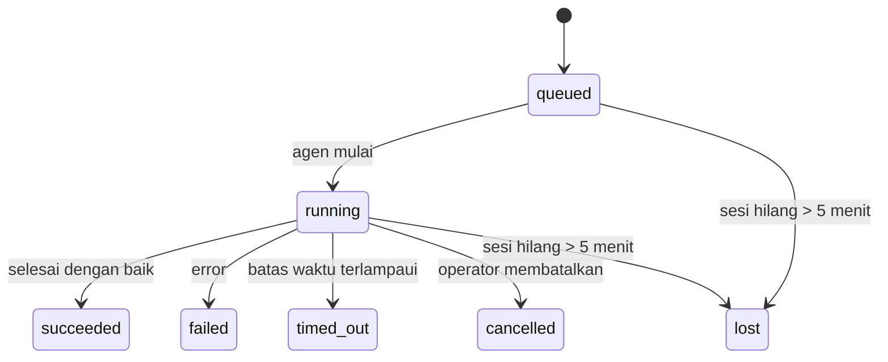

---
read_when:
    - Memeriksa pekerjaan latar belakang yang sedang berlangsung atau baru saja selesai
    - Men-debug kegagalan pengiriman untuk run agen yang terlepas
    - Memahami bagaimana run latar belakang terkait dengan sesi, Cron, dan Heartbeat
summary: Pelacakan tugas latar belakang untuk run ACP, subagen, tugas Cron terisolasi, dan operasi CLI
title: Tugas Latar Belakang
x-i18n:
    generated_at: "2026-04-21T19:20:54Z"
    model: gpt-5.4
    provider: openai
    source_hash: a4cd666b3eaffde8df0b5e1533eb337e44a0824824af6f8a240f18a89f71b402
    source_path: automation/tasks.md
    workflow: 15
---

# Tugas Latar Belakang

> **Mencari penjadwalan?** Lihat [Otomasi & Tugas](/id/automation) untuk memilih mekanisme yang tepat. Halaman ini membahas **pelacakan** pekerjaan latar belakang, bukan penjadwalannya.

Tugas latar belakang melacak pekerjaan yang berjalan **di luar sesi percakapan utama Anda**:
run ACP, spawn subagen, eksekusi tugas Cron terisolasi, dan operasi yang dimulai dari CLI.

Tugas **tidak** menggantikan sesi, tugas Cron, atau Heartbeat — tugas adalah **ledger aktivitas** yang mencatat pekerjaan terlepas apa yang terjadi, kapan terjadi, dan apakah berhasil.

<Note>
Tidak setiap run agen membuat tugas. Putaran Heartbeat dan chat interaktif normal tidak membuat tugas. Semua eksekusi Cron, spawn ACP, spawn subagen, dan perintah agen CLI membuat tugas.
</Note>

## Ringkasan Singkat

- Tugas adalah **catatan**, bukan penjadwal — Cron dan Heartbeat menentukan _kapan_ pekerjaan dijalankan, tugas melacak _apa yang terjadi_.
- ACP, subagen, semua tugas Cron, dan operasi CLI membuat tugas. Putaran Heartbeat tidak.
- Setiap tugas bergerak melalui `queued → running → terminal` (`succeeded`, `failed`, `timed_out`, `cancelled`, atau `lost`).
- Tugas Cron tetap aktif selama runtime Cron masih memiliki tugas tersebut; tugas CLI yang didukung chat tetap aktif hanya selama konteks run pemiliknya masih aktif.
- Penyelesaian bersifat push-driven: pekerjaan terlepas dapat memberi tahu secara langsung atau membangunkan sesi/Heartbeat peminta saat selesai, jadi loop polling status biasanya bukan pola yang tepat.
- Run Cron terisolasi dan penyelesaian subagen melakukan pembersihan best-effort pada tab/proses browser yang dilacak untuk sesi turunannya sebelum pembukuan pembersihan akhir.
- Pengiriman Cron terisolasi menekan balasan induk sementara yang sudah usang saat pekerjaan subagen turunan masih dikuras, dan lebih memilih output turunan final jika itu tiba sebelum pengiriman.
- Notifikasi penyelesaian dikirim langsung ke channel atau diantrekan untuk Heartbeat berikutnya.
- `openclaw tasks list` menampilkan semua tugas; `openclaw tasks audit` menampilkan masalah.
- Catatan terminal disimpan selama 7 hari, lalu otomatis dipangkas.

## Mulai cepat

```bash
# Daftar semua tugas (terbaru lebih dulu)
openclaw tasks list

# Filter berdasarkan runtime atau status
openclaw tasks list --runtime acp
openclaw tasks list --status running

# Tampilkan detail untuk tugas tertentu (berdasarkan ID, ID run, atau kunci sesi)
openclaw tasks show <lookup>

# Batalkan tugas yang sedang berjalan (menghentikan sesi anak)
openclaw tasks cancel <lookup>

# Ubah kebijakan notifikasi untuk sebuah tugas
openclaw tasks notify <lookup> state_changes

# Jalankan audit kesehatan
openclaw tasks audit

# Pratinjau atau terapkan pemeliharaan
openclaw tasks maintenance
openclaw tasks maintenance --apply

# Periksa status TaskFlow
openclaw tasks flow list
openclaw tasks flow show <lookup>
openclaw tasks flow cancel <lookup>
```

## Apa yang membuat tugas

| Sumber                 | Jenis runtime | Kapan catatan tugas dibuat                           | Kebijakan notifikasi default |
| ---------------------- | ------------- | ---------------------------------------------------- | ---------------------------- |
| Run latar belakang ACP | `acp`         | Saat men-spawn sesi ACP anak                         | `done_only`                  |
| Orkestrasi subagen     | `subagent`    | Saat men-spawn subagen melalui `sessions_spawn`      | `done_only`                  |
| Tugas Cron (semua jenis) | `cron`      | Setiap eksekusi Cron (sesi utama dan terisolasi)     | `silent`                     |
| Operasi CLI            | `cli`         | Perintah `openclaw agent` yang berjalan melalui Gateway | `silent`                  |
| Tugas media agen       | `cli`         | Run `video_generate` yang didukung sesi              | `silent`                     |

Tugas Cron sesi utama menggunakan kebijakan notifikasi `silent` secara default — mereka membuat catatan untuk pelacakan tetapi tidak menghasilkan notifikasi. Tugas Cron terisolasi juga default ke `silent` tetapi lebih terlihat karena berjalan dalam sesi mereka sendiri.

Run `video_generate` yang didukung sesi juga menggunakan kebijakan notifikasi `silent`. Run tersebut tetap membuat catatan tugas, tetapi penyelesaiannya dikembalikan ke sesi agen asal sebagai wake internal agar agen dapat menulis pesan tindak lanjut dan melampirkan video yang selesai sendiri. Jika Anda memilih `tools.media.asyncCompletion.directSend`, penyelesaian async `music_generate` dan `video_generate` mencoba pengiriman channel langsung terlebih dahulu sebelum kembali ke jalur wake sesi peminta.

Saat sebuah tugas `video_generate` yang didukung sesi masih aktif, tool ini juga bertindak sebagai guardrail: panggilan `video_generate` berulang dalam sesi yang sama akan mengembalikan status tugas aktif alih-alih memulai generasi serentak kedua. Gunakan `action: "status"` jika Anda ingin pencarian kemajuan/status yang eksplisit dari sisi agen.

**Yang tidak membuat tugas:**

- Putaran Heartbeat — sesi utama; lihat [Heartbeat](/id/gateway/heartbeat)
- Putaran chat interaktif normal
- Respons `/command` langsung

## Siklus hidup tugas



| Status      | Artinya                                                                  |
| ----------- | ------------------------------------------------------------------------ |
| `queued`    | Dibuat, menunggu agen mulai                                              |
| `running`   | Putaran agen sedang dieksekusi secara aktif                              |
| `succeeded` | Selesai dengan sukses                                                    |
| `failed`    | Selesai dengan error                                                     |
| `timed_out` | Melebihi batas waktu yang dikonfigurasi                                  |
| `cancelled` | Dihentikan oleh operator melalui `openclaw tasks cancel`                 |
| `lost`      | Runtime kehilangan status pendukung otoritatif setelah masa tenggang 5 menit |

Transisi terjadi secara otomatis — saat run agen terkait berakhir, status tugas diperbarui agar sesuai.

`lost` bersifat runtime-aware:

- Tugas ACP: metadata sesi anak ACP pendukung menghilang.
- Tugas subagen: sesi anak pendukung menghilang dari penyimpanan agen target.
- Tugas Cron: runtime Cron tidak lagi melacak tugas sebagai aktif.
- Tugas CLI: tugas sesi anak terisolasi menggunakan sesi anak; tugas CLI yang didukung chat menggunakan konteks run aktif sebagai gantinya, jadi baris sesi channel/grup/langsung yang tersisa tidak membuatnya tetap hidup.

## Pengiriman dan notifikasi

Saat sebuah tugas mencapai status terminal, OpenClaw memberi tahu Anda. Ada dua jalur pengiriman:

**Pengiriman langsung** — jika tugas memiliki target channel (`requesterOrigin`), pesan penyelesaian langsung dikirim ke channel tersebut (Telegram, Discord, Slack, dll.). Untuk penyelesaian subagen, OpenClaw juga mempertahankan perutean thread/topik yang terikat bila tersedia dan dapat mengisi `to` / akun yang hilang dari rute tersimpan sesi peminta (`lastChannel` / `lastTo` / `lastAccountId`) sebelum menyerah pada pengiriman langsung.

**Pengiriman yang diantrekan ke sesi** — jika pengiriman langsung gagal atau tidak ada origin yang ditetapkan, pembaruan diantrekan sebagai peristiwa sistem dalam sesi peminta dan muncul pada Heartbeat berikutnya.

<Tip>
Penyelesaian tugas memicu wake Heartbeat segera agar Anda cepat melihat hasilnya — Anda tidak perlu menunggu tick Heartbeat terjadwal berikutnya.
</Tip>

Artinya, alur kerja yang umum bersifat berbasis push: mulai pekerjaan terlepas sekali, lalu biarkan runtime membangunkan atau memberi tahu Anda saat selesai. Poll status tugas hanya saat Anda memerlukan debugging, intervensi, atau audit eksplisit.

### Kebijakan notifikasi

Kendalikan seberapa banyak yang Anda dengar tentang setiap tugas:

| Kebijakan            | Apa yang dikirimkan                                                      |
| -------------------- | ------------------------------------------------------------------------ |
| `done_only` (default) | Hanya status terminal (`succeeded`, `failed`, dll.) — **ini adalah default** |
| `state_changes`      | Setiap transisi status dan pembaruan kemajuan                            |
| `silent`             | Tidak ada sama sekali                                                    |

Ubah kebijakan saat tugas sedang berjalan:

```bash
openclaw tasks notify <lookup> state_changes
```

## Referensi CLI

### `tasks list`

```bash
openclaw tasks list [--runtime <acp|subagent|cron|cli>] [--status <status>] [--json]
```

Kolom output: ID Tugas, Jenis, Status, Pengiriman, ID Run, Sesi Anak, Ringkasan.

### `tasks show`

```bash
openclaw tasks show <lookup>
```

Token lookup menerima ID tugas, ID run, atau kunci sesi. Menampilkan catatan lengkap termasuk waktu, status pengiriman, error, dan ringkasan terminal.

### `tasks cancel`

```bash
openclaw tasks cancel <lookup>
```

Untuk tugas ACP dan subagen, ini menghentikan sesi anak. Untuk tugas yang dilacak CLI, pembatalan dicatat dalam registry tugas (tidak ada handle runtime anak yang terpisah). Status bertransisi ke `cancelled` dan notifikasi pengiriman dikirim jika berlaku.

### `tasks notify`

```bash
openclaw tasks notify <lookup> <done_only|state_changes|silent>
```

### `tasks audit`

```bash
openclaw tasks audit [--json]
```

Menampilkan masalah operasional. Temuan juga muncul di `openclaw status` saat masalah terdeteksi.

| Temuan                    | Tingkat keparahan | Pemicu                                                 |
| ------------------------- | ----------------- | ------------------------------------------------------ |
| `stale_queued`            | warn              | Dalam antrean lebih dari 10 menit                      |
| `stale_running`           | error             | Berjalan lebih dari 30 menit                           |
| `lost`                    | error             | Kepemilikan tugas yang didukung runtime menghilang     |
| `delivery_failed`         | warn              | Pengiriman gagal dan kebijakan notifikasi bukan `silent` |
| `missing_cleanup`         | warn              | Tugas terminal tanpa stempel waktu pembersihan         |
| `inconsistent_timestamps` | warn              | Pelanggaran linimasa (misalnya selesai sebelum dimulai) |

### `tasks maintenance`

```bash
openclaw tasks maintenance [--json]
openclaw tasks maintenance --apply [--json]
```

Gunakan ini untuk mempratinjau atau menerapkan rekonsiliasi, penandaan pembersihan, dan pemangkasan untuk tugas dan status TaskFlow.

Rekonsiliasi bersifat runtime-aware:

- Tugas ACP/subagen memeriksa sesi anak pendukungnya.
- Tugas Cron memeriksa apakah runtime Cron masih memiliki tugas tersebut.
- Tugas CLI yang didukung chat memeriksa konteks run aktif pemiliknya, bukan hanya baris sesi chat.

Pembersihan penyelesaian juga bersifat runtime-aware:

- Penyelesaian subagen melakukan penutupan best-effort pada tab/proses browser yang dilacak untuk sesi anak sebelum pembersihan pengumuman berlanjut.
- Penyelesaian Cron terisolasi melakukan penutupan best-effort pada tab/proses browser yang dilacak untuk sesi Cron sebelum run sepenuhnya dibongkar.
- Pengiriman Cron terisolasi menunggu tindak lanjut subagen turunan bila diperlukan dan menekan teks pengakuan induk yang sudah usang alih-alih mengumumkannya.
- Pengiriman penyelesaian subagen lebih memilih teks asisten terlihat terbaru; jika kosong, pengiriman kembali ke teks tool/toolResult terbaru yang sudah disanitasi, dan run pemanggilan tool yang hanya timeout dapat diringkas menjadi ringkasan kemajuan parsial singkat. Run gagal terminal mengumumkan status kegagalan tanpa memutar ulang teks balasan yang ditangkap.
- Kegagalan pembersihan tidak menutupi hasil tugas yang sebenarnya.

### `tasks flow list|show|cancel`

```bash
openclaw tasks flow list [--status <status>] [--json]
openclaw tasks flow show <lookup> [--json]
openclaw tasks flow cancel <lookup>
```

Gunakan ini saat TaskFlow pengorkestrasi adalah hal yang Anda pedulikan, bukan satu catatan tugas latar belakang individual.

## Papan tugas chat (`/tasks`)

Gunakan `/tasks` dalam sesi chat mana pun untuk melihat tugas latar belakang yang terhubung ke sesi itu. Papan menampilkan tugas aktif dan yang baru selesai dengan runtime, status, waktu, serta detail kemajuan atau error.

Saat sesi saat ini tidak memiliki tugas tertaut yang terlihat, `/tasks` akan kembali ke hitungan tugas lokal agen
agar Anda tetap mendapatkan gambaran umum tanpa membocorkan detail sesi lain.

Untuk ledger operator lengkap, gunakan CLI: `openclaw tasks list`.

## Integrasi status (tekanan tugas)

`openclaw status` menyertakan ringkasan tugas sekilas:

```
Tasks: 3 queued · 2 running · 1 issues
```

Ringkasan tersebut melaporkan:

- **active** — jumlah `queued` + `running`
- **failures** — jumlah `failed` + `timed_out` + `lost`
- **byRuntime** — rincian menurut `acp`, `subagent`, `cron`, `cli`

Baik `/status` maupun tool `session_status` menggunakan snapshot tugas yang sadar-pembersihan: tugas aktif
diprioritaskan, baris selesai yang usang disembunyikan, dan kegagalan terbaru hanya ditampilkan saat tidak ada pekerjaan aktif
yang tersisa. Ini menjaga kartu status tetap fokus pada hal yang penting saat ini.

## Penyimpanan dan pemeliharaan

### Tempat tugas disimpan

Catatan tugas disimpan persisten di SQLite pada:

```
$OPENCLAW_STATE_DIR/tasks/runs.sqlite
```

Registry dimuat ke memori saat Gateway dimulai dan menyinkronkan penulisan ke SQLite agar tetap tahan terhadap restart.

### Pemeliharaan otomatis

Sebuah sweeper berjalan setiap **60 detik** dan menangani tiga hal:

1. **Rekonsiliasi** — memeriksa apakah tugas aktif masih memiliki dukungan runtime otoritatif. Tugas ACP/subagen menggunakan status sesi anak, tugas Cron menggunakan kepemilikan tugas aktif, dan tugas CLI yang didukung chat menggunakan konteks run pemiliknya. Jika status pendukung itu hilang selama lebih dari 5 menit, tugas ditandai sebagai `lost`.
2. **Penandaan pembersihan** — menetapkan stempel waktu `cleanupAfter` pada tugas terminal (`endedAt + 7 hari`).
3. **Pemangkasan** — menghapus catatan yang sudah melewati tanggal `cleanupAfter` mereka.

**Retensi**: catatan tugas terminal disimpan selama **7 hari**, lalu otomatis dipangkas. Tidak perlu konfigurasi.

## Bagaimana tugas berhubungan dengan sistem lain

### Tugas dan TaskFlow

[TaskFlow](/id/automation/taskflow) adalah lapisan orkestrasi alur di atas tugas latar belakang. Satu flow dapat mengoordinasikan beberapa tugas selama masa hidupnya menggunakan mode sinkronisasi terkelola atau tercermin. Gunakan `openclaw tasks` untuk memeriksa catatan tugas individual dan `openclaw tasks flow` untuk memeriksa flow pengorkestrasi.

Lihat [TaskFlow](/id/automation/taskflow) untuk detailnya.

### Tugas dan Cron

Sebuah **definisi** tugas Cron disimpan di `~/.openclaw/cron/jobs.json`; status eksekusi runtime disimpan di sebelahnya dalam `~/.openclaw/cron/jobs-state.json`. **Setiap** eksekusi Cron membuat catatan tugas — baik sesi utama maupun terisolasi. Tugas Cron sesi utama default ke kebijakan notifikasi `silent` sehingga dapat dilacak tanpa menghasilkan notifikasi.

Lihat [Tugas Cron](/id/automation/cron-jobs).

### Tugas dan Heartbeat

Run Heartbeat adalah putaran sesi utama — run tersebut tidak membuat catatan tugas. Saat sebuah tugas selesai, tugas itu dapat memicu wake Heartbeat agar Anda segera melihat hasilnya.

Lihat [Heartbeat](/id/gateway/heartbeat).

### Tugas dan sesi

Sebuah tugas dapat merujuk `childSessionKey` (tempat pekerjaan dijalankan) dan `requesterSessionKey` (siapa yang memulainya). Sesi adalah konteks percakapan; tugas adalah pelacakan aktivitas di atas konteks tersebut.

### Tugas dan run agen

`runId` sebuah tugas terhubung ke run agen yang melakukan pekerjaan. Peristiwa siklus hidup agen (mulai, selesai, error) secara otomatis memperbarui status tugas — Anda tidak perlu mengelola siklus hidupnya secara manual.

## Terkait

- [Otomasi & Tugas](/id/automation) — semua mekanisme otomasi dalam satu ringkasan
- [TaskFlow](/id/automation/taskflow) — orkestrasi alur di atas tugas
- [Tugas Terjadwal](/id/automation/cron-jobs) — menjadwalkan pekerjaan latar belakang
- [Heartbeat](/id/gateway/heartbeat) — putaran sesi utama berkala
- [CLI: Tasks](/cli/index#tasks) — referensi perintah CLI
