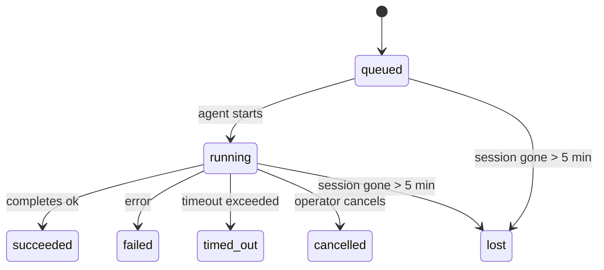

---
read_when:
    - Memeriksa pekerjaan latar belakang yang sedang berlangsung atau baru saja selesai
    - Men-debug kegagalan pengiriman untuk agent run terlepas
    - Memahami bagaimana eksekusi latar belakang terkait dengan sesi, Cron, dan Heartbeat
sidebarTitle: Background tasks
summary: Pelacakan tugas latar belakang untuk eksekusi ACP, subagen, pekerjaan Cron terisolasi, dan operasi CLI
title: Tugas latar belakang
x-i18n:
    generated_at: "2026-06-27T17:08:54Z"
    model: gpt-5.5
    postprocess_version: locale-links-v1
    provider: openai
    source_hash: 4a630a52d0d6bfd387a37415dd63fc4bfbce23f99eaa8cb780c3d6f8913675fd
    source_path: automation/tasks.md
    workflow: 16
---

<Note>
Mencari penjadwalan? Lihat [Automation](/id/automation) untuk memilih mekanisme yang tepat. Halaman ini adalah buku besar aktivitas untuk pekerjaan latar belakang, bukan penjadwal.
</Note>

Tugas latar belakang melacak pekerjaan yang berjalan **di luar sesi percakapan utama Anda**: eksekusi ACP, spawn subagent, eksekusi cron job terisolasi, dan operasi yang dimulai dari CLI.

Tugas **tidak** menggantikan sesi, cron job, atau heartbeat - tugas adalah **buku besar aktivitas** yang mencatat pekerjaan terlepas apa yang terjadi, kapan, dan apakah berhasil.

<Note>
Tidak setiap eksekusi agen membuat tugas. Giliran Heartbeat dan chat interaktif normal tidak. Semua eksekusi cron, spawn ACP, spawn subagent, dan perintah agen CLI membuatnya.
</Note>

## Ringkasan

- Tugas adalah **catatan**, bukan penjadwal - cron dan heartbeat menentukan _kapan_ pekerjaan berjalan, tugas melacak _apa yang terjadi_.
- ACP, subagent, semua cron job, dan operasi CLI membuat tugas. Giliran Heartbeat tidak.
- Setiap tugas bergerak melalui `queued → running → terminal` (succeeded, failed, timed_out, cancelled, atau lost).
- Tugas cron tetap aktif selama runtime cron masih memiliki job tersebut; jika
  status runtime dalam memori hilang, pemeliharaan tugas terlebih dahulu memeriksa riwayat
  eksekusi cron yang persisten sebelum menandai tugas sebagai lost.
- Penyelesaian didorong oleh push: pekerjaan terlepas dapat memberi tahu secara langsung atau membangunkan
  sesi/heartbeat peminta saat selesai, sehingga loop polling status
  biasanya bukan bentuk yang tepat.
- Eksekusi cron terisolasi dan penyelesaian subagent berusaha sebaik mungkin membersihkan tab/proses browser yang dilacak untuk sesi anaknya sebelum pembukuan pembersihan akhir.
- Pengiriman cron terisolasi menekan balasan induk sementara yang basi saat pekerjaan subagent turunan masih diselesaikan, dan lebih memilih keluaran turunan akhir saat keluaran itu tiba sebelum pengiriman.
- Notifikasi penyelesaian dikirim langsung ke channel atau diantrekan untuk heartbeat berikutnya.
- `openclaw tasks list` menampilkan semua tugas; `openclaw tasks audit` menampilkan masalah.
- Catatan terminal disimpan selama 7 hari, lalu dipangkas otomatis.

## Mulai cepat

<Tabs>
  <Tab title="List and filter">
    ```bash
    # List all tasks (newest first)
    openclaw tasks list

    # Filter by runtime or status
    openclaw tasks list --runtime acp
    openclaw tasks list --status running
    ```

  </Tab>
  <Tab title="Inspect">
    ```bash
    # Show details for a specific task (by ID, run ID, or session key)
    openclaw tasks show <lookup>
    ```
  </Tab>
  <Tab title="Cancel and notify">
    ```bash
    # Cancel a running task (kills the child session)
    openclaw tasks cancel <lookup>

    # Change notification policy for a task
    openclaw tasks notify <lookup> state_changes
    ```

  </Tab>
  <Tab title="Audit and maintenance">
    ```bash
    # Run a health audit
    openclaw tasks audit

    # Preview or apply maintenance
    openclaw tasks maintenance
    openclaw tasks maintenance --apply
    ```

  </Tab>
  <Tab title="Task flow">
    ```bash
    # Inspect TaskFlow state
    openclaw tasks flow list
    openclaw tasks flow show <lookup>
    openclaw tasks flow cancel <lookup>
    ```
  </Tab>
</Tabs>

## Apa yang membuat tugas

| Sumber                 | Jenis runtime | Kapan catatan tugas dibuat                                          | Kebijakan notifikasi default |
| ---------------------- | ------------ | ---------------------------------------------------------------------- | --------------------- |
| Eksekusi latar belakang ACP    | `acp`        | Men-spawn sesi anak ACP                                           | `done_only`           |
| Orkestrasi subagent | `subagent`   | Men-spawn subagent melalui `sessions_spawn`                               | `done_only`           |
| Cron job (semua jenis)  | `cron`       | Setiap eksekusi cron (sesi utama dan terisolasi)                       | `silent`              |
| Operasi CLI         | `cli`        | Perintah `openclaw agent` yang berjalan melalui gateway                 | `silent`              |
| Job media agen       | `cli`        | Eksekusi `image_generate`/`music_generate`/`video_generate` berbasis sesi | `silent`              |

<AccordionGroup>
  <Accordion title="Notify defaults for cron and media">
    Tugas cron sesi utama menggunakan kebijakan notifikasi `silent` secara default - tugas tersebut membuat catatan untuk pelacakan tetapi tidak menghasilkan notifikasi. Tugas cron terisolasi juga default ke `silent`, tetapi lebih terlihat karena berjalan dalam sesinya sendiri.

    Eksekusi `image_generate`, `music_generate`, dan `video_generate` berbasis sesi juga menggunakan kebijakan notifikasi `silent`. Eksekusi tersebut tetap membuat catatan tugas, tetapi penyelesaian diserahkan kembali ke sesi agen asli sebagai wake internal sehingga agen dapat menulis pesan lanjutan dan melampirkan media yang selesai sendiri. Agen peminta mengikuti kontrak balasan terlihat normalnya: balasan akhir otomatis saat dikonfigurasi, atau `message(action="send")` plus `NO_REPLY` saat sesi memerlukan balasan alat pesan. Jika sesi peminta tidak lagi aktif atau wake aktifnya gagal, dan agen penyelesaian melewatkan sebagian atau semua media yang dihasilkan, OpenClaw mengirim fallback langsung idempoten dengan hanya media yang hilang ke target channel asli.

  </Accordion>
  <Accordion title="Concurrent media-generation guardrail">
    Selama tugas pembuatan media berbasis sesi masih aktif, alat media juga bertindak sebagai guardrail untuk percobaan ulang yang tidak disengaja. Panggilan `image_generate` berulang untuk prompt yang sama mengembalikan status tugas aktif yang cocok, sedangkan prompt gambar yang berbeda dapat memulai tugasnya sendiri. Panggilan `music_generate` dan `video_generate` tetap mengembalikan status tugas aktif untuk sesi tersebut alih-alih memulai pembuatan kedua secara bersamaan. Gunakan `action: "status"` saat Anda menginginkan pencarian progres/status eksplisit dari sisi agen.
  </Accordion>
  <Accordion title="What does not create tasks">
    - Giliran Heartbeat - sesi utama; lihat [Heartbeat](/id/gateway/heartbeat)
    - Giliran chat interaktif normal
    - Respons `/command` langsung

  </Accordion>
</AccordionGroup>

## Siklus hidup tugas



| Status      | Artinya                                                              |
| ----------- | -------------------------------------------------------------------------- |
| `queued`    | Dibuat, menunggu agen dimulai                                    |
| `running`   | Giliran agen sedang dieksekusi secara aktif                                           |
| `succeeded` | Selesai dengan sukses                                                     |
| `failed`    | Selesai dengan error                                                    |
| `timed_out` | Melebihi timeout yang dikonfigurasi                                            |
| `cancelled` | Dihentikan oleh operator melalui `openclaw tasks cancel`                        |
| `lost`      | Runtime kehilangan status pendukung otoritatif setelah masa tenggang 5 menit |

Transisi terjadi otomatis - saat eksekusi agen terkait berakhir, status tugas diperbarui agar cocok.

Penyelesaian eksekusi agen bersifat otoritatif untuk catatan tugas aktif. Eksekusi terlepas yang berhasil difinalisasi sebagai `succeeded`, error eksekusi biasa difinalisasi sebagai `failed`, dan hasil timeout atau abort difinalisasi sebagai `timed_out`. Jika operator sudah membatalkan tugas, atau runtime sudah mencatat status terminal yang lebih kuat seperti `failed`, `timed_out`, atau `lost`, sinyal sukses belakangan tidak menurunkan status terminal tersebut.

`lost` sadar runtime:

- Tugas ACP: metadata sesi anak ACP pendukung menghilang.
- Tugas subagent: sesi anak pendukung menghilang dari penyimpanan agen target.
- Tugas cron: runtime cron tidak lagi melacak job sebagai aktif dan riwayat
  eksekusi cron persisten tidak menunjukkan hasil terminal untuk eksekusi itu. Audit CLI
  offline tidak memperlakukan status runtime cron dalam prosesnya sendiri yang kosong sebagai otoritas.
- Tugas CLI: tugas dengan run id/source id menggunakan konteks eksekusi langsung, sehingga
  baris sesi anak atau sesi chat yang tersisa tidak membuatnya tetap hidup setelah
  eksekusi milik gateway menghilang. Tugas CLI lama tanpa identitas eksekusi masih fallback
  ke sesi anak. Eksekusi `openclaw agent` yang didukung Gateway juga difinalisasi
  dari hasil eksekusinya, sehingga eksekusi yang selesai tidak tetap aktif sampai sweeper
  menandainya `lost`.

## Pengiriman dan notifikasi

Saat tugas mencapai status terminal, OpenClaw memberi tahu Anda. Ada dua jalur pengiriman:

**Pengiriman langsung** - jika tugas memiliki target channel (`requesterOrigin`), pesan penyelesaian langsung masuk ke channel tersebut (Telegram, Discord, Slack, dll.). Penyelesaian tugas grup dan channel dialihkan melalui sesi peminta sehingga agen induk dapat menulis balasan yang terlihat. Untuk penyelesaian subagent, OpenClaw juga mempertahankan routing thread/topik terikat saat tersedia dan dapat mengisi `to` / akun yang hilang dari rute tersimpan sesi peminta (`lastChannel` / `lastTo` / `lastAccountId`) sebelum menyerah pada pengiriman langsung.

**Pengiriman antrean sesi** - jika pengiriman langsung gagal atau origin tidak ditetapkan, pembaruan diantrekan sebagai event sistem di sesi peminta dan muncul pada heartbeat berikutnya.

<Tip>
Penyelesaian tugas memicu wake heartbeat segera sehingga Anda melihat hasilnya dengan cepat - Anda tidak perlu menunggu tick heartbeat terjadwal berikutnya.
</Tip>

Artinya workflow biasa berbasis push: mulai pekerjaan terlepas sekali, lalu biarkan runtime membangunkan atau memberi tahu Anda saat selesai. Poll status tugas hanya saat Anda memerlukan debugging, intervensi, atau audit eksplisit.

### Kebijakan notifikasi

Kontrol seberapa banyak yang Anda dengar tentang setiap tugas:

| Kebijakan                | Yang dikirim                                                       |
| --------------------- | ----------------------------------------------------------------------- |
| `done_only` (default) | Hanya status terminal (succeeded, failed, dll.) - **ini defaultnya** |
| `state_changes`       | Setiap transisi status dan pembaruan progres                              |
| `silent`              | Tidak ada sama sekali                                                          |

Ubah kebijakan saat tugas sedang berjalan:

```bash
openclaw tasks notify <lookup> state_changes
```

## Referensi CLI

<AccordionGroup>
  <Accordion title="tasks list">
    ```bash
    openclaw tasks list [--runtime <acp|subagent|cron|cli>] [--status <status>] [--json]
    ```

    Kolom keluaran: ID Tugas, Jenis, Status, Pengiriman, ID Eksekusi, Sesi Anak, Ringkasan.

  </Accordion>
  <Accordion title="tasks show">
    ```bash
    openclaw tasks show <lookup>
    ```

    Token pencarian menerima ID tugas, ID eksekusi, atau kunci sesi. Menampilkan catatan lengkap termasuk waktu, status pengiriman, error, dan ringkasan terminal.

  </Accordion>
  <Accordion title="tasks cancel">
    ```bash
    openclaw tasks cancel <lookup>
    ```

    Untuk tugas ACP dan subagent, ini mematikan sesi anak. Untuk tugas yang dilacak CLI, pembatalan dicatat di registri tugas (tidak ada handle runtime anak terpisah). Status bertransisi ke `cancelled` dan notifikasi pengiriman dikirim saat berlaku.

  </Accordion>
  <Accordion title="tasks notify">
    ```bash
    openclaw tasks notify <lookup> <done_only|state_changes|silent>
    ```
  </Accordion>
  <Accordion title="tasks audit">
    ```bash
    openclaw tasks audit [--json]
    ```

    Menampilkan masalah operasional. Temuan juga muncul di `openclaw status` saat masalah terdeteksi.

    | Temuan                    | Tingkat keparahan | Pemicu                                                                                                              |
    | ------------------------- | ---------- | ------------------------------------------------------------------------------------------------------------ |
    | `stale_queued`            | warn       | Mengantre selama lebih dari 10 menit                                                                                 |
    | `stale_running`           | error      | Berjalan selama lebih dari 30 menit                                                                                  |
    | `lost`                    | warn/error | Kepemilikan tugas yang didukung runtime menghilang; tugas hilang yang dipertahankan memberi peringatan hingga `cleanupAfter`, lalu menjadi error |
    | `delivery_failed`         | warn       | Pengiriman gagal dan kebijakan notifikasi bukan `silent`                                                             |
    | `missing_cleanup`         | warn       | Tugas terminal tanpa stempel waktu pembersihan                                                                        |
    | `inconsistent_timestamps` | warn       | Pelanggaran linimasa (misalnya berakhir sebelum dimulai)                                                              |

  </Accordion>
  <Accordion title="tasks maintenance">
    ```bash
    openclaw tasks maintenance [--json]
    openclaw tasks maintenance --apply [--json]
    ```

    Gunakan ini untuk meninjau atau menerapkan rekonsiliasi, pemberian stempel pembersihan, dan pemangkasan untuk tugas, status Task Flow, serta baris registri sesi cron run yang kedaluwarsa.

    Rekonsiliasi sadar runtime:

    - Tugas ACP/subagent memeriksa sesi anak yang mendukungnya.
    - Tugas subagent yang sesi anaknya memiliki tombstone pemulihan-restart ditandai hilang alih-alih diperlakukan sebagai sesi pendukung yang dapat dipulihkan.
    - Tugas Cron memeriksa apakah runtime cron masih memiliki job, lalu memulihkan status terminal dari log cron run/status job yang dipersistenkan sebelum beralih ke `lost`. Hanya proses Gateway yang otoritatif untuk set job aktif cron dalam memori; audit CLI offline menggunakan riwayat tahan lama tetapi tidak menandai tugas cron sebagai hilang hanya karena Set lokal itu kosong.
    - Tugas CLI dengan identitas run memeriksa konteks live run pemilik, bukan hanya baris sesi anak atau sesi chat.

    Pembersihan penyelesaian juga sadar runtime:

    - Penyelesaian subagent secara upaya terbaik menutup tab/proses browser yang dilacak untuk sesi anak sebelum pembersihan pengumuman berlanjut.
    - Penyelesaian cron terisolasi secara upaya terbaik menutup tab/proses browser yang dilacak untuk sesi cron sebelum run sepenuhnya dibongkar.
    - Pengiriman cron terisolasi menunggu tindak lanjut subagent turunan bila diperlukan dan menekan teks pengakuan induk yang basi alih-alih mengumumkannya.
    - Pengiriman penyelesaian subagent hanya menggunakan teks asisten terbaru yang terlihat dari anak. Output tool/toolResult tidak dipromosikan menjadi teks hasil anak. Run terminal yang gagal mengumumkan status kegagalan tanpa memutar ulang teks balasan yang ditangkap.
    - Kegagalan pembersihan tidak menutupi hasil tugas yang sebenarnya.

    Saat menerapkan pemeliharaan, OpenClaw juga menghapus baris registri sesi `cron:<jobId>:run:<uuid>` yang kedaluwarsa lebih dari 7 hari, sambil mempertahankan baris untuk job cron yang sedang berjalan dan membiarkan baris sesi non-cron tidak tersentuh.

  </Accordion>
  <Accordion title="tasks flow list | show | cancel">
    ```bash
    openclaw tasks flow list [--status <status>] [--json]
    openclaw tasks flow show <lookup> [--json]
    openclaw tasks flow cancel <lookup>
    ```

    Gunakan ini saat Task Flow pengorkestrasi adalah hal yang Anda pedulikan, bukan satu catatan tugas latar belakang individual.

  </Accordion>
</AccordionGroup>

## Papan tugas chat (`/tasks`)

Gunakan `/tasks` di sesi chat apa pun untuk melihat tugas latar belakang yang ditautkan ke sesi tersebut. Papan menampilkan tugas aktif dan yang baru selesai dengan detail runtime, status, waktu, dan progres atau error.

Saat sesi saat ini tidak memiliki tugas tertaut yang terlihat, `/tasks` beralih ke jumlah tugas lokal agen sehingga Anda tetap mendapatkan ringkasan tanpa membocorkan detail sesi lain.

Untuk ledger operator lengkap, gunakan CLI: `openclaw tasks list`.

## Integrasi status (tekanan tugas)

`openclaw status` menyertakan ringkasan tugas sekilas:

```
Tasks: 3 queued · 2 running · 1 issues
```

Ringkasan melaporkan:

- **active** - jumlah `queued` + `running`
- **failures** - jumlah `failed` + `timed_out` + `lost`
- **byRuntime** - rincian menurut `acp`, `subagent`, `cron`, `cli`

Baik `/status` maupun tool `session_status` menggunakan snapshot tugas yang sadar pembersihan: tugas aktif diprioritaskan, baris selesai yang basi disembunyikan, dan kegagalan terbaru hanya muncul saat tidak ada pekerjaan aktif yang tersisa. Ini menjaga kartu status tetap berfokus pada hal yang penting saat ini.

## Penyimpanan dan pemeliharaan

### Tempat tugas berada

Catatan tugas dipersistenkan di SQLite pada:

```
$OPENCLAW_STATE_DIR/tasks/runs.sqlite
```

Registri dimuat ke memori saat gateway dimulai dan menyinkronkan penulisan ke SQLite agar tahan lama lintas restart.
Gateway menjaga log write-ahead SQLite tetap terbatas dengan menggunakan ambang
autocheckpoint default SQLite ditambah checkpoint `PASSIVE` berkala. Shutdown dan
checkpoint pemeliharaan eksplisit tetap menggunakan `TRUNCATE` sehingga penutupan normal dapat
mengambil kembali ruang WAL tanpa membuat penyapu latar belakang menunggu pembaca aktif.

### Pemeliharaan otomatis

Penyapu berjalan setiap **60 detik** dan menangani empat hal:

<Steps>
  <Step title="Reconciliation">
    Memeriksa apakah tugas aktif masih memiliki dukungan runtime otoritatif. Tugas ACP/subagent menggunakan status sesi anak, tugas cron menggunakan kepemilikan job aktif, dan tugas CLI dengan identitas run menggunakan konteks run pemilik. Jika status pendukung itu hilang selama lebih dari 5 menit, tugas ditandai `lost`.
  </Step>
  <Step title="ACP session repair">
    Menutup sesi ACP one-shot milik induk yang terminal atau yatim, dan menutup sesi ACP persisten yang terminal atau yatim yang basi hanya saat tidak ada pengikatan percakapan aktif yang tersisa.
  </Step>
  <Step title="Cleanup stamping">
    Menetapkan stempel waktu `cleanupAfter` pada tugas terminal (endedAt + 7 hari). Selama retensi, tugas hilang masih muncul dalam audit sebagai peringatan; setelah `cleanupAfter` kedaluwarsa atau saat metadata pembersihan hilang, tugas tersebut menjadi error.
  </Step>
  <Step title="Pruning">
    Menghapus catatan yang melewati tanggal `cleanupAfter`.
  </Step>
</Steps>

<Note>
**Retensi:** catatan tugas terminal disimpan selama **7 hari**, lalu dipangkas otomatis. Tidak diperlukan konfigurasi.
</Note>

## Hubungan tugas dengan sistem lain

<AccordionGroup>
  <Accordion title="Tasks and Task Flow">
    [Task Flow](/id/automation/taskflow) adalah lapisan orkestrasi alur di atas tugas latar belakang. Satu alur dapat mengoordinasikan beberapa tugas sepanjang masa hidupnya menggunakan mode sinkronisasi terkelola atau tercermin. Gunakan `openclaw tasks` untuk memeriksa catatan tugas individual dan `openclaw tasks flow` untuk memeriksa alur pengorkestrasi.

    Lihat [Task Flow](/id/automation/taskflow) untuk detail.

  </Accordion>
  <Accordion title="Tasks and cron">
    Definisi job Cron, status eksekusi runtime, dan riwayat run berada di basis data status SQLite bersama OpenClaw. **Setiap** eksekusi cron membuat catatan tugas - baik sesi utama maupun terisolasi. Tugas cron sesi utama secara default menggunakan kebijakan notifikasi `silent` sehingga tugas dilacak tanpa menghasilkan notifikasi.

    Lihat [Cron Jobs](/id/automation/cron-jobs).

  </Accordion>
  <Accordion title="Tasks and heartbeat">
    Run Heartbeat adalah giliran sesi utama - run ini tidak membuat catatan tugas. Saat tugas selesai, tugas dapat memicu bangun heartbeat sehingga Anda segera melihat hasilnya.

    Lihat [Heartbeat](/id/gateway/heartbeat).

  </Accordion>
  <Accordion title="Tasks and sessions">
    Tugas dapat mereferensikan `childSessionKey` (tempat pekerjaan berjalan) dan `requesterSessionKey` (siapa yang memulainya). `agentId`-nya mengidentifikasi agen yang mengeksekusi pekerjaan, sementara kolom peminta dan pemilik mempertahankan konteks peluncuran dan kontrol. Sesi adalah konteks percakapan; tugas adalah pelacakan aktivitas di atasnya.
  </Accordion>
  <Accordion title="Tasks and agent runs">
    `runId` tugas menautkan ke run agen yang melakukan pekerjaan. Peristiwa siklus hidup agen (mulai, berakhir, error) otomatis memperbarui status tugas - Anda tidak perlu mengelola siklus hidup secara manual.
  </Accordion>
</AccordionGroup>

## Terkait

- [Automation](/id/automation) - semua mekanisme otomasi secara sekilas
- [CLI: Tasks](/id/cli/tasks) - referensi perintah CLI
- [Heartbeat](/id/gateway/heartbeat) - giliran sesi utama berkala
- [Scheduled Tasks](/id/automation/cron-jobs) - penjadwalan pekerjaan latar belakang
- [Task Flow](/id/automation/taskflow) - orkestrasi alur di atas tugas
