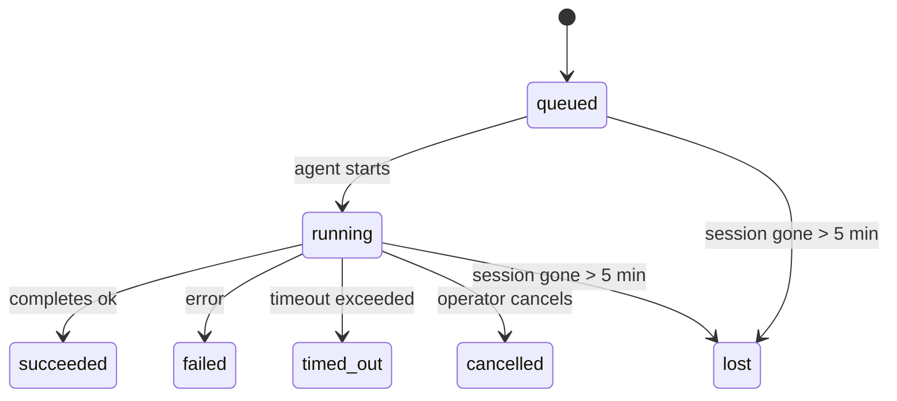

---
read_when:
    - Memeriksa pekerjaan latar belakang yang sedang berlangsung atau baru saja selesai
    - Men-debug kegagalan pengiriman untuk eksekusi agen terpisah
    - Memahami bagaimana eksekusi latar belakang berkaitan dengan sesi, Cron, dan Heartbeat
sidebarTitle: Background tasks
summary: Pelacakan tugas latar belakang untuk eksekusi ACP, subagen, pekerjaan Cron terisolasi, dan operasi CLI
title: Tugas latar belakang
x-i18n:
    generated_at: "2026-05-01T09:22:19Z"
    model: gpt-5.5
    provider: openai
    source_hash: 8782987a79989264ae3bd1ca4b16755bdfb7e295e4f77933bf3a38c136d837f4
    source_path: automation/tasks.md
    workflow: 16
---

<Note>
Mencari penjadwalan? Lihat [Automasi dan tugas](/id/automation) untuk memilih mekanisme yang tepat. Halaman ini adalah buku besar aktivitas untuk pekerjaan latar belakang, bukan penjadwal.
</Note>

Tugas latar belakang melacak pekerjaan yang berjalan **di luar sesi percakapan utama Anda**: proses ACP, pemijahan subagen, eksekusi pekerjaan cron terisolasi, dan operasi yang dimulai oleh CLI.

Tugas **tidak** menggantikan sesi, pekerjaan cron, atau Heartbeat — tugas adalah **buku besar aktivitas** yang mencatat pekerjaan terlepas apa yang terjadi, kapan, dan apakah berhasil.

<Note>
Tidak setiap proses agen membuat tugas. Giliran Heartbeat dan chat interaktif normal tidak membuatnya. Semua eksekusi cron, pemijahan ACP, pemijahan subagen, dan perintah agen CLI membuatnya.
</Note>

## TL;DR

- Tugas adalah **catatan**, bukan penjadwal — cron dan Heartbeat menentukan _kapan_ pekerjaan berjalan, tugas melacak _apa yang terjadi_.
- ACP, subagen, semua pekerjaan cron, dan operasi CLI membuat tugas. Giliran Heartbeat tidak.
- Setiap tugas bergerak melalui `queued → running → terminal` (succeeded, failed, timed_out, cancelled, atau lost).
- Tugas cron tetap aktif selama runtime cron masih memiliki pekerjaan tersebut; jika
  status runtime dalam memori hilang, pemeliharaan tugas terlebih dahulu memeriksa riwayat
  proses cron yang tahan lama sebelum menandai tugas sebagai hilang.
- Penyelesaian didorong oleh push: pekerjaan terlepas dapat memberi tahu secara langsung atau membangunkan
  sesi/Heartbeat peminta saat selesai, sehingga loop polling status
  biasanya bukan bentuk yang tepat.
- Proses cron terisolasi dan penyelesaian subagen melakukan upaya terbaik untuk membersihkan tab/proses browser terlacak bagi sesi anaknya sebelum pembukuan pembersihan akhir.
- Pengiriman cron terisolasi menekan balasan induk sementara yang usang ketika pekerjaan subagen turunan masih dikuras, dan lebih memilih output turunan akhir ketika output itu tiba sebelum pengiriman.
- Notifikasi penyelesaian dikirim langsung ke channel atau diantrekan untuk Heartbeat berikutnya.
- `openclaw tasks list` menampilkan semua tugas; `openclaw tasks audit` memunculkan masalah.
- Catatan terminal disimpan selama 7 hari, lalu dipangkas secara otomatis.

## Mulai cepat

<Tabs>
  <Tab title="List and filter">
    ```bash
    # Cantumkan semua tugas (terbaru lebih dulu)
    openclaw tasks list

    # Filter berdasarkan runtime atau status
    openclaw tasks list --runtime acp
    openclaw tasks list --status running
    ```

  </Tab>
  <Tab title="Inspect">
    ```bash
    # Tampilkan detail untuk tugas tertentu (berdasarkan ID, ID proses, atau kunci sesi)
    openclaw tasks show <lookup>
    ```
  </Tab>
  <Tab title="Cancel and notify">
    ```bash
    # Batalkan tugas yang sedang berjalan (membunuh sesi anak)
    openclaw tasks cancel <lookup>

    # Ubah kebijakan notifikasi untuk sebuah tugas
    openclaw tasks notify <lookup> state_changes
    ```

  </Tab>
  <Tab title="Audit and maintenance">
    ```bash
    # Jalankan audit kesehatan
    openclaw tasks audit

    # Pratinjau atau terapkan pemeliharaan
    openclaw tasks maintenance
    openclaw tasks maintenance --apply
    ```

  </Tab>
  <Tab title="Task flow">
    ```bash
    # Periksa status TaskFlow
    openclaw tasks flow list
    openclaw tasks flow show <lookup>
    openclaw tasks flow cancel <lookup>
    ```
  </Tab>
</Tabs>

## Apa yang membuat tugas

| Sumber                 | Jenis runtime | Kapan catatan tugas dibuat                            | Kebijakan notifikasi default |
| ---------------------- | ------------ | ------------------------------------------------------ | --------------------- |
| Proses latar belakang ACP    | `acp`        | Memijahkan sesi ACP anak                           | `done_only`           |
| Orkestrasi subagen | `subagent`   | Memijahkan subagen melalui `sessions_spawn`               | `done_only`           |
| Pekerjaan cron (semua jenis)  | `cron`       | Setiap eksekusi cron (sesi utama dan terisolasi)       | `silent`              |
| Operasi CLI         | `cli`        | Perintah `openclaw agent` yang berjalan melalui Gateway | `silent`              |
| Pekerjaan media agen       | `cli`        | Proses `music_generate`/`video_generate` yang didukung sesi  | `silent`              |

<AccordionGroup>
  <Accordion title="Notify defaults for cron and media">
    Tugas cron sesi utama menggunakan kebijakan notifikasi `silent` secara default — tugas tersebut membuat catatan untuk pelacakan tetapi tidak menghasilkan notifikasi. Tugas cron terisolasi juga default ke `silent` tetapi lebih terlihat karena berjalan dalam sesinya sendiri.

    Proses `music_generate` dan `video_generate` yang didukung sesi juga menggunakan kebijakan notifikasi `silent`. Proses tersebut tetap membuat catatan tugas, tetapi penyelesaian dikembalikan ke sesi agen asli sebagai wake internal sehingga agen dapat menulis pesan tindak lanjut dan melampirkan media yang selesai itu sendiri. Jika Anda memilih `tools.media.asyncCompletion.directSend`, penyelesaian `video_generate` asinkron dapat mencoba pengiriman channel langsung terlebih dahulu; penyelesaian `music_generate` asinkron tetap berada pada jalur wake sesi peminta.

  </Accordion>
  <Accordion title="Concurrent video_generate guardrail">
    Saat tugas `video_generate` yang didukung sesi masih aktif, alat tersebut juga bertindak sebagai pagar pengaman: panggilan `video_generate` berulang dalam sesi yang sama mengembalikan status tugas aktif, bukan memulai pembuatan konkuren kedua. Gunakan `action: "status"` ketika Anda menginginkan pencarian progres/status eksplisit dari sisi agen.
  </Accordion>
  <Accordion title="What does not create tasks">
    - Giliran Heartbeat — sesi utama; lihat [Heartbeat](/id/gateway/heartbeat)
    - Giliran chat interaktif normal
    - Respons `/command` langsung

  </Accordion>
</AccordionGroup>

## Siklus hidup tugas



| Status      | Artinya                                                              |
| ----------- | -------------------------------------------------------------------------- |
| `queued`    | Dibuat, menunggu agen dimulai                                    |
| `running`   | Giliran agen sedang aktif dieksekusi                                           |
| `succeeded` | Selesai dengan sukses                                                     |
| `failed`    | Selesai dengan kesalahan                                                    |
| `timed_out` | Melebihi batas waktu yang dikonfigurasi                                            |
| `cancelled` | Dihentikan oleh operator melalui `openclaw tasks cancel`                        |
| `lost`      | Runtime kehilangan status pendukung otoritatif setelah masa tenggang 5 menit |

Transisi terjadi secara otomatis — ketika proses agen terkait berakhir, status tugas diperbarui agar sesuai.

Penyelesaian proses agen bersifat otoritatif untuk catatan tugas aktif. Proses terlepas yang berhasil diselesaikan sebagai `succeeded`, kesalahan proses biasa diselesaikan sebagai `failed`, dan hasil timeout atau abort diselesaikan sebagai `timed_out`. Jika operator sudah membatalkan tugas, atau runtime sudah mencatat status terminal yang lebih kuat seperti `failed`, `timed_out`, atau `lost`, sinyal sukses yang datang belakangan tidak menurunkan status terminal tersebut.

`lost` sadar runtime:

- Tugas ACP: metadata sesi anak ACP pendukung menghilang.
- Tugas subagen: sesi anak pendukung menghilang dari penyimpanan agen target.
- Tugas cron: runtime cron tidak lagi melacak pekerjaan sebagai aktif dan riwayat
  proses cron yang tahan lama tidak menunjukkan hasil terminal untuk proses tersebut. Audit CLI
  offline tidak memperlakukan status runtime cron dalam prosesnya sendiri yang kosong sebagai otoritas.
- Tugas CLI: tugas sesi anak terisolasi menggunakan sesi anak; CLI berbasis chat
  menggunakan konteks proses live sebagai gantinya, sehingga baris sesi
  channel/grup/langsung yang tersisa tidak mempertahankannya tetap hidup. Proses
  `openclaw agent` yang didukung Gateway juga diselesaikan dari hasil prosesnya, sehingga proses yang selesai
  tidak tetap aktif sampai penyapu menandainya `lost`.

## Pengiriman dan notifikasi

Ketika sebuah tugas mencapai status terminal, OpenClaw memberi tahu Anda. Ada dua jalur pengiriman:

**Pengiriman langsung** — jika tugas memiliki target channel (`requesterOrigin`), pesan penyelesaian langsung masuk ke channel itu (Telegram, Discord, Slack, dll.). Untuk penyelesaian subagen, OpenClaw juga mempertahankan perutean thread/topik terikat jika tersedia dan dapat mengisi `to` / akun yang hilang dari rute tersimpan sesi peminta (`lastChannel` / `lastTo` / `lastAccountId`) sebelum menyerah pada pengiriman langsung.

**Pengiriman yang diantrekan sesi** — jika pengiriman langsung gagal atau tidak ada origin yang ditetapkan, pembaruan diantrekan sebagai event sistem dalam sesi peminta dan muncul pada Heartbeat berikutnya.

<Tip>
Penyelesaian tugas memicu wake Heartbeat langsung sehingga Anda melihat hasilnya dengan cepat — Anda tidak perlu menunggu tick Heartbeat terjadwal berikutnya.
</Tip>

Itu berarti alur kerja biasanya berbasis push: mulai pekerjaan terlepas sekali, lalu biarkan runtime membangunkan atau memberi tahu Anda saat selesai. Poll status tugas hanya ketika Anda memerlukan debugging, intervensi, atau audit eksplisit.

### Kebijakan notifikasi

Kontrol seberapa banyak yang Anda dengar tentang setiap tugas:

| Kebijakan                | Yang dikirim                                                       |
| --------------------- | ----------------------------------------------------------------------- |
| `done_only` (default) | Hanya status terminal (succeeded, failed, dll.) — **ini adalah default** |
| `state_changes`       | Setiap transisi status dan pembaruan progres                              |
| `silent`              | Tidak ada sama sekali                                                          |

Ubah kebijakan saat tugas berjalan:

```bash
openclaw tasks notify <lookup> state_changes
```

## Referensi CLI

<AccordionGroup>
  <Accordion title="tasks list">
    ```bash
    openclaw tasks list [--runtime <acp|subagent|cron|cli>] [--status <status>] [--json]
    ```

    Kolom output: ID Tugas, Jenis, Status, Pengiriman, ID Proses, Sesi Anak, Ringkasan.

  </Accordion>
  <Accordion title="tasks show">
    ```bash
    openclaw tasks show <lookup>
    ```

    Token pencarian menerima ID tugas, ID proses, atau kunci sesi. Menampilkan catatan lengkap termasuk waktu, status pengiriman, kesalahan, dan ringkasan terminal.

  </Accordion>
  <Accordion title="tasks cancel">
    ```bash
    openclaw tasks cancel <lookup>
    ```

    Untuk tugas ACP dan subagen, ini membunuh sesi anak. Untuk tugas yang dilacak CLI, pembatalan dicatat di registri tugas (tidak ada handle runtime anak terpisah). Status bertransisi ke `cancelled` dan notifikasi pengiriman dikirim jika berlaku.

  </Accordion>
  <Accordion title="tasks notify">
    ```bash
    openclaw tasks notify <lookup> <done_only|state_changes|silent>
    ```
  </Accordion>
  <Accordion title="tasks audit">
    ```bash
    openclaw tasks audit [--json]
    ```

    Memunculkan masalah operasional. Temuan juga muncul di `openclaw status` ketika masalah terdeteksi.

    | Temuan                   | Tingkat keparahan | Pemicu                                                                                                      |
    | ------------------------- | ---------- | ------------------------------------------------------------------------------------------------------------ |
    | `stale_queued`            | warn       | Diantrekan selama lebih dari 10 menit                                                                              |
    | `stale_running`           | error      | Berjalan selama lebih dari 30 menit                                                                             |
    | `lost`                    | warn/error | Kepemilikan tugas yang didukung runtime menghilang; tugas hilang yang dipertahankan memberi peringatan hingga `cleanupAfter`, lalu menjadi error |
    | `delivery_failed`         | warn       | Pengiriman gagal dan kebijakan notifikasi bukan `silent`                                                            |
    | `missing_cleanup`         | warn       | Tugas terminal tanpa timestamp pembersihan                                                                      |
    | `inconsistent_timestamps` | warn       | Pelanggaran lini masa (misalnya berakhir sebelum dimulai)                                                        |

  </Accordion>
  <Accordion title="tasks maintenance">
    ```bash
    openclaw tasks maintenance [--json]
    openclaw tasks maintenance --apply [--json]
    ```

    Gunakan ini untuk mempratinjau atau menerapkan rekonsiliasi, pencatatan pembersihan, dan pemangkasan untuk tugas serta status Task Flow.

    Rekonsiliasi sadar runtime:

    - Tugas ACP/subagent memeriksa sesi anak yang mendukungnya.
    - Tugas subagent yang sesi anaknya memiliki tombstone pemulihan-restart ditandai hilang alih-alih diperlakukan sebagai sesi pendukung yang dapat dipulihkan.
    - Tugas Cron memeriksa apakah runtime cron masih memiliki job tersebut, lalu memulihkan status terminal dari log eksekusi cron/status job yang dipersistenkan sebelum kembali ke `lost`. Hanya proses Gateway yang otoritatif untuk kumpulan job aktif cron dalam memori; audit CLI offline menggunakan riwayat tahan lama tetapi tidak menandai tugas cron hilang semata-mata karena Set lokal tersebut kosong.
    - Tugas CLI yang didukung chat memeriksa konteks eksekusi live pemiliknya, bukan hanya baris sesi chat.

    Pembersihan penyelesaian juga sadar runtime:

    - Penyelesaian subagent berupaya sebaik mungkin menutup tab/proses browser yang dilacak untuk sesi anak sebelum pembersihan pengumuman berlanjut.
    - Penyelesaian cron terisolasi berupaya sebaik mungkin menutup tab/proses browser yang dilacak untuk sesi cron sebelum eksekusi sepenuhnya dibongkar.
    - Pengiriman cron terisolasi menunggu tindak lanjut subagent turunan bila perlu dan menekan teks pengakuan induk yang basi alih-alih mengumumkannya.
    - Pengiriman penyelesaian subagent mengutamakan teks asisten terbaru yang terlihat; jika kosong, ia kembali ke teks tool/toolResult terbaru yang telah disanitasi, dan eksekusi panggilan tool yang hanya timeout dapat diringkas menjadi ringkasan kemajuan parsial singkat. Eksekusi terminal yang gagal mengumumkan status kegagalan tanpa memutar ulang teks balasan yang ditangkap.
    - Kegagalan pembersihan tidak menyamarkan hasil tugas yang sebenarnya.

  </Accordion>
  <Accordion title="tasks flow list | show | cancel">
    ```bash
    openclaw tasks flow list [--status <status>] [--json]
    openclaw tasks flow show <lookup> [--json]
    openclaw tasks flow cancel <lookup>
    ```

    Gunakan ini ketika Task Flow yang mengorkestrasi adalah hal yang Anda pedulikan, bukan satu catatan tugas latar belakang individual.

  </Accordion>
</AccordionGroup>

## Papan tugas chat (`/tasks`)

Gunakan `/tasks` di sesi chat mana pun untuk melihat tugas latar belakang yang tertaut ke sesi tersebut. Papan menampilkan tugas aktif dan yang baru selesai beserta runtime, status, waktu, dan detail kemajuan atau error.

Ketika sesi saat ini tidak memiliki tugas tertaut yang terlihat, `/tasks` kembali ke jumlah tugas lokal agen sehingga Anda tetap mendapat gambaran umum tanpa membocorkan detail sesi lain.

Untuk ledger operator lengkap, gunakan CLI: `openclaw tasks list`.

## Integrasi status (tekanan tugas)

`openclaw status` menyertakan ringkasan tugas sekilas:

```
Tasks: 3 queued · 2 running · 1 issues
```

Ringkasan melaporkan:

- **active** — jumlah `queued` + `running`
- **failures** — jumlah `failed` + `timed_out` + `lost`
- **byRuntime** — rincian menurut `acp`, `subagent`, `cron`, `cli`

Baik `/status` maupun tool `session_status` menggunakan snapshot tugas yang sadar pembersihan: tugas aktif diutamakan, baris selesai yang basi disembunyikan, dan kegagalan terbaru hanya muncul ketika tidak ada pekerjaan aktif yang tersisa. Ini menjaga kartu status tetap berfokus pada hal yang penting saat ini.

## Penyimpanan dan pemeliharaan

### Lokasi tugas berada

Catatan tugas dipersistenkan di SQLite pada:

```
$OPENCLAW_STATE_DIR/tasks/runs.sqlite
```

Registry dimuat ke memori saat gateway dimulai dan menyinkronkan penulisan ke SQLite agar tahan lama lintas restart.
Gateway menjaga log write-ahead SQLite tetap terbatas dengan menggunakan ambang autocheckpoint default SQLite plus checkpoint `TRUNCATE` berkala dan saat shutdown.

### Pemeliharaan otomatis

Sweeper berjalan setiap **60 detik** dan menangani empat hal:

<Steps>
  <Step title="Rekonsiliasi">
    Memeriksa apakah tugas aktif masih memiliki dukungan runtime otoritatif. Tugas ACP/subagent menggunakan status sesi anak, tugas cron menggunakan kepemilikan job aktif, dan tugas CLI yang didukung chat menggunakan konteks eksekusi pemilik. Jika status pendukung tersebut hilang selama lebih dari 5 menit, tugas ditandai `lost`.
  </Step>
  <Step title="Perbaikan sesi ACP">
    Menutup sesi ACP one-shot milik induk yang terminal atau yatim, dan menutup sesi ACP persisten yang terminal atau yatim yang basi hanya ketika tidak ada binding percakapan aktif yang tersisa.
  </Step>
  <Step title="Pencatatan pembersihan">
    Menetapkan timestamp `cleanupAfter` pada tugas terminal (endedAt + 7 hari). Selama retensi, tugas hilang masih muncul dalam audit sebagai peringatan; setelah `cleanupAfter` kedaluwarsa atau ketika metadata pembersihan hilang, tugas tersebut menjadi error.
  </Step>
  <Step title="Pemangkasan">
    Menghapus catatan yang melewati tanggal `cleanupAfter`.
  </Step>
</Steps>

<Note>
**Retensi:** catatan tugas terminal disimpan selama **7 hari**, lalu dipangkas otomatis. Tidak perlu konfigurasi.
</Note>

## Bagaimana tugas berhubungan dengan sistem lain

<AccordionGroup>
  <Accordion title="Tugas dan Task Flow">
    [Task Flow](/id/automation/taskflow) adalah lapisan orkestrasi alur di atas tugas latar belakang. Satu alur dapat mengoordinasikan beberapa tugas selama masa hidupnya menggunakan mode sinkronisasi terkelola atau tercermin. Gunakan `openclaw tasks` untuk memeriksa catatan tugas individual dan `openclaw tasks flow` untuk memeriksa alur yang mengorkestrasi.

    Lihat [Task Flow](/id/automation/taskflow) untuk detail.

  </Accordion>
  <Accordion title="Tugas dan cron">
    **Definisi** job cron berada di `~/.openclaw/cron/jobs.json`; status eksekusi runtime berada di sebelahnya dalam `~/.openclaw/cron/jobs-state.json`. **Setiap** eksekusi cron membuat catatan tugas — baik sesi utama maupun terisolasi. Tugas cron sesi utama secara default menggunakan kebijakan notifikasi `silent` sehingga tugas dilacak tanpa menghasilkan notifikasi.

    Lihat [Job Cron](/id/automation/cron-jobs).

  </Accordion>
  <Accordion title="Tugas dan Heartbeat">
    Eksekusi Heartbeat adalah giliran sesi utama — eksekusi tersebut tidak membuat catatan tugas. Ketika tugas selesai, tugas dapat memicu wake Heartbeat sehingga Anda segera melihat hasilnya.

    Lihat [Heartbeat](/id/gateway/heartbeat).

  </Accordion>
  <Accordion title="Tugas dan sesi">
    Tugas dapat merujuk ke `childSessionKey` (tempat pekerjaan berjalan) dan `requesterSessionKey` (pihak yang memulainya). Sesi adalah konteks percakapan; tugas adalah pelacakan aktivitas di atasnya.
  </Accordion>
  <Accordion title="Tugas dan eksekusi agen">
    `runId` milik tugas tertaut ke eksekusi agen yang melakukan pekerjaan. Peristiwa siklus hidup agen (mulai, selesai, error) secara otomatis memperbarui status tugas — Anda tidak perlu mengelola siklus hidup secara manual.
  </Accordion>
</AccordionGroup>

## Terkait

- [Otomasi & Tugas](/id/automation) — semua mekanisme otomasi sekilas
- [CLI: Tugas](/id/cli/tasks) — referensi perintah CLI
- [Heartbeat](/id/gateway/heartbeat) — giliran sesi utama berkala
- [Tugas Terjadwal](/id/automation/cron-jobs) — menjadwalkan pekerjaan latar belakang
- [Task Flow](/id/automation/taskflow) — orkestrasi alur di atas tugas
