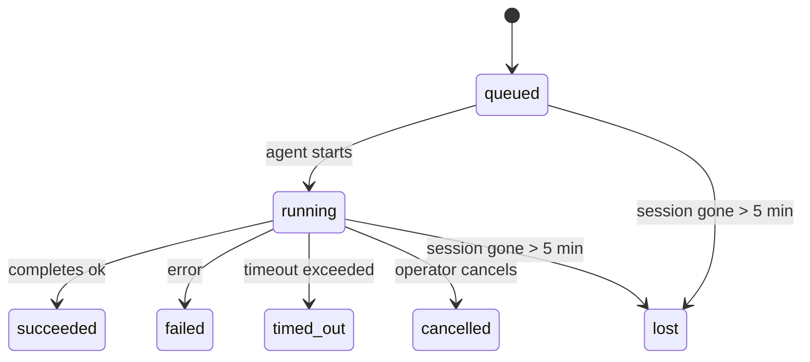

---
read_when:
    - Memeriksa pekerjaan latar belakang yang sedang berlangsung atau baru saja selesai
    - Men-debug kegagalan pengiriman untuk eksekusi agen terpisah
    - Memahami bagaimana eksekusi latar belakang berkaitan dengan sesi, Cron, dan Heartbeat
sidebarTitle: Background tasks
summary: Pelacakan tugas latar belakang untuk eksekusi ACP, subagen, tugas Cron terisolasi, dan operasi CLI
title: Tugas latar belakang
x-i18n:
    generated_at: "2026-05-12T00:56:11Z"
    model: gpt-5.5
    provider: openai
    source_hash: 31cbf09df48bab0686a1350f91aefffffef899c86704bb97b68320fc47e78021
    source_path: automation/tasks.md
    workflow: 16
---

<Note>
Mencari penjadwalan? Lihat [Otomatisasi](/id/automation) untuk memilih mekanisme yang tepat. Halaman ini adalah buku besar aktivitas untuk pekerjaan latar belakang, bukan penjadwal.
</Note>

Tugas latar belakang melacak pekerjaan yang berjalan **di luar sesi percakapan utama Anda**: eksekusi ACP, pemijahan subagen, eksekusi tugas cron terisolasi, dan operasi yang dimulai CLI.

Tugas **tidak** menggantikan sesi, tugas cron, atau heartbeat - tugas adalah **buku besar aktivitas** yang mencatat pekerjaan terpisah apa yang terjadi, kapan, dan apakah berhasil.

<Note>
Tidak setiap eksekusi agen membuat tugas. Giliran heartbeat dan chat interaktif normal tidak. Semua eksekusi cron, pemijahan ACP, pemijahan subagen, dan perintah agen CLI melakukannya.
</Note>

## TL;DR

- Tugas adalah **catatan**, bukan penjadwal - cron dan heartbeat menentukan _kapan_ pekerjaan berjalan, tugas melacak _apa yang terjadi_.
- ACP, subagen, semua tugas cron, dan operasi CLI membuat tugas. Giliran heartbeat tidak.
- Setiap tugas bergerak melalui `queued → running → terminal` (succeeded, failed, timed_out, cancelled, atau lost).
- Tugas Cron tetap aktif selama runtime cron masih memiliki tugas tersebut; jika
  status runtime dalam memori hilang, pemeliharaan tugas pertama-tama memeriksa riwayat
  eksekusi cron yang persisten sebelum menandai tugas sebagai hilang.
- Penyelesaian didorong push: pekerjaan terpisah dapat memberi tahu secara langsung atau membangunkan
  sesi/heartbeat peminta saat selesai, sehingga loop polling status
  biasanya bukan bentuk yang tepat.
- Eksekusi cron terisolasi dan penyelesaian subagen berupaya sebaik mungkin membersihkan tab/proses browser yang dilacak untuk sesi turunannya sebelum pembukuan pembersihan akhir.
- Pengiriman cron terisolasi menekan balasan induk sementara yang usang saat pekerjaan subagen turunan masih dikuras, dan lebih memilih output turunan akhir saat output itu tiba sebelum pengiriman.
- Notifikasi penyelesaian dikirim langsung ke channel atau diantrekan untuk heartbeat berikutnya.
- `openclaw tasks list` menampilkan semua tugas; `openclaw tasks audit` memunculkan masalah.
- Catatan terminal disimpan selama 7 hari, lalu dipangkas otomatis.

## Mulai cepat

<Tabs>
  <Tab title="Daftar dan filter">
    ```bash
    # List all tasks (newest first)
    openclaw tasks list

    # Filter by runtime or status
    openclaw tasks list --runtime acp
    openclaw tasks list --status running
    ```

  </Tab>
  <Tab title="Periksa">
    ```bash
    # Show details for a specific task (by ID, run ID, or session key)
    openclaw tasks show <lookup>
    ```
  </Tab>
  <Tab title="Batalkan dan beri tahu">
    ```bash
    # Cancel a running task (kills the child session)
    openclaw tasks cancel <lookup>

    # Change notification policy for a task
    openclaw tasks notify <lookup> state_changes
    ```

  </Tab>
  <Tab title="Audit dan pemeliharaan">
    ```bash
    # Run a health audit
    openclaw tasks audit

    # Preview or apply maintenance
    openclaw tasks maintenance
    openclaw tasks maintenance --apply
    ```

  </Tab>
  <Tab title="Alur tugas">
    ```bash
    # Inspect TaskFlow state
    openclaw tasks flow list
    openclaw tasks flow show <lookup>
    openclaw tasks flow cancel <lookup>
    ```
  </Tab>
</Tabs>

## Apa yang membuat tugas

| Sumber                 | Jenis runtime | Kapan catatan tugas dibuat                            | Kebijakan notifikasi default |
| ---------------------- | ------------ | ------------------------------------------------------ | --------------------- |
| Eksekusi latar belakang ACP    | `acp`        | Memijahkan sesi ACP turunan                           | `done_only`           |
| Orkestrasi subagen | `subagent`   | Memijahkan subagen melalui `sessions_spawn`               | `done_only`           |
| Tugas Cron (semua jenis)  | `cron`       | Setiap eksekusi cron (sesi utama dan terisolasi)       | `silent`              |
| Operasi CLI         | `cli`        | Perintah `openclaw agent` yang berjalan melalui gateway | `silent`              |
| Tugas media agen       | `cli`        | Eksekusi `music_generate`/`video_generate` berbasis sesi  | `silent`              |

<AccordionGroup>
  <Accordion title="Default notifikasi untuk cron dan media">
    Tugas cron sesi utama menggunakan kebijakan notifikasi `silent` secara default - tugas tersebut membuat catatan untuk pelacakan tetapi tidak menghasilkan notifikasi. Tugas cron terisolasi juga default ke `silent` tetapi lebih terlihat karena berjalan dalam sesinya sendiri.

    Eksekusi `music_generate` dan `video_generate` berbasis sesi juga menggunakan kebijakan notifikasi `silent`. Eksekusi tersebut tetap membuat catatan tugas, tetapi penyelesaian diserahkan kembali ke sesi agen asli sebagai wake internal agar agen dapat menulis pesan tindak lanjut dan melampirkan media yang selesai sendiri. Penyelesaian grup/channel mengikuti kebijakan balasan terlihat yang normal, sehingga agen menggunakan alat pesan saat pengiriman sumber memerlukannya. Jika agen penyelesaian gagal menghasilkan bukti pengiriman alat pesan dalam rute hanya alat, OpenClaw mengirim fallback penyelesaian langsung ke channel asli alih-alih membiarkan media tetap privat.

  </Accordion>
  <Accordion title="Guardrail video_generate bersamaan">
    Saat tugas `video_generate` berbasis sesi masih aktif, alat tersebut juga bertindak sebagai guardrail: panggilan `video_generate` berulang dalam sesi yang sama mengembalikan status tugas aktif alih-alih memulai pembuatan bersamaan kedua. Gunakan `action: "status"` saat Anda menginginkan pencarian progres/status eksplisit dari sisi agen.
  </Accordion>
  <Accordion title="Apa yang tidak membuat tugas">
    - Giliran Heartbeat - sesi utama; lihat [Heartbeat](/id/gateway/heartbeat)
    - Giliran chat interaktif normal
    - Respons `/command` langsung

  </Accordion>
</AccordionGroup>

## Siklus hidup tugas



| Status      | Artinya                                                              |
| ----------- | -------------------------------------------------------------------------- |
| `queued`    | Dibuat, menunggu agen dimulai                                    |
| `running`   | Giliran agen sedang aktif dieksekusi                                           |
| `succeeded` | Selesai dengan berhasil                                                     |
| `failed`    | Selesai dengan error                                                    |
| `timed_out` | Melebihi timeout yang dikonfigurasi                                            |
| `cancelled` | Dihentikan oleh operator melalui `openclaw tasks cancel`                        |
| `lost`      | Runtime kehilangan status pendukung otoritatif setelah masa tenggang 5 menit |

Transisi terjadi otomatis - saat eksekusi agen terkait berakhir, status tugas diperbarui agar sesuai.

Penyelesaian eksekusi agen bersifat otoritatif untuk catatan tugas aktif. Eksekusi terpisah yang berhasil difinalisasi sebagai `succeeded`, error eksekusi biasa difinalisasi sebagai `failed`, dan hasil timeout atau abort difinalisasi sebagai `timed_out`. Jika operator sudah membatalkan tugas, atau runtime sudah mencatat status terminal yang lebih kuat seperti `failed`, `timed_out`, atau `lost`, sinyal keberhasilan yang datang belakangan tidak menurunkan status terminal tersebut.

`lost` sadar runtime:

- Tugas ACP: metadata sesi turunan ACP pendukung menghilang.
- Tugas subagen: sesi turunan pendukung menghilang dari penyimpanan agen target.
- Tugas Cron: runtime cron tidak lagi melacak tugas sebagai aktif dan riwayat
  eksekusi cron yang persisten tidak menampilkan hasil terminal untuk eksekusi tersebut. Audit CLI
  offline tidak memperlakukan status runtime cron dalam prosesnya sendiri yang kosong sebagai otoritas.
- Tugas CLI: tugas dengan id eksekusi/id sumber menggunakan konteks eksekusi live, sehingga
  baris sesi turunan atau sesi chat yang tertinggal tidak membuatnya tetap aktif setelah
  eksekusi milik gateway menghilang. Tugas CLI lama tanpa identitas eksekusi tetap
  fallback ke sesi turunan. Eksekusi `openclaw agent` yang didukung Gateway juga difinalisasi
  dari hasil eksekusinya, sehingga eksekusi yang selesai tidak tetap aktif sampai penyapu
  menandainya `lost`.

## Pengiriman dan notifikasi

Saat tugas mencapai status terminal, OpenClaw memberi tahu Anda. Ada dua jalur pengiriman:

**Pengiriman langsung** - jika tugas memiliki target channel (`requesterOrigin`), pesan penyelesaian langsung menuju channel tersebut (Telegram, Discord, Slack, dll.). Penyelesaian tugas grup dan channel sebaliknya dirutekan melalui sesi peminta agar agen induk dapat menulis balasan yang terlihat. Untuk penyelesaian subagen, OpenClaw juga mempertahankan perutean thread/topik terikat bila tersedia dan dapat mengisi `to` / akun yang hilang dari rute tersimpan sesi peminta (`lastChannel` / `lastTo` / `lastAccountId`) sebelum menyerah pada pengiriman langsung.

**Pengiriman antrean sesi** - jika pengiriman langsung gagal atau tidak ada origin yang disetel, pembaruan diantrekan sebagai event sistem dalam sesi peminta dan muncul pada heartbeat berikutnya.

<Tip>
Penyelesaian tugas memicu wake heartbeat langsung sehingga Anda melihat hasilnya dengan cepat - Anda tidak perlu menunggu tick heartbeat terjadwal berikutnya.
</Tip>

Itu berarti workflow biasanya berbasis push: mulai pekerjaan terpisah sekali, lalu biarkan runtime membangunkan atau memberi tahu Anda saat selesai. Poll status tugas hanya saat Anda membutuhkan debugging, intervensi, atau audit eksplisit.

### Kebijakan notifikasi

Kontrol seberapa banyak yang Anda dengar tentang setiap tugas:

| Kebijakan                | Apa yang dikirim                                                       |
| --------------------- | ----------------------------------------------------------------------- |
| `done_only` (default) | Hanya status terminal (succeeded, failed, dll.) - **ini adalah default** |
| `state_changes`       | Setiap transisi status dan pembaruan progres                              |
| `silent`              | Tidak ada sama sekali                                                          |

Ubah kebijakan saat tugas sedang berjalan:

```bash
openclaw tasks notify <lookup> state_changes
```

## Referensi CLI

<AccordionGroup>
  <Accordion title="tasks list">
    ```bash
    openclaw tasks list [--runtime <acp|subagent|cron|cli>] [--status <status>] [--json]
    ```

    Kolom output: ID Tugas, Jenis, Status, Pengiriman, ID Eksekusi, Sesi Turunan, Ringkasan.

  </Accordion>
  <Accordion title="tasks show">
    ```bash
    openclaw tasks show <lookup>
    ```

    Token pencarian menerima ID tugas, ID eksekusi, atau kunci sesi. Menampilkan catatan lengkap termasuk waktu, status pengiriman, error, dan ringkasan terminal.

  </Accordion>
  <Accordion title="tasks cancel">
    ```bash
    openclaw tasks cancel <lookup>
    ```

    Untuk tugas ACP dan subagen, ini mematikan sesi turunan. Untuk tugas yang dilacak CLI, pembatalan dicatat dalam registry tugas (tidak ada handle runtime turunan terpisah). Status bertransisi ke `cancelled` dan notifikasi pengiriman dikirim bila berlaku.

  </Accordion>
  <Accordion title="tasks notify">
    ```bash
    openclaw tasks notify <lookup> <done_only|state_changes|silent>
    ```
  </Accordion>
  <Accordion title="tasks audit">
    ```bash
    openclaw tasks audit [--json]
    ```

    Memunculkan masalah operasional. Temuan juga muncul di `openclaw status` saat masalah terdeteksi.

    | Temuan                   | Keparahan  | Pemicu                                                                                                      |
    | ------------------------- | ---------- | ------------------------------------------------------------------------------------------------------------ |
    | `stale_queued`            | peringatan | Mengantre selama lebih dari 10 menit                                                                         |
    | `stale_running`           | kesalahan  | Berjalan selama lebih dari 30 menit                                                                          |
    | `lost`                    | peringatan/kesalahan | Kepemilikan tugas yang didukung runtime menghilang; tugas hilang yang dipertahankan memperingatkan hingga `cleanupAfter`, lalu menjadi kesalahan |
    | `delivery_failed`         | peringatan | Pengiriman gagal dan kebijakan notifikasi bukan `silent`                                                     |
    | `missing_cleanup`         | peringatan | Tugas terminal tanpa stempel waktu pembersihan                                                               |
    | `inconsistent_timestamps` | peringatan | Pelanggaran linimasa (misalnya berakhir sebelum dimulai)                                                     |

  </Accordion>
  <Accordion title="pemeliharaan tugas">
    ```bash
    openclaw tasks maintenance [--json]
    openclaw tasks maintenance --apply [--json]
    ```

    Gunakan ini untuk meninjau atau menerapkan rekonsiliasi, penandaan pembersihan, dan pemangkasan untuk tugas, status Task Flow, serta baris registri sesi eksekusi cron yang usang.

    Rekonsiliasi sadar runtime:

    - Tugas ACP/subagent memeriksa sesi anak yang mendukungnya.
    - Tugas subagent yang sesi anaknya memiliki tombstone pemulihan restart ditandai hilang alih-alih diperlakukan sebagai sesi pendukung yang dapat dipulihkan.
    - Tugas Cron memeriksa apakah runtime cron masih memiliki job, lalu memulihkan status terminal dari log eksekusi cron/status job yang dipersistenkan sebelum fallback ke `lost`. Hanya proses Gateway yang berwenang atas set job aktif cron dalam memori; audit CLI offline menggunakan riwayat tahan lama tetapi tidak menandai tugas cron hilang hanya karena Set lokal itu kosong.
    - Tugas CLI dengan identitas eksekusi memeriksa konteks eksekusi live pemilik, bukan hanya baris sesi anak atau sesi chat.

    Pembersihan penyelesaian juga sadar runtime:

    - Penyelesaian subagent berupaya sebaik mungkin menutup tab/proses browser yang terlacak untuk sesi anak sebelum pembersihan pengumuman berlanjut.
    - Penyelesaian cron terisolasi berupaya sebaik mungkin menutup tab/proses browser yang terlacak untuk sesi cron sebelum eksekusi sepenuhnya dibongkar.
    - Pengiriman cron terisolasi menunggu tindak lanjut subagent turunan bila diperlukan dan menekan teks pengakuan induk yang usang alih-alih mengumumkannya.
    - Pengiriman penyelesaian subagent lebih memilih teks asisten terbaru yang terlihat; jika kosong, ia fallback ke teks tool/toolResult terbaru yang telah disanitasi, dan eksekusi panggilan tool yang hanya timeout dapat diringkas menjadi ringkasan kemajuan parsial singkat. Eksekusi terminal yang gagal mengumumkan status kegagalan tanpa memutar ulang teks balasan yang ditangkap.
    - Kegagalan pembersihan tidak menutupi hasil tugas yang sebenarnya.

    Saat menerapkan pemeliharaan, OpenClaw juga menghapus baris registri sesi `cron:<jobId>:run:<uuid>` yang usang lebih dari 7 hari, sambil mempertahankan baris untuk job cron yang sedang berjalan dan membiarkan baris sesi non-cron tidak tersentuh.

  </Accordion>
  <Accordion title="tasks flow list | show | cancel">
    ```bash
    openclaw tasks flow list [--status <status>] [--json]
    openclaw tasks flow show <lookup> [--json]
    openclaw tasks flow cancel <lookup>
    ```

    Gunakan ini ketika Task Flow pengorkestrasi adalah hal yang Anda pedulikan, bukan satu catatan tugas latar belakang individual.

  </Accordion>
</AccordionGroup>

## Papan tugas chat (`/tasks`)

Gunakan `/tasks` dalam sesi chat apa pun untuk melihat tugas latar belakang yang ditautkan ke sesi tersebut. Papan menampilkan tugas aktif dan yang baru selesai dengan runtime, status, waktu, serta detail kemajuan atau kesalahan.

Ketika sesi saat ini tidak memiliki tugas tertaut yang terlihat, `/tasks` fallback ke jumlah tugas lokal agen sehingga Anda tetap mendapatkan ikhtisar tanpa membocorkan detail sesi lain.

Untuk ledger operator lengkap, gunakan CLI: `openclaw tasks list`.

## Integrasi status (tekanan tugas)

`openclaw status` menyertakan ringkasan tugas sekilas:

```
Tasks: 3 queued · 2 running · 1 issues
```

Ringkasan melaporkan:

- **aktif** - jumlah `queued` + `running`
- **kegagalan** - jumlah `failed` + `timed_out` + `lost`
- **byRuntime** - rincian menurut `acp`, `subagent`, `cron`, `cli`

Baik `/status` maupun tool `session_status` menggunakan snapshot tugas yang sadar pembersihan: tugas aktif diprioritaskan, baris selesai yang usang disembunyikan, dan kegagalan terbaru hanya ditampilkan ketika tidak ada pekerjaan aktif yang tersisa. Ini menjaga kartu status tetap berfokus pada hal yang penting saat ini.

## Penyimpanan dan pemeliharaan

### Tempat tugas berada

Catatan tugas dipersistenkan di SQLite pada:

```
$OPENCLAW_STATE_DIR/tasks/runs.sqlite
```

Registri dimuat ke memori saat gateway dimulai dan menyinkronkan penulisan ke SQLite untuk ketahanan lintas restart.
Gateway menjaga log write-ahead SQLite tetap terbatas dengan menggunakan ambang batas autocheckpoint default SQLite plus checkpoint `TRUNCATE` berkala dan saat shutdown.

### Pemeliharaan otomatis

Sweeper berjalan setiap **60 detik** dan menangani empat hal:

<Steps>
  <Step title="Rekonsiliasi">
    Memeriksa apakah tugas aktif masih memiliki dukungan runtime yang berwenang. Tugas ACP/subagent menggunakan status sesi anak, tugas cron menggunakan kepemilikan job aktif, dan tugas CLI dengan identitas eksekusi menggunakan konteks eksekusi pemilik. Jika status pendukung itu hilang selama lebih dari 5 menit, tugas ditandai `lost`.
  </Step>
  <Step title="Perbaikan sesi ACP">
    Menutup sesi ACP one-shot milik induk yang terminal atau yatim, dan menutup sesi ACP persisten yang terminal usang atau yatim hanya ketika tidak ada binding percakapan aktif yang tersisa.
  </Step>
  <Step title="Penandaan pembersihan">
    Menetapkan stempel waktu `cleanupAfter` pada tugas terminal (endedAt + 7 hari). Selama retensi, tugas hilang masih muncul dalam audit sebagai peringatan; setelah `cleanupAfter` kedaluwarsa atau ketika metadata pembersihan hilang, tugas tersebut menjadi kesalahan.
  </Step>
  <Step title="Pemangkasan">
    Menghapus catatan yang melewati tanggal `cleanupAfter` mereka.
  </Step>
</Steps>

<Note>
**Retensi:** catatan tugas terminal disimpan selama **7 hari**, lalu otomatis dipangkas. Tidak perlu konfigurasi.
</Note>

## Cara tugas terkait dengan sistem lain

<AccordionGroup>
  <Accordion title="Tugas dan Task Flow">
    [Task Flow](/id/automation/taskflow) adalah lapisan orkestrasi flow di atas tugas latar belakang. Satu flow dapat mengoordinasikan beberapa tugas selama masa pakainya menggunakan mode sinkronisasi terkelola atau tercermin. Gunakan `openclaw tasks` untuk memeriksa catatan tugas individual dan `openclaw tasks flow` untuk memeriksa flow pengorkestrasi.

    Lihat [Task Flow](/id/automation/taskflow) untuk detail.

  </Accordion>
  <Accordion title="Tugas dan cron">
    **Definisi** job cron berada di `~/.openclaw/cron/jobs.json`; status eksekusi runtime berada di sampingnya di `~/.openclaw/cron/jobs-state.json`. **Setiap** eksekusi cron membuat catatan tugas - baik sesi utama maupun terisolasi. Tugas cron sesi utama default ke kebijakan notifikasi `silent` sehingga dapat dilacak tanpa menghasilkan notifikasi.

    Lihat [Cron Jobs](/id/automation/cron-jobs).

  </Accordion>
  <Accordion title="Tugas dan heartbeat">
    Eksekusi Heartbeat adalah giliran sesi utama - eksekusi tersebut tidak membuat catatan tugas. Ketika sebuah tugas selesai, tugas tersebut dapat memicu bangun heartbeat sehingga Anda segera melihat hasilnya.

    Lihat [Heartbeat](/id/gateway/heartbeat).

  </Accordion>
  <Accordion title="Tugas dan sesi">
    Tugas dapat merujuk ke `childSessionKey` (tempat pekerjaan berjalan) dan `requesterSessionKey` (siapa yang memulainya). Sesi adalah konteks percakapan; tugas adalah pelacakan aktivitas di atasnya.
  </Accordion>
  <Accordion title="Tugas dan eksekusi agen">
    `runId` tugas menautkan ke eksekusi agen yang melakukan pekerjaan. Peristiwa siklus hidup agen (mulai, selesai, kesalahan) otomatis memperbarui status tugas - Anda tidak perlu mengelola siklus hidup secara manual.
  </Accordion>
</AccordionGroup>

## Terkait

- [Otomatisasi](/id/automation) - semua mekanisme otomatisasi sekilas
- [CLI: Tugas](/id/cli/tasks) - referensi perintah CLI
- [Heartbeat](/id/gateway/heartbeat) - giliran sesi utama berkala
- [Tugas Terjadwal](/id/automation/cron-jobs) - menjadwalkan pekerjaan latar belakang
- [Task Flow](/id/automation/taskflow) - orkestrasi flow di atas tugas
