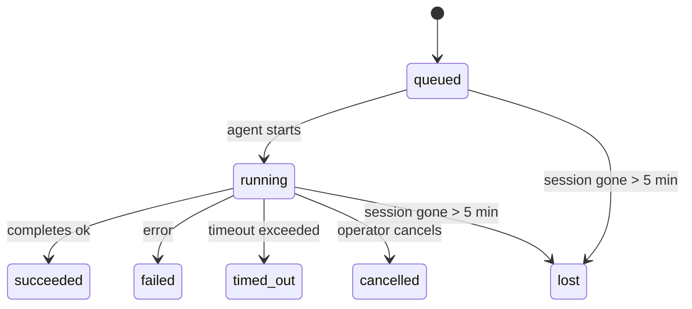

---
read_when:
    - Memeriksa pekerjaan latar belakang yang sedang berlangsung atau baru saja selesai
    - Men-debug kegagalan pengiriman untuk eksekusi agen terpisah
    - Memahami bagaimana eksekusi latar belakang berkaitan dengan sesi, Cron, dan Heartbeat
sidebarTitle: Background tasks
summary: Pelacakan tugas latar belakang untuk eksekusi ACP, subagen, pekerjaan Cron terisolasi, dan operasi CLI
title: Tugas latar belakang
x-i18n:
    generated_at: "2026-04-30T16:27:58Z"
    model: gpt-5.5
    provider: openai
    source_hash: 999653c9360323d5135e33193c76458cba8c288227de46a6217f1ccbed2a6d34
    source_path: automation/tasks.md
    workflow: 16
---

<Note>
Mencari penjadwalan? Lihat [Otomasi dan tugas](/id/automation) untuk memilih mekanisme yang tepat. Halaman ini adalah buku aktivitas untuk pekerjaan latar belakang, bukan penjadwal.
</Note>

Tugas latar belakang melacak pekerjaan yang berjalan **di luar sesi percakapan utama Anda**: eksekusi ACP, spawn subagent, eksekusi cron job terisolasi, dan operasi yang dimulai dari CLI.

Tugas **tidak** menggantikan sesi, cron job, atau Heartbeat — tugas adalah **buku aktivitas** yang mencatat pekerjaan terlepas apa yang terjadi, kapan, dan apakah berhasil.

<Note>
Tidak setiap eksekusi agen membuat tugas. Giliran Heartbeat dan chat interaktif normal tidak membuatnya. Semua eksekusi cron, spawn ACP, spawn subagent, dan perintah agen CLI membuatnya.
</Note>

## Ringkasnya

- Tugas adalah **catatan**, bukan penjadwal — cron dan Heartbeat menentukan _kapan_ pekerjaan berjalan, tugas melacak _apa yang terjadi_.
- ACP, subagent, semua cron job, dan operasi CLI membuat tugas. Giliran Heartbeat tidak.
- Setiap tugas bergerak melalui `queued → running → terminal` (succeeded, failed, timed_out, cancelled, atau lost).
- Tugas cron tetap aktif selama runtime cron masih memiliki job tersebut; jika status runtime dalam memori hilang, pemeliharaan tugas terlebih dahulu memeriksa riwayat eksekusi cron yang tahan lama sebelum menandai tugas sebagai lost.
- Penyelesaian digerakkan oleh push: pekerjaan terlepas dapat memberi tahu secara langsung atau membangunkan sesi peminta/Heartbeat ketika selesai, sehingga loop polling status biasanya bukan bentuk yang tepat.
- Eksekusi cron terisolasi dan penyelesaian subagent melakukan upaya terbaik untuk membersihkan tab/proses browser terlacak untuk sesi anaknya sebelum pembukuan pembersihan akhir.
- Pengiriman cron terisolasi menekan balasan induk sementara yang basi saat pekerjaan subagent turunan masih diselesaikan, dan lebih memilih output turunan akhir ketika itu tiba sebelum pengiriman.
- Notifikasi penyelesaian dikirim langsung ke channel atau diantrekan untuk Heartbeat berikutnya.
- `openclaw tasks list` menampilkan semua tugas; `openclaw tasks audit` memunculkan masalah.
- Catatan terminal disimpan selama 7 hari, lalu dipangkas secara otomatis.

## Mulai cepat

<Tabs>
  <Tab title="Daftar dan filter">
    ```bash
    # List all tasks (newest first)
    openclaw tasks list

    # Filter by runtime or status
    openclaw tasks list --runtime acp
    openclaw tasks list --status running
    ```

  </Tab>
  <Tab title="Inspeksi">
    ```bash
    # Show details for a specific task (by ID, run ID, or session key)
    openclaw tasks show <lookup>
    ```
  </Tab>
  <Tab title="Batalkan dan beri tahu">
    ```bash
    # Cancel a running task (kills the child session)
    openclaw tasks cancel <lookup>

    # Change notification policy for a task
    openclaw tasks notify <lookup> state_changes
    ```

  </Tab>
  <Tab title="Audit dan pemeliharaan">
    ```bash
    # Run a health audit
    openclaw tasks audit

    # Preview or apply maintenance
    openclaw tasks maintenance
    openclaw tasks maintenance --apply
    ```

  </Tab>
  <Tab title="Alur tugas">
    ```bash
    # Inspect TaskFlow state
    openclaw tasks flow list
    openclaw tasks flow show <lookup>
    openclaw tasks flow cancel <lookup>
    ```
  </Tab>
</Tabs>

## Apa yang membuat tugas

| Sumber                 | Jenis runtime | Kapan catatan tugas dibuat                            | Kebijakan notifikasi bawaan |
| ---------------------- | ------------ | ------------------------------------------------------ | --------------------------- |
| Eksekusi latar belakang ACP | `acp`        | Men-spawn sesi ACP anak                               | `done_only`                 |
| Orkestrasi subagent | `subagent`   | Men-spawn subagent melalui `sessions_spawn`            | `done_only`                 |
| Cron job (semua jenis)  | `cron`       | Setiap eksekusi cron (sesi utama dan terisolasi)       | `silent`                    |
| Operasi CLI         | `cli`        | Perintah `openclaw agent` yang berjalan melalui Gateway | `silent`                    |
| Job media agen       | `cli`        | Eksekusi `video_generate` berbasis sesi                | `silent`                    |

<AccordionGroup>
  <Accordion title="Bawaan notifikasi untuk cron dan media">
    Tugas cron sesi utama menggunakan kebijakan notifikasi `silent` secara bawaan — tugas tersebut membuat catatan untuk pelacakan tetapi tidak menghasilkan notifikasi. Tugas cron terisolasi juga menggunakan `silent` secara bawaan tetapi lebih terlihat karena berjalan dalam sesinya sendiri.

    Eksekusi `video_generate` berbasis sesi juga menggunakan kebijakan notifikasi `silent`. Eksekusi tersebut tetap membuat catatan tugas, tetapi penyelesaian dikembalikan ke sesi agen asli sebagai bangun internal agar agen dapat menulis pesan tindak lanjut dan melampirkan video yang selesai sendiri. Jika Anda ikut serta ke `tools.media.asyncCompletion.directSend`, penyelesaian asinkron `music_generate` dan `video_generate` mencoba pengiriman channel langsung terlebih dahulu sebelum fallback ke jalur bangun sesi peminta.

  </Accordion>
  <Accordion title="Pembatas pengaman video_generate serentak">
    Saat tugas `video_generate` berbasis sesi masih aktif, tool tersebut juga bertindak sebagai pembatas pengaman: panggilan `video_generate` berulang dalam sesi yang sama mengembalikan status tugas aktif alih-alih memulai pembuatan kedua secara serentak. Gunakan `action: "status"` saat Anda menginginkan pencarian progres/status eksplisit dari sisi agen.
  </Accordion>
  <Accordion title="Apa yang tidak membuat tugas">
    - Giliran Heartbeat — sesi utama; lihat [Heartbeat](/id/gateway/heartbeat)
    - Giliran chat interaktif normal
    - Respons `/command` langsung

  </Accordion>
</AccordionGroup>

## Siklus hidup tugas



| Status      | Artinya                                                              |
| ----------- | -------------------------------------------------------------------- |
| `queued`    | Dibuat, menunggu agen mulai                                    |
| `running`   | Giliran agen sedang dieksekusi secara aktif                                           |
| `succeeded` | Selesai dengan sukses                                                     |
| `failed`    | Selesai dengan kesalahan                                                    |
| `timed_out` | Melebihi timeout yang dikonfigurasi                                            |
| `cancelled` | Dihentikan oleh operator melalui `openclaw tasks cancel`                        |
| `lost`      | Runtime kehilangan status pendukung otoritatif setelah masa tenggang 5 menit |

Transisi terjadi otomatis — ketika eksekusi agen terkait berakhir, status tugas diperbarui agar cocok.

Penyelesaian eksekusi agen bersifat otoritatif untuk catatan tugas aktif. Eksekusi terlepas yang berhasil difinalisasi sebagai `succeeded`, kesalahan eksekusi biasa difinalisasi sebagai `failed`, dan hasil timeout atau abort difinalisasi sebagai `timed_out`. Jika operator sudah membatalkan tugas, atau runtime sudah mencatat status terminal yang lebih kuat seperti `failed`, `timed_out`, atau `lost`, sinyal sukses yang datang belakangan tidak menurunkan status terminal tersebut.

`lost` sadar runtime:

- Tugas ACP: metadata sesi anak ACP pendukung menghilang.
- Tugas subagent: sesi anak pendukung menghilang dari penyimpanan agen target.
- Tugas cron: runtime cron tidak lagi melacak job sebagai aktif dan riwayat eksekusi cron yang tahan lama tidak menampilkan hasil terminal untuk eksekusi tersebut. Audit CLI offline tidak memperlakukan status runtime cron dalam prosesnya sendiri yang kosong sebagai otoritas.
- Tugas CLI: tugas sesi anak terisolasi menggunakan sesi anak; tugas CLI berbasis chat menggunakan konteks eksekusi langsung sebagai gantinya, sehingga baris sesi channel/grup/langsung yang tersisa tidak membuatnya tetap aktif. Eksekusi `openclaw agent` berbasis Gateway juga difinalisasi dari hasil eksekusinya, sehingga eksekusi yang selesai tidak tetap aktif sampai sweeper menandainya `lost`.

## Pengiriman dan notifikasi

Saat tugas mencapai status terminal, OpenClaw memberi tahu Anda. Ada dua jalur pengiriman:

**Pengiriman langsung** — jika tugas memiliki target channel (`requesterOrigin`), pesan penyelesaian langsung masuk ke channel tersebut (Telegram, Discord, Slack, dll.). Untuk penyelesaian subagent, OpenClaw juga mempertahankan perutean thread/topik terikat saat tersedia dan dapat mengisi `to` / akun yang hilang dari rute tersimpan sesi peminta (`lastChannel` / `lastTo` / `lastAccountId`) sebelum menyerah pada pengiriman langsung.

**Pengiriman antrean sesi** — jika pengiriman langsung gagal atau tidak ada origin yang ditetapkan, pembaruan diantrekan sebagai event sistem di sesi peminta dan muncul pada Heartbeat berikutnya.

<Tip>
Penyelesaian tugas memicu bangun Heartbeat langsung agar Anda melihat hasilnya dengan cepat — Anda tidak perlu menunggu tick Heartbeat terjadwal berikutnya.
</Tip>

Itu berarti workflow biasanya berbasis push: mulai pekerjaan terlepas sekali, lalu biarkan runtime membangunkan atau memberi tahu Anda saat selesai. Poll status tugas hanya saat Anda membutuhkan debugging, intervensi, atau audit eksplisit.

### Kebijakan notifikasi

Kontrol seberapa banyak Anda mendengar tentang setiap tugas:

| Kebijakan             | Yang dikirim                                                       |
| --------------------- | ------------------------------------------------------------------ |
| `done_only` (bawaan) | Hanya status terminal (succeeded, failed, dll.) — **ini adalah bawaan** |
| `state_changes`       | Setiap transisi status dan pembaruan progres                              |
| `silent`              | Tidak ada sama sekali                                                          |

Ubah kebijakan saat tugas sedang berjalan:

```bash
openclaw tasks notify <lookup> state_changes
```

## Referensi CLI

<AccordionGroup>
  <Accordion title="tasks list">
    ```bash
    openclaw tasks list [--runtime <acp|subagent|cron|cli>] [--status <status>] [--json]
    ```

    Kolom output: ID Tugas, Jenis, Status, Pengiriman, ID Eksekusi, Sesi Anak, Ringkasan.

  </Accordion>
  <Accordion title="tasks show">
    ```bash
    openclaw tasks show <lookup>
    ```

    Token pencarian menerima ID tugas, ID eksekusi, atau kunci sesi. Menampilkan catatan lengkap termasuk waktu, status pengiriman, kesalahan, dan ringkasan terminal.

  </Accordion>
  <Accordion title="tasks cancel">
    ```bash
    openclaw tasks cancel <lookup>
    ```

    Untuk tugas ACP dan subagent, ini menghentikan sesi anak. Untuk tugas yang dilacak CLI, pembatalan dicatat dalam registri tugas (tidak ada handle runtime anak terpisah). Status bertransisi ke `cancelled` dan notifikasi pengiriman dikirim jika berlaku.

  </Accordion>
  <Accordion title="tasks notify">
    ```bash
    openclaw tasks notify <lookup> <done_only|state_changes|silent>
    ```
  </Accordion>
  <Accordion title="tasks audit">
    ```bash
    openclaw tasks audit [--json]
    ```

    Memunculkan masalah operasional. Temuan juga muncul di `openclaw status` saat masalah terdeteksi.

    | Temuan                    | Tingkat keparahan | Pemicu                                                                                                                |
    | ------------------------- | ----------------- | --------------------------------------------------------------------------------------------------------------------- |
    | `stale_queued`            | warn              | Mengantre selama lebih dari 10 menit                                                                                  |
    | `stale_running`           | error             | Berjalan selama lebih dari 30 menit                                                                                   |
    | `lost`                    | warn/error        | Kepemilikan tugas yang didukung runtime menghilang; tugas hilang yang dipertahankan memunculkan peringatan hingga `cleanupAfter`, lalu menjadi error |
    | `delivery_failed`         | warn              | Pengiriman gagal dan kebijakan notifikasi bukan `silent`                                                              |
    | `missing_cleanup`         | warn              | Tugas terminal tanpa stempel waktu pembersihan                                                                        |
    | `inconsistent_timestamps` | warn              | Pelanggaran linimasa (misalnya berakhir sebelum dimulai)                                                              |

  </Accordion>
  <Accordion title="pemeliharaan tasks">
    ```bash
    openclaw tasks maintenance [--json]
    openclaw tasks maintenance --apply [--json]
    ```

    Gunakan ini untuk meninjau atau menerapkan rekonsiliasi, pemberian stempel pembersihan, dan pemangkasan untuk tugas dan status Task Flow.

    Rekonsiliasi sadar runtime:

    - Tugas ACP/subagent memeriksa sesi turunan pendukungnya.
    - Tugas subagent yang sesi turunannya memiliki tombstone pemulihan-restart ditandai hilang, alih-alih diperlakukan sebagai sesi pendukung yang dapat dipulihkan.
    - Tugas Cron memeriksa apakah runtime cron masih memiliki job, lalu memulihkan status terminal dari log eksekusi cron/status job yang dipersistensikan sebelum beralih ke `lost`. Hanya proses Gateway yang otoritatif untuk set job aktif cron dalam memori; audit CLI offline menggunakan riwayat tahan lama tetapi tidak menandai tugas cron sebagai hilang hanya karena Set lokal itu kosong.
    - Tugas CLI yang didukung chat memeriksa konteks eksekusi langsung pemiliknya, bukan hanya baris sesi chat.

    Pembersihan penyelesaian juga sadar runtime:

    - Penyelesaian subagent berupaya sebaik mungkin menutup tab/proses browser terlacak untuk sesi turunan sebelum pembersihan pengumuman berlanjut.
    - Penyelesaian cron terisolasi berupaya sebaik mungkin menutup tab/proses browser terlacak untuk sesi cron sebelum eksekusi sepenuhnya dibongkar.
    - Pengiriman cron terisolasi menunggu tindak lanjut subagent turunan bila diperlukan dan menekan teks pengakuan induk yang kedaluwarsa alih-alih mengumumkannya.
    - Pengiriman penyelesaian subagent memprioritaskan teks asisten terlihat yang terbaru; jika kosong, ia beralih ke teks tool/toolResult terbaru yang sudah disanitasi, dan eksekusi panggilan tool yang hanya timeout dapat diringkas menjadi ringkasan kemajuan parsial singkat. Eksekusi gagal terminal mengumumkan status kegagalan tanpa memutar ulang teks balasan yang ditangkap.
    - Kegagalan pembersihan tidak menyamarkan hasil tugas yang sebenarnya.

  </Accordion>
  <Accordion title="daftar | tampilkan | batalkan alur tasks">
    ```bash
    openclaw tasks flow list [--status <status>] [--json]
    openclaw tasks flow show <lookup> [--json]
    openclaw tasks flow cancel <lookup>
    ```

    Gunakan ini ketika Task Flow yang mengorkestrasi adalah hal yang Anda pedulikan, bukan satu catatan tugas latar belakang individual.

  </Accordion>
</AccordionGroup>

## Papan tugas chat (`/tasks`)

Gunakan `/tasks` di sesi chat apa pun untuk melihat tugas latar belakang yang ditautkan ke sesi tersebut. Papan menampilkan tugas aktif dan yang baru selesai dengan runtime, status, waktu, serta detail kemajuan atau error.

Ketika sesi saat ini tidak memiliki tugas tertaut yang terlihat, `/tasks` beralih ke jumlah tugas lokal agen sehingga Anda tetap mendapatkan gambaran umum tanpa membocorkan detail sesi lain.

Untuk ledger operator lengkap, gunakan CLI: `openclaw tasks list`.

## Integrasi status (tekanan tugas)

`openclaw status` menyertakan ringkasan tugas sekilas:

```
Tasks: 3 queued · 2 running · 1 issues
```

Ringkasan melaporkan:

- **aktif** — jumlah `queued` + `running`
- **kegagalan** — jumlah `failed` + `timed_out` + `lost`
- **byRuntime** — rincian berdasarkan `acp`, `subagent`, `cron`, `cli`

Baik `/status` maupun tool `session_status` menggunakan snapshot tugas yang sadar pembersihan: tugas aktif diprioritaskan, baris selesai yang kedaluwarsa disembunyikan, dan kegagalan terbaru hanya muncul ketika tidak ada pekerjaan aktif yang tersisa. Ini menjaga kartu status tetap berfokus pada hal yang penting saat ini.

## Penyimpanan dan pemeliharaan

### Tempat tugas berada

Catatan tugas dipersistensikan di SQLite pada:

```
$OPENCLAW_STATE_DIR/tasks/runs.sqlite
```

Registry dimuat ke memori saat Gateway dimulai dan menyinkronkan penulisan ke SQLite untuk ketahanan lintas restart.
Gateway menjaga log write-ahead SQLite tetap terbatas dengan menggunakan ambang autocheckpoint default SQLite ditambah checkpoint `TRUNCATE` berkala dan saat shutdown.

### Pemeliharaan otomatis

Sweeper berjalan setiap **60 detik** dan menangani empat hal:

<Steps>
  <Step title="Rekonsiliasi">
    Memeriksa apakah tugas aktif masih memiliki dukungan runtime otoritatif. Tugas ACP/subagent menggunakan status sesi turunan, tugas cron menggunakan kepemilikan job aktif, dan tugas CLI yang didukung chat menggunakan konteks eksekusi pemiliknya. Jika status pendukung itu hilang selama lebih dari 5 menit, tugas ditandai `lost`.
  </Step>
  <Step title="Perbaikan sesi ACP">
    Menutup sesi ACP one-shot terminal atau yatim milik induk, dan menutup sesi ACP persisten terminal atau yatim yang kedaluwarsa hanya ketika tidak ada binding percakapan aktif yang tersisa.
  </Step>
  <Step title="Pemberian stempel pembersihan">
    Menetapkan stempel waktu `cleanupAfter` pada tugas terminal (endedAt + 7 hari). Selama retensi, tugas yang hilang masih muncul dalam audit sebagai peringatan; setelah `cleanupAfter` kedaluwarsa atau ketika metadata pembersihan hilang, tugas tersebut menjadi error.
  </Step>
  <Step title="Pemangkasan">
    Menghapus catatan yang melewati tanggal `cleanupAfter`-nya.
  </Step>
</Steps>

<Note>
**Retensi:** catatan tugas terminal disimpan selama **7 hari**, lalu dipangkas secara otomatis. Tidak perlu konfigurasi.
</Note>

## Bagaimana tugas berkaitan dengan sistem lain

<AccordionGroup>
  <Accordion title="Tugas dan Task Flow">
    [Task Flow](/id/automation/taskflow) adalah lapisan orkestrasi alur di atas tugas latar belakang. Satu alur dapat mengoordinasikan beberapa tugas sepanjang masa hidupnya menggunakan mode sinkronisasi terkelola atau tercermin. Gunakan `openclaw tasks` untuk memeriksa catatan tugas individual dan `openclaw tasks flow` untuk memeriksa alur yang mengorkestrasi.

    Lihat [Task Flow](/id/automation/taskflow) untuk detail.

  </Accordion>
  <Accordion title="Tugas dan cron">
    **Definisi** job cron berada di `~/.openclaw/cron/jobs.json`; status eksekusi runtime berada di sampingnya di `~/.openclaw/cron/jobs-state.json`. **Setiap** eksekusi cron membuat catatan tugas — baik sesi utama maupun terisolasi. Tugas cron sesi utama secara default menggunakan kebijakan notifikasi `silent` sehingga tugas tersebut terlacak tanpa menghasilkan notifikasi.

    Lihat [Cron Jobs](/id/automation/cron-jobs).

  </Accordion>
  <Accordion title="Tugas dan heartbeat">
    Eksekusi Heartbeat adalah giliran sesi utama — eksekusi tersebut tidak membuat catatan tugas. Ketika tugas selesai, tugas dapat memicu bangun heartbeat sehingga Anda segera melihat hasilnya.

    Lihat [Heartbeat](/id/gateway/heartbeat).

  </Accordion>
  <Accordion title="Tugas dan sesi">
    Tugas dapat mereferensikan `childSessionKey` (tempat pekerjaan berjalan) dan `requesterSessionKey` (pihak yang memulainya). Sesi adalah konteks percakapan; tugas adalah pelacakan aktivitas di atasnya.
  </Accordion>
  <Accordion title="Tugas dan eksekusi agen">
    `runId` milik tugas tertaut ke eksekusi agen yang melakukan pekerjaan. Peristiwa siklus hidup agen (mulai, selesai, error) secara otomatis memperbarui status tugas — Anda tidak perlu mengelola siklus hidup secara manual.
  </Accordion>
</AccordionGroup>

## Terkait

- [Automation & Tasks](/id/automation) — semua mekanisme otomatisasi sekilas
- [CLI: Tasks](/id/cli/tasks) — referensi perintah CLI
- [Heartbeat](/id/gateway/heartbeat) — giliran sesi utama berkala
- [Scheduled Tasks](/id/automation/cron-jobs) — menjadwalkan pekerjaan latar belakang
- [Task Flow](/id/automation/taskflow) — orkestrasi alur di atas tugas
