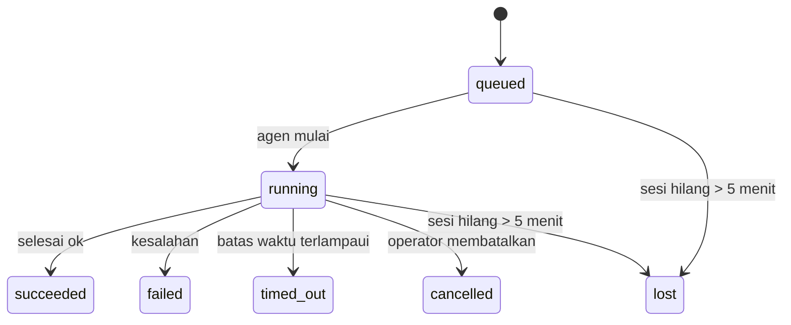

---
read_when:
    - Memeriksa pekerjaan di latar belakang yang sedang berlangsung atau baru saja selesai
    - Men-debug kegagalan pengiriman untuk eksekusi agen terpisah
    - Memahami hubungan eksekusi latar belakang dengan sesi, Cron, dan Heartbeat
sidebarTitle: Background tasks
summary: Pelacakan tugas latar belakang untuk eksekusi ACP, subagen, pekerjaan Cron terisolasi, dan operasi CLI
title: Tugas latar belakang
x-i18n:
    generated_at: "2026-05-07T13:13:33Z"
    model: gpt-5.5
    provider: openai
    source_hash: a91a04ef6142e488d2fbc459d2c663afb93816a58fe9f52e0a51420703ea2d4d
    source_path: automation/tasks.md
    workflow: 16
---

<Note>
Mencari penjadwalan? Lihat [Automasi dan tugas](/id/automation) untuk memilih mekanisme yang tepat. Halaman ini adalah buku besar aktivitas untuk pekerjaan latar belakang, bukan penjadwal.
</Note>

Tugas latar belakang melacak pekerjaan yang berjalan **di luar sesi percakapan utama Anda**: eksekusi ACP, pemunculan subagent, eksekusi cron job terisolasi, dan operasi yang dimulai dari CLI.

Tugas **tidak** menggantikan sesi, cron job, atau Heartbeat - tugas adalah **buku besar aktivitas** yang mencatat pekerjaan terlepas apa yang terjadi, kapan, dan apakah berhasil.

<Note>
Tidak setiap eksekusi agen membuat tugas. Giliran Heartbeat dan chat interaktif normal tidak. Semua eksekusi cron, pemunculan ACP, pemunculan subagent, dan perintah agen CLI membuatnya.
</Note>

## TL;DR

- Tugas adalah **catatan**, bukan penjadwal - cron dan Heartbeat menentukan _kapan_ pekerjaan berjalan, tugas melacak _apa yang terjadi_.
- ACP, subagent, semua cron job, dan operasi CLI membuat tugas. Giliran Heartbeat tidak.
- Setiap tugas bergerak melalui `queued → running → terminal` (succeeded, failed, timed_out, cancelled, atau lost).
- Tugas cron tetap aktif selama runtime cron masih memiliki job tersebut; jika
  status runtime dalam memori hilang, pemeliharaan tugas terlebih dahulu memeriksa riwayat eksekusi cron
  yang tahan lama sebelum menandai tugas sebagai lost.
- Penyelesaian digerakkan oleh push: pekerjaan terlepas dapat memberi tahu secara langsung atau membangunkan
  sesi peminta/Heartbeat saat selesai, sehingga loop polling status
  biasanya bukan bentuk yang tepat.
- Eksekusi cron terisolasi dan penyelesaian subagent berupaya sebaik mungkin membersihkan tab/proses browser yang dilacak untuk sesi anaknya sebelum pembukuan pembersihan akhir.
- Pengiriman cron terisolasi menekan balasan induk sementara yang kedaluwarsa ketika pekerjaan subagent turunan masih dikuras, dan lebih memilih keluaran akhir turunan jika keluaran itu tiba sebelum pengiriman.
- Notifikasi penyelesaian dikirim langsung ke channel atau diantrekan untuk Heartbeat berikutnya.
- `openclaw tasks list` menampilkan semua tugas; `openclaw tasks audit` memunculkan masalah.
- Catatan terminal disimpan selama 7 hari, lalu otomatis dipangkas.

## Mulai cepat

<Tabs>
  <Tab title="Daftar dan filter">
    ```bash
    # List all tasks (newest first)
    openclaw tasks list

    # Filter by runtime or status
    openclaw tasks list --runtime acp
    openclaw tasks list --status running
    ```

  </Tab>
  <Tab title="Periksa">
    ```bash
    # Show details for a specific task (by ID, run ID, or session key)
    openclaw tasks show <lookup>
    ```
  </Tab>
  <Tab title="Batalkan dan beri tahu">
    ```bash
    # Cancel a running task (kills the child session)
    openclaw tasks cancel <lookup>

    # Change notification policy for a task
    openclaw tasks notify <lookup> state_changes
    ```

  </Tab>
  <Tab title="Audit dan pemeliharaan">
    ```bash
    # Run a health audit
    openclaw tasks audit

    # Preview or apply maintenance
    openclaw tasks maintenance
    openclaw tasks maintenance --apply
    ```

  </Tab>
  <Tab title="Alur tugas">
    ```bash
    # Inspect TaskFlow state
    openclaw tasks flow list
    openclaw tasks flow show <lookup>
    openclaw tasks flow cancel <lookup>
    ```
  </Tab>
</Tabs>

## Apa yang membuat tugas

| Sumber                 | Jenis runtime | Kapan catatan tugas dibuat                          | Kebijakan notifikasi default |
| ---------------------- | ------------ | ------------------------------------------------------ | --------------------- |
| Eksekusi latar belakang ACP    | `acp`        | Memunculkan sesi ACP anak                           | `done_only`           |
| Orkestrasi subagent | `subagent`   | Memunculkan subagent melalui `sessions_spawn`               | `done_only`           |
| Cron job (semua jenis)  | `cron`       | Setiap eksekusi cron (sesi utama dan terisolasi)       | `silent`              |
| Operasi CLI         | `cli`        | Perintah `openclaw agent` yang berjalan melalui Gateway | `silent`              |
| Job media agen       | `cli`        | Eksekusi berbasis sesi `music_generate`/`video_generate`  | `silent`              |

<AccordionGroup>
  <Accordion title="Default notifikasi untuk cron dan media">
    Tugas cron sesi utama menggunakan kebijakan notifikasi `silent` secara default - tugas membuat catatan untuk pelacakan tetapi tidak menghasilkan notifikasi. Tugas cron terisolasi juga default ke `silent` tetapi lebih terlihat karena berjalan dalam sesinya sendiri.

    Eksekusi berbasis sesi `music_generate` dan `video_generate` juga menggunakan kebijakan notifikasi `silent`. Eksekusi itu tetap membuat catatan tugas, tetapi penyelesaian diserahkan kembali ke sesi agen asli sebagai wake internal agar agen dapat menulis pesan tindak lanjut dan melampirkan sendiri media yang selesai. Penyelesaian grup/channel mengikuti kebijakan balasan terlihat yang normal, sehingga agen menggunakan alat pesan saat pengiriman sumber memerlukannya. Jika agen penyelesaian gagal menghasilkan bukti pengiriman alat pesan dalam rute khusus alat, OpenClaw mengirim fallback penyelesaian langsung ke channel asli alih-alih membiarkan media tetap privat.

  </Accordion>
  <Accordion title="Guardrail video_generate serentak">
    Saat tugas berbasis sesi `video_generate` masih aktif, alat tersebut juga bertindak sebagai guardrail: panggilan `video_generate` berulang dalam sesi yang sama mengembalikan status tugas aktif alih-alih memulai generasi serentak kedua. Gunakan `action: "status"` saat Anda menginginkan pencarian progres/status eksplisit dari sisi agen.
  </Accordion>
  <Accordion title="Yang tidak membuat tugas">
    - Giliran Heartbeat - sesi utama; lihat [Heartbeat](/id/gateway/heartbeat)
    - Giliran chat interaktif normal
    - Respons langsung `/command`

  </Accordion>
</AccordionGroup>

## Siklus hidup tugas



| Status      | Artinya                                                              |
| ----------- | -------------------------------------------------------------------------- |
| `queued`    | Dibuat, menunggu agen dimulai                                    |
| `running`   | Giliran agen sedang aktif dieksekusi                                           |
| `succeeded` | Selesai dengan sukses                                                     |
| `failed`    | Selesai dengan kesalahan                                                    |
| `timed_out` | Melampaui batas waktu yang dikonfigurasi                                            |
| `cancelled` | Dihentikan oleh operator melalui `openclaw tasks cancel`                        |
| `lost`      | Runtime kehilangan status pendukung otoritatif setelah masa tenggang 5 menit |

Transisi terjadi otomatis - saat eksekusi agen terkait berakhir, status tugas diperbarui agar sesuai.

Penyelesaian eksekusi agen bersifat otoritatif untuk catatan tugas aktif. Eksekusi terlepas yang berhasil diselesaikan sebagai `succeeded`, kesalahan eksekusi biasa diselesaikan sebagai `failed`, dan hasil timeout atau abort diselesaikan sebagai `timed_out`. Jika operator sudah membatalkan tugas, atau runtime sudah mencatat status terminal yang lebih kuat seperti `failed`, `timed_out`, atau `lost`, sinyal keberhasilan yang datang kemudian tidak menurunkan status terminal tersebut.

`lost` sadar-runtime:

- Tugas ACP: metadata sesi anak ACP pendukung menghilang.
- Tugas subagent: sesi anak pendukung menghilang dari penyimpanan agen target.
- Tugas cron: runtime cron tidak lagi melacak job sebagai aktif dan riwayat
  eksekusi cron tahan lama tidak menunjukkan hasil terminal untuk eksekusi itu. Audit CLI
  offline tidak memperlakukan status runtime cron dalam prosesnya sendiri yang kosong sebagai otoritas.
- Tugas CLI: tugas dengan id eksekusi/id sumber menggunakan konteks eksekusi live, sehingga
  baris sesi anak atau sesi chat yang tersisa tidak membuatnya tetap aktif setelah
  eksekusi milik Gateway menghilang. Tugas CLI lama tanpa identitas eksekusi masih
  fallback ke sesi anak. Eksekusi `openclaw agent` yang didukung Gateway juga diselesaikan
  dari hasil eksekusinya, sehingga eksekusi yang sudah selesai tidak tetap aktif sampai sweeper
  menandainya `lost`.

## Pengiriman dan notifikasi

Saat tugas mencapai status terminal, OpenClaw memberi tahu Anda. Ada dua jalur pengiriman:

**Pengiriman langsung** - jika tugas memiliki target channel (`requesterOrigin`), pesan penyelesaian langsung menuju channel tersebut (Telegram, Discord, Slack, dll.). Untuk penyelesaian subagent, OpenClaw juga mempertahankan perutean thread/topik terikat saat tersedia dan dapat mengisi `to` / akun yang hilang dari rute tersimpan sesi peminta (`lastChannel` / `lastTo` / `lastAccountId`) sebelum menyerah pada pengiriman langsung.

**Pengiriman yang diantrekan sesi** - jika pengiriman langsung gagal atau tidak ada origin yang disetel, pembaruan diantrekan sebagai event sistem dalam sesi peminta dan muncul pada Heartbeat berikutnya.

<Tip>
Penyelesaian tugas memicu wake Heartbeat langsung sehingga Anda melihat hasilnya dengan cepat - Anda tidak perlu menunggu tick Heartbeat terjadwal berikutnya.
</Tip>

Itu berarti alur kerja biasanya berbasis push: mulai pekerjaan terlepas sekali, lalu biarkan runtime membangunkan atau memberi tahu Anda saat selesai. Poll status tugas hanya saat Anda perlu debugging, intervensi, atau audit eksplisit.

### Kebijakan notifikasi

Kontrol seberapa banyak Anda mendengar tentang setiap tugas:

| Kebijakan                | Yang dikirim                                                       |
| --------------------- | ----------------------------------------------------------------------- |
| `done_only` (default) | Hanya status terminal (succeeded, failed, dll.) - **ini defaultnya** |
| `state_changes`       | Setiap transisi status dan pembaruan progres                              |
| `silent`              | Tidak ada sama sekali                                                          |

Ubah kebijakan saat tugas sedang berjalan:

```bash
openclaw tasks notify <lookup> state_changes
```

## Referensi CLI

<AccordionGroup>
  <Accordion title="tasks list">
    ```bash
    openclaw tasks list [--runtime <acp|subagent|cron|cli>] [--status <status>] [--json]
    ```

    Kolom keluaran: ID Tugas, Jenis, Status, Pengiriman, ID Eksekusi, Sesi Anak, Ringkasan.

  </Accordion>
  <Accordion title="tasks show">
    ```bash
    openclaw tasks show <lookup>
    ```

    Token pencarian menerima ID tugas, ID eksekusi, atau kunci sesi. Menampilkan catatan lengkap termasuk waktu, status pengiriman, kesalahan, dan ringkasan terminal.

  </Accordion>
  <Accordion title="tasks cancel">
    ```bash
    openclaw tasks cancel <lookup>
    ```

    Untuk tugas ACP dan subagent, ini menghentikan sesi anak. Untuk tugas yang dilacak CLI, pembatalan dicatat dalam registri tugas (tidak ada handle runtime anak terpisah). Status bertransisi ke `cancelled` dan notifikasi pengiriman dikirim saat berlaku.

  </Accordion>
  <Accordion title="tasks notify">
    ```bash
    openclaw tasks notify <lookup> <done_only|state_changes|silent>
    ```
  </Accordion>
  <Accordion title="tasks audit">
    ```bash
    openclaw tasks audit [--json]
    ```

    Memunculkan masalah operasional. Temuan juga muncul di `openclaw status` saat masalah terdeteksi.

    | Temuan                   | Tingkat keparahan | Pemicu                                                                                                      |
    | ------------------------- | ---------- | ------------------------------------------------------------------------------------------------------------ |
    | `stale_queued`            | warn       | Antrean lebih dari 10 menit                                                                              |
    | `stale_running`           | error      | Berjalan lebih dari 30 menit                                                                             |
    | `lost`                    | warn/error | Kepemilikan tugas yang didukung runtime menghilang; tugas hilang yang dipertahankan memberi peringatan hingga `cleanupAfter`, lalu menjadi error |
    | `delivery_failed`         | warn       | Pengiriman gagal dan kebijakan pemberitahuan bukan `silent`                                                            |
    | `missing_cleanup`         | warn       | Tugas terminal tanpa stempel waktu cleanup                                                                      |
    | `inconsistent_timestamps` | warn       | Pelanggaran timeline (misalnya berakhir sebelum dimulai)                                                        |

  </Accordion>
  <Accordion title="pemeliharaan tugas">
    ```bash
    openclaw tasks maintenance [--json]
    openclaw tasks maintenance --apply [--json]
    ```

    Gunakan ini untuk mempratinjau atau menerapkan rekonsiliasi, pemberian stempel cleanup, dan pemangkasan untuk tugas serta status Alur Tugas.

    Rekonsiliasi sadar runtime:

    - Tugas ACP/subagent memeriksa sesi anak pendukungnya.
    - Tugas subagent yang sesi anaknya memiliki tombstone restart-recovery ditandai hilang, bukan diperlakukan sebagai sesi pendukung yang dapat dipulihkan.
    - Tugas Cron memeriksa apakah runtime cron masih memiliki job, lalu memulihkan status terminal dari log eksekusi cron/status job yang dipersistenkan sebelum kembali ke `lost`. Hanya proses Gateway yang berwenang atas set job aktif cron dalam memori; audit CLI offline menggunakan riwayat tahan lama tetapi tidak menandai tugas cron hilang semata-mata karena Set lokal itu kosong.
    - Tugas CLI dengan identitas run memeriksa konteks run live pemiliknya, bukan hanya baris sesi anak atau sesi chat.

    Cleanup penyelesaian juga sadar runtime:

    - Penyelesaian subagent secara upaya terbaik menutup tab/proses browser terlacak untuk sesi anak sebelum cleanup pengumuman berlanjut.
    - Penyelesaian cron terisolasi secara upaya terbaik menutup tab/proses browser terlacak untuk sesi cron sebelum run sepenuhnya dihentikan.
    - Pengiriman cron terisolasi menunggu tindak lanjut subagent turunan bila diperlukan dan menekan teks pengakuan induk yang kedaluwarsa alih-alih mengumumkannya.
    - Pengiriman penyelesaian subagent memilih teks asisten terlihat terbaru; jika kosong, ia kembali ke teks tool/toolResult terbaru yang sudah disanitasi, dan run panggilan tool yang hanya timeout dapat diringkas menjadi ringkasan progres parsial singkat. Run terminal yang gagal mengumumkan status kegagalan tanpa memutar ulang teks balasan yang tertangkap.
    - Kegagalan cleanup tidak menutupi hasil tugas yang sebenarnya.

  </Accordion>
  <Accordion title="daftar | tampilkan | batalkan alur tugas">
    ```bash
    openclaw tasks flow list [--status <status>] [--json]
    openclaw tasks flow show <lookup> [--json]
    openclaw tasks flow cancel <lookup>
    ```

    Gunakan ini saat Alur Tugas yang mengorkestrasi adalah hal yang Anda pedulikan, bukan satu catatan tugas latar belakang individual.

  </Accordion>
</AccordionGroup>

## Papan tugas chat (`/tasks`)

Gunakan `/tasks` di sesi chat mana pun untuk melihat tugas latar belakang yang tertaut ke sesi tersebut. Papan menampilkan tugas aktif dan yang baru selesai dengan runtime, status, waktu, serta detail progres atau error.

Saat sesi saat ini tidak memiliki tugas tertaut yang terlihat, `/tasks` kembali ke jumlah tugas lokal agen sehingga Anda tetap mendapat gambaran umum tanpa membocorkan detail sesi lain.

Untuk ledger operator lengkap, gunakan CLI: `openclaw tasks list`.

## Integrasi status (tekanan tugas)

`openclaw status` menyertakan ringkasan tugas sekilas:

```
Tasks: 3 queued · 2 running · 1 issues
```

Ringkasan melaporkan:

- **active** - jumlah `queued` + `running`
- **failures** - jumlah `failed` + `timed_out` + `lost`
- **byRuntime** - perincian menurut `acp`, `subagent`, `cron`, `cli`

Baik `/status` maupun tool `session_status` menggunakan snapshot tugas yang sadar cleanup: tugas aktif diprioritaskan, baris selesai yang kedaluwarsa disembunyikan, dan kegagalan terbaru hanya muncul saat tidak ada pekerjaan aktif yang tersisa. Ini menjaga kartu status tetap berfokus pada hal yang penting saat ini.

## Penyimpanan dan pemeliharaan

### Tempat tugas disimpan

Catatan tugas dipersistenkan di SQLite pada:

```
$OPENCLAW_STATE_DIR/tasks/runs.sqlite
```

Registry dimuat ke memori saat gateway dimulai dan menyinkronkan penulisan ke SQLite untuk daya tahan lintas restart.
Gateway menjaga log write-ahead SQLite tetap terbatas dengan menggunakan ambang autocheckpoint default SQLite ditambah checkpoint `TRUNCATE` berkala dan saat shutdown.

### Pemeliharaan otomatis

Sweeper berjalan setiap **60 detik** dan menangani empat hal:

<Steps>
  <Step title="Rekonsiliasi">
    Memeriksa apakah tugas aktif masih memiliki dukungan runtime yang berwenang. Tugas ACP/subagent menggunakan status sesi anak, tugas cron menggunakan kepemilikan job aktif, dan tugas CLI dengan identitas run menggunakan konteks run pemiliknya. Jika status pendukung itu hilang selama lebih dari 5 menit, tugas ditandai `lost`.
  </Step>
  <Step title="Perbaikan sesi ACP">
    Menutup sesi ACP one-shot terminal atau yatim milik induk, dan menutup sesi ACP persisten terminal yang kedaluwarsa atau yatim hanya saat tidak ada binding percakapan aktif yang tersisa.
  </Step>
  <Step title="Pemberian stempel cleanup">
    Menetapkan stempel waktu `cleanupAfter` pada tugas terminal (endedAt + 7 hari). Selama retensi, tugas hilang masih muncul dalam audit sebagai peringatan; setelah `cleanupAfter` berakhir atau saat metadata cleanup hilang, tugas tersebut menjadi error.
  </Step>
  <Step title="Pemangkasan">
    Menghapus catatan yang melewati tanggal `cleanupAfter`-nya.
  </Step>
</Steps>

<Note>
**Retensi:** catatan tugas terminal disimpan selama **7 hari**, lalu dipangkas secara otomatis. Tidak perlu konfigurasi.
</Note>

## Bagaimana tugas terkait dengan sistem lain

<AccordionGroup>
  <Accordion title="Tugas dan Alur Tugas">
    [Alur Tugas](/id/automation/taskflow) adalah lapisan orkestrasi alur di atas tugas latar belakang. Satu alur dapat mengoordinasikan beberapa tugas sepanjang masa hidupnya menggunakan mode sinkronisasi terkelola atau tercermin. Gunakan `openclaw tasks` untuk memeriksa catatan tugas individual dan `openclaw tasks flow` untuk memeriksa alur yang mengorkestrasi.

    Lihat [Alur Tugas](/id/automation/taskflow) untuk detail.

  </Accordion>
  <Accordion title="Tugas dan cron">
    **Definisi** job cron berada di `~/.openclaw/cron/jobs.json`; status eksekusi runtime berada di sampingnya dalam `~/.openclaw/cron/jobs-state.json`. **Setiap** eksekusi cron membuat catatan tugas - baik sesi utama maupun terisolasi. Tugas cron sesi utama default ke kebijakan pemberitahuan `silent` sehingga tugas tersebut terlacak tanpa menghasilkan notifikasi.

    Lihat [Job Cron](/id/automation/cron-jobs).

  </Accordion>
  <Accordion title="Tugas dan heartbeat">
    Run Heartbeat adalah giliran sesi utama - tidak membuat catatan tugas. Saat tugas selesai, tugas dapat memicu bangun heartbeat sehingga Anda segera melihat hasilnya.

    Lihat [Heartbeat](/id/gateway/heartbeat).

  </Accordion>
  <Accordion title="Tugas dan sesi">
    Tugas dapat mereferensikan `childSessionKey` (tempat pekerjaan berjalan) dan `requesterSessionKey` (siapa yang memulainya). Sesi adalah konteks percakapan; tugas adalah pelacakan aktivitas di atasnya.
  </Accordion>
  <Accordion title="Tugas dan run agen">
    `runId` milik tugas tertaut ke run agen yang melakukan pekerjaan. Peristiwa siklus hidup agen (mulai, selesai, error) otomatis memperbarui status tugas - Anda tidak perlu mengelola siklus hidup secara manual.
  </Accordion>
</AccordionGroup>

## Terkait

- [Otomasi & Tugas](/id/automation) - semua mekanisme otomasi sekilas
- [CLI: Tugas](/id/cli/tasks) - referensi perintah CLI
- [Heartbeat](/id/gateway/heartbeat) - giliran sesi utama berkala
- [Tugas Terjadwal](/id/automation/cron-jobs) - penjadwalan pekerjaan latar belakang
- [Alur Tugas](/id/automation/taskflow) - orkestrasi alur di atas tugas
