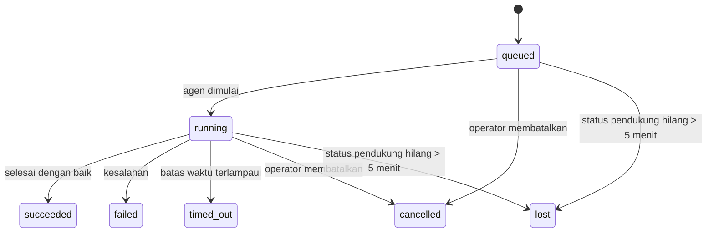

---
read_when:
    - Memeriksa pekerjaan latar belakang yang sedang berlangsung atau baru saja selesai
    - Men-debug kegagalan pengiriman untuk proses agen terpisah
    - Memahami hubungan proses latar belakang dengan sesi, Cron, dan Heartbeat
sidebarTitle: Background tasks
summary: Pelacakan tugas latar belakang untuk proses ACP, subagen, eksekusi Cron, dan operasi CLI
title: Tugas latar belakang
x-i18n:
    generated_at: "2026-07-12T13:55:19Z"
    model: gpt-5.6
    postprocess_version: locale-links-v1
    provider: openai
    source_hash: 0a945e8103c5df5a64785f326a9d0b08784ac32a2ca6fa3d4c399d75fc54be2b
    source_path: automation/tasks.md
    workflow: 16
---

<Note>
Mencari penjadwalan? Lihat [Otomatisasi](/id/automation) untuk memilih mekanisme yang tepat. Halaman ini adalah catatan aktivitas untuk pekerjaan latar belakang, bukan penjadwal.
</Note>

Tugas latar belakang melacak pekerjaan yang berjalan **di luar sesi percakapan utama Anda**: proses ACP, pembuatan subagen, eksekusi tugas cron, dan operasi yang dimulai melalui CLI.

Tugas **tidak** menggantikan sesi, tugas cron, atau heartbeat—tugas merupakan **catatan aktivitas** yang mencatat pekerjaan terpisah apa yang terjadi, kapan terjadinya, dan apakah pekerjaan tersebut berhasil.

<Note>
Tidak setiap proses agen membuat tugas. Giliran Heartbeat dan percakapan interaktif biasa tidak membuatnya. Semua eksekusi cron, pembuatan ACP, pembuatan subagen, dan perintah agen CLI yang dikirim oleh Gateway membuat tugas.
</Note>

## Ringkasan singkat

- Tugas adalah **catatan**, bukan penjadwal—cron dan heartbeat menentukan _kapan_ pekerjaan berjalan, sedangkan tugas melacak _apa yang terjadi_.
- ACP, subagen, semua tugas cron, dan operasi CLI membuat tugas. Giliran Heartbeat tidak.
- Setiap tugas bergerak melalui `queued → running → terminal` (berhasil, gagal, kehabisan waktu, dibatalkan, atau hilang).
- Tugas cron tetap aktif selama runtime cron masih memiliki tugas tersebut; jika status runtime dalam memori telah hilang, pemeliharaan tugas terlebih dahulu memeriksa riwayat proses cron permanen sebelum menandai tugas sebagai hilang.
- Penyelesaian didorong oleh notifikasi: pekerjaan terpisah dapat memberi tahu secara langsung atau membangunkan sesi pemohon/heartbeat saat selesai, sehingga perulangan polling status biasanya bukan pendekatan yang tepat.
- Proses cron terisolasi dan penyelesaian subagen berupaya sebaik mungkin untuk membersihkan tab/proses peramban yang dilacak untuk sesi turunannya sebelum pembukuan pembersihan akhir.
- Pengiriman cron terisolasi menekan balasan induk sementara yang sudah tidak relevan saat pekerjaan subagen turunan masih diselesaikan, dan mengutamakan keluaran akhir turunan jika keluaran tersebut tiba sebelum pengiriman.
- Notifikasi penyelesaian dikirim langsung ke kanal atau dimasukkan ke antrean untuk heartbeat berikutnya.
- `openclaw tasks list` menampilkan semua tugas; `openclaw tasks audit` menampilkan masalah.
- Catatan terminal disimpan selama 7 hari (catatan `lost` selama 24 jam), lalu dibersihkan secara otomatis.

## Mulai cepat

<Tabs>
  <Tab title="Cantumkan dan filter">
    ```bash
    # Cantumkan semua tugas (yang terbaru lebih dahulu)
    openclaw tasks list

    # Filter berdasarkan runtime atau status
    openclaw tasks list --runtime acp
    openclaw tasks list --status running
    ```

  </Tab>
  <Tab title="Periksa">
    ```bash
    # Tampilkan detail tugas tertentu (berdasarkan ID tugas, ID proses, atau kunci sesi)
    openclaw tasks show <lookup>
    ```
  </Tab>
  <Tab title="Batalkan dan beri tahu">
    ```bash
    # Batalkan tugas yang sedang berjalan (menghentikan sesi turunan)
    openclaw tasks cancel <lookup>

    # Ubah kebijakan notifikasi untuk tugas
    openclaw tasks notify <lookup> state_changes
    ```

  </Tab>
  <Tab title="Audit dan pemeliharaan">
    ```bash
    # Jalankan audit kesehatan
    openclaw tasks audit

    # Pratinjau atau terapkan pemeliharaan
    openclaw tasks maintenance
    openclaw tasks maintenance --apply
    ```

  </Tab>
  <Tab title="Alur tugas">
    ```bash
    # Periksa status TaskFlow
    openclaw tasks flow list
    openclaw tasks flow show <lookup>
    openclaw tasks flow cancel <lookup>
    ```
  </Tab>
</Tabs>

## Hal yang membuat tugas

| Sumber                 | Jenis runtime | Saat catatan tugas dibuat                                               | Kebijakan notifikasi bawaan |
| ---------------------- | ------------- | ----------------------------------------------------------------------- | --------------------------- |
| Proses latar belakang ACP | `acp`      | Saat membuat sesi ACP turunan                                           | `done_only`                 |
| Orkestrasi subagen     | `subagent`    | Saat membuat subagen melalui `sessions_spawn`                           | `done_only`                 |
| Tugas cron (semua jenis) | `cron`      | Setiap eksekusi cron (sesi utama dan terisolasi)                        | `silent`                    |
| Operasi CLI            | `cli`         | Perintah `openclaw agent` yang berjalan melalui Gateway                 | `silent`                    |
| Tugas media agen       | `cli`         | Proses `image_generate`/`music_generate`/`video_generate` berbasis sesi | `silent`                    |

<AccordionGroup>
  <Accordion title="Bawaan notifikasi untuk cron dan media">
    Tugas cron (sesi utama dan terisolasi) menggunakan kebijakan notifikasi `silent`—tugas tersebut membuat catatan untuk pelacakan tetapi tidak menghasilkan notifikasi tugas sendiri; cron mengelola jalur pengirimannya.

    Proses `image_generate`, `music_generate`, dan `video_generate` berbasis sesi juga menggunakan kebijakan notifikasi `silent`. Proses tersebut tetap membuat catatan tugas, tetapi penyelesaiannya dikembalikan ke sesi agen asal sebagai pemicu internal agar agen dapat menulis pesan tindak lanjut dan melampirkan sendiri media yang telah selesai. Agen pemohon mengikuti kontrak balasan terlihat seperti biasa: balasan akhir otomatis jika dikonfigurasi, atau `message(action="send")` ditambah `NO_REPLY` jika sesi mengharuskan balasan melalui alat pesan. Jika sesi pemohon sudah tidak aktif atau pemicu aktifnya gagal, dan agen penyelesaian melewatkan sebagian atau seluruh media yang dihasilkan, OpenClaw mengirim pengiriman cadangan langsung yang idempoten dan hanya berisi media yang hilang ke target kanal asal.

  </Accordion>
  <Accordion title="Pengaman pembuatan media serentak">
    Selama tugas pembuatan media berbasis sesi masih aktif, `image_generate`, `music_generate`, dan `video_generate` mencegah percobaan ulang yang tidak disengaja: pengulangan panggilan untuk perintah/permintaan yang sama akan mengembalikan status tugas aktif yang cocok, alih-alih memulai duplikat, sedangkan perintah yang berbeda dapat memulai tugasnya sendiri. Gunakan `action: "status"` jika Anda menginginkan pencarian kemajuan/status secara eksplisit dari sisi agen.
  </Accordion>
  <Accordion title="Hal yang tidak membuat tugas">
    - Giliran Heartbeat—sesi utama; lihat [Heartbeat](/id/gateway/heartbeat)
    - Giliran percakapan interaktif biasa
    - Respons langsung `/command`

  </Accordion>
</AccordionGroup>

## Siklus hidup tugas



| Status      | Artinya                                                                     |
| ----------- | -------------------------------------------------------------------------- |
| `queued`    | Dibuat, menunggu agen dimulai                                               |
| `running`   | Giliran agen sedang aktif dieksekusi                                        |
| `succeeded` | Berhasil diselesaikan                                                       |
| `failed`    | Selesai dengan kesalahan                                                    |
| `timed_out` | Melampaui batas waktu yang dikonfigurasi                                    |
| `cancelled` | Dihentikan oleh operator melalui `openclaw tasks cancel`, atau proses dibatalkan |
| `lost`      | Runtime kehilangan status pendukung otoritatif setelah masa tenggang 5 menit |

Transisi terjadi secara otomatis—peristiwa siklus hidup proses agen (mulai, selesai, kesalahan) memperbarui status tugas; Anda tidak mengelolanya secara manual.

Penyelesaian proses agen bersifat otoritatif untuk catatan tugas aktif. Proses terpisah yang berhasil diselesaikan ditetapkan sebagai `succeeded`, kesalahan proses biasa ditetapkan sebagai `failed`, kehabisan waktu ditetapkan sebagai `timed_out`, dan hasil pembatalan/penghentian ditetapkan sebagai `cancelled`. Setelah tugas mencapai status terminal, sinyal siklus hidup berikutnya tidak menurunkan statusnya—tugas yang dibatalkan operator atau sudah berstatus `failed`/`timed_out`/`lost` tetap demikian meskipun sinyal keberhasilan tiba setelahnya.

`lost` bergantung pada runtime:

- Tugas ACP: hanya giliran ACP dalam proses yang aktif di Gateway yang membuktikan bahwa proses masih berjalan; metadata sesi permanen saja tidak membuktikannya. Audit CLI luring bersifat konservatif dan tidak pernah mengambil alih kembali tugas ACP.
- Tugas subagen: sesi turunan pendukung menghilang dari penyimpanan agen target (atau memiliki penanda pemulihan setelah dimulai ulang).
- Tugas cron: runtime cron tidak lagi melacak tugas sebagai aktif dan riwayat proses cron permanen tidak menunjukkan hasil terminal untuk proses tersebut. Audit CLI luring tidak menganggap status runtime cron dalam prosesnya sendiri yang kosong sebagai sumber otoritatif.
- Tugas CLI: tugas dengan ID proses/ID sumber menggunakan konteks proses aktif, sehingga baris sesi turunan atau sesi percakapan yang tertinggal tidak membuatnya tetap aktif setelah proses milik Gateway menghilang. Tugas CLI lama tanpa identitas proses masih menggunakan sesi turunan sebagai cadangan. Proses `openclaw agent` berbasis Gateway juga diselesaikan berdasarkan hasil prosesnya, sehingga proses yang telah selesai tidak tetap aktif sampai pembersih menandainya sebagai `lost`.

## Pengiriman dan notifikasi

Saat tugas mencapai status terminal, OpenClaw memberi tahu Anda. Terdapat dua jalur pengiriman:

**Pengiriman langsung**—jika tugas memiliki target kanal (`requesterOrigin`), pesan penyelesaian dikirim langsung ke kanal tersebut (Discord, Slack, Telegram, dan sebagainya). Penyelesaian tugas grup dan kanal dialihkan melalui sesi pemohon agar agen induk dapat menulis balasan yang terlihat. Untuk penyelesaian subagen, OpenClaw juga mempertahankan perutean utas/topik terikat jika tersedia dan dapat mengisi `to` / akun yang tidak ada dari rute tersimpan milik sesi pemohon (`lastChannel` / `lastTo` / `lastAccountId`) sebelum menghentikan upaya pengiriman langsung.

**Pengiriman dalam antrean sesi**—jika pengiriman langsung gagal atau asal tidak ditetapkan, pembaruan dimasukkan ke antrean sebagai peristiwa sistem dalam sesi pemohon dan muncul pada heartbeat berikutnya.

<Tip>
Penyelesaian tugas dalam antrean sesi memicu aktivasi heartbeat secara langsung, sehingga Anda melihat hasil dengan cepat—Anda tidak perlu menunggu tick heartbeat terjadwal berikutnya.
</Tip>

Artinya, alur kerja yang lazim berbasis notifikasi: mulai pekerjaan terpisah satu kali, lalu biarkan runtime membangunkan atau memberi tahu Anda saat pekerjaan selesai. Lakukan polling status tugas hanya ketika Anda perlu melakukan debug, intervensi, atau audit eksplisit.

### Kebijakan notifikasi

Kendalikan seberapa banyak informasi yang Anda terima mengenai setiap tugas:

| Kebijakan             | Hal yang dikirim                                              |
| --------------------- | ------------------------------------------------------------- |
| `done_only` (bawaan)  | Hanya status terminal (berhasil, gagal, dan sebagainya)       |
| `state_changes`       | Setiap transisi status dan pembaruan kemajuan                 |
| `silent`              | Tidak ada sama sekali (bawaan untuk tugas cron, CLI, dan media) |

Ubah kebijakan saat tugas sedang berjalan:

```bash
openclaw tasks notify <lookup> state_changes
```

## Referensi CLI

<AccordionGroup>
  <Accordion title="tasks list">
    ```bash
    openclaw tasks list [--runtime <acp|subagent|cron|cli>] [--status <status>] [--json]
    ```

    Kolom keluaran: Tugas, Jenis, Status, Pengiriman, Proses, Sesi Turunan, Ringkasan. `openclaw tasks` tanpa argumen berperilaku seperti `openclaw tasks list`.

  </Accordion>
  <Accordion title="tasks show">
    ```bash
    openclaw tasks show <lookup> [--json]
    ```

    Token pencarian menerima ID tugas, ID proses, atau kunci sesi. Menampilkan catatan lengkap termasuk waktu, status pengiriman, kesalahan, dan ringkasan terminal.

  </Accordion>
  <Accordion title="tasks cancel">
    ```bash
    openclaw tasks cancel <lookup>
    ```

    Untuk tugas ACP dan subagen, perintah ini menghentikan sesi turunan; pembatalan ACP dan cron dirutekan melalui Gateway yang sedang berjalan (`tasks.cancel`). Untuk tugas yang dilacak CLI, pembatalan dicatat dalam registri tugas (tidak ada pegangan runtime turunan yang terpisah). Status beralih menjadi `cancelled` dan notifikasi pengiriman dikirim jika berlaku.

  </Accordion>
  <Accordion title="tasks notify">
    ```bash
    openclaw tasks notify <lookup> <done_only|state_changes|silent>
    ```
  </Accordion>
  <Accordion title="tasks audit">
    ```bash
    openclaw tasks audit [--severity <warn|error>] [--code <name>] [--limit <n>] [--json]
    ```

    Menampilkan masalah operasional untuk tugas **dan** TaskFlow dalam satu laporan. Temuan juga muncul di `openclaw status` ketika masalah terdeteksi.

    Temuan tugas:

    | Temuan                    | Tingkat keparahan | Pemicu                                                                                                                  |
    | ------------------------- | ----------------- | ----------------------------------------------------------------------------------------------------------------------- |
    | `stale_queued`            | peringatan        | Mengantre selama lebih dari 10 menit                                                                                    |
    | `stale_running`           | kesalahan         | Berjalan selama lebih dari 30 menit                                                                                     |
    | `lost`                    | peringatan/kesalahan | Kepemilikan tugas yang didukung runtime menghilang; tugas hilang yang dipertahankan menghasilkan peringatan hingga `cleanupAfter`, lalu menjadi kesalahan |
    | `delivery_failed`         | peringatan        | Pengiriman gagal dan kebijakan notifikasi bukan `silent`                                                                |
    | `missing_cleanup`         | peringatan        | Tugas terminal tanpa stempel waktu pembersihan                                                                          |
    | `inconsistent_timestamps` | peringatan        | Pelanggaran lini waktu (misalnya berakhir sebelum dimulai)                                                               |

    Temuan TaskFlow:

    | Temuan                 | Tingkat keparahan | Pemicu                                                                                  |
    | ---------------------- | ----------------- | --------------------------------------------------------------------------------------- |
    | `restore_failed`       | kesalahan         | Pemulihan registri alur dari SQLite gagal                                                |
    | `stale_running`        | kesalahan         | Alur yang berjalan belum mengalami kemajuan selama lebih dari 30 menit                  |
    | `stale_waiting`        | peringatan        | Alur yang menunggu belum mengalami kemajuan selama lebih dari 30 menit                  |
    | `stale_blocked`        | peringatan        | Alur yang diblokir belum mengalami kemajuan selama lebih dari 30 menit                  |
    | `cancel_stuck`         | peringatan        | Pembatalan diminta lebih dari 5 menit lalu, tidak ada tugas anak aktif, tetapi masih belum terminal |
    | `missing_linked_tasks` | peringatan/kesalahan | Alur terkelola yang kedaluwarsa tanpa tugas tertaut atau status tunggu                  |
    | `blocked_task_missing` | peringatan        | Alur yang diblokir menunjuk ke ID tugas yang sudah tidak ada                            |

  </Accordion>
  <Accordion title="pemeliharaan tugas">
    ```bash
    openclaw tasks maintenance [--json]
    openclaw tasks maintenance --apply [--json]
    ```

    Gunakan ini untuk melihat pratinjau atau menerapkan rekonsiliasi, pemberian stempel pembersihan, dan pemangkasan bagi tugas, status TaskFlow, serta baris registri sesi eksekusi cron yang kedaluwarsa.

    Rekonsiliasi memperhitungkan runtime:

    - Tugas ACP memerlukan giliran aktif dalam proses di Gateway; tugas subagen memeriksa sesi anak yang mendukungnya.
    - Tugas subagen yang sesi anaknya memiliki penanda pemulihan setelah mulai ulang ditandai sebagai hilang, alih-alih diperlakukan sebagai sesi pendukung yang dapat dipulihkan.
    - Tugas Cron memeriksa apakah runtime cron masih memiliki pekerjaan tersebut, lalu memulihkan status terminal dari log eksekusi cron/status pekerjaan yang dipersistenkan sebelum beralih ke `lost`. Hanya proses Gateway yang berwenang atas kumpulan pekerjaan cron aktif dalam memori; audit CLI luring menggunakan riwayat tahan lama, tetapi tidak menandai tugas cron sebagai hilang hanya karena kumpulan lokal tersebut kosong.
    - Tugas CLI dengan identitas eksekusi memeriksa konteks eksekusi aktif yang memilikinya, bukan hanya baris sesi anak atau sesi percakapan.

    Pembersihan penyelesaian juga memperhitungkan runtime:

    - Penyelesaian subagen berupaya sebaik mungkin menutup tab/proses peramban yang dilacak untuk sesi anak sebelum pembersihan pengumuman dilanjutkan.
    - Penyelesaian cron terisolasi berupaya sebaik mungkin menutup tab/proses peramban yang dilacak untuk sesi cron sebelum eksekusi sepenuhnya dihentikan.
    - Pengiriman cron terisolasi menunggu tindak lanjut subagen turunan selesai bila diperlukan dan menekan teks konfirmasi induk yang kedaluwarsa alih-alih mengumumkannya.
    - Pengiriman penyelesaian subagen hanya menggunakan teks asisten terbaru yang terlihat dari anak tersebut. Keluaran tool/toolResult tidak dijadikan teks hasil anak. Eksekusi terminal yang gagal mengumumkan status kegagalan tanpa memutar ulang teks balasan yang direkam.
    - Kegagalan pembersihan tidak menyamarkan hasil tugas yang sebenarnya.

    Saat menerapkan pemeliharaan, OpenClaw juga menghapus baris registri sesi `cron:<jobId>:run:<runId>` yang berusia lebih dari 7 hari, sambil mempertahankan baris untuk pekerjaan cron yang sedang berjalan dan membiarkan baris sesi non-cron tetap utuh.

  </Accordion>
  <Accordion title="daftar | tampilkan | batalkan alur tugas">
    ```bash
    openclaw tasks flow list [--status <status>] [--json]
    openclaw tasks flow show <lookup> [--json]
    openclaw tasks flow cancel <lookup>
    ```

    Token pencarian alur menerima ID alur atau kunci pemilik. Gunakan perintah ini ketika [Alur Tugas](/id/automation/taskflow) yang mengorkestrasi merupakan hal yang ingin Anda periksa, bukan satu catatan tugas latar belakang tertentu.

  </Accordion>
</AccordionGroup>

## Papan tugas percakapan (`/tasks`)

Gunakan `/tasks` dalam sesi percakapan apa pun untuk melihat tugas latar belakang yang tertaut ke sesi tersebut. Papan menampilkan hingga lima tugas aktif dan yang baru saja selesai beserta runtime, status, waktu, serta detail kemajuan atau kesalahan.

Jika sesi saat ini tidak memiliki tugas tertaut yang terlihat, `/tasks` akan beralih ke jumlah tugas lokal agen sehingga Anda tetap memperoleh gambaran umum tanpa membocorkan detail sesi lain.

Untuk buku besar operator lengkap, gunakan CLI: `openclaw tasks list`.

### UI Kontrol

UI Kontrol web memiliki halaman **Tugas** di bilah samping yang menampilkan tugas latar belakang aktif dan terkini secara langsung. Gunakan halaman ini untuk memeriksa kemajuan, membuka sesi tertaut, menyegarkan buku besar, atau membatalkan tugas yang mengantre dan sedang berjalan.

Panel percakapan juga memiliki panel **Tugas latar belakang** yang dapat diciutkan dan dibatasi pada agen panel tersebut: tugas dan subagen yang sedang berjalan dengan kontrol berhenti, bagian yang telah selesai, serta tautan Lihat transkrip menuju sesi anak setiap tugas. Buka melalui tombol aktivitas pada header panel (atau tombol aktivitas mengambang dalam percakapan panel tunggal).

## Integrasi status (tekanan tugas)

`openclaw status` menyertakan baris ringkasan tugas:

```
Tugas    2 aktif · 1 mengantre · 1 berjalan · 1 masalah · audit bersih · 6 terlacak
```

Ringkasan menghitung pekerjaan aktif (`queued` + `running`), kegagalan (`failed` + `timed_out` + `lost`), temuan audit, dan total catatan terlacak; muatan JSON juga menguraikan jumlah berdasarkan runtime (`acp`, `subagent`, `cron`, `cli`).

Baik `/status` maupun alat `session_status` menggunakan cuplikan tugas yang memperhitungkan pembersihan: tugas aktif diprioritaskan, baris kedaluwarsa disembunyikan, dan tugas terminal hanya muncul dalam jangka waktu terkini yang singkat (5 menit), dengan kegagalan ditonjolkan saat tidak ada pekerjaan aktif tersisa. Hal ini menjaga kartu status tetap berfokus pada hal yang penting saat ini.

## Penyimpanan dan pemeliharaan

### Lokasi penyimpanan tugas

Catatan tugas dan status pengiriman dipersistenkan dalam basis data status SQLite bersama milik OpenClaw:

```
~/.openclaw/state/openclaw.sqlite   (tables: task_runs, task_delivery_state, flow_runs)
```

Atur `OPENCLAW_STATE_DIR` untuk memindahkan seluruh akar status (bawaan `~/.openclaw`) ke lokasi lain; jalur basis data bersama akan ikut berpindah.

Registri dimuat ke memori saat pertama kali digunakan dan setiap penulisan dipersistenkan kembali ke SQLite, sehingga catatan tetap bertahan setelah Gateway dimulai ulang. Pertumbuhan WAL tetap terbatas melalui ambang pemeriksaan otomatis bawaan SQLite ditambah pemeriksaan `PASSIVE` berkala; penghentian dan pemeriksaan pemeliharaan eksplisit menggunakan `TRUNCATE` agar penutupan normal memperoleh kembali ruang WAL tanpa membuat penyapu latar belakang menunggu pembaca aktif.

Penyimpanan pendamping lama dari instalasi terdahulu (`tasks/runs.sqlite`, `flows/registry.sqlite`) diimpor ke basis data bersama oleh `openclaw doctor`.

### Pemeliharaan otomatis

Penyapu berjalan setiap **60 detik** (putaran pertama sekitar 5 detik setelah Gateway dimulai) dan menangani empat hal:

<Steps>
  <Step title="Rekonsiliasi">
    Memeriksa apakah tugas aktif masih memiliki dukungan runtime yang berwenang. Tugas ACP memerlukan giliran aktif dalam proses, tugas subagen menggunakan status sesi anak, tugas cron menggunakan kepemilikan pekerjaan aktif beserta riwayat eksekusi tahan lama, dan tugas CLI dengan identitas eksekusi menggunakan konteks eksekusi pemiliknya. Jika status pendukung hilang selama lebih dari 5 menit (30 menit untuk tugas subagen native tanpa anak), tugas ditandai sebagai `lost`.
  </Step>
  <Step title="Perbaikan sesi ACP">
    Menutup sesi ACP sekali jalan milik induk yang terminal atau terlantar, serta menutup sesi ACP persisten yang terminal atau terlantar dan kedaluwarsa hanya jika tidak ada pengikatan percakapan aktif yang tersisa.
  </Step>
  <Step title="Pemberian stempel pembersihan">
    Menetapkan stempel waktu `cleanupAfter` pada tugas terminal (waktu terminal + periode retensi). Selama retensi, tugas yang hilang masih muncul dalam audit sebagai peringatan; setelah `cleanupAfter` kedaluwarsa atau jika metadata pembersihan tidak ada, tugas tersebut menjadi kesalahan.
  </Step>
  <Step title="Pemangkasan">
    Menghapus catatan yang telah melewati tanggal `cleanupAfter`.
  </Step>
</Steps>

<Note>
**Retensi:** catatan tugas terminal disimpan selama **7 hari** (catatan `lost` selama **24 jam**), lalu dipangkas secara otomatis. Tidak diperlukan konfigurasi.
</Note>

## Hubungan tugas dengan sistem lain

<AccordionGroup>
  <Accordion title="Tugas dan Alur Tugas">
    [Alur Tugas](/id/automation/taskflow) adalah lapisan orkestrasi alur di atas tugas latar belakang. Satu alur dapat mengoordinasikan beberapa tugas sepanjang masa aktifnya menggunakan mode sinkronisasi terkelola atau tercermin. Gunakan `openclaw tasks` untuk memeriksa catatan tugas individual dan `openclaw tasks flow` untuk memeriksa alur yang mengorkestrasi.

  </Accordion>
  <Accordion title="Tugas dan cron">
    Definisi pekerjaan Cron, status eksekusi runtime, dan riwayat eksekusi berada dalam basis data status SQLite bersama milik OpenClaw. **Setiap** eksekusi cron membuat catatan tugas—baik sesi utama maupun terisolasi—dengan kebijakan notifikasi `silent`, sehingga eksekusi cron dilacak tanpa menghasilkan notifikasi tugas tersendiri.

    Lihat [Pekerjaan Cron](/id/automation/cron-jobs).

  </Accordion>
  <Accordion title="Tugas dan Heartbeat">
    Eksekusi Heartbeat adalah giliran sesi utama—eksekusi tersebut tidak membuat catatan tugas. Saat tugas selesai, tugas tersebut dapat memicu pembangkitan Heartbeat agar Anda segera melihat hasilnya.

    Lihat [Heartbeat](/id/gateway/heartbeat).

  </Accordion>
  <Accordion title="Tugas dan sesi">
    Sebuah tugas dapat merujuk pada `childSessionKey` (tempat pekerjaan berjalan) dan `requesterSessionKey` (pihak yang memulainya). `agentId` mengidentifikasi agen yang menjalankan pekerjaan, sedangkan bidang peminta dan pemilik mempertahankan konteks peluncuran dan kontrol. Sesi merupakan konteks percakapan; tugas merupakan pelacakan aktivitas di atasnya.
  </Accordion>
  <Accordion title="Tugas dan eksekusi agen">
    `runId` milik tugas tertaut ke eksekusi agen yang mengerjakan tugas tersebut. Peristiwa siklus hidup agen (mulai, selesai, kesalahan) secara otomatis memperbarui status tugas—Anda tidak perlu mengelola siklus hidup secara manual.
  </Accordion>
</AccordionGroup>

## Terkait

- [Otomatisasi](/id/automation) - semua mekanisme otomatisasi secara ringkas
- [CLI: Tugas](/id/cli/tasks) - referensi perintah CLI
- [Heartbeat](/id/gateway/heartbeat) - giliran sesi utama berkala
- [Tugas Terjadwal](/id/automation/cron-jobs) - penjadwalan pekerjaan latar belakang
- [Alur Tugas](/id/automation/taskflow) - orkestrasi alur di atas tugas
