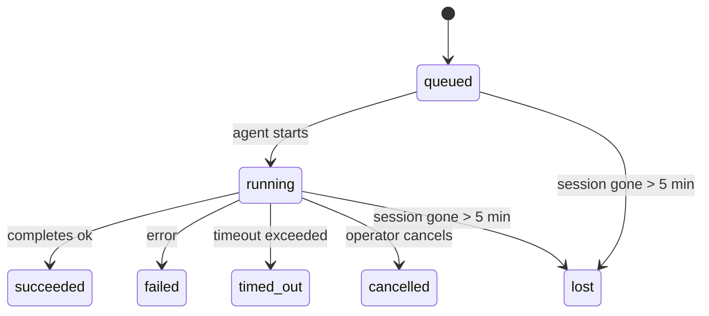

---
read_when:
    - Memeriksa pekerjaan latar belakang yang sedang berlangsung atau baru saja selesai
    - Men-debug kegagalan pengiriman untuk eksekusi agen terlepas
    - Memahami bagaimana eksekusi latar belakang terkait dengan sesi, Cron, dan Heartbeat
sidebarTitle: Background tasks
summary: Pelacakan tugas latar belakang untuk eksekusi ACP, subagen, pekerjaan Cron terisolasi, dan operasi CLI
title: Tugas latar belakang
x-i18n:
    generated_at: "2026-04-26T11:23:05Z"
    model: gpt-5.4
    provider: openai
    source_hash: 46952a378babdee9f43102bfa71dbd35b6ca7ecb142ffce3785eeb479e19d6b6
    source_path: automation/tasks.md
    workflow: 15
---

<Note>
Mencari penjadwalan? Lihat [Automation & Tasks](/id/automation) untuk memilih mekanisme yang tepat. Halaman ini membahas **pelacakan** pekerjaan latar belakang, bukan penjadwalannya.
</Note>

Tugas latar belakang melacak pekerjaan yang berjalan **di luar sesi percakapan utama Anda**: eksekusi ACP, pemanggilan subagen, eksekusi pekerjaan Cron terisolasi, dan operasi yang dimulai dari CLI.

Tugas **tidak** menggantikan sesi, pekerjaan Cron, atau Heartbeat — tugas adalah **buku besar aktivitas** yang mencatat pekerjaan terlepas apa yang terjadi, kapan itu terjadi, dan apakah berhasil.

<Note>
Tidak setiap eksekusi agen membuat tugas. Giliran Heartbeat dan chat interaktif normal tidak membuatnya. Semua eksekusi Cron, pemanggilan ACP, pemanggilan subagen, dan perintah agen CLI membuat tugas.
</Note>

## Ringkasnya

- Tugas adalah **catatan**, bukan penjadwal — Cron dan Heartbeat menentukan _kapan_ pekerjaan berjalan, tugas melacak _apa yang terjadi_.
- ACP, subagen, semua pekerjaan Cron, dan operasi CLI membuat tugas. Giliran Heartbeat tidak.
- Setiap tugas bergerak melalui `queued → running → terminal` (succeeded, failed, timed_out, cancelled, atau lost).
- Tugas Cron tetap aktif selama runtime Cron masih memiliki pekerjaan tersebut; jika status runtime dalam memori sudah hilang, pemeliharaan tugas terlebih dahulu memeriksa riwayat eksekusi Cron yang tahan lama sebelum menandai tugas sebagai lost.
- Penyelesaian bersifat push-driven: pekerjaan terlepas dapat memberi tahu secara langsung atau membangunkan sesi/heartbeat peminta saat selesai, sehingga loop polling status biasanya bukan pendekatan yang tepat.
- Eksekusi Cron terisolasi dan penyelesaian subagen sebisa mungkin membersihkan tab/proses browser yang dilacak untuk sesi anak mereka sebelum pembukuan pembersihan akhir.
- Pengiriman Cron terisolasi menekan balasan induk sementara yang usang saat pekerjaan subagen turunan masih dikuras, dan lebih mengutamakan output turunan final jika itu tiba sebelum pengiriman.
- Notifikasi penyelesaian dikirim langsung ke channel atau diantrekan untuk Heartbeat berikutnya.
- `openclaw tasks list` menampilkan semua tugas; `openclaw tasks audit` menampilkan masalah.
- Catatan terminal disimpan selama 7 hari, lalu secara otomatis dipangkas.

## Mulai cepat

<Tabs>
  <Tab title="Daftar dan filter">
    ```bash
    # Daftarkan semua tugas (terbaru lebih dulu)
    openclaw tasks list

    # Filter berdasarkan runtime atau status
    openclaw tasks list --runtime acp
    openclaw tasks list --status running
    ```

  </Tab>
  <Tab title="Periksa">
    ```bash
    # Tampilkan detail untuk tugas tertentu (berdasarkan ID, run ID, atau kunci sesi)
    openclaw tasks show <lookup>
    ```
  </Tab>
  <Tab title="Batalkan dan beri notifikasi">
    ```bash
    # Batalkan tugas yang sedang berjalan (menghentikan sesi anak)
    openclaw tasks cancel <lookup>

    # Ubah kebijakan notifikasi untuk suatu tugas
    openclaw tasks notify <lookup> state_changes
    ```

  </Tab>
  <Tab title="Audit dan pemeliharaan">
    ```bash
    # Jalankan audit kesehatan
    openclaw tasks audit

    # Pratinjau atau terapkan pemeliharaan
    openclaw tasks maintenance
    openclaw tasks maintenance --apply
    ```

  </Tab>
  <Tab title="Alur tugas">
    ```bash
    # Periksa status TaskFlow
    openclaw tasks flow list
    openclaw tasks flow show <lookup>
    openclaw tasks flow cancel <lookup>
    ```
  </Tab>
</Tabs>

## Apa yang membuat tugas

| Sumber                 | Jenis runtime | Kapan catatan tugas dibuat                           | Kebijakan notifikasi default |
| ---------------------- | ------------- | ---------------------------------------------------- | ---------------------------- |
| Eksekusi latar belakang ACP    | `acp`        | Saat memunculkan sesi anak ACP                       | `done_only`                  |
| Orkestrasi subagen | `subagent`    | Saat memunculkan subagen melalui `sessions_spawn`    | `done_only`                  |
| Pekerjaan Cron (semua jenis)  | `cron`       | Setiap eksekusi Cron (sesi utama dan terisolasi)     | `silent`                     |
| Operasi CLI         | `cli`         | Perintah `openclaw agent` yang berjalan melalui gateway | `silent`                  |
| Pekerjaan media agen       | `cli`         | Eksekusi `video_generate` berbasis sesi              | `silent`                     |

<AccordionGroup>
  <Accordion title="Default notifikasi untuk Cron dan media">
    Tugas Cron sesi utama menggunakan kebijakan notifikasi `silent` secara default — tugas ini membuat catatan untuk pelacakan tetapi tidak menghasilkan notifikasi. Tugas Cron terisolasi juga default ke `silent` tetapi lebih terlihat karena berjalan dalam sesi mereka sendiri.

    Eksekusi `video_generate` berbasis sesi juga menggunakan kebijakan notifikasi `silent`. Eksekusi ini tetap membuat catatan tugas, tetapi penyelesaiannya dikembalikan ke sesi agen asli sebagai wake internal agar agen dapat menulis pesan tindak lanjut dan melampirkan video yang sudah selesai sendiri. Jika Anda memilih `tools.media.asyncCompletion.directSend`, penyelesaian async `music_generate` dan `video_generate` akan mencoba pengiriman channel langsung terlebih dahulu sebelum kembali ke jalur wake sesi peminta.

  </Accordion>
  <Accordion title="Pagar pengaman video_generate bersamaan">
    Selama tugas `video_generate` berbasis sesi masih aktif, tool ini juga berfungsi sebagai pagar pengaman: panggilan `video_generate` berulang dalam sesi yang sama akan mengembalikan status tugas aktif alih-alih memulai generasi kedua secara bersamaan. Gunakan `action: "status"` jika Anda menginginkan pencarian progres/status secara eksplisit dari sisi agen.
  </Accordion>
  <Accordion title="Apa yang tidak membuat tugas">
    - Giliran Heartbeat — sesi utama; lihat [Heartbeat](/id/gateway/heartbeat)
    - Giliran chat interaktif normal
    - Respons `/command` langsung
  </Accordion>
</AccordionGroup>

## Siklus hidup tugas



| Status      | Artinya                                                                    |
| ----------- | -------------------------------------------------------------------------- |
| `queued`    | Dibuat, menunggu agen mulai                                                |
| `running`   | Giliran agen sedang dieksekusi secara aktif                                |
| `succeeded` | Selesai dengan sukses                                                      |
| `failed`    | Selesai dengan error                                                       |
| `timed_out` | Melebihi batas waktu yang dikonfigurasi                                    |
| `cancelled` | Dihentikan oleh operator melalui `openclaw tasks cancel`                   |
| `lost`      | Runtime kehilangan status pendukung otoritatif setelah masa tenggang 5 menit |

Transisi terjadi secara otomatis — ketika eksekusi agen terkait berakhir, status tugas diperbarui agar sesuai.

Penyelesaian eksekusi agen bersifat otoritatif untuk catatan tugas aktif. Eksekusi terlepas yang berhasil difinalisasi sebagai `succeeded`, error eksekusi biasa difinalisasi sebagai `failed`, dan hasil timeout atau abort difinalisasi sebagai `timed_out`. Jika operator sudah membatalkan tugas, atau runtime sudah mencatat status terminal yang lebih kuat seperti `failed`, `timed_out`, atau `lost`, sinyal keberhasilan yang datang belakangan tidak akan menurunkan status terminal tersebut.

`lost` sadar terhadap runtime:

- Tugas ACP: metadata sesi anak ACP pendukung hilang.
- Tugas subagen: sesi anak pendukung hilang dari penyimpanan agen target.
- Tugas Cron: runtime Cron tidak lagi melacak pekerjaan tersebut sebagai aktif dan riwayat eksekusi Cron yang tahan lama tidak menunjukkan hasil terminal untuk eksekusi itu. Audit CLI offline tidak memperlakukan status runtime Cron dalam prosesnya sendiri yang kosong sebagai otoritas.
- Tugas CLI: tugas sesi anak terisolasi menggunakan sesi anak; tugas CLI berbasis chat menggunakan konteks eksekusi langsung sebagai gantinya, sehingga baris sesi channel/grup/direct yang tersisa tidak mempertahankannya tetap aktif. Eksekusi `openclaw agent` berbasis gateway juga difinalisasi dari hasil eksekusinya, sehingga eksekusi yang sudah selesai tidak tetap aktif sampai sweeper menandainya sebagai `lost`.

## Pengiriman dan notifikasi

Ketika sebuah tugas mencapai status terminal, OpenClaw memberi tahu Anda. Ada dua jalur pengiriman:

**Pengiriman langsung** — jika tugas memiliki target channel (`requesterOrigin`), pesan penyelesaian langsung dikirim ke channel tersebut (Telegram, Discord, Slack, dll.). Untuk penyelesaian subagen, OpenClaw juga mempertahankan perutean thread/topik yang terikat saat tersedia dan dapat mengisi `to` / akun yang hilang dari rute tersimpan milik sesi peminta (`lastChannel` / `lastTo` / `lastAccountId`) sebelum menyerah pada pengiriman langsung.

**Pengiriman yang diantrekan ke sesi** — jika pengiriman langsung gagal atau tidak ada origin yang ditetapkan, pembaruan akan diantrekan sebagai peristiwa sistem dalam sesi peminta dan akan muncul pada Heartbeat berikutnya.

<Tip>
Penyelesaian tugas memicu wake Heartbeat langsung agar Anda dapat melihat hasilnya dengan cepat — Anda tidak perlu menunggu tick Heartbeat terjadwal berikutnya.
</Tip>

Artinya, alur kerja yang umum bersifat berbasis push: mulai pekerjaan terlepas satu kali, lalu biarkan runtime membangunkan atau memberi tahu Anda saat selesai. Poll status tugas hanya saat Anda memerlukan debugging, intervensi, atau audit eksplisit.

### Kebijakan notifikasi

Kontrol seberapa banyak yang Anda dengar untuk setiap tugas:

| Kebijakan                | Apa yang dikirim                                                          |
| ------------------------ | ------------------------------------------------------------------------- |
| `done_only` (default)    | Hanya status terminal (succeeded, failed, dll.) — **ini adalah default** |
| `state_changes`          | Setiap transisi status dan pembaruan progres                              |
| `silent`                 | Tidak ada sama sekali                                                     |

Ubah kebijakan saat tugas sedang berjalan:

```bash
openclaw tasks notify <lookup> state_changes
```

## Referensi CLI

<AccordionGroup>
  <Accordion title="tasks list">
    ```bash
    openclaw tasks list [--runtime <acp|subagent|cron|cli>] [--status <status>] [--json]
    ```

    Kolom output: ID Tugas, Jenis, Status, Pengiriman, Run ID, Sesi Anak, Ringkasan.

  </Accordion>
  <Accordion title="tasks show">
    ```bash
    openclaw tasks show <lookup>
    ```

    Token lookup menerima ID tugas, run ID, atau kunci sesi. Menampilkan catatan lengkap termasuk waktu, status pengiriman, error, dan ringkasan terminal.

  </Accordion>
  <Accordion title="tasks cancel">
    ```bash
    openclaw tasks cancel <lookup>
    ```

    Untuk tugas ACP dan subagen, ini menghentikan sesi anak. Untuk tugas yang dilacak CLI, pembatalan dicatat dalam registri tugas (tidak ada handle runtime anak yang terpisah). Status bertransisi ke `cancelled` dan notifikasi pengiriman dikirim jika berlaku.

  </Accordion>
  <Accordion title="tasks notify">
    ```bash
    openclaw tasks notify <lookup> <done_only|state_changes|silent>
    ```
  </Accordion>
  <Accordion title="tasks audit">
    ```bash
    openclaw tasks audit [--json]
    ```

    Menampilkan masalah operasional. Temuan juga muncul di `openclaw status` saat masalah terdeteksi.

    | Temuan                   | Tingkat keparahan | Pemicu                                                                                                           |
    | ------------------------ | ----------------- | ---------------------------------------------------------------------------------------------------------------- |
    | `stale_queued`           | warn              | Dalam antrean selama lebih dari 10 menit                                                                         |
    | `stale_running`          | error             | Berjalan selama lebih dari 30 menit                                                                              |
    | `lost`                   | warn/error        | Kepemilikan tugas yang didukung runtime menghilang; tugas lost yang dipertahankan menjadi peringatan hingga `cleanupAfter`, lalu menjadi error |
    | `delivery_failed`        | warn              | Pengiriman gagal dan kebijakan notifikasi bukan `silent`                                                         |
    | `missing_cleanup`        | warn              | Tugas terminal tanpa stempel waktu pembersihan                                                                   |
    | `inconsistent_timestamps` | warn             | Pelanggaran linimasa (misalnya berakhir sebelum dimulai)                                                         |

  </Accordion>
  <Accordion title="tasks maintenance">
    ```bash
    openclaw tasks maintenance [--json]
    openclaw tasks maintenance --apply [--json]
    ```

    Gunakan ini untuk melihat pratinjau atau menerapkan rekonsiliasi, stempel pembersihan, dan pemangkasan untuk tugas dan status Task Flow.

    Rekonsiliasi sadar terhadap runtime:

    - Tugas ACP/subagen memeriksa sesi anak pendukungnya.
    - Tugas Cron memeriksa apakah runtime Cron masih memiliki pekerjaan tersebut, lalu memulihkan status terminal dari log eksekusi/status pekerjaan Cron yang dipersistenkan sebelum kembali ke `lost`. Hanya proses Gateway yang menjadi otoritas untuk kumpulan pekerjaan aktif Cron dalam memori; audit CLI offline menggunakan riwayat yang tahan lama tetapi tidak menandai tugas Cron sebagai lost hanya karena Set lokal itu kosong.
    - Tugas CLI berbasis chat memeriksa konteks eksekusi langsung yang memilikinya, bukan hanya baris sesi chat.

    Pembersihan penyelesaian juga sadar terhadap runtime:

    - Penyelesaian subagen sebisa mungkin menutup tab/proses browser yang dilacak untuk sesi anak sebelum pembersihan pengumuman berlanjut.
    - Penyelesaian Cron terisolasi sebisa mungkin menutup tab/proses browser yang dilacak untuk sesi Cron sebelum eksekusi dihentikan sepenuhnya.
    - Pengiriman Cron terisolasi menunggu tindak lanjut subagen turunan bila diperlukan dan menekan teks pengakuan induk yang usang alih-alih mengumumkannya.
    - Pengiriman penyelesaian subagen lebih memilih teks asisten terlihat terbaru; jika kosong, akan kembali ke teks tool/toolResult terbaru yang sudah disanitasi, dan eksekusi panggilan tool yang hanya timeout dapat diringkas menjadi ringkasan progres parsial singkat. Eksekusi gagal terminal mengumumkan status kegagalan tanpa memutar ulang teks balasan yang tertangkap.
    - Kegagalan pembersihan tidak menutupi hasil tugas yang sebenarnya.

  </Accordion>
  <Accordion title="tasks flow list | show | cancel">
    ```bash
    openclaw tasks flow list [--status <status>] [--json]
    openclaw tasks flow show <lookup> [--json]
    openclaw tasks flow cancel <lookup>
    ```

    Gunakan ini ketika Task Flow pengorkestrasi adalah hal yang Anda pedulikan, bukan satu catatan tugas latar belakang individual.

  </Accordion>
</AccordionGroup>

## Papan tugas chat (`/tasks`)

Gunakan `/tasks` di sesi chat mana pun untuk melihat tugas latar belakang yang ditautkan ke sesi tersebut. Papan ini menampilkan tugas yang aktif dan yang baru selesai dengan runtime, status, waktu, serta detail progres atau error.

Saat sesi saat ini tidak memiliki tugas tertaut yang terlihat, `/tasks` akan kembali ke jumlah tugas lokal agen sehingga Anda tetap mendapatkan gambaran umum tanpa membocorkan detail sesi lain.

Untuk buku besar operator lengkap, gunakan CLI: `openclaw tasks list`.

## Integrasi status (tekanan tugas)

`openclaw status` menyertakan ringkasan tugas sekilas:

```
Tasks: 3 queued · 2 running · 1 issues
```

Ringkasan melaporkan:

- **active** — jumlah `queued` + `running`
- **failures** — jumlah `failed` + `timed_out` + `lost`
- **byRuntime** — rincian berdasarkan `acp`, `subagent`, `cron`, `cli`

Baik `/status` maupun tool `session_status` menggunakan snapshot tugas yang sadar pembersihan: tugas aktif diprioritaskan, baris selesai yang usang disembunyikan, dan kegagalan terbaru hanya ditampilkan ketika tidak ada pekerjaan aktif yang tersisa. Ini menjaga kartu status tetap fokus pada hal yang penting saat ini.

## Penyimpanan dan pemeliharaan

### Lokasi penyimpanan tugas

Catatan tugas dipersistenkan dalam SQLite di:

```
$OPENCLAW_STATE_DIR/tasks/runs.sqlite
```

Registri dimuat ke memori saat gateway dimulai dan menyinkronkan penulisan ke SQLite untuk ketahanan di seluruh restart.

### Pemeliharaan otomatis

Sebuah sweeper berjalan setiap **60 detik** dan menangani tiga hal:

<Steps>
  <Step title="Rekonsiliasi">
    Memeriksa apakah tugas aktif masih memiliki dukungan runtime yang otoritatif. Tugas ACP/subagen menggunakan status sesi anak, tugas Cron menggunakan kepemilikan pekerjaan aktif, dan tugas CLI berbasis chat menggunakan konteks eksekusi yang memilikinya. Jika status pendukung itu hilang selama lebih dari 5 menit, tugas ditandai sebagai `lost`.
  </Step>
  <Step title="Stempel pembersihan">
    Menetapkan stempel waktu `cleanupAfter` pada tugas terminal (`endedAt` + 7 hari). Selama masa retensi, tugas lost tetap muncul di audit sebagai peringatan; setelah `cleanupAfter` kedaluwarsa atau ketika metadata pembersihan tidak ada, statusnya menjadi error.
  </Step>
  <Step title="Pemangkasan">
    Menghapus catatan yang telah melewati tanggal `cleanupAfter`.
  </Step>
</Steps>

<Note>
**Retensi:** catatan tugas terminal disimpan selama **7 hari**, lalu otomatis dipangkas. Tidak perlu konfigurasi.
</Note>

## Hubungan tugas dengan sistem lain

<AccordionGroup>
  <Accordion title="Tugas dan Task Flow">
    [Task Flow](/id/automation/taskflow) adalah lapisan orkestrasi alur di atas tugas latar belakang. Satu flow dapat mengoordinasikan beberapa tugas selama masa hidupnya menggunakan mode sinkronisasi terkelola atau tercermin. Gunakan `openclaw tasks` untuk memeriksa catatan tugas individual dan `openclaw tasks flow` untuk memeriksa flow pengorkestrasi.

    Lihat [Task Flow](/id/automation/taskflow) untuk detailnya.

  </Accordion>
  <Accordion title="Tugas dan Cron">
    **Definisi** pekerjaan Cron berada di `~/.openclaw/cron/jobs.json`; status eksekusi runtime berada di sampingnya di `~/.openclaw/cron/jobs-state.json`. **Setiap** eksekusi Cron membuat catatan tugas — baik sesi utama maupun terisolasi. Tugas Cron sesi utama menggunakan kebijakan notifikasi `silent` secara default sehingga tetap dilacak tanpa menghasilkan notifikasi.

    Lihat [Cron Jobs](/id/automation/cron-jobs).

  </Accordion>
  <Accordion title="Tugas dan Heartbeat">
    Eksekusi Heartbeat adalah giliran sesi utama — itu tidak membuat catatan tugas. Saat sebuah tugas selesai, tugas tersebut dapat memicu wake heartbeat agar Anda segera melihat hasilnya.

    Lihat [Heartbeat](/id/gateway/heartbeat).

  </Accordion>
  <Accordion title="Tugas dan sesi">
    Sebuah tugas dapat merujuk ke `childSessionKey` (tempat pekerjaan berjalan) dan `requesterSessionKey` (siapa yang memulainya). Sesi adalah konteks percakapan; tugas adalah pelacakan aktivitas di atasnya.
  </Accordion>
  <Accordion title="Tugas dan eksekusi agen">
    `runId` suatu tugas terhubung ke eksekusi agen yang mengerjakan tugas tersebut. Peristiwa siklus hidup agen (mulai, selesai, error) secara otomatis memperbarui status tugas — Anda tidak perlu mengelola siklus hidupnya secara manual.
  </Accordion>
</AccordionGroup>

## Terkait

- [Automation & Tasks](/id/automation) — semua mekanisme otomatisasi secara sekilas
- [CLI: Tasks](/id/cli/tasks) — referensi perintah CLI
- [Heartbeat](/id/gateway/heartbeat) — giliran sesi utama berkala
- [Scheduled Tasks](/id/automation/cron-jobs) — menjadwalkan pekerjaan latar belakang
- [Task Flow](/id/automation/taskflow) — orkestrasi alur di atas tugas
