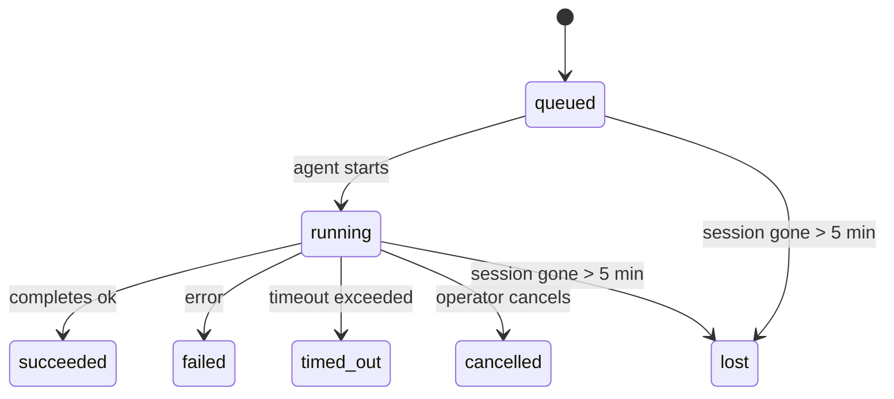

---
read_when:
    - Memeriksa pekerjaan latar belakang yang sedang berlangsung atau baru saja selesai
    - Mendiagnosis kegagalan pengiriman untuk eksekusi agen terpisah
    - Memahami bagaimana eksekusi latar belakang berkaitan dengan sesi, Cron, dan Heartbeat
sidebarTitle: Background tasks
summary: Pelacakan tugas latar belakang untuk eksekusi ACP, subagen, pekerjaan Cron terisolasi, dan operasi CLI
title: Tugas latar belakang
x-i18n:
    generated_at: "2026-05-06T09:02:20Z"
    model: gpt-5.5
    provider: openai
    source_hash: 055e16b4f53dbd089cc72eea7fe80bdaee5451dc56fa6e88a742f98e566bb57a
    source_path: automation/tasks.md
    workflow: 16
---

<Note>
Mencari penjadwalan? Lihat [Automasi dan tugas](/id/automation) untuk memilih mekanisme yang tepat. Halaman ini adalah buku besar aktivitas untuk pekerjaan latar belakang, bukan penjadwal.
</Note>

Tugas latar belakang melacak pekerjaan yang berjalan **di luar sesi percakapan utama Anda**: eksekusi ACP, spawn subagent, eksekusi pekerjaan cron terisolasi, dan operasi yang dimulai CLI.

Tugas **tidak** menggantikan sesi, pekerjaan cron, atau heartbeat - tugas adalah **buku besar aktivitas** yang mencatat pekerjaan terlepas apa yang terjadi, kapan, dan apakah berhasil.

<Note>
Tidak setiap eksekusi agen membuat tugas. Giliran Heartbeat dan chat interaktif normal tidak membuatnya. Semua eksekusi cron, spawn ACP, spawn subagent, dan perintah agen CLI membuatnya.
</Note>

## TL;DR

- Tugas adalah **catatan**, bukan penjadwal - cron dan Heartbeat menentukan _kapan_ pekerjaan berjalan, tugas melacak _apa yang terjadi_.
- ACP, subagent, semua pekerjaan cron, dan operasi CLI membuat tugas. Giliran Heartbeat tidak.
- Setiap tugas bergerak melalui `queued → running → terminal` (succeeded, failed, timed_out, cancelled, atau lost).
- Tugas cron tetap aktif selama runtime cron masih memiliki pekerjaan tersebut; jika
  status runtime dalam memori hilang, pemeliharaan tugas terlebih dahulu memeriksa riwayat eksekusi cron
  yang persisten sebelum menandai tugas sebagai lost.
- Penyelesaian didorong secara push: pekerjaan terlepas dapat memberi tahu secara langsung atau membangunkan
  sesi peminta/Heartbeat saat selesai, sehingga loop polling status
  biasanya merupakan bentuk yang keliru.
- Eksekusi cron terisolasi dan penyelesaian subagent melakukan pembersihan best-effort atas tab/proses browser yang terlacak untuk sesi anaknya sebelum pembukuan pembersihan akhir.
- Pengiriman cron terisolasi menekan balasan induk sementara yang kedaluwarsa selama pekerjaan subagent turunan masih mengalir, dan lebih memilih keluaran turunan akhir ketika keluaran itu tiba sebelum pengiriman.
- Notifikasi penyelesaian dikirim langsung ke channel atau diantrekan untuk Heartbeat berikutnya.
- `openclaw tasks list` menampilkan semua tugas; `openclaw tasks audit` memunculkan masalah.
- Catatan terminal disimpan selama 7 hari, lalu dipangkas otomatis.

## Mulai cepat

<Tabs>
  <Tab title="Daftar dan filter">
    ```bash
    # List all tasks (newest first)
    openclaw tasks list

    # Filter by runtime or status
    openclaw tasks list --runtime acp
    openclaw tasks list --status running
    ```

  </Tab>
  <Tab title="Periksa">
    ```bash
    # Show details for a specific task (by ID, run ID, or session key)
    openclaw tasks show <lookup>
    ```
  </Tab>
  <Tab title="Batalkan dan beri tahu">
    ```bash
    # Cancel a running task (kills the child session)
    openclaw tasks cancel <lookup>

    # Change notification policy for a task
    openclaw tasks notify <lookup> state_changes
    ```

  </Tab>
  <Tab title="Audit dan pemeliharaan">
    ```bash
    # Run a health audit
    openclaw tasks audit

    # Preview or apply maintenance
    openclaw tasks maintenance
    openclaw tasks maintenance --apply
    ```

  </Tab>
  <Tab title="Alur tugas">
    ```bash
    # Inspect TaskFlow state
    openclaw tasks flow list
    openclaw tasks flow show <lookup>
    openclaw tasks flow cancel <lookup>
    ```
  </Tab>
</Tabs>

## Apa yang membuat tugas

| Sumber                 | Jenis runtime | Kapan catatan tugas dibuat                            | Kebijakan notifikasi default |
| ---------------------- | ------------ | ----------------------------------------------------- | ---------------------------- |
| Eksekusi latar belakang ACP | `acp`        | Men-spawn sesi anak ACP                               | `done_only`                  |
| Orkestrasi subagent | `subagent`   | Men-spawn subagent melalui `sessions_spawn`           | `done_only`                  |
| Pekerjaan Cron (semua jenis)  | `cron`       | Setiap eksekusi cron (sesi utama dan terisolasi)      | `silent`                     |
| Operasi CLI         | `cli`        | Perintah `openclaw agent` yang berjalan melalui gateway | `silent`                   |
| Pekerjaan media agen       | `cli`        | Eksekusi `music_generate`/`video_generate` berbasis sesi | `silent`                 |

<AccordionGroup>
  <Accordion title="Default notifikasi untuk cron dan media">
    Tugas cron sesi utama menggunakan kebijakan notifikasi `silent` secara default - tugas membuat catatan untuk pelacakan tetapi tidak menghasilkan notifikasi. Tugas cron terisolasi juga default ke `silent` tetapi lebih terlihat karena berjalan dalam sesinya sendiri.

    Eksekusi `music_generate` dan `video_generate` berbasis sesi juga menggunakan kebijakan notifikasi `silent`. Eksekusi tetap membuat catatan tugas, tetapi penyelesaian dikembalikan ke sesi agen asli sebagai wake internal sehingga agen dapat menulis pesan tindak lanjut dan melampirkan media yang sudah selesai sendiri. Penyelesaian grup/channel mengikuti kebijakan balasan terlihat yang normal, sehingga agen menggunakan alat pesan saat pengiriman sumber memerlukannya. Jika agen penyelesaian gagal menghasilkan bukti pengiriman alat pesan dalam rute hanya-alat, OpenClaw mengirim fallback penyelesaian langsung ke channel asli alih-alih membiarkan media tetap privat.

  </Accordion>
  <Accordion title="Guardrail video_generate bersamaan">
    Saat tugas `video_generate` berbasis sesi masih aktif, alat ini juga bertindak sebagai guardrail: panggilan `video_generate` berulang dalam sesi yang sama mengembalikan status tugas aktif alih-alih memulai pembuatan kedua yang bersamaan. Gunakan `action: "status"` saat Anda menginginkan pencarian progres/status eksplisit dari sisi agen.
  </Accordion>
  <Accordion title="Apa yang tidak membuat tugas">
    - Giliran Heartbeat - sesi utama; lihat [Heartbeat](/id/gateway/heartbeat)
    - Giliran chat interaktif normal
    - Respons `/command` langsung

  </Accordion>
</AccordionGroup>

## Siklus hidup tugas



| Status      | Artinya                                                                    |
| ----------- | -------------------------------------------------------------------------- |
| `queued`    | Dibuat, menunggu agen dimulai                                             |
| `running`   | Giliran agen sedang aktif dieksekusi                                      |
| `succeeded` | Selesai dengan sukses                                                     |
| `failed`    | Selesai dengan kesalahan                                                   |
| `timed_out` | Melampaui timeout yang dikonfigurasi                                      |
| `cancelled` | Dihentikan oleh operator melalui `openclaw tasks cancel`                  |
| `lost`      | Runtime kehilangan status pendukung otoritatif setelah masa tenggang 5 menit |

Transisi terjadi otomatis - saat eksekusi agen terkait berakhir, status tugas diperbarui agar cocok.

Penyelesaian eksekusi agen bersifat otoritatif untuk catatan tugas aktif. Eksekusi terlepas yang berhasil difinalisasi sebagai `succeeded`, kesalahan eksekusi biasa difinalisasi sebagai `failed`, dan hasil timeout atau abort difinalisasi sebagai `timed_out`. Jika operator sudah membatalkan tugas, atau runtime sudah mencatat status terminal yang lebih kuat seperti `failed`, `timed_out`, atau `lost`, sinyal sukses yang datang kemudian tidak menurunkan status terminal tersebut.

`lost` sadar runtime:

- Tugas ACP: metadata sesi anak ACP pendukung menghilang.
- Tugas subagent: sesi anak pendukung menghilang dari penyimpanan agen target.
- Tugas Cron: runtime cron tidak lagi melacak pekerjaan sebagai aktif dan riwayat
  eksekusi cron persisten tidak menunjukkan hasil terminal untuk eksekusi itu. Audit CLI
  offline tidak memperlakukan status runtime cron dalam prosesnya sendiri yang kosong sebagai otoritas.
- Tugas CLI: tugas sesi anak terisolasi menggunakan sesi anak; CLI yang didukung chat
  menggunakan konteks eksekusi langsung sebagai gantinya, sehingga baris sesi
  channel/grup/langsung yang tersisa tidak menjaganya tetap aktif. Eksekusi
  `openclaw agent` yang didukung Gateway juga difinalisasi dari hasil eksekusinya, sehingga eksekusi yang selesai
  tidak tetap aktif sampai penyapu menandainya `lost`.

## Pengiriman dan notifikasi

Saat tugas mencapai status terminal, OpenClaw memberi tahu Anda. Ada dua jalur pengiriman:

**Pengiriman langsung** - jika tugas memiliki target channel (`requesterOrigin`), pesan penyelesaian langsung menuju channel tersebut (Telegram, Discord, Slack, dan sebagainya). Untuk penyelesaian subagent, OpenClaw juga mempertahankan perutean thread/topik terikat saat tersedia dan dapat mengisi `to` / akun yang hilang dari rute tersimpan milik sesi peminta (`lastChannel` / `lastTo` / `lastAccountId`) sebelum menyerah pada pengiriman langsung.

**Pengiriman antrean sesi** - jika pengiriman langsung gagal atau tidak ada origin yang ditetapkan, pembaruan diantrekan sebagai peristiwa sistem dalam sesi peminta dan muncul pada Heartbeat berikutnya.

<Tip>
Penyelesaian tugas memicu wake Heartbeat langsung sehingga Anda melihat hasilnya dengan cepat - Anda tidak perlu menunggu tick Heartbeat terjadwal berikutnya.
</Tip>

Itu berarti alur kerja biasa berbasis push: mulai pekerjaan terlepas sekali, lalu biarkan runtime membangunkan atau memberi tahu Anda saat selesai. Poll status tugas hanya saat Anda memerlukan debugging, intervensi, atau audit eksplisit.

### Kebijakan notifikasi

Kontrol seberapa banyak yang Anda dengar tentang setiap tugas:

| Kebijakan             | Yang dikirim                                                            |
| --------------------- | ----------------------------------------------------------------------- |
| `done_only` (default) | Hanya status terminal (succeeded, failed, dan sebagainya) - **ini defaultnya** |
| `state_changes`       | Setiap transisi status dan pembaruan progres                           |
| `silent`              | Tidak ada sama sekali                                                   |

Ubah kebijakan saat tugas sedang berjalan:

```bash
openclaw tasks notify <lookup> state_changes
```

## Referensi CLI

<AccordionGroup>
  <Accordion title="tasks list">
    ```bash
    openclaw tasks list [--runtime <acp|subagent|cron|cli>] [--status <status>] [--json]
    ```

    Kolom keluaran: ID Tugas, Jenis, Status, Pengiriman, ID Eksekusi, Sesi Anak, Ringkasan.

  </Accordion>
  <Accordion title="tasks show">
    ```bash
    openclaw tasks show <lookup>
    ```

    Token pencarian menerima ID tugas, ID eksekusi, atau kunci sesi. Menampilkan catatan lengkap termasuk waktu, status pengiriman, kesalahan, dan ringkasan terminal.

  </Accordion>
  <Accordion title="tasks cancel">
    ```bash
    openclaw tasks cancel <lookup>
    ```

    Untuk tugas ACP dan subagent, ini menghentikan sesi anak. Untuk tugas yang dilacak CLI, pembatalan dicatat dalam registri tugas (tidak ada handle runtime anak terpisah). Status bertransisi ke `cancelled` dan notifikasi pengiriman dikirim saat berlaku.

  </Accordion>
  <Accordion title="tasks notify">
    ```bash
    openclaw tasks notify <lookup> <done_only|state_changes|silent>
    ```
  </Accordion>
  <Accordion title="tasks audit">
    ```bash
    openclaw tasks audit [--json]
    ```

    Memunculkan masalah operasional. Temuan juga muncul di `openclaw status` saat masalah terdeteksi.

    | Temuan                    | Tingkat keparahan | Pemicu                                                                                                                |
    | ------------------------- | ----------------- | --------------------------------------------------------------------------------------------------------------------- |
    | `stale_queued`            | warn              | Diantrekan selama lebih dari 10 menit                                                                                 |
    | `stale_running`           | error             | Berjalan selama lebih dari 30 menit                                                                                   |
    | `lost`                    | warn/error        | Kepemilikan tugas yang didukung runtime menghilang; tugas hilang yang dipertahankan memberi peringatan hingga `cleanupAfter`, lalu menjadi error |
    | `delivery_failed`         | warn              | Pengiriman gagal dan kebijakan notifikasi bukan `silent`                                                              |
    | `missing_cleanup`         | warn              | Tugas terminal tanpa stempel waktu pembersihan                                                                        |
    | `inconsistent_timestamps` | warn              | Pelanggaran linimasa (misalnya berakhir sebelum dimulai)                                                              |

  </Accordion>
  <Accordion title="pemeliharaan tugas">
    ```bash
    openclaw tasks maintenance [--json]
    openclaw tasks maintenance --apply [--json]
    ```

    Gunakan ini untuk meninjau atau menerapkan rekonsiliasi, pemberian stempel pembersihan, dan pemangkasan untuk tugas serta status Alur Tugas.

    Rekonsiliasi sadar runtime:

    - Tugas ACP/subagen memeriksa sesi anak yang mendukungnya.
    - Tugas subagen yang sesi anaknya memiliki tombstone pemulihan mulai ulang ditandai hilang, bukan diperlakukan sebagai sesi pendukung yang dapat dipulihkan.
    - Tugas Cron memeriksa apakah runtime cron masih memiliki job, lalu memulihkan status terminal dari log cron run/status job yang dipersistenkan sebelum beralih ke `lost`. Hanya proses Gateway yang otoritatif untuk set job aktif cron dalam memori; audit CLI offline menggunakan riwayat tahan lama tetapi tidak menandai tugas cron hilang hanya karena Set lokal itu kosong.
    - Tugas CLI yang didukung chat memeriksa konteks live run pemilik, bukan hanya baris sesi chat.

    Pembersihan penyelesaian juga sadar runtime:

    - Penyelesaian subagen berupaya sebaik mungkin menutup tab/proses browser terlacak untuk sesi anak sebelum pembersihan pengumuman berlanjut.
    - Penyelesaian cron terisolasi berupaya sebaik mungkin menutup tab/proses browser terlacak untuk sesi cron sebelum run sepenuhnya dibongkar.
    - Pengiriman cron terisolasi menunggu tindak lanjut subagen turunan bila diperlukan dan menekan teks pengakuan induk yang basi alih-alih mengumumkannya.
    - Pengiriman penyelesaian subagen mengutamakan teks asisten terbaru yang terlihat; jika kosong, ia beralih ke teks alat/toolResult terbaru yang telah dibersihkan, dan run panggilan alat yang hanya timeout dapat diringkas menjadi ringkasan progres parsial singkat. Run terminal yang gagal mengumumkan status kegagalan tanpa memutar ulang teks balasan yang ditangkap.
    - Kegagalan pembersihan tidak menutupi hasil tugas yang sebenarnya.

  </Accordion>
  <Accordion title="daftar | tampilkan | batalkan alur tugas">
    ```bash
    openclaw tasks flow list [--status <status>] [--json]
    openclaw tasks flow show <lookup> [--json]
    openclaw tasks flow cancel <lookup>
    ```

    Gunakan ini ketika Alur Tugas yang mengorkestrasi adalah hal yang Anda pedulikan, bukan satu catatan tugas latar belakang individual.

  </Accordion>
</AccordionGroup>

## Papan tugas chat (`/tasks`)

Gunakan `/tasks` di sesi chat mana pun untuk melihat tugas latar belakang yang tertaut ke sesi tersebut. Papan menampilkan tugas aktif dan yang baru selesai dengan runtime, status, waktu, serta detail progres atau error.

Ketika sesi saat ini tidak memiliki tugas tertaut yang terlihat, `/tasks` beralih ke jumlah tugas lokal agen sehingga Anda tetap mendapatkan gambaran umum tanpa membocorkan detail sesi lain.

Untuk ledger operator lengkap, gunakan CLI: `openclaw tasks list`.

## Integrasi status (tekanan tugas)

`openclaw status` menyertakan ringkasan tugas sekilas:

```
Tasks: 3 queued · 2 running · 1 issues
```

Ringkasan melaporkan:

- **aktif** - jumlah `queued` + `running`
- **kegagalan** - jumlah `failed` + `timed_out` + `lost`
- **byRuntime** - rincian berdasarkan `acp`, `subagent`, `cron`, `cli`

Baik `/status` maupun alat `session_status` menggunakan snapshot tugas yang sadar pembersihan: tugas aktif diutamakan, baris selesai yang basi disembunyikan, dan kegagalan terbaru hanya muncul ketika tidak ada pekerjaan aktif yang tersisa. Ini menjaga kartu status tetap fokus pada hal yang penting saat ini.

## Penyimpanan dan pemeliharaan

### Tempat tugas disimpan

Catatan tugas dipersistenkan di SQLite pada:

```
$OPENCLAW_STATE_DIR/tasks/runs.sqlite
```

Registry dimuat ke memori saat gateway dimulai dan menyinkronkan penulisan ke SQLite agar tahan lama lintas mulai ulang.
Gateway menjaga log write-ahead SQLite tetap terbatas dengan menggunakan ambang autocheckpoint default SQLite plus checkpoint `TRUNCATE` berkala dan saat shutdown.

### Pemeliharaan otomatis

Sweeper berjalan setiap **60 detik** dan menangani empat hal:

<Steps>
  <Step title="Rekonsiliasi">
    Memeriksa apakah tugas aktif masih memiliki dukungan runtime otoritatif. Tugas ACP/subagen menggunakan status sesi anak, tugas cron menggunakan kepemilikan job aktif, dan tugas CLI yang didukung chat menggunakan konteks run pemilik. Jika status pendukung itu hilang selama lebih dari 5 menit, tugas ditandai `lost`.
  </Step>
  <Step title="Perbaikan sesi ACP">
    Menutup sesi ACP sekali jalan milik induk yang terminal atau yatim, dan menutup sesi ACP persisten yang terminal basi atau yatim hanya ketika tidak ada binding percakapan aktif yang tersisa.
  </Step>
  <Step title="Pemberian stempel pembersihan">
    Menetapkan stempel waktu `cleanupAfter` pada tugas terminal (endedAt + 7 hari). Selama retensi, tugas yang hilang tetap muncul dalam audit sebagai peringatan; setelah `cleanupAfter` kedaluwarsa atau ketika metadata pembersihan hilang, tugas tersebut menjadi error.
  </Step>
  <Step title="Pemangkasan">
    Menghapus catatan yang melewati tanggal `cleanupAfter`.
  </Step>
</Steps>

<Note>
**Retensi:** catatan tugas terminal disimpan selama **7 hari**, lalu dipangkas otomatis. Tidak perlu konfigurasi.
</Note>

## Bagaimana tugas berhubungan dengan sistem lain

<AccordionGroup>
  <Accordion title="Tugas dan Alur Tugas">
    [Alur Tugas](/id/automation/taskflow) adalah lapisan orkestrasi alur di atas tugas latar belakang. Satu alur dapat mengoordinasikan beberapa tugas selama masa aktifnya menggunakan mode sinkronisasi terkelola atau tercermin. Gunakan `openclaw tasks` untuk memeriksa catatan tugas individual dan `openclaw tasks flow` untuk memeriksa alur yang mengorkestrasi.

    Lihat [Alur Tugas](/id/automation/taskflow) untuk detail.

  </Accordion>
  <Accordion title="Tugas dan cron">
    **Definisi** job cron berada di `~/.openclaw/cron/jobs.json`; status eksekusi runtime berada di sebelahnya dalam `~/.openclaw/cron/jobs-state.json`. **Setiap** eksekusi cron membuat catatan tugas - baik sesi utama maupun terisolasi. Tugas cron sesi utama secara default menggunakan kebijakan notifikasi `silent` sehingga tugas dilacak tanpa menghasilkan notifikasi.

    Lihat [Cron Jobs](/id/automation/cron-jobs).

  </Accordion>
  <Accordion title="Tugas dan Heartbeat">
    Run Heartbeat adalah giliran sesi utama - run tersebut tidak membuat catatan tugas. Ketika tugas selesai, tugas dapat memicu bangun Heartbeat sehingga Anda segera melihat hasilnya.

    Lihat [Heartbeat](/id/gateway/heartbeat).

  </Accordion>
  <Accordion title="Tugas dan sesi">
    Tugas dapat mereferensikan `childSessionKey` (tempat pekerjaan berjalan) dan `requesterSessionKey` (siapa yang memulainya). Sesi adalah konteks percakapan; tugas adalah pelacakan aktivitas di atasnya.
  </Accordion>
  <Accordion title="Tugas dan run agen">
    `runId` tugas tertaut ke run agen yang melakukan pekerjaan. Peristiwa siklus hidup agen (mulai, selesai, error) otomatis memperbarui status tugas - Anda tidak perlu mengelola siklus hidup secara manual.
  </Accordion>
</AccordionGroup>

## Terkait

- [Otomatisasi & Tugas](/id/automation) - semua mekanisme otomatisasi secara sekilas
- [CLI: Tugas](/id/cli/tasks) - referensi perintah CLI
- [Heartbeat](/id/gateway/heartbeat) - giliran sesi utama berkala
- [Tugas Terjadwal](/id/automation/cron-jobs) - menjadwalkan pekerjaan latar belakang
- [Alur Tugas](/id/automation/taskflow) - orkestrasi alur di atas tugas
