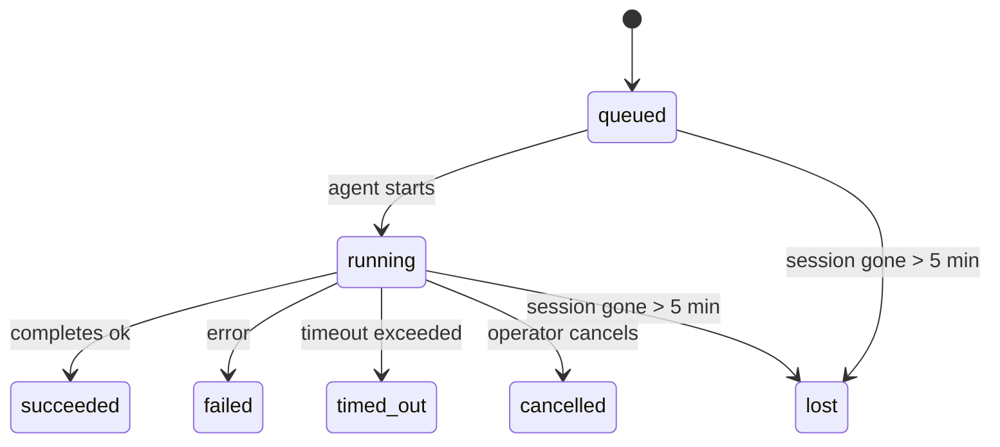

---
read_when:
    - Memeriksa pekerjaan latar belakang yang sedang berlangsung atau baru saja selesai
    - Men-debug kegagalan pengiriman untuk eksekusi agen terpisah
    - Memahami bagaimana eksekusi latar belakang berkaitan dengan sesi, Cron, dan Heartbeat
sidebarTitle: Background tasks
summary: Pelacakan tugas latar belakang untuk eksekusi ACP, subagen, pekerjaan Cron terisolasi, dan operasi CLI
title: Tugas latar belakang
x-i18n:
    generated_at: "2026-04-30T09:32:30Z"
    model: gpt-5.5
    provider: openai
    source_hash: 4bbf74f3aeea532738b56b83cd2e1a0a3734bfd453da6636b8be985a28ccc027
    source_path: automation/tasks.md
    workflow: 16
---

<Note>
Mencari penjadwalan? Lihat [Automasi dan tugas](/id/automation) untuk memilih mekanisme yang tepat. Halaman ini adalah buku besar aktivitas untuk pekerjaan latar belakang, bukan penjadwal.
</Note>

Tugas latar belakang melacak pekerjaan yang berjalan **di luar sesi percakapan utama Anda**: eksekusi ACP, spawn subagen, eksekusi tugas cron terisolasi, dan operasi yang dimulai dari CLI.

Tugas **tidak** menggantikan sesi, cron job, atau Heartbeat — tugas adalah **buku besar aktivitas** yang mencatat pekerjaan terlepas apa yang terjadi, kapan, dan apakah berhasil.

<Note>
Tidak setiap eksekusi agen membuat tugas. Giliran Heartbeat dan chat interaktif normal tidak. Semua eksekusi Cron, spawn ACP, spawn subagen, dan perintah agen CLI melakukannya.
</Note>

## Ringkasan

- Tugas adalah **rekaman**, bukan penjadwal — Cron dan Heartbeat menentukan _kapan_ pekerjaan berjalan, tugas melacak _apa yang terjadi_.
- ACP, subagen, semua cron job, dan operasi CLI membuat tugas. Giliran Heartbeat tidak.
- Setiap tugas bergerak melalui `queued → running → terminal` (succeeded, failed, timed_out, cancelled, atau lost).
- Tugas Cron tetap aktif selama runtime Cron masih memiliki job tersebut; jika
  status runtime dalam memori hilang, pemeliharaan tugas terlebih dahulu memeriksa riwayat eksekusi Cron
  yang tahan lama sebelum menandai tugas sebagai hilang.
- Penyelesaian didorong oleh push: pekerjaan terlepas dapat memberi tahu secara langsung atau membangunkan
  sesi/Heartbeat peminta saat selesai, jadi loop polling status
  biasanya bukan bentuk yang tepat.
- Eksekusi Cron terisolasi dan penyelesaian subagen berupaya sebaik mungkin membersihkan tab/proses browser yang dilacak untuk sesi anaknya sebelum pembukuan pembersihan final.
- Pengiriman Cron terisolasi menekan balasan induk sementara yang basi saat pekerjaan subagen turunan masih dikuras, dan lebih memilih output turunan final saat output itu tiba sebelum pengiriman.
- Notifikasi penyelesaian dikirim langsung ke channel atau diantrekan untuk Heartbeat berikutnya.
- `openclaw tasks list` menampilkan semua tugas; `openclaw tasks audit` memunculkan masalah.
- Rekaman terminal disimpan selama 7 hari, lalu otomatis dipangkas.

## Mulai cepat

<Tabs>
  <Tab title="List and filter">
    ```bash
    # List all tasks (newest first)
    openclaw tasks list

    # Filter by runtime or status
    openclaw tasks list --runtime acp
    openclaw tasks list --status running
    ```

  </Tab>
  <Tab title="Inspect">
    ```bash
    # Show details for a specific task (by ID, run ID, or session key)
    openclaw tasks show <lookup>
    ```
  </Tab>
  <Tab title="Cancel and notify">
    ```bash
    # Cancel a running task (kills the child session)
    openclaw tasks cancel <lookup>

    # Change notification policy for a task
    openclaw tasks notify <lookup> state_changes
    ```

  </Tab>
  <Tab title="Audit and maintenance">
    ```bash
    # Run a health audit
    openclaw tasks audit

    # Preview or apply maintenance
    openclaw tasks maintenance
    openclaw tasks maintenance --apply
    ```

  </Tab>
  <Tab title="Task flow">
    ```bash
    # Inspect TaskFlow state
    openclaw tasks flow list
    openclaw tasks flow show <lookup>
    openclaw tasks flow cancel <lookup>
    ```
  </Tab>
</Tabs>

## Apa yang membuat tugas

| Sumber                 | Jenis runtime | Kapan rekaman tugas dibuat                           | Kebijakan notifikasi default |
| ---------------------- | ------------ | ------------------------------------------------------ | --------------------- |
| Eksekusi latar belakang ACP    | `acp`        | Saat men-spawn sesi ACP anak                           | `done_only`           |
| Orkestrasi subagen | `subagent`   | Saat men-spawn subagen melalui `sessions_spawn`               | `done_only`           |
| Cron job (semua jenis)  | `cron`       | Setiap eksekusi Cron (sesi utama dan terisolasi)       | `silent`              |
| Operasi CLI         | `cli`        | Perintah `openclaw agent` yang berjalan melalui Gateway | `silent`              |
| Job media agen       | `cli`        | Eksekusi `video_generate` berbasis sesi                   | `silent`              |

<AccordionGroup>
  <Accordion title="Notify defaults for cron and media">
    Tugas Cron sesi utama menggunakan kebijakan notifikasi `silent` secara default — tugas tersebut membuat rekaman untuk pelacakan tetapi tidak menghasilkan notifikasi. Tugas Cron terisolasi juga default ke `silent` tetapi lebih terlihat karena berjalan dalam sesinya sendiri.

    Eksekusi `video_generate` berbasis sesi juga menggunakan kebijakan notifikasi `silent`. Eksekusi ini tetap membuat rekaman tugas, tetapi penyelesaian dikembalikan ke sesi agen asli sebagai wake internal agar agen dapat menulis pesan lanjutan dan melampirkan video yang selesai sendiri. Jika Anda ikut memakai `tools.media.asyncCompletion.directSend`, penyelesaian `music_generate` dan `video_generate` async akan mencoba pengiriman channel langsung terlebih dahulu sebelum fallback ke jalur wake sesi peminta.

  </Accordion>
  <Accordion title="Concurrent video_generate guardrail">
    Selama tugas `video_generate` berbasis sesi masih aktif, tool tersebut juga bertindak sebagai pembatas: panggilan `video_generate` berulang dalam sesi yang sama mengembalikan status tugas aktif alih-alih memulai generasi serentak kedua. Gunakan `action: "status"` saat Anda menginginkan lookup progres/status eksplisit dari sisi agen.
  </Accordion>
  <Accordion title="What does not create tasks">
    - Giliran Heartbeat — sesi utama; lihat [Heartbeat](/id/gateway/heartbeat)
    - Giliran chat interaktif normal
    - Respons `/command` langsung

  </Accordion>
</AccordionGroup>

## Siklus hidup tugas



| Status      | Artinya                                                              |
| ----------- | -------------------------------------------------------------------------- |
| `queued`    | Dibuat, menunggu agen mulai                                    |
| `running`   | Giliran agen sedang aktif dieksekusi                                           |
| `succeeded` | Selesai dengan sukses                                                     |
| `failed`    | Selesai dengan error                                                    |
| `timed_out` | Melebihi timeout yang dikonfigurasi                                            |
| `cancelled` | Dihentikan oleh operator melalui `openclaw tasks cancel`                        |
| `lost`      | Runtime kehilangan status pendukung otoritatif setelah masa tenggang 5 menit |

Transisi terjadi otomatis — saat eksekusi agen terkait berakhir, status tugas diperbarui agar sesuai.

Penyelesaian eksekusi agen bersifat otoritatif untuk rekaman tugas aktif. Eksekusi terlepas yang berhasil difinalisasi sebagai `succeeded`, error eksekusi biasa difinalisasi sebagai `failed`, dan hasil timeout atau abort difinalisasi sebagai `timed_out`. Jika operator sudah membatalkan tugas, atau runtime sudah mencatat status terminal yang lebih kuat seperti `failed`, `timed_out`, atau `lost`, sinyal sukses berikutnya tidak menurunkan status terminal tersebut.

`lost` sadar-runtime:

- Tugas ACP: metadata sesi ACP anak pendukung menghilang.
- Tugas subagen: sesi anak pendukung menghilang dari store agen target.
- Tugas Cron: runtime Cron tidak lagi melacak job sebagai aktif dan riwayat
  eksekusi Cron yang tahan lama tidak menampilkan hasil terminal untuk eksekusi itu. Audit CLI
  offline tidak memperlakukan status runtime Cron dalam prosesnya sendiri yang kosong sebagai otoritas.
- Tugas CLI: tugas sesi anak terisolasi menggunakan sesi anak; CLI berbasis chat
  menggunakan konteks eksekusi langsung, sehingga baris sesi
  channel/group/direct yang tersisa tidak membuatnya tetap aktif. Eksekusi
  `openclaw agent` berbasis Gateway juga difinalisasi dari hasil eksekusinya, sehingga eksekusi yang selesai
  tidak tetap aktif sampai sweeper menandainya `lost`.

## Pengiriman dan notifikasi

Saat tugas mencapai status terminal, OpenClaw memberi tahu Anda. Ada dua jalur pengiriman:

**Pengiriman langsung** — jika tugas memiliki target channel (`requesterOrigin`), pesan penyelesaian langsung masuk ke channel tersebut (Telegram, Discord, Slack, dll.). Untuk penyelesaian subagen, OpenClaw juga mempertahankan routing thread/topik terikat saat tersedia dan dapat mengisi `to` / akun yang hilang dari rute tersimpan sesi peminta (`lastChannel` / `lastTo` / `lastAccountId`) sebelum menyerah pada pengiriman langsung.

**Pengiriman yang diantrekan sesi** — jika pengiriman langsung gagal atau tidak ada asal yang ditetapkan, pembaruan diantrekan sebagai event sistem di sesi peminta dan muncul pada Heartbeat berikutnya.

<Tip>
Penyelesaian tugas memicu wake Heartbeat langsung sehingga Anda melihat hasilnya dengan cepat — Anda tidak perlu menunggu tick Heartbeat terjadwal berikutnya.
</Tip>

Itu berarti alur kerja biasa berbasis push: mulai pekerjaan terlepas sekali, lalu biarkan runtime membangunkan atau memberi tahu Anda saat selesai. Poll status tugas hanya saat Anda memerlukan debugging, intervensi, atau audit eksplisit.

### Kebijakan notifikasi

Kontrol seberapa banyak kabar yang Anda terima tentang setiap tugas:

| Kebijakan                | Yang dikirim                                                       |
| --------------------- | ----------------------------------------------------------------------- |
| `done_only` (default) | Hanya status terminal (succeeded, failed, dll.) — **ini adalah default** |
| `state_changes`       | Setiap transisi status dan pembaruan progres                              |
| `silent`              | Tidak ada sama sekali                                                          |

Ubah kebijakan saat tugas berjalan:

```bash
openclaw tasks notify <lookup> state_changes
```

## Referensi CLI

<AccordionGroup>
  <Accordion title="tasks list">
    ```bash
    openclaw tasks list [--runtime <acp|subagent|cron|cli>] [--status <status>] [--json]
    ```

    Kolom output: ID Tugas, Jenis, Status, Pengiriman, ID Eksekusi, Sesi Anak, Ringkasan.

  </Accordion>
  <Accordion title="tasks show">
    ```bash
    openclaw tasks show <lookup>
    ```

    Token lookup menerima ID tugas, ID eksekusi, atau kunci sesi. Menampilkan rekaman lengkap termasuk waktu, status pengiriman, error, dan ringkasan terminal.

  </Accordion>
  <Accordion title="tasks cancel">
    ```bash
    openclaw tasks cancel <lookup>
    ```

    Untuk tugas ACP dan subagen, ini mematikan sesi anak. Untuk tugas yang dilacak CLI, pembatalan dicatat di registry tugas (tidak ada handle runtime anak terpisah). Status bertransisi ke `cancelled` dan notifikasi pengiriman dikirim jika berlaku.

  </Accordion>
  <Accordion title="tasks notify">
    ```bash
    openclaw tasks notify <lookup> <done_only|state_changes|silent>
    ```
  </Accordion>
  <Accordion title="tasks audit">
    ```bash
    openclaw tasks audit [--json]
    ```

    Memunculkan masalah operasional. Temuan juga muncul di `openclaw status` saat masalah terdeteksi.

    | Temuan                   | Tingkat Keparahan | Pemicu                                                                                                      |
    | ------------------------- | ---------- | ------------------------------------------------------------------------------------------------------------ |
    | `stale_queued`            | warn       | Mengantre selama lebih dari 10 menit                                                                              |
    | `stale_running`           | error      | Berjalan selama lebih dari 30 menit                                                                             |
    | `lost`                    | warn/error | Kepemilikan tugas yang didukung runtime menghilang; tugas hilang yang dipertahankan memberi peringatan hingga `cleanupAfter`, lalu menjadi error |
    | `delivery_failed`         | warn       | Pengiriman gagal dan kebijakan notifikasi bukan `silent`                                                            |
    | `missing_cleanup`         | warn       | Tugas terminal tanpa stempel waktu pembersihan                                                                      |
    | `inconsistent_timestamps` | warn       | Pelanggaran lini masa (misalnya berakhir sebelum dimulai)                                                        |

  </Accordion>
  <Accordion title="pemeliharaan tugas">
    ```bash
    openclaw tasks maintenance [--json]
    openclaw tasks maintenance --apply [--json]
    ```

    Gunakan ini untuk mempratinjau atau menerapkan rekonsiliasi, pemberian stempel pembersihan, dan pemangkasan untuk tugas serta status Task Flow.

    Rekonsiliasi sadar runtime:

    - Tugas ACP/subagent memeriksa sesi anak pendukungnya.
    - Tugas Cron memeriksa apakah runtime cron masih memiliki job tersebut, lalu memulihkan status terminal dari log proses cron/status job yang dipersistensikan sebelum kembali ke `lost`. Hanya proses Gateway yang berwenang atas set job aktif cron dalam memori; audit CLI offline menggunakan riwayat tahan lama tetapi tidak menandai tugas cron sebagai hilang semata-mata karena Set lokal itu kosong.
    - Tugas CLI yang didukung chat memeriksa konteks proses langsung pemiliknya, bukan hanya baris sesi chat.

    Pembersihan penyelesaian juga sadar runtime:

    - Penyelesaian subagent dengan upaya terbaik menutup tab/proses browser yang dilacak untuk sesi anak sebelum pembersihan pengumuman berlanjut.
    - Penyelesaian cron terisolasi dengan upaya terbaik menutup tab/proses browser yang dilacak untuk sesi cron sebelum proses sepenuhnya dibongkar.
    - Pengiriman cron terisolasi menunggu tindak lanjut subagent turunan saat diperlukan dan menekan teks pengakuan induk yang usang alih-alih mengumumkannya.
    - Pengiriman penyelesaian subagent memilih teks asisten terlihat terbaru; jika kosong, pengiriman kembali ke teks alat/toolResult terbaru yang telah disanitasi, dan proses pemanggilan alat yang hanya timeout dapat diringkas menjadi ringkasan progres parsial singkat. Proses terminal yang gagal mengumumkan status kegagalan tanpa memutar ulang teks balasan yang ditangkap.
    - Kegagalan pembersihan tidak menutupi hasil tugas yang sebenarnya.

  </Accordion>
  <Accordion title="daftar | tampilkan | batalkan alur tugas">
    ```bash
    openclaw tasks flow list [--status <status>] [--json]
    openclaw tasks flow show <lookup> [--json]
    openclaw tasks flow cancel <lookup>
    ```

    Gunakan ini ketika Task Flow pengatur adalah hal yang Anda pedulikan, bukan satu rekaman tugas latar belakang individual.

  </Accordion>
</AccordionGroup>

## Papan tugas chat (`/tasks`)

Gunakan `/tasks` dalam sesi chat apa pun untuk melihat tugas latar belakang yang tertaut ke sesi tersebut. Papan menampilkan tugas aktif dan yang baru selesai dengan detail runtime, status, waktu, dan progres atau error.

Ketika sesi saat ini tidak memiliki tugas tertaut yang terlihat, `/tasks` kembali ke jumlah tugas lokal agen sehingga Anda tetap mendapatkan gambaran umum tanpa membocorkan detail sesi lain.

Untuk ledger operator lengkap, gunakan CLI: `openclaw tasks list`.

## Integrasi status (tekanan tugas)

`openclaw status` menyertakan ringkasan tugas sekilas:

```
Tasks: 3 queued · 2 running · 1 issues
```

Ringkasan melaporkan:

- **aktif** — jumlah `queued` + `running`
- **kegagalan** — jumlah `failed` + `timed_out` + `lost`
- **berdasarkanRuntime** — rincian berdasarkan `acp`, `subagent`, `cron`, `cli`

Baik `/status` maupun alat `session_status` menggunakan snapshot tugas yang sadar pembersihan: tugas aktif diprioritaskan, baris selesai yang usang disembunyikan, dan kegagalan terbaru hanya muncul ketika tidak ada pekerjaan aktif yang tersisa. Ini menjaga kartu status tetap berfokus pada hal yang penting saat ini.

## Penyimpanan dan pemeliharaan

### Tempat tugas berada

Rekaman tugas dipersistensikan di SQLite pada:

```
$OPENCLAW_STATE_DIR/tasks/runs.sqlite
```

Registry dimuat ke memori saat gateway dimulai dan menyinkronkan penulisan ke SQLite untuk ketahanan di antara restart.
Gateway menjaga log write-ahead SQLite tetap terbatas dengan menggunakan ambang
autocheckpoint default SQLite plus checkpoint `TRUNCATE` berkala dan saat shutdown.

### Pemeliharaan otomatis

Sweeper berjalan setiap **60 detik** dan menangani empat hal:

<Steps>
  <Step title="Rekonsiliasi">
    Memeriksa apakah tugas aktif masih memiliki dukungan runtime yang berwenang. Tugas ACP/subagent menggunakan status sesi anak, tugas cron menggunakan kepemilikan job aktif, dan tugas CLI yang didukung chat menggunakan konteks proses pemiliknya. Jika status pendukung itu hilang selama lebih dari 5 menit, tugas ditandai `lost`.
  </Step>
  <Step title="Perbaikan sesi ACP">
    Menutup sesi ACP one-shot milik induk yang terminal atau yatim, dan menutup sesi ACP persisten yang terminal usang atau yatim hanya ketika tidak ada binding percakapan aktif yang tersisa.
  </Step>
  <Step title="Pemberian stempel pembersihan">
    Menetapkan stempel waktu `cleanupAfter` pada tugas terminal (endedAt + 7 hari). Selama retensi, tugas hilang tetap muncul dalam audit sebagai peringatan; setelah `cleanupAfter` kedaluwarsa atau ketika metadata pembersihan hilang, tugas tersebut menjadi error.
  </Step>
  <Step title="Pemangkasan">
    Menghapus rekaman yang melewati tanggal `cleanupAfter`.
  </Step>
</Steps>

<Note>
**Retensi:** rekaman tugas terminal disimpan selama **7 hari**, lalu dipangkas secara otomatis. Tidak perlu konfigurasi.
</Note>

## Bagaimana tugas terkait dengan sistem lain

<AccordionGroup>
  <Accordion title="Tugas dan Task Flow">
    [Task Flow](/id/automation/taskflow) adalah lapisan orkestrasi alur di atas tugas latar belakang. Satu alur dapat mengoordinasikan beberapa tugas selama masa hidupnya menggunakan mode sinkronisasi terkelola atau tercermin. Gunakan `openclaw tasks` untuk memeriksa rekaman tugas individual dan `openclaw tasks flow` untuk memeriksa alur pengatur.

    Lihat [Task Flow](/id/automation/taskflow) untuk detail.

  </Accordion>
  <Accordion title="Tugas dan cron">
    **Definisi** job cron berada di `~/.openclaw/cron/jobs.json`; status eksekusi runtime berada di sebelahnya di `~/.openclaw/cron/jobs-state.json`. **Setiap** eksekusi cron membuat rekaman tugas — baik sesi utama maupun terisolasi. Tugas cron sesi utama secara default menggunakan kebijakan notifikasi `silent` sehingga tugas terlacak tanpa menghasilkan notifikasi.

    Lihat [Cron Jobs](/id/automation/cron-jobs).

  </Accordion>
  <Accordion title="Tugas dan Heartbeat">
    Proses Heartbeat adalah giliran sesi utama — proses tersebut tidak membuat rekaman tugas. Ketika tugas selesai, tugas dapat memicu bangun Heartbeat sehingga Anda melihat hasilnya dengan segera.

    Lihat [Heartbeat](/id/gateway/heartbeat).

  </Accordion>
  <Accordion title="Tugas dan sesi">
    Tugas dapat mereferensikan `childSessionKey` (tempat pekerjaan berjalan) dan `requesterSessionKey` (siapa yang memulainya). Sesi adalah konteks percakapan; tugas adalah pelacakan aktivitas di atasnya.
  </Accordion>
  <Accordion title="Tugas dan proses agen">
    `runId` milik tugas tertaut ke proses agen yang melakukan pekerjaan. Peristiwa siklus hidup agen (mulai, berakhir, error) secara otomatis memperbarui status tugas — Anda tidak perlu mengelola siklus hidup secara manual.
  </Accordion>
</AccordionGroup>

## Terkait

- [Otomatisasi & Tugas](/id/automation) — semua mekanisme otomatisasi secara sekilas
- [CLI: Tugas](/id/cli/tasks) — referensi perintah CLI
- [Heartbeat](/id/gateway/heartbeat) — giliran sesi utama berkala
- [Tugas Terjadwal](/id/automation/cron-jobs) — menjadwalkan pekerjaan latar belakang
- [Task Flow](/id/automation/taskflow) — orkestrasi alur di atas tugas
