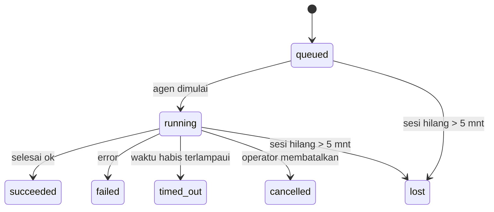

---
read_when:
    - Memeriksa pekerjaan latar belakang yang sedang berlangsung atau baru saja selesai
    - Men-debug kegagalan pengiriman untuk eksekusi agen terpisah
    - Memahami bagaimana proses yang berjalan di latar belakang berhubungan dengan sesi, Cron, dan Heartbeat
sidebarTitle: Background tasks
summary: Pelacakan tugas latar belakang untuk eksekusi ACP, subagen, pekerjaan Cron terisolasi, dan operasi CLI
title: Tugas latar belakang
x-i18n:
    generated_at: "2026-05-05T06:16:12Z"
    model: gpt-5.5
    provider: openai
    source_hash: bafd959feaf2e220820ec56bf1ef144207d05757418e9971ebf427844cf30c46
    source_path: automation/tasks.md
    workflow: 16
---

<Note>
Mencari penjadwalan? Lihat [Otomatisasi dan tugas](/id/automation) untuk memilih mekanisme yang tepat. Halaman ini adalah buku besar aktivitas untuk pekerjaan latar belakang, bukan penjadwal.
</Note>

Tugas latar belakang melacak pekerjaan yang berjalan **di luar sesi percakapan utama Anda**: proses ACP, kemunculan subagent, eksekusi tugas cron terisolasi, dan operasi yang dimulai dari CLI.

Tugas **tidak** menggantikan sesi, tugas cron, atau Heartbeat — tugas adalah **buku besar aktivitas** yang mencatat pekerjaan terlepas apa yang terjadi, kapan terjadi, dan apakah berhasil.

<Note>
Tidak setiap proses agen membuat tugas. Giliran Heartbeat dan chat interaktif normal tidak membuat tugas. Semua eksekusi cron, kemunculan ACP, kemunculan subagent, dan perintah agen CLI membuat tugas.
</Note>

## TL;DR

- Tugas adalah **catatan**, bukan penjadwal — cron dan Heartbeat menentukan _kapan_ pekerjaan berjalan, tugas melacak _apa yang terjadi_.
- ACP, subagent, semua tugas cron, dan operasi CLI membuat tugas. Giliran Heartbeat tidak.
- Setiap tugas bergerak melalui `queued → running → terminal` (succeeded, failed, timed_out, cancelled, atau lost).
- Tugas cron tetap aktif selama runtime cron masih memiliki pekerjaan tersebut; jika
  status runtime dalam memori hilang, pemeliharaan tugas pertama-tama memeriksa riwayat
  eksekusi cron yang tahan lama sebelum menandai tugas sebagai hilang.
- Penyelesaian digerakkan oleh push: pekerjaan terlepas dapat memberi tahu secara langsung atau membangunkan
  sesi/Heartbeat peminta saat selesai, sehingga loop polling status
  biasanya merupakan bentuk yang keliru.
- Eksekusi cron terisolasi dan penyelesaian subagent berupaya sebaik mungkin membersihkan tab/proses browser terlacak untuk sesi anaknya sebelum pembukuan pembersihan akhir.
- Pengiriman cron terisolasi menekan balasan induk sementara yang usang saat pekerjaan subagent turunan masih selesai diproses, dan lebih memilih keluaran turunan akhir jika keluaran itu tiba sebelum pengiriman.
- Notifikasi penyelesaian dikirim langsung ke channel atau diantrikan untuk Heartbeat berikutnya.
- `openclaw tasks list` menampilkan semua tugas; `openclaw tasks audit` memunculkan masalah.
- Catatan terminal disimpan selama 7 hari, lalu dipangkas secara otomatis.

## Mulai cepat

<Tabs>
  <Tab title="Daftar dan filter">
    ```bash
    # Daftar semua tugas (terbaru terlebih dahulu)
    openclaw tasks list

    # Filter berdasarkan runtime atau status
    openclaw tasks list --runtime acp
    openclaw tasks list --status running
    ```

  </Tab>
  <Tab title="Periksa">
    ```bash
    # Tampilkan detail untuk tugas tertentu (berdasarkan ID, ID eksekusi, atau kunci sesi)
    openclaw tasks show <lookup>
    ```
  </Tab>
  <Tab title="Batalkan dan beri tahu">
    ```bash
    # Batalkan tugas yang sedang berjalan (menghentikan sesi anak)
    openclaw tasks cancel <lookup>

    # Ubah kebijakan notifikasi untuk suatu tugas
    openclaw tasks notify <lookup> state_changes
    ```

  </Tab>
  <Tab title="Audit dan pemeliharaan">
    ```bash
    # Jalankan audit kesehatan
    openclaw tasks audit

    # Pratinjau atau terapkan pemeliharaan
    openclaw tasks maintenance
    openclaw tasks maintenance --apply
    ```

  </Tab>
  <Tab title="Alur tugas">
    ```bash
    # Periksa status TaskFlow
    openclaw tasks flow list
    openclaw tasks flow show <lookup>
    openclaw tasks flow cancel <lookup>
    ```
  </Tab>
</Tabs>

## Apa yang membuat tugas

| Sumber                 | Jenis runtime | Kapan catatan tugas dibuat                            | Kebijakan notifikasi default |
| ---------------------- | ------------ | ------------------------------------------------------ | --------------------- |
| Proses latar belakang ACP    | `acp`        | Memunculkan sesi ACP anak                           | `done_only`           |
| Orkestrasi subagent | `subagent`   | Memunculkan subagent melalui `sessions_spawn`               | `done_only`           |
| Tugas cron (semua jenis)  | `cron`       | Setiap eksekusi cron (sesi utama dan terisolasi)       | `silent`              |
| Operasi CLI         | `cli`        | Perintah `openclaw agent` yang berjalan melalui Gateway | `silent`              |
| Pekerjaan media agen       | `cli`        | Eksekusi `music_generate`/`video_generate` berbasis sesi  | `silent`              |

<AccordionGroup>
  <Accordion title="Default notifikasi untuk cron dan media">
    Tugas cron sesi utama menggunakan kebijakan notifikasi `silent` secara default — tugas membuat catatan untuk pelacakan tetapi tidak menghasilkan notifikasi. Tugas cron terisolasi juga default ke `silent` tetapi lebih terlihat karena berjalan dalam sesinya sendiri.

    Eksekusi `music_generate` dan `video_generate` berbasis sesi juga menggunakan kebijakan notifikasi `silent`. Eksekusi ini tetap membuat catatan tugas, tetapi penyelesaian dikembalikan ke sesi agen asli sebagai wake internal sehingga agen dapat menulis pesan tindak lanjut dan melampirkan media yang selesai itu sendiri. Penyelesaian grup/channel mengikuti kebijakan balasan terlihat yang normal, sehingga agen menggunakan alat pesan saat pengiriman sumber membutuhkannya. Jika agen penyelesaian gagal menghasilkan bukti pengiriman alat pesan dalam rute khusus alat, OpenClaw mengirim fallback penyelesaian langsung ke channel asli alih-alih membiarkan media tetap privat.

  </Accordion>
  <Accordion title="Guardrail video_generate bersamaan">
    Saat tugas `video_generate` berbasis sesi masih aktif, alat ini juga bertindak sebagai guardrail: panggilan `video_generate` berulang dalam sesi yang sama mengembalikan status tugas aktif alih-alih memulai generasi kedua secara bersamaan. Gunakan `action: "status"` saat Anda menginginkan pencarian progres/status eksplisit dari sisi agen.
  </Accordion>
  <Accordion title="Yang tidak membuat tugas">
    - Giliran Heartbeat — sesi utama; lihat [Heartbeat](/id/gateway/heartbeat)
    - Giliran chat interaktif normal
    - Respons `/command` langsung

  </Accordion>
</AccordionGroup>

## Siklus hidup tugas



| Status      | Artinya                                                              |
| ----------- | -------------------------------------------------------------------------- |
| `queued`    | Dibuat, menunggu agen dimulai                                    |
| `running`   | Giliran agen sedang aktif dieksekusi                                           |
| `succeeded` | Selesai dengan berhasil                                                     |
| `failed`    | Selesai dengan error                                                    |
| `timed_out` | Melebihi waktu habis yang dikonfigurasi                                            |
| `cancelled` | Dihentikan oleh operator melalui `openclaw tasks cancel`                        |
| `lost`      | Runtime kehilangan status pendukung otoritatif setelah masa tenggang 5 menit |

Transisi terjadi secara otomatis — saat proses agen terkait berakhir, status tugas diperbarui agar sesuai.

Penyelesaian proses agen bersifat otoritatif untuk catatan tugas aktif. Proses terlepas yang berhasil diselesaikan difinalisasi sebagai `succeeded`, error proses biasa difinalisasi sebagai `failed`, dan hasil waktu habis atau batal difinalisasi sebagai `timed_out`. Jika operator sudah membatalkan tugas, atau runtime sudah mencatat status terminal yang lebih kuat seperti `failed`, `timed_out`, atau `lost`, sinyal sukses yang datang belakangan tidak menurunkan status terminal tersebut.

`lost` sadar runtime:

- Tugas ACP: metadata sesi anak ACP pendukung menghilang.
- Tugas subagent: sesi anak pendukung menghilang dari penyimpanan agen target.
- Tugas cron: runtime cron tidak lagi melacak pekerjaan sebagai aktif dan riwayat
  eksekusi cron yang tahan lama tidak menampilkan hasil terminal untuk eksekusi tersebut. Audit CLI
  offline tidak memperlakukan status runtime cron dalam prosesnya sendiri yang kosong sebagai otoritas.
- Tugas CLI: tugas sesi anak terisolasi menggunakan sesi anak; tugas CLI
  berbasis chat menggunakan konteks eksekusi langsung sebagai gantinya, sehingga baris sesi
  channel/grup/langsung yang tersisa tidak membuatnya tetap aktif. Eksekusi
  `openclaw agent` berbasis Gateway juga difinalisasi dari hasil eksekusinya, sehingga eksekusi yang selesai
  tidak tetap aktif sampai sweeper menandainya `lost`.

## Pengiriman dan notifikasi

Saat tugas mencapai status terminal, OpenClaw memberi tahu Anda. Ada dua jalur pengiriman:

**Pengiriman langsung** — jika tugas memiliki target channel (`requesterOrigin`), pesan penyelesaian langsung masuk ke channel tersebut (Telegram, Discord, Slack, dll.). Untuk penyelesaian subagent, OpenClaw juga mempertahankan perutean thread/topik terikat saat tersedia dan dapat mengisi `to` / akun yang hilang dari rute tersimpan sesi peminta (`lastChannel` / `lastTo` / `lastAccountId`) sebelum menyerah pada pengiriman langsung.

**Pengiriman antrean sesi** — jika pengiriman langsung gagal atau tidak ada origin yang ditetapkan, pembaruan diantrikan sebagai event sistem dalam sesi peminta dan muncul pada Heartbeat berikutnya.

<Tip>
Penyelesaian tugas memicu wake Heartbeat langsung sehingga Anda melihat hasilnya dengan cepat — Anda tidak perlu menunggu tick Heartbeat terjadwal berikutnya.
</Tip>

Artinya, alur kerja biasa berbasis push: mulai pekerjaan terlepas sekali, lalu biarkan runtime membangunkan atau memberi tahu Anda saat selesai. Poll status tugas hanya saat Anda perlu debugging, intervensi, atau audit eksplisit.

### Kebijakan notifikasi

Kontrol seberapa banyak yang Anda dengar tentang setiap tugas:

| Kebijakan                | Yang dikirim                                                       |
| --------------------- | ----------------------------------------------------------------------- |
| `done_only` (default) | Hanya status terminal (succeeded, failed, dll.) — **ini adalah default** |
| `state_changes`       | Setiap transisi status dan pembaruan progres                              |
| `silent`              | Tidak ada sama sekali                                                          |

Ubah kebijakan saat tugas sedang berjalan:

```bash
openclaw tasks notify <lookup> state_changes
```

## Referensi CLI

<AccordionGroup>
  <Accordion title="tasks list">
    ```bash
    openclaw tasks list [--runtime <acp|subagent|cron|cli>] [--status <status>] [--json]
    ```

    Kolom keluaran: ID Tugas, Jenis, Status, Pengiriman, ID Eksekusi, Sesi Anak, Ringkasan.

  </Accordion>
  <Accordion title="tasks show">
    ```bash
    openclaw tasks show <lookup>
    ```

    Token lookup menerima ID tugas, ID eksekusi, atau kunci sesi. Menampilkan catatan lengkap termasuk waktu, status pengiriman, error, dan ringkasan terminal.

  </Accordion>
  <Accordion title="tasks cancel">
    ```bash
    openclaw tasks cancel <lookup>
    ```

    Untuk tugas ACP dan subagent, ini menghentikan sesi anak. Untuk tugas yang dilacak CLI, pembatalan dicatat dalam registri tugas (tidak ada handle runtime anak terpisah). Status bertransisi ke `cancelled` dan notifikasi pengiriman dikirim bila berlaku.

  </Accordion>
  <Accordion title="tasks notify">
    ```bash
    openclaw tasks notify <lookup> <done_only|state_changes|silent>
    ```
  </Accordion>
  <Accordion title="tasks audit">
    ```bash
    openclaw tasks audit [--json]
    ```

    Memunculkan masalah operasional. Temuan juga muncul di `openclaw status` saat masalah terdeteksi.

    | Temuan                    | Tingkat keparahan | Pemicu                                                                                                      |
    | ------------------------- | ---------- | ------------------------------------------------------------------------------------------------------------ |
    | `stale_queued`            | warn       | Mengantre selama lebih dari 10 menit                                                                        |
    | `stale_running`           | error      | Berjalan selama lebih dari 30 menit                                                                         |
    | `lost`                    | warn/error | Kepemilikan tugas berbasis runtime menghilang; tugas hilang yang dipertahankan memberi peringatan hingga `cleanupAfter`, lalu menjadi galat |
    | `delivery_failed`         | warn       | Pengiriman gagal dan kebijakan notifikasi bukan `silent`                                                    |
    | `missing_cleanup`         | warn       | Tugas terminal tanpa stempel waktu pembersihan                                                              |
    | `inconsistent_timestamps` | warn       | Pelanggaran linimasa (misalnya berakhir sebelum dimulai)                                                     |

  </Accordion>
  <Accordion title="pemeliharaan tugas">
    ```bash
    openclaw tasks maintenance [--json]
    openclaw tasks maintenance --apply [--json]
    ```

    Gunakan ini untuk meninjau atau menerapkan rekonsiliasi, pemberian stempel pembersihan, dan pemangkasan untuk tugas serta status Task Flow.

    Rekonsiliasi sadar runtime:

    - Tugas ACP/subagent memeriksa sesi anak pendukungnya.
    - Tugas subagent yang sesi anaknya memiliki tombstone pemulihan restart ditandai hilang, bukan diperlakukan sebagai sesi pendukung yang dapat dipulihkan.
    - Tugas Cron memeriksa apakah runtime cron masih memiliki job tersebut, lalu memulihkan status terminal dari log cron run/status job yang dipersistenkan sebelum kembali ke `lost`. Hanya proses Gateway yang berwenang atas kumpulan job aktif cron dalam memori; audit CLI offline menggunakan riwayat tahan lama tetapi tidak menandai tugas cron hilang semata-mata karena Set lokal itu kosong.
    - Tugas CLI yang didukung chat memeriksa konteks live run pemiliknya, bukan hanya baris sesi chat.

    Pembersihan penyelesaian juga sadar runtime:

    - Penyelesaian subagent secara best-effort menutup tab/proses browser terlacak untuk sesi anak sebelum pembersihan pengumuman berlanjut.
    - Penyelesaian cron terisolasi secara best-effort menutup tab/proses browser terlacak untuk sesi cron sebelum run sepenuhnya dibongkar.
    - Pengiriman cron terisolasi menunggu tindak lanjut subagent turunan bila diperlukan dan menekan teks pengakuan induk yang basi alih-alih mengumumkannya.
    - Pengiriman penyelesaian subagent mengutamakan teks asisten terbaru yang terlihat; jika kosong, kembali ke teks tool/toolResult terbaru yang disanitasi, dan run pemanggilan tool yang hanya timeout dapat diringkas menjadi ringkasan progres parsial singkat. Run gagal terminal mengumumkan status kegagalan tanpa memutar ulang teks balasan yang ditangkap.
    - Kegagalan pembersihan tidak menutupi hasil tugas yang sebenarnya.

  </Accordion>
  <Accordion title="daftar | tampilkan | batalkan alur tugas">
    ```bash
    openclaw tasks flow list [--status <status>] [--json]
    openclaw tasks flow show <lookup> [--json]
    openclaw tasks flow cancel <lookup>
    ```

    Gunakan ini ketika Task Flow pengorkestrasi adalah hal yang Anda pedulikan, bukan satu catatan tugas latar belakang individual.

  </Accordion>
</AccordionGroup>

## Papan tugas chat (`/tasks`)

Gunakan `/tasks` dalam sesi chat apa pun untuk melihat tugas latar belakang yang ditautkan ke sesi tersebut. Papan menampilkan tugas aktif dan yang baru selesai dengan runtime, status, waktu, serta detail progres atau galat.

Saat sesi saat ini tidak memiliki tugas tertaut yang terlihat, `/tasks` kembali ke jumlah tugas lokal agen sehingga Anda tetap mendapatkan gambaran umum tanpa membocorkan detail sesi lain.

Untuk ledger operator lengkap, gunakan CLI: `openclaw tasks list`.

## Integrasi status (tekanan tugas)

`openclaw status` menyertakan ringkasan tugas sekilas:

```
Tasks: 3 queued · 2 running · 1 issues
```

Ringkasan melaporkan:

- **aktif** — jumlah `queued` + `running`
- **kegagalan** — jumlah `failed` + `timed_out` + `lost`
- **byRuntime** — rincian menurut `acp`, `subagent`, `cron`, `cli`

Baik `/status` maupun tool `session_status` menggunakan snapshot tugas yang sadar pembersihan: tugas aktif diutamakan, baris selesai yang basi disembunyikan, dan kegagalan terbaru hanya muncul saat tidak ada pekerjaan aktif yang tersisa. Ini menjaga kartu status tetap berfokus pada hal yang penting saat ini.

## Penyimpanan dan pemeliharaan

### Lokasi tugas disimpan

Catatan tugas dipersistenkan dalam SQLite di:

```
$OPENCLAW_STATE_DIR/tasks/runs.sqlite
```

Registry dimuat ke memori saat Gateway dimulai dan menyinkronkan penulisan ke SQLite agar tahan lama lintas restart.
Gateway menjaga log write-ahead SQLite tetap terbatas dengan menggunakan ambang autocheckpoint default SQLite ditambah checkpoint `TRUNCATE` berkala dan saat shutdown.

### Pemeliharaan otomatis

Sweeper berjalan setiap **60 detik** dan menangani empat hal:

<Steps>
  <Step title="Rekonsiliasi">
    Memeriksa apakah tugas aktif masih memiliki pendukung runtime yang berwenang. Tugas ACP/subagent menggunakan status sesi anak, tugas cron menggunakan kepemilikan job aktif, dan tugas CLI yang didukung chat menggunakan konteks run pemiliknya. Jika status pendukung itu hilang selama lebih dari 5 menit, tugas ditandai `lost`.
  </Step>
  <Step title="Perbaikan sesi ACP">
    Menutup sesi ACP one-shot milik induk yang terminal atau yatim, dan menutup sesi ACP persisten yang terminal basi atau yatim hanya ketika tidak ada binding percakapan aktif yang tersisa.
  </Step>
  <Step title="Pemberian stempel pembersihan">
    Menetapkan stempel waktu `cleanupAfter` pada tugas terminal (endedAt + 7 hari). Selama retensi, tugas hilang masih muncul dalam audit sebagai peringatan; setelah `cleanupAfter` kedaluwarsa atau ketika metadata pembersihan hilang, tugas tersebut menjadi galat.
  </Step>
  <Step title="Pemangkasan">
    Menghapus catatan yang sudah melewati tanggal `cleanupAfter`.
  </Step>
</Steps>

<Note>
**Retensi:** catatan tugas terminal disimpan selama **7 hari**, lalu dipangkas secara otomatis. Tidak perlu konfigurasi.
</Note>

## Bagaimana tugas terkait dengan sistem lain

<AccordionGroup>
  <Accordion title="Tugas dan Task Flow">
    [Task Flow](/id/automation/taskflow) adalah lapisan orkestrasi alur di atas tugas latar belakang. Satu alur dapat mengoordinasikan beberapa tugas sepanjang masa hidupnya menggunakan mode sinkronisasi terkelola atau tercermin. Gunakan `openclaw tasks` untuk memeriksa catatan tugas individual dan `openclaw tasks flow` untuk memeriksa alur pengorkestrasi.

    Lihat [Task Flow](/id/automation/taskflow) untuk detail.

  </Accordion>
  <Accordion title="Tugas dan cron">
    **Definisi** job cron berada di `~/.openclaw/cron/jobs.json`; status eksekusi runtime berada di sampingnya dalam `~/.openclaw/cron/jobs-state.json`. **Setiap** eksekusi cron membuat catatan tugas — baik sesi utama maupun terisolasi. Tugas cron sesi utama secara default menggunakan kebijakan notifikasi `silent` sehingga tugas tersebut dilacak tanpa menghasilkan notifikasi.

    Lihat [Cron Jobs](/id/automation/cron-jobs).

  </Accordion>
  <Accordion title="Tugas dan heartbeat">
    Run Heartbeat adalah giliran sesi utama — tidak membuat catatan tugas. Saat tugas selesai, tugas dapat memicu wake heartbeat sehingga Anda melihat hasilnya dengan segera.

    Lihat [Heartbeat](/id/gateway/heartbeat).

  </Accordion>
  <Accordion title="Tugas dan sesi">
    Tugas dapat merujuk ke `childSessionKey` (tempat pekerjaan berjalan) dan `requesterSessionKey` (siapa yang memulainya). Sesi adalah konteks percakapan; tugas adalah pelacakan aktivitas di atasnya.
  </Accordion>
  <Accordion title="Tugas dan run agen">
    `runId` tugas tertaut ke run agen yang melakukan pekerjaan. Peristiwa siklus hidup agen (mulai, akhir, galat) otomatis memperbarui status tugas — Anda tidak perlu mengelola siklus hidup secara manual.
  </Accordion>
</AccordionGroup>

## Terkait

- [Automasi & Tugas](/id/automation) — semua mekanisme automasi sekilas
- [CLI: Tugas](/id/cli/tasks) — referensi perintah CLI
- [Heartbeat](/id/gateway/heartbeat) — giliran sesi utama berkala
- [Tugas Terjadwal](/id/automation/cron-jobs) — menjadwalkan pekerjaan latar belakang
- [Task Flow](/id/automation/taskflow) — orkestrasi alur di atas tugas
