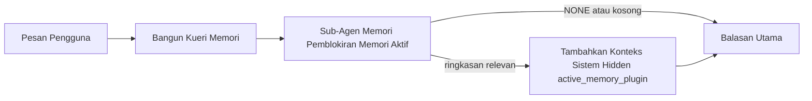

---
read_when:
    - Anda ingin memahami untuk apa memori aktif digunakan
    - Anda ingin mengaktifkan memori aktif untuk agen percakapan
    - Anda ingin menyesuaikan perilaku memori aktif tanpa mengaktifkannya di semua tempat
summary: Sub-agen memori pemblokiran milik plugin yang menyuntikkan memori yang relevan ke dalam sesi chat interaktif
title: Memori Aktif
x-i18n:
    generated_at: "2026-04-12T09:06:15Z"
    model: gpt-5.4
    provider: openai
    source_hash: 59456805c28daaab394ba2a7f87e1104a1334a5cf32dbb961d5d232d9c471d84
    source_path: concepts/active-memory.md
    workflow: 15
---

# Memori Aktif

Memori aktif adalah sub-agen memori pemblokiran milik plugin yang opsional dan berjalan
sebelum balasan utama untuk sesi percakapan yang memenuhi syarat.

Fitur ini ada karena sebagian besar sistem memori mampu tetapi reaktif. Sistem tersebut bergantung pada
agen utama untuk memutuskan kapan harus mencari memori, atau pada pengguna untuk mengatakan hal-hal
seperti "ingat ini" atau "cari memori." Pada saat itu, momen ketika memori seharusnya
membuat balasan terasa alami sudah terlewat.

Memori aktif memberi sistem satu kesempatan yang terbatas untuk menampilkan memori yang relevan
sebelum balasan utama dibuat.

## Tempelkan Ini ke Dalam Agen Anda

Tempelkan ini ke dalam agen Anda jika Anda ingin mengaktifkan Memori Aktif dengan
pengaturan mandiri yang aman secara default:

```json5
{
  plugins: {
    entries: {
      "active-memory": {
        enabled: true,
        config: {
          enabled: true,
          agents: ["main"],
          allowedChatTypes: ["direct"],
          modelFallback: "google/gemini-3-flash",
          queryMode: "recent",
          promptStyle: "balanced",
          timeoutMs: 15000,
          maxSummaryChars: 220,
          persistTranscripts: false,
          logging: true,
        },
      },
    },
  },
}
```

Ini menyalakan plugin untuk agen `main`, membatasinya ke sesi bergaya
pesan langsung secara default, memungkinkannya mewarisi model sesi saat ini terlebih dahulu, dan
menggunakan model fallback yang dikonfigurasi hanya jika tidak ada model eksplisit atau turunan yang tersedia.

Setelah itu, mulai ulang gateway:

```bash
openclaw gateway
```

Untuk memeriksanya secara langsung dalam sebuah percakapan:

```text
/verbose on
```

## Nyalakan memori aktif

Pengaturan paling aman adalah:

1. aktifkan plugin
2. targetkan satu agen percakapan
3. biarkan logging tetap aktif hanya saat penyesuaian

Mulailah dengan ini di `openclaw.json`:

```json5
{
  plugins: {
    entries: {
      "active-memory": {
        enabled: true,
        config: {
          agents: ["main"],
          allowedChatTypes: ["direct"],
          modelFallback: "google/gemini-3-flash",
          queryMode: "recent",
          promptStyle: "balanced",
          timeoutMs: 15000,
          maxSummaryChars: 220,
          persistTranscripts: false,
          logging: true,
        },
      },
    },
  },
}
```

Lalu mulai ulang gateway:

```bash
openclaw gateway
```

Artinya:

- `plugins.entries.active-memory.enabled: true` menyalakan plugin
- `config.agents: ["main"]` hanya mengikutsertakan agen `main` ke dalam memori aktif
- `config.allowedChatTypes: ["direct"]` membuat memori aktif hanya aktif untuk sesi bergaya pesan langsung secara default
- jika `config.model` tidak diatur, memori aktif mewarisi model sesi saat ini terlebih dahulu
- `config.modelFallback` secara opsional menyediakan provider/model fallback Anda sendiri untuk pengambilan memori
- `config.promptStyle: "balanced"` menggunakan gaya prompt tujuan umum default untuk mode `recent`
- memori aktif tetap hanya berjalan pada sesi chat interaktif persisten yang memenuhi syarat

## Cara melihatnya

Memori aktif menyuntikkan konteks sistem tersembunyi untuk model. Fitur ini tidak mengekspos
tag mentah `<active_memory_plugin>...</active_memory_plugin>` ke klien.

## Toggle sesi

Gunakan perintah plugin saat Anda ingin menjeda atau melanjutkan memori aktif untuk
sesi chat saat ini tanpa mengedit konfigurasi:

```text
/active-memory status
/active-memory off
/active-memory on
```

Ini berskala sesi. Ini tidak mengubah
`plugins.entries.active-memory.enabled`, penargetan agen, atau konfigurasi global
lainnya.

Jika Anda ingin perintah tersebut menulis konfigurasi dan menjeda atau melanjutkan memori aktif untuk
semua sesi, gunakan bentuk global yang eksplisit:

```text
/active-memory status --global
/active-memory off --global
/active-memory on --global
```

Bentuk global menulis `plugins.entries.active-memory.config.enabled`. Bentuk ini tetap membiarkan
`plugins.entries.active-memory.enabled` menyala agar perintah tetap tersedia untuk
menyalakan kembali memori aktif nanti.

Jika Anda ingin melihat apa yang dilakukan memori aktif dalam sesi langsung, nyalakan mode verbose
untuk sesi tersebut:

```text
/verbose on
```

Dengan verbose diaktifkan, OpenClaw dapat menampilkan:

- baris status memori aktif seperti `Active Memory: ok 842ms recent 34 chars`
- ringkasan debug yang mudah dibaca seperti `Active Memory Debug: Lemon pepper wings with blue cheese.`

Baris-baris tersebut berasal dari pass memori aktif yang sama yang memberi konteks
sistem tersembunyi, tetapi diformat untuk manusia alih-alih mengekspos markup prompt
mentah.

Secara default, transkrip sub-agen memori pemblokiran bersifat sementara dan dihapus
setelah proses selesai.

Contoh alur:

```text
/verbose on
sayap apa yang sebaiknya saya pesan?
```

Bentuk balasan yang terlihat dan diharapkan:

```text
...balasan asisten normal...

🧩 Active Memory: ok 842ms recent 34 chars
🔎 Active Memory Debug: Lemon pepper wings with blue cheese.
```

## Kapan fitur ini berjalan

Memori aktif menggunakan dua gerbang:

1. **Opt-in konfigurasi**
   Plugin harus diaktifkan, dan id agen saat ini harus muncul di
   `plugins.entries.active-memory.config.agents`.
2. **Kelayakan runtime yang ketat**
   Bahkan ketika diaktifkan dan ditargetkan, memori aktif hanya berjalan untuk sesi chat interaktif persisten yang memenuhi syarat.

Aturan sebenarnya adalah:

```text
plugin diaktifkan
+
id agen ditargetkan
+
jenis chat yang diizinkan
+
sesi chat interaktif persisten yang memenuhi syarat
=
memori aktif berjalan
```

Jika salah satu dari kondisi tersebut gagal, memori aktif tidak berjalan.

## Jenis sesi

`config.allowedChatTypes` mengontrol jenis percakapan mana yang dapat menjalankan Memori
Aktif sama sekali.

Nilai default adalah:

```json5
allowedChatTypes: ["direct"]
```

Artinya, Memori Aktif berjalan secara default dalam sesi bergaya pesan langsung, tetapi
tidak dalam sesi grup atau channel kecuali Anda secara eksplisit mengikutsertakannya.

Contoh:

```json5
allowedChatTypes: ["direct"]
```

```json5
allowedChatTypes: ["direct", "group"]
```

```json5
allowedChatTypes: ["direct", "group", "channel"]
```

## Di mana fitur ini berjalan

Memori aktif adalah fitur pengayaan percakapan, bukan fitur inferensi
di seluruh platform.

| Surface                                                             | Menjalankan memori aktif?                               |
| ------------------------------------------------------------------- | ------------------------------------------------------- |
| Sesi persisten Control UI / web chat                                | Ya, jika plugin diaktifkan dan agen ditargetkan         |
| Sesi channel interaktif lain pada jalur chat persisten yang sama    | Ya, jika plugin diaktifkan dan agen ditargetkan         |
| Proses headless one-shot                                            | Tidak                                                   |
| Proses heartbeat/latar belakang                                     | Tidak                                                   |
| Jalur internal `agent-command` generik                              | Tidak                                                   |
| Eksekusi sub-agen/helper internal                                   | Tidak                                                   |

## Mengapa menggunakannya

Gunakan memori aktif ketika:

- sesi bersifat persisten dan berhadapan dengan pengguna
- agen memiliki memori jangka panjang yang bermakna untuk dicari
- kesinambungan dan personalisasi lebih penting daripada determinisme prompt mentah

Fitur ini bekerja sangat baik untuk:

- preferensi yang stabil
- kebiasaan yang berulang
- konteks pengguna jangka panjang yang seharusnya muncul secara alami

Fitur ini kurang cocok untuk:

- otomatisasi
- worker internal
- tugas API one-shot
- tempat yang akan terasa mengejutkan jika ada personalisasi tersembunyi

## Cara kerjanya

Bentuk runtime-nya adalah:



Sub-agen memori pemblokiran hanya dapat menggunakan:

- `memory_search`
- `memory_get`

Jika koneksinya lemah, sub-agen harus mengembalikan `NONE`.

## Mode kueri

`config.queryMode` mengontrol seberapa banyak percakapan yang dilihat sub-agen memori pemblokiran.

## Gaya prompt

`config.promptStyle` mengontrol seberapa agresif atau ketat sub-agen memori pemblokiran
saat memutuskan apakah akan mengembalikan memori.

Gaya yang tersedia:

- `balanced`: default tujuan umum untuk mode `recent`
- `strict`: paling tidak agresif; terbaik ketika Anda ingin sangat sedikit kebocoran dari konteks terdekat
- `contextual`: paling ramah kesinambungan; terbaik ketika riwayat percakapan perlu lebih diperhatikan
- `recall-heavy`: lebih bersedia menampilkan memori pada kecocokan yang lebih lemah tetapi masih masuk akal
- `precision-heavy`: sangat memilih `NONE` kecuali kecocokannya jelas
- `preference-only`: dioptimalkan untuk favorit, kebiasaan, rutinitas, selera, dan fakta pribadi yang berulang

Pemetaan default saat `config.promptStyle` tidak diatur:

```text
message -> strict
recent -> balanced
full -> contextual
```

Jika Anda mengatur `config.promptStyle` secara eksplisit, override tersebut yang berlaku.

Contoh:

```json5
promptStyle: "preference-only"
```

## Kebijakan fallback model

Jika `config.model` tidak diatur, Memori Aktif mencoba menyelesaikan model dalam urutan ini:

```text
model plugin eksplisit
-> model sesi saat ini
-> model utama agen
-> model fallback terkonfigurasi opsional
```

`config.modelFallback` mengontrol langkah fallback terkonfigurasi tersebut.

Fallback kustom opsional:

```json5
modelFallback: "google/gemini-3-flash"
```

Jika tidak ada model fallback eksplisit, turunan, atau terkonfigurasi yang dapat diselesaikan, Memori Aktif
melewati pengambilan memori untuk giliran itu.

`config.modelFallbackPolicy` dipertahankan hanya sebagai field kompatibilitas usang
untuk konfigurasi lama. Field ini tidak lagi mengubah perilaku runtime.

## Escape hatch lanjutan

Opsi-opsi ini sengaja tidak menjadi bagian dari pengaturan yang direkomendasikan.

`config.thinking` dapat mengganti tingkat thinking sub-agen memori pemblokiran:

```json5
thinking: "medium"
```

Default:

```json5
thinking: "off"
```

Jangan aktifkan ini secara default. Memori Aktif berjalan di jalur balasan, jadi waktu
thinking tambahan secara langsung meningkatkan latensi yang terlihat oleh pengguna.

`config.promptAppend` menambahkan instruksi operator tambahan setelah prompt Memori
Aktif default dan sebelum konteks percakapan:

```json5
promptAppend: "Utamakan preferensi jangka panjang yang stabil daripada kejadian satu kali."
```

`config.promptOverride` menggantikan prompt Memori Aktif default. OpenClaw
tetap menambahkan konteks percakapan setelahnya:

```json5
promptOverride: "Anda adalah agen pencarian memori. Kembalikan NONE atau satu fakta pengguna yang ringkas."
```

Kustomisasi prompt tidak direkomendasikan kecuali Anda secara sengaja menguji
kontrak pengambilan memori yang berbeda. Prompt default disetel untuk mengembalikan `NONE`
atau konteks fakta pengguna yang ringkas untuk model utama.

### `message`

Hanya pesan pengguna terbaru yang dikirim.

```text
Hanya pesan pengguna terbaru
```

Gunakan ini ketika:

- Anda menginginkan perilaku tercepat
- Anda menginginkan bias terkuat terhadap pengambilan preferensi yang stabil
- giliran tindak lanjut tidak memerlukan konteks percakapan

Timeout yang direkomendasikan:

- mulai di sekitar `3000` hingga `5000` ms

### `recent`

Pesan pengguna terbaru ditambah ekor percakapan terbaru yang kecil akan dikirim.

```text
Ekor percakapan terbaru:
user: ...
assistant: ...
user: ...

Pesan pengguna terbaru:
...
```

Gunakan ini ketika:

- Anda menginginkan keseimbangan yang lebih baik antara kecepatan dan landasan percakapan
- pertanyaan tindak lanjut sering bergantung pada beberapa giliran terakhir

Timeout yang direkomendasikan:

- mulai di sekitar `15000` ms

### `full`

Percakapan penuh dikirim ke sub-agen memori pemblokiran.

```text
Konteks percakapan penuh:
user: ...
assistant: ...
user: ...
...
```

Gunakan ini ketika:

- kualitas pengambilan memori yang paling kuat lebih penting daripada latensi
- percakapan berisi pengaturan penting yang berada jauh di belakang dalam utas

Timeout yang direkomendasikan:

- tingkatkan secara signifikan dibandingkan dengan `message` atau `recent`
- mulai di sekitar `15000` ms atau lebih tinggi tergantung ukuran utas

Secara umum, timeout harus meningkat seiring ukuran konteks:

```text
message < recent < full
```

## Persistensi transkrip

Proses sub-agen memori pemblokiran memori aktif membuat transkrip `session.jsonl` sungguhan selama panggilan sub-agen memori pemblokiran.

Secara default, transkrip tersebut bersifat sementara:

- ditulis ke direktori temp
- hanya digunakan untuk proses sub-agen memori pemblokiran
- dihapus segera setelah proses selesai

Jika Anda ingin menyimpan transkrip sub-agen memori pemblokiran tersebut di disk untuk debugging atau
inspeksi, aktifkan persistensi secara eksplisit:

```json5
{
  plugins: {
    entries: {
      "active-memory": {
        enabled: true,
        config: {
          agents: ["main"],
          persistTranscripts: true,
          transcriptDir: "active-memory",
        },
      },
    },
  },
}
```

Saat diaktifkan, memori aktif menyimpan transkrip di direktori terpisah di bawah
folder sesi agen target, bukan di jalur transkrip percakapan pengguna utama.

Tata letak default secara konseptual adalah:

```text
agents/<agent>/sessions/active-memory/<blocking-memory-sub-agent-session-id>.jsonl
```

Anda dapat mengubah subdirektori relatif dengan `config.transcriptDir`.

Gunakan ini dengan hati-hati:

- transkrip sub-agen memori pemblokiran dapat menumpuk dengan cepat pada sesi yang sibuk
- mode kueri `full` dapat menduplikasi banyak konteks percakapan
- transkrip ini berisi konteks prompt tersembunyi dan memori yang diambil kembali

## Konfigurasi

Semua konfigurasi memori aktif berada di bawah:

```text
plugins.entries.active-memory
```

Field yang paling penting adalah:

| Key                         | Type                                                                                                 | Arti                                                                                                   |
| --------------------------- | ---------------------------------------------------------------------------------------------------- | ------------------------------------------------------------------------------------------------------ |
| `enabled`                   | `boolean`                                                                                            | Mengaktifkan plugin itu sendiri                                                                        |
| `config.agents`             | `string[]`                                                                                           | ID agen yang dapat menggunakan memori aktif                                                            |
| `config.model`              | `string`                                                                                             | Ref model sub-agen memori pemblokiran opsional; jika tidak diatur, memori aktif menggunakan model sesi saat ini |
| `config.queryMode`          | `"message" \| "recent" \| "full"`                                                                    | Mengontrol seberapa banyak percakapan yang dilihat sub-agen memori pemblokiran                        |
| `config.promptStyle`        | `"balanced" \| "strict" \| "contextual" \| "recall-heavy" \| "precision-heavy" \| "preference-only"` | Mengontrol seberapa agresif atau ketat sub-agen memori pemblokiran saat memutuskan apakah akan mengembalikan memori |
| `config.thinking`           | `"off" \| "minimal" \| "low" \| "medium" \| "high" \| "xhigh" \| "adaptive"`                         | Override thinking lanjutan untuk sub-agen memori pemblokiran; default `off` untuk kecepatan          |
| `config.promptOverride`     | `string`                                                                                             | Penggantian prompt penuh lanjutan; tidak direkomendasikan untuk penggunaan normal                     |
| `config.promptAppend`       | `string`                                                                                             | Instruksi tambahan lanjutan yang ditambahkan ke prompt default atau prompt yang dioverride            |
| `config.timeoutMs`          | `number`                                                                                             | Timeout keras untuk sub-agen memori pemblokiran                                                       |
| `config.maxSummaryChars`    | `number`                                                                                             | Jumlah total karakter maksimum yang diizinkan dalam ringkasan active-memory                           |
| `config.logging`            | `boolean`                                                                                            | Mengeluarkan log memori aktif saat penyesuaian                                                        |
| `config.persistTranscripts` | `boolean`                                                                                            | Menyimpan transkrip sub-agen memori pemblokiran di disk alih-alih menghapus file temp                |
| `config.transcriptDir`      | `string`                                                                                             | Direktori transkrip sub-agen memori pemblokiran relatif di bawah folder sesi agen                     |

Field penyesuaian yang berguna:

| Key                           | Type     | Arti                                                         |
| ----------------------------- | -------- | ------------------------------------------------------------ |
| `config.maxSummaryChars`      | `number` | Jumlah total karakter maksimum yang diizinkan dalam ringkasan active-memory |
| `config.recentUserTurns`      | `number` | Giliran pengguna sebelumnya yang disertakan saat `queryMode` adalah `recent` |
| `config.recentAssistantTurns` | `number` | Giliran asisten sebelumnya yang disertakan saat `queryMode` adalah `recent` |
| `config.recentUserChars`      | `number` | Karakter maksimum per giliran pengguna terbaru               |
| `config.recentAssistantChars` | `number` | Karakter maksimum per giliran asisten terbaru                |
| `config.cacheTtlMs`           | `number` | Penggunaan ulang cache untuk kueri identik yang berulang     |

## Pengaturan yang direkomendasikan

Mulailah dengan `recent`.

```json5
{
  plugins: {
    entries: {
      "active-memory": {
        enabled: true,
        config: {
          agents: ["main"],
          queryMode: "recent",
          promptStyle: "balanced",
          timeoutMs: 15000,
          maxSummaryChars: 220,
          logging: true,
        },
      },
    },
  },
}
```

Jika Anda ingin memeriksa perilaku langsung saat menyesuaikan, gunakan `/verbose on` di
sesi tersebut alih-alih mencari perintah debug active-memory terpisah.

Lalu beralih ke:

- `message` jika Anda menginginkan latensi yang lebih rendah
- `full` jika Anda memutuskan konteks tambahan layak untuk sub-agen memori pemblokiran yang lebih lambat

## Debugging

Jika memori aktif tidak muncul di tempat yang Anda harapkan:

1. Pastikan plugin diaktifkan di bawah `plugins.entries.active-memory.enabled`.
2. Pastikan ID agen saat ini tercantum di `config.agents`.
3. Pastikan Anda menguji melalui sesi chat interaktif persisten.
4. Aktifkan `config.logging: true` dan pantau log gateway.
5. Verifikasi bahwa pencarian memori itu sendiri berfungsi dengan `openclaw memory status --deep`.

Jika hasil memori terlalu berisik, perketat:

- `maxSummaryChars`

Jika memori aktif terlalu lambat:

- turunkan `queryMode`
- turunkan `timeoutMs`
- kurangi jumlah giliran terbaru
- kurangi batas karakter per giliran

## Halaman terkait

- [Pencarian Memori](/id/concepts/memory-search)
- [Referensi konfigurasi memori](/id/reference/memory-config)
- [Penyiapan Plugin SDK](/id/plugins/sdk-setup)
