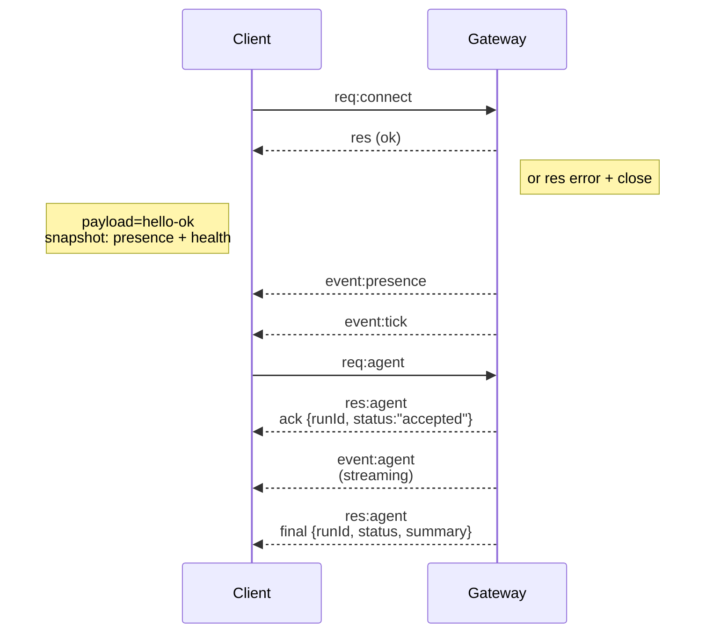

---
read_when:
    - Sedang mengerjakan protokol gateway, klien, atau transport
summary: Arsitektur gateway WebSocket, komponen, dan alur klien
title: Arsitektur Gateway
x-i18n:
    generated_at: "2026-04-05T13:50:52Z"
    model: gpt-5.4
    provider: openai
    source_hash: 2b12a2a29e94334c6d10787ac85c34b5b046f9a14f3dd53be453368ca4a7547d
    source_path: concepts/architecture.md
    workflow: 15
---

# Arsitektur gateway

## Gambaran umum

- Satu **Gateway** jangka panjang memiliki semua permukaan perpesanan (WhatsApp melalui
  Baileys, Telegram melalui grammY, Slack, Discord, Signal, iMessage, WebChat).
- Klien control-plane (app macOS, CLI, UI web, automasi) terhubung ke
  Gateway melalui **WebSocket** pada host bind yang dikonfigurasi (default
  `127.0.0.1:18789`).
- **Node** (macOS/iOS/Android/headless) juga terhubung melalui **WebSocket**, tetapi
  mendeklarasikan `role: node` dengan kapabilitas/perintah yang eksplisit.
- Satu Gateway per host; ini adalah satu-satunya tempat yang membuka sesi WhatsApp.
- **Canvas host** disajikan oleh server HTTP Gateway di bawah:
  - `/__openclaw__/canvas/` (HTML/CSS/JS yang dapat diedit agen)
  - `/__openclaw__/a2ui/` (host A2UI)
    Ini menggunakan port yang sama dengan Gateway (default `18789`).

## Komponen dan alur

### Gateway (daemon)

- Memelihara koneksi penyedia.
- Mengekspos API WS bertipe (permintaan, respons, event server-push).
- Memvalidasi frame masuk terhadap JSON Schema.
- Menghasilkan event seperti `agent`, `chat`, `presence`, `health`, `heartbeat`, `cron`.

### Klien (app mac / CLI / admin web)

- Satu koneksi WS per klien.
- Mengirim permintaan (`health`, `status`, `send`, `agent`, `system-presence`).
- Berlangganan ke event (`tick`, `agent`, `presence`, `shutdown`).

### Node (macOS / iOS / Android / headless)

- Terhubung ke **server WS yang sama** dengan `role: node`.
- Menyediakan identitas perangkat di `connect`; pairing bersifat **berbasis perangkat** (role `node`) dan
  persetujuan disimpan di penyimpanan pairing perangkat.
- Mengekspos perintah seperti `canvas.*`, `camera.*`, `screen.record`, `location.get`.

Detail protokol:

- [Protokol Gateway](/gateway/protocol)

### WebChat

- UI statis yang menggunakan API WS Gateway untuk riwayat chat dan pengiriman.
- Dalam penyiapan jarak jauh, terhubung melalui tunnel SSH/Tailscale yang sama seperti
  klien lainnya.

## Siklus hidup koneksi (satu klien)



## Protokol wire (ringkasan)

- Transport: WebSocket, frame teks dengan payload JSON.
- Frame pertama **harus** `connect`.
- Setelah handshake:
  - Permintaan: `{type:"req", id, method, params}` → `{type:"res", id, ok, payload|error}`
  - Event: `{type:"event", event, payload, seq?, stateVersion?}`
- `hello-ok.features.methods` / `events` adalah metadata discovery, bukan
  dump terhasilkan dari setiap rute helper yang dapat dipanggil.
- Auth shared-secret menggunakan `connect.params.auth.token` atau
  `connect.params.auth.password`, tergantung mode auth gateway yang dikonfigurasi.
- Mode yang membawa identitas seperti Tailscale Serve
  (`gateway.auth.allowTailscale: true`) atau non-loopback
  `gateway.auth.mode: "trusted-proxy"` memenuhi auth dari header permintaan
  alih-alih `connect.params.auth.*`.
- Private-ingress `gateway.auth.mode: "none"` menonaktifkan auth shared-secret
  sepenuhnya; jangan gunakan mode itu pada ingress publik/tidak tepercaya.
- Kunci idempotensi diperlukan untuk metode yang memiliki efek samping (`send`, `agent`) agar
  aman untuk dicoba ulang; server menyimpan cache deduplikasi berumur pendek.
- Node harus menyertakan `role: "node"` beserta kapabilitas/perintah/izin di `connect`.

## Pairing + kepercayaan lokal

- Semua klien WS (operator + node) menyertakan **identitas perangkat** pada `connect`.
- ID perangkat baru memerlukan persetujuan pairing; Gateway mengeluarkan **token perangkat**
  untuk koneksi berikutnya.
- Koneksi local loopback langsung dapat disetujui otomatis agar UX host yang sama tetap
  lancar.
- OpenClaw juga memiliki jalur self-connect backend/container-local yang sempit untuk
  alur helper shared-secret tepercaya.
- Koneksi tailnet dan LAN, termasuk bind tailnet host yang sama, tetap memerlukan
  persetujuan pairing eksplisit.
- Semua koneksi harus menandatangani nonce `connect.challenge`.
- Payload tanda tangan `v3` juga mengikat `platform` + `deviceFamily`; gateway
  menyematkan metadata yang dipairkan saat reconnect dan memerlukan repair pairing untuk
  perubahan metadata.
- Koneksi **non-lokal** tetap memerlukan persetujuan eksplisit.
- Auth gateway (`gateway.auth.*`) tetap berlaku untuk **semua** koneksi, lokal maupun
  jarak jauh.

Detail: [Protokol Gateway](/gateway/protocol), [Pairing](/id/channels/pairing),
[Keamanan](/gateway/security).

## Pengetikan protokol dan codegen

- Skema TypeBox mendefinisikan protokol.
- JSON Schema dihasilkan dari skema tersebut.
- Model Swift dihasilkan dari JSON Schema.

## Akses jarak jauh

- Disarankan: Tailscale atau VPN.
- Alternatif: tunnel SSH

  ```bash
  ssh -N -L 18789:127.0.0.1:18789 user@host
  ```

- Handshake + token auth yang sama berlaku melalui tunnel.
- TLS + pinning opsional dapat diaktifkan untuk WS dalam penyiapan jarak jauh.

## Ringkasan operasional

- Mulai: `openclaw gateway` (foreground, log ke stdout).
- Kesehatan: `health` melalui WS (juga disertakan dalam `hello-ok`).
- Supervisi: launchd/systemd untuk restart otomatis.

## Invarian

- Tepat satu Gateway mengontrol satu sesi Baileys per host.
- Handshake wajib; frame pertama yang bukan JSON atau bukan connect akan menyebabkan hard close.
- Event tidak diputar ulang; klien harus me-refresh saat ada gap.

## Terkait

- [Agent Loop](/concepts/agent-loop) — siklus eksekusi agen secara terperinci
- [Gateway Protocol](/gateway/protocol) — kontrak protokol WebSocket
- [Queue](/concepts/queue) — antrean perintah dan konkurensi
- [Security](/gateway/security) — model kepercayaan dan hardening
