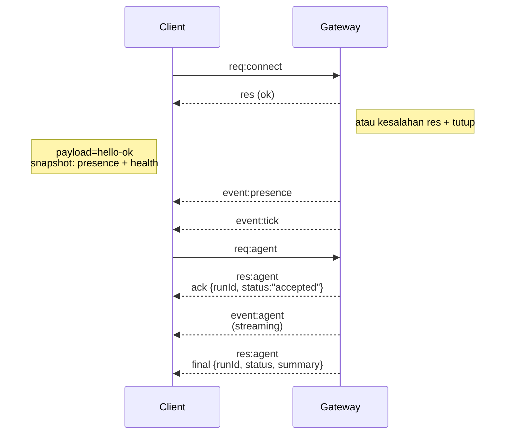

---
read_when:
    - Mengerjakan protokol Gateway, klien, atau transportasi
summary: Arsitektur, komponen, dan alur klien Gateway WebSocket
title: Arsitektur Gateway
x-i18n:
    generated_at: "2026-07-12T14:04:16Z"
    model: gpt-5.6
    postprocess_version: locale-links-v1
    provider: openai
    source_hash: f8054bd87f738b957c24f8d6965d55365de2293d44902530a9ba778afa597cc7
    source_path: concepts/architecture.md
    workflow: 16
---

## Ikhtisar

- Satu **Gateway** berumur panjang mengelola semua sarana perpesanan (WhatsApp melalui
  Baileys, Telegram melalui grammY, Slack, Discord, Signal, iMessage, WebChat).
- Klien bidang kontrol (aplikasi macOS, CLI, UI web, otomatisasi) terhubung ke
  Gateway melalui **WebSocket** pada host pengikatan yang dikonfigurasi (bawaan
  `127.0.0.1:18789`).
- **Node** (macOS/iOS/Android/headless) juga terhubung melalui **WebSocket**, tetapi
  mendeklarasikan `role: node` dengan kapabilitas/perintah eksplisit.
- Satu Gateway per host; Gateway adalah satu-satunya tempat yang membuka sesi WhatsApp.
- **Host kanvas** disajikan oleh server HTTP Gateway pada:
  - `/__openclaw__/canvas/` (HTML/CSS/JS yang dapat diedit agen)
  - `/__openclaw__/a2ui/` (host A2UI)

  Host ini menggunakan porta yang sama dengan Gateway (bawaan `18789`).

## Komponen dan alur

### Gateway (daemon)

- Memelihara koneksi penyedia.
- Menyediakan API WS bertipe (permintaan, respons, peristiwa dorong-server).
- Memvalidasi bingkai masuk terhadap JSON Schema.
- Memancarkan peristiwa seperti `agent`, `chat`, `presence`, `health`, `heartbeat`, `cron`.

### Klien (aplikasi Mac / CLI / admin web)

- Satu koneksi WS per klien.
- Mengirim permintaan (`health`, `status`, `send`, `agent`, `system-presence`).
- Berlangganan peristiwa (`tick`, `agent`, `presence`, `shutdown`).

### Node (macOS / iOS / Android / headless)

- Terhubung ke **server WS yang sama** dengan `role: node`.
- Menyediakan identitas perangkat dalam `connect`; pemasangan **berbasis perangkat** (peran `node`) dan
  persetujuan disimpan dalam penyimpanan pemasangan perangkat.
- Menyediakan perintah seperti `canvas.*`, `camera.*`, `screen.record`, `location.get`.

Detail protokol: [Protokol Gateway](/id/gateway/protocol)

### WebChat

- UI statis yang menggunakan API WS Gateway untuk riwayat percakapan dan pengiriman.
- Dalam penyiapan jarak jauh, terhubung melalui terowongan SSH/Tailscale yang sama seperti
  klien lainnya.

## Siklus hidup koneksi (klien tunggal)



## Protokol komunikasi (ringkasan)

- Transpor: WebSocket, bingkai teks dengan muatan JSON.
- Bingkai pertama **harus** berupa `connect`.
- Setelah jabat tangan:
  - Permintaan: `{type:"req", id, method, params}` → `{type:"res", id, ok, payload|error}`
  - Peristiwa: `{type:"event", event, payload, seq?, stateVersion?}`
- `hello-ok.features.methods` / `events` adalah metadata penemuan, bukan
  hasil pembuatan yang memuat setiap rute pembantu yang dapat dipanggil.
- Autentikasi rahasia bersama menggunakan `connect.params.auth.token` atau
  `connect.params.auth.password`, bergantung pada mode autentikasi Gateway yang dikonfigurasi.
- Mode yang membawa identitas seperti Tailscale Serve
  (`gateway.auth.allowTailscale: true`) atau
  `gateway.auth.mode: "trusted-proxy"` non-loopback memenuhi autentikasi dari header permintaan
  alih-alih `connect.params.auth.*`.
- `gateway.auth.mode: "none"` untuk akses masuk privat menonaktifkan autentikasi rahasia bersama
  sepenuhnya; jangan gunakan mode tersebut pada akses masuk publik/tidak tepercaya.
- Kunci idempotensi diwajibkan untuk metode yang menimbulkan efek samping (`send`, `agent`) agar
  dapat dicoba ulang dengan aman; server menyimpan singgahan deduplikasi berumur pendek.
- Node harus menyertakan `role: "node"` beserta kapabilitas/perintah/izin dalam `connect`.

## Pemasangan dan kepercayaan lokal

- Semua klien WS (operator + Node) menyertakan **identitas perangkat** saat `connect`.
- ID perangkat baru memerlukan persetujuan pemasangan; Gateway menerbitkan **token perangkat**
  untuk koneksi berikutnya.
- Koneksi local loopback langsung dapat disetujui secara otomatis agar pengalaman pengguna
  pada host yang sama tetap lancar.
- OpenClaw juga memiliki jalur koneksi mandiri sempit yang bersifat lokal untuk backend/kontainer
  bagi alur pembantu rahasia bersama tepercaya.
- Koneksi tailnet dan LAN, termasuk pengikatan tailnet pada host yang sama, tetap memerlukan
  persetujuan pemasangan eksplisit.
- Semua koneksi harus menandatangani nonce `connect.challenge`. Muatan tanda tangan `v3`
  juga mengikat `platform` dan `deviceFamily`; Gateway mengunci metadata yang dipasangkan saat
  koneksi ulang dan mewajibkan pemasangan perbaikan untuk perubahan metadata.
- Koneksi **nonlokal** tetap memerlukan persetujuan eksplisit.
- Autentikasi Gateway (`gateway.auth.*`) tetap berlaku untuk **semua** koneksi, baik lokal maupun
  jarak jauh.

Detail: [Protokol Gateway](/id/gateway/protocol), [Pemasangan](/id/channels/pairing),
[Keamanan](/id/gateway/security).

## Pengetikan protokol dan pembuatan kode

- Skema TypeBox mendefinisikan protokol.
- JSON Schema dihasilkan dari skema tersebut.
- Model Swift dihasilkan dari JSON Schema.

## Akses jarak jauh

- Disarankan: Tailscale atau VPN.
- Alternatif: terowongan SSH

  ```bash
  ssh -N -L 18789:127.0.0.1:18789 user@gateway-host
  ```

- Jabat tangan + token autentikasi yang sama berlaku melalui terowongan.
- TLS + penyematan opsional dapat diaktifkan untuk WS dalam penyiapan jarak jauh.

## Ringkasan operasional

- Mulai: `openclaw gateway` (latar depan, log ke stdout).
- Kesehatan: `health` melalui WS (juga disertakan dalam `hello-ok`).
- Supervisi: launchd/systemd untuk mulai ulang otomatis.

## Invarian

- Tepat satu Gateway mengendalikan satu sesi Baileys per host.
- Jabat tangan wajib; bingkai pertama yang bukan JSON atau bukan `connect` akan menyebabkan penutupan paksa.
- Peristiwa tidak diputar ulang; klien harus menyegarkan ketika terdapat celah.

## Terkait

- [Perulangan Agen](/id/concepts/agent-loop) — siklus eksekusi agen secara mendetail
- [Protokol Gateway](/id/gateway/protocol) — kontrak protokol WebSocket
- [Antrean](/id/concepts/queue) — antrean perintah dan konkurensi
- [Keamanan](/id/gateway/security) — model kepercayaan dan penguatan
