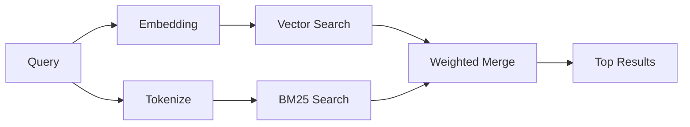

---
read_when:
    - Anda ingin memahami cara kerja memory_search
    - Anda ingin memilih penyedia embedding
    - Anda ingin menyetel kualitas pencarian
summary: Cara pencarian memori menemukan catatan yang relevan menggunakan embedding dan pengambilan hibrida
title: Pencarian memori
x-i18n:
    generated_at: "2026-06-27T17:24:37Z"
    model: gpt-5.5
    postprocess_version: locale-links-v1
    provider: openai
    source_hash: b0bcb8cf400100ba8b6ddbb46bdf8b2a89a8bc32a550ee6df47c874e7e9e0879
    source_path: concepts/memory-search.md
    workflow: 16
---

`memory_search` menemukan catatan yang relevan dari file memori Anda, bahkan ketika
susunan katanya berbeda dari teks asli. Ini bekerja dengan mengindeks memori menjadi
potongan kecil dan mencarinya menggunakan embedding, kata kunci, atau keduanya.

## Mulai cepat

Pencarian memori menggunakan embedding OpenAI secara default. Untuk menggunakan
backend embedding lain, tetapkan penyedia secara eksplisit:

```json5
{
  agents: {
    defaults: {
      memorySearch: {
        provider: "openai", // or "gemini", "local", "ollama", "openai-compatible", etc.
      },
    },
  },
}
```

Untuk penyiapan multi-endpoint dengan penyedia khusus memori, `provider` juga dapat
berupa entri `models.providers.<id>` kustom, seperti `ollama-5080`, ketika
penyedia tersebut menetapkan `api: "ollama"` atau pemilik adaptor embedding memori lain.

Untuk embedding lokal tanpa kunci API, instal
`@openclaw/llama-cpp-provider` dan tetapkan `provider: "local"`. Checkout sumber
mungkin masih memerlukan persetujuan build native: `pnpm approve-builds` lalu
`pnpm rebuild node-llama-cpp`.

Beberapa endpoint embedding yang kompatibel dengan OpenAI memerlukan label asimetris seperti
`input_type: "query"` untuk pencarian dan `input_type: "document"` atau `"passage"`
untuk potongan yang diindeks. Konfigurasikan dengan `memorySearch.queryInputType` dan
`memorySearch.documentInputType`; lihat [Referensi konfigurasi memori](/id/reference/memory-config#provider-specific-config).

## Penyedia yang didukung

| Penyedia          | ID                  | Memerlukan kunci API | Catatan                         |
| ----------------- | ------------------- | ------------- | ----------------------------- |
| Bedrock           | `bedrock`           | Tidak            | Menggunakan rantai kredensial AWS     |
| DeepInfra         | `deepinfra`         | Ya           | Default: `BAAI/bge-m3`        |
| Gemini            | `gemini`            | Ya           | Mendukung pengindeksan gambar/audio |
| GitHub Copilot    | `github-copilot`    | Tidak            | Menggunakan langganan Copilot     |
| Lokal             | `local`             | Tidak            | Model GGUF, unduhan ~0,6 GB  |
| Mistral           | `mistral`           | Ya           |                               |
| Ollama            | `ollama`            | Tidak            | Lokal/self-hosted             |
| OpenAI            | `openai`            | Ya           | Default                       |
| Kompatibel dengan OpenAI | `openai-compatible` | Biasanya       | `/v1/embeddings` generik      |
| Voyage            | `voyage`            | Ya           |                               |

## Cara kerja pencarian

OpenClaw menjalankan dua jalur pengambilan secara paralel dan menggabungkan hasilnya:



- **Pencarian vektor** menemukan catatan dengan makna serupa ("gateway host" cocok dengan
  "the machine running OpenClaw").
- **Pencarian kata kunci BM25** menemukan kecocokan persis (ID, string error, kunci
  konfigurasi).

Jika hanya satu jalur yang tersedia, jalur lainnya berjalan sendiri. Mode khusus FTS saja
(`provider: "none"`) dan pemilihan penyedia otomatis/default tetap dapat menggunakan
pemeringkatan leksikal ketika embedding tidak tersedia.

Penyedia embedding non-lokal yang eksplisit berbeda. Jika Anda menetapkan
`memorySearch.provider` ke penyedia konkret yang didukung remote dan penyedia tersebut
tidak tersedia saat runtime, `memory_search` melaporkan memori sebagai tidak tersedia alih-alih
diam-diam menggunakan hasil FTS saja. Ini membuat penyedia semantik yang dikonfigurasi tetapi rusak
tetap terlihat. Tetapkan `provider: "none"` untuk recall FTS saja secara sengaja, atau perbaiki
konfigurasi penyedia/autentikasi untuk memulihkan pemeringkatan semantik.

## Meningkatkan kualitas pencarian

Dua fitur opsional membantu saat Anda memiliki riwayat catatan yang besar:

### Peluruhan temporal

Catatan lama secara bertahap kehilangan bobot peringkat sehingga informasi terbaru muncul lebih dulu.
Dengan half-life default 30 hari, catatan dari bulan lalu mendapat skor 50% dari
bobot aslinya. File yang selalu relevan seperti `MEMORY.md` tidak pernah diluruhkan.

<Tip>
Aktifkan peluruhan temporal jika agen Anda memiliki catatan harian selama berbulan-bulan dan informasi
usang terus mengungguli konteks terbaru.
</Tip>

### MMR (keragaman)

Mengurangi hasil yang berulang. Jika lima catatan semuanya menyebut konfigurasi router yang sama, MMR
memastikan hasil teratas mencakup topik yang berbeda, bukan pengulangan.

<Tip>
Aktifkan MMR jika `memory_search` terus mengembalikan cuplikan yang hampir duplikat dari
catatan harian yang berbeda.
</Tip>

### Aktifkan keduanya

```json5
{
  agents: {
    defaults: {
      memorySearch: {
        query: {
          hybrid: {
            mmr: { enabled: true },
            temporalDecay: { enabled: true },
          },
        },
      },
    },
  },
}
```

## Memori multimodal

Dengan Gemini Embedding 2, Anda dapat mengindeks gambar dan file audio bersama
Markdown. Kueri pencarian tetap berupa teks, tetapi cocok dengan konten visual dan audio.
Lihat [Referensi konfigurasi memori](/id/reference/memory-config) untuk penyiapan.

## Pencarian memori sesi

Anda dapat secara opsional mengindeks transkrip sesi sehingga `memory_search` dapat mengingat
percakapan sebelumnya. Ini bersifat opt-in melalui
`memorySearch.experimental.sessionMemory`. Lihat
[referensi konfigurasi](/id/reference/memory-config) untuk detail.

## Pemecahan masalah

**Tidak ada hasil?** Jalankan `openclaw memory status` untuk memeriksa indeks. Jika kosong, jalankan
`openclaw memory index --force`.

**Hanya kecocokan kata kunci?** Penyedia embedding Anda mungkin belum dikonfigurasi. Periksa
`openclaw memory status --deep`.

**Embedding lokal timeout?** `ollama`, `lmstudio`, dan `local` menggunakan timeout batch inline
yang lebih panjang secara default. Jika host memang lambat, tetapkan
`agents.defaults.memorySearch.sync.embeddingBatchTimeoutSeconds` dan jalankan ulang
`openclaw memory index --force`.

**Teks CJK tidak ditemukan?** Bangun ulang indeks FTS dengan
`openclaw memory index --force`.

## Bacaan lanjutan

- [Active Memory](/id/concepts/active-memory) -- memori sub-agen untuk sesi chat interaktif
- [Memori](/id/concepts/memory) -- tata letak file, backend, alat
- [Referensi konfigurasi memori](/id/reference/memory-config) -- semua kenop konfigurasi

## Terkait

- [Ringkasan memori](/id/concepts/memory)
- [Active Memory](/id/concepts/active-memory)
- [Mesin memori bawaan](/id/concepts/memory-builtin)
