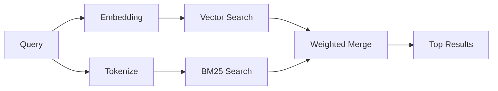

---
read_when:
    - Anda ingin memahami cara kerja memory_search
    - Anda ingin memilih provider embedding
    - Anda ingin menyetel kualitas pencarian
summary: Bagaimana pencarian memory menemukan catatan yang relevan menggunakan embedding dan retrieval hibrida
title: Pencarian memory
x-i18n:
    generated_at: "2026-04-24T09:04:31Z"
    model: gpt-5.4
    provider: openai
    source_hash: 04db62e519a691316ce40825c082918094bcaa9c36042cc8101c6504453d238e
    source_path: concepts/memory-search.md
    workflow: 15
---

`memory_search` menemukan catatan yang relevan dari file memory Anda, bahkan saat
susunan katanya berbeda dari teks aslinya. Ini bekerja dengan mengindeks memory ke dalam
potongan-potongan kecil dan mencarinya menggunakan embedding, kata kunci, atau keduanya.

## Mulai cepat

Jika Anda memiliki langganan GitHub Copilot, OpenAI, Gemini, Voyage, atau Mistral
API key yang dikonfigurasi, pencarian memory akan berfungsi secara otomatis. Untuk mengatur provider
secara eksplisit:

```json5
{
  agents: {
    defaults: {
      memorySearch: {
        provider: "openai", // atau "gemini", "local", "ollama", dll.
      },
    },
  },
}
```

Untuk embedding lokal tanpa API key, gunakan `provider: "local"` (memerlukan
node-llama-cpp).

## Provider yang didukung

| Provider       | ID               | Perlu API key | Catatan                                             |
| -------------- | ---------------- | ------------- | --------------------------------------------------- |
| Bedrock        | `bedrock`        | Tidak         | Terdeteksi otomatis saat rantai kredensial AWS berhasil di-resolve |
| Gemini         | `gemini`         | Ya            | Mendukung pengindeksan gambar/audio                 |
| GitHub Copilot | `github-copilot` | Tidak         | Terdeteksi otomatis, menggunakan langganan Copilot  |
| Local          | `local`          | Tidak         | Model GGUF, unduhan ~0.6 GB                         |
| Mistral        | `mistral`        | Ya            | Terdeteksi otomatis                                 |
| Ollama         | `ollama`         | Tidak         | Lokal, harus diatur secara eksplisit                |
| OpenAI         | `openai`         | Ya            | Terdeteksi otomatis, cepat                          |
| Voyage         | `voyage`         | Ya            | Terdeteksi otomatis                                 |

## Cara kerja pencarian

OpenClaw menjalankan dua jalur retrieval secara paralel dan menggabungkan hasilnya:



- **Pencarian vektor** menemukan catatan dengan makna yang serupa ("gateway host" cocok dengan
  "mesin yang menjalankan OpenClaw").
- **Pencarian kata kunci BM25** menemukan kecocokan persis (ID, string error, config
  key).

Jika hanya satu jalur yang tersedia (tidak ada embedding atau tidak ada FTS), jalur lainnya berjalan sendiri.

Saat embedding tidak tersedia, OpenClaw tetap menggunakan pemeringkatan leksikal atas hasil FTS alih-alih hanya fallback ke pengurutan kecocokan persis mentah. Mode terdegradasi itu meningkatkan peringkat potongan dengan cakupan istilah kueri yang lebih kuat dan path file yang relevan, sehingga recall tetap berguna bahkan tanpa `sqlite-vec` atau provider embedding.

## Meningkatkan kualitas pencarian

Dua fitur opsional membantu saat Anda memiliki riwayat catatan yang besar:

### Peluruhan temporal

Catatan lama secara bertahap kehilangan bobot peringkat sehingga informasi terbaru muncul lebih dulu.
Dengan half-life default 30 hari, catatan dari bulan lalu mendapat skor 50% dari
bobot aslinya. File evergreen seperti `MEMORY.md` tidak pernah dikenai peluruhan.

<Tip>
Aktifkan peluruhan temporal jika agen Anda memiliki catatan harian selama berbulan-bulan dan informasi usang
terus mengungguli konteks terbaru.
</Tip>

### MMR (keragaman)

Mengurangi hasil yang redundan. Jika lima catatan semuanya menyebut config router yang sama, MMR
memastikan hasil teratas mencakup topik yang berbeda alih-alih berulang.

<Tip>
Aktifkan MMR jika `memory_search` terus mengembalikan cuplikan yang hampir duplikat dari
catatan harian yang berbeda.
</Tip>

### Aktifkan keduanya

```json5
{
  agents: {
    defaults: {
      memorySearch: {
        query: {
          hybrid: {
            mmr: { enabled: true },
            temporalDecay: { enabled: true },
          },
        },
      },
    },
  },
}
```

## Memory multimodal

Dengan Gemini Embedding 2, Anda dapat mengindeks gambar dan file audio bersama
Markdown. Kueri pencarian tetap berupa teks, tetapi akan dicocokkan dengan konten visual dan audio. Lihat [referensi konfigurasi Memory](/id/reference/memory-config) untuk
penyiapan.

## Pencarian memory sesi

Anda dapat secara opsional mengindeks transkrip sesi agar `memory_search` dapat mengingat
percakapan sebelumnya. Ini bersifat opt-in melalui
`memorySearch.experimental.sessionMemory`. Lihat
[referensi konfigurasi](/id/reference/memory-config) untuk detailnya.

## Pemecahan masalah

**Tidak ada hasil?** Jalankan `openclaw memory status` untuk memeriksa indeks. Jika kosong, jalankan
`openclaw memory index --force`.

**Hanya kecocokan kata kunci?** Provider embedding Anda mungkin belum dikonfigurasi. Periksa
`openclaw memory status --deep`.

**Teks CJK tidak ditemukan?** Bangun ulang indeks FTS dengan
`openclaw memory index --force`.

## Bacaan lebih lanjut

- [Active Memory](/id/concepts/active-memory) -- memory subagen untuk sesi chat interaktif
- [Memory](/id/concepts/memory) -- tata letak file, backend, tool
- [Referensi konfigurasi Memory](/id/reference/memory-config) -- semua opsi konfigurasi

## Terkait

- [Ikhtisar Memory](/id/concepts/memory)
- [Active Memory](/id/concepts/active-memory)
- [Mesin memory bawaan](/id/concepts/memory-builtin)
