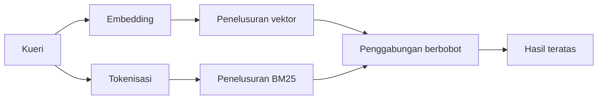

---
read_when:
    - Anda ingin memahami cara kerja memory_search
    - Anda ingin memilih penyedia embedding
    - Anda ingin menyempurnakan kualitas pencarian
summary: Cara pencarian memori menemukan catatan yang relevan menggunakan embedding dan pengambilan hibrida
title: Pencarian memori
x-i18n:
    generated_at: "2026-07-19T05:04:44Z"
    model: gpt-5.6
    postprocess_version: locale-links-v1
    prompt_version: 32
    provider: openai
    source_hash: e7be013665593c82890d3e0586136385f9b17e8d76f18e85abeab7304f34264d
    source_path: concepts/memory-search.md
    workflow: 16
---

`memory_search` menemukan catatan yang relevan dari file memori Anda, bahkan ketika
redaksinya berbeda dari teks asli. Fitur ini membagi memori menjadi bagian-bagian kecil dan
menelusurinya dengan embedding, kata kunci, atau keduanya.

## Mulai cepat

OpenClaw menggunakan embedding OpenAI secara default. Untuk menggunakan penyedia lain, tetapkan
secara eksplisit:

```json5
{
  agents: {
    defaults: {
      memorySearch: {
        provider: "openai", // atau "gemini", "voyage", "mistral", "bedrock", "local", "ollama", "lmstudio", "github-copilot", "openai-compatible"
      },
    },
  },
}
```

`provider` juga dapat merujuk ke entri `models.providers.<id>` khusus (misalnya
`ollama-5080`), selama entri tersebut menetapkan `api` ke `"ollama"` atau
id penyedia lain yang memiliki adaptor embedding memori.

Untuk embedding lokal tanpa kunci API, instal plugin penyedia llama.cpp resmi
dan tetapkan `provider: "local"`:

```bash
openclaw plugins install @openclaw/llama-cpp-provider
```

Checkout sumber tetap memerlukan persetujuan build native: `pnpm approve-builds`, lalu
`pnpm rebuild node-llama-cpp`.

Beberapa endpoint embedding yang kompatibel dengan OpenAI memerlukan label `input_type`
asimetris, seperti `"query"` untuk penelusuran dan `"document"`/`"passage"` untuk potongan
yang diindeks. Tetapkan ini dengan `queryInputType` dan `documentInputType`; lihat
[Referensi konfigurasi memori](/id/reference/memory-config#provider-specific-config).

## Penyedia yang didukung

| Penyedia          | ID                  | Memerlukan kunci API | Catatan                                  |
| ----------------- | ------------------- | -------------------- | ---------------------------------------- |
| Bedrock           | `bedrock`           | Tidak                | Menggunakan rantai kredensial AWS        |
| DeepInfra         | `deepinfra`         | Ya                   | Model default `BAAI/bge-m3`              |
| Gemini            | `gemini`            | Ya                   | Mendukung pengindeksan gambar/audio      |
| GitHub Copilot    | `github-copilot`    | Tidak                | Menggunakan langganan Copilot Anda       |
| Lokal             | `local`             | Tidak                | Model GGUF, unduhan otomatis ~0.6 GB     |
| LM Studio         | `lmstudio`          | Tidak                | Server lokal/dihosting sendiri           |
| Mistral           | `mistral`           | Ya                   |                                          |
| Ollama            | `ollama`            | Tidak                | Server lokal/dihosting sendiri           |
| OpenAI            | `openai`            | Ya                   | Default                                  |
| Kompatibel dengan OpenAI | `openai-compatible` | Biasanya             | Endpoint `/v1/embeddings` generik      |
| Voyage            | `voyage`            | Ya                   |                                          |

## Cara kerja penelusuran

OpenClaw menjalankan dua jalur pengambilan secara paralel dan menggabungkan hasilnya:



- **Penelusuran vektor** mencocokkan makna yang serupa ("host gateway" cocok dengan "mesin
  yang menjalankan OpenClaw").
- **Penelusuran kata kunci BM25** mencocokkan istilah persis (ID, string kesalahan, kunci
  konfigurasi).
- **Penelusuran nama file** mengindeks jalur secara terpisah dari isi catatan. Jalur lengkap
  yang persis, nama dasar, dan stem nama file memiliki peringkat lebih tinggi daripada kecocokan jalur parsial,
  sementara skor kata kunci cuplikan dan isi tetap berasal dari konten catatan.

Jika hanya satu jalur yang tersedia, jalur tersebut berjalan sendiri.

**Mode hanya FTS.** Tetapkan `provider: "none"` untuk menonaktifkan embedding secara sengaja
dan menelusuri hanya dengan kata kunci. Membiarkan `provider` tidak ditetapkan atau menetapkannya ke `"auto"`
juga akan kembali ke pemeringkatan hanya berdasarkan kata kunci jika tidak ada autentikasi embedding yang dikonfigurasi,
tanpa menghasilkan kesalahan, begitu pula `provider: "local"` (penyedia GGUF/llama.cpp)
ketika gagal.

**Penyedia eksplisit tidak tersedia.** Jika Anda menyebutkan penyedia lain secara eksplisit
(misalnya `openai`, `ollama`, `gemini`) dan penyedia tersebut tidak tersedia pada
saat permintaan (autentikasi buruk, kegagalan jaringan), `memory_search` melaporkan memori sebagai
tidak tersedia alih-alih diam-diam menurunkan fungsi ke hasil hanya FTS. Hal ini membuat
penyedia terkonfigurasi yang bermasalah tetap terlihat. Tetapkan `provider: "none"` untuk pengingatan
hanya FTS yang disengaja, atau perbaiki konfigurasi penyedia/autentikasi untuk memulihkan pemeringkatan
semantik.

## Meningkatkan kualitas penelusuran

Dua fitur opsional membantu menangani riwayat catatan yang besar.

### Peluruhan temporal

Bobot peringkat catatan lama berkurang secara bertahap agar informasi terbaru muncul lebih dahulu.
Dengan waktu paruh default 30 hari, catatan dari bulan lalu mendapat skor 50% dari
bobot aslinya. `MEMORY.md` dan file lain tanpa tanggal di bawah `memory/` bersifat
selalu relevan dan tidak pernah mengalami peluruhan; hanya file `memory/YYYY-MM-DD.md` bertanggal yang mengalami peluruhan.

<Tip>
Aktifkan ini jika agen Anda memiliki catatan harian selama berbulan-bulan dan informasi usang
terus mendapat peringkat lebih tinggi daripada konteks terbaru.
</Tip>

### MMR (keberagaman)

Mengurangi hasil yang redundan. Jika lima catatan semuanya menyebutkan konfigurasi router yang sama,
MMR memastikan hasil teratas mencakup topik yang berbeda alih-alih mengulanginya.

<Tip>
Aktifkan ini jika `memory_search` terus mengembalikan cuplikan yang hampir identik dari
catatan harian yang berbeda.
</Tip>

### Mengaktifkan keduanya

```json5
{
  agents: {
    defaults: {
      memorySearch: {
        query: {
          hybrid: {
            mmr: { enabled: true },
            temporalDecay: { enabled: true },
          },
        },
      },
    },
  },
}
```

## Memori multimodal

Dengan `gemini-embedding-2-preview`, Anda dapat mengindeks gambar dan audio bersama
Markdown. Ini hanya berlaku untuk file di bawah `memorySearch.extraPaths`; root
memori default (`MEMORY.md`, `memory/*.md`) tetap hanya mendukung Markdown. Kueri penelusuran
tetap berupa teks, tetapi dicocokkan dengan konten visual dan audio. Lihat
[Referensi konfigurasi memori](/id/reference/memory-config#multimodal-memory-gemini)
untuk penyiapan.

## Penelusuran memori sesi

Untuk pengingatan teks lengkap yang persis dari transkrip sesi, gunakan [`sessions_search`](/id/concepts/session-search)
lalu buka hasil dengan `sessions_history`. Penelusuran memori sesi tetap menjadi pelengkap semantik
yang eksperimental.

Secara opsional, indeks transkrip sesi agar `memory_search` dapat mengingat percakapan
sebelumnya. Fitur ini bersifat opt-in: tetapkan `experimental.sessionMemory: true` dan tambahkan
`"sessions"` ke `sources` (nilai default `sources` adalah `["memory"]`).

Hasil sesi mematuhi `tools.sessions.visibility`: nilai default `"tree"` mengekspos
sesi saat ini, sesi yang dibuatnya, dan sesi grup dengan agen yang sama yang dipantau
melalui kesadaran grup ambien. Dengan `session.dmScope: "main"`, penyiapan
DM multi-pengguna berbagi sesi utama tersebut, sehingga pengguna yang diarahkan ke sana dapat mengingat konten
dari grup yang dipantaunya. Gunakan `dmScope` per rekan untuk isolasi DM, atau tetapkan
visibilitas ke `"self"` untuk tidak ikut serta dalam pembacaan sesi terpantau secara ambien. Sesi
lain dengan agen yang sama dan tidak terkait tetap memerlukan visibilitas `"agent"`.

Saat menggunakan backend QMD, tetapkan juga `memory.qmd.sessions.enabled: true` agar
transkrip diekspor ke koleksi QMD; `experimental.sessionMemory`
dan `sources` saja tidak mengekspor transkrip ke QMD. Lihat
[referensi konfigurasi](/id/reference/memory-config#session-memory-search-experimental).

## Pemecahan masalah

**Tidak ada hasil?** Jalankan `openclaw memory status` untuk memeriksa indeks. Jika kosong, jalankan
`openclaw memory index --force`.

**Hanya kecocokan kata kunci?** Penyedia embedding Anda mungkin belum dikonfigurasi. Periksa
`openclaw memory status --deep`.

**Embedding lokal mengalami batas waktu?** `ollama`, `lmstudio`, dan `local` menggunakan batas waktu
batch inline yang lebih lama secara default. Jika host hanya lambat, tetapkan
`agents.defaults.memorySearch.sync.embeddingBatchTimeoutSeconds` dan jalankan kembali
`openclaw memory index --force`.

**Teks CJK tidak ditemukan?** Bangun ulang indeks FTS dengan
`openclaw memory index --force`.

## Terkait

- [Ikhtisar memori](/id/concepts/memory)
- [Active Memory](/id/concepts/active-memory)
- [Mesin memori bawaan](/id/concepts/memory-builtin)
- [Referensi konfigurasi memori](/id/reference/memory-config)
