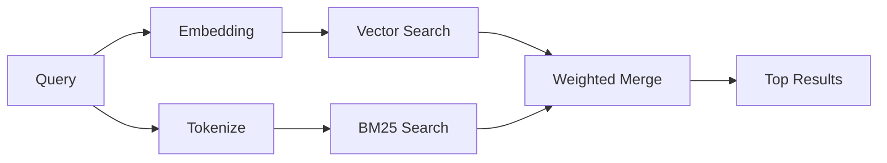

---
read_when:
    - Anda ingin memahami cara kerja memory_search
    - Anda ingin memilih provider embedding
    - Anda ingin menyesuaikan kualitas pencarian
summary: Cara memory search menemukan catatan yang relevan menggunakan embedding dan hybrid retrieval
title: Memory search
x-i18n:
    generated_at: "2026-04-26T11:27:02Z"
    model: gpt-5.4
    provider: openai
    source_hash: 95d86fb3efe79aae92f5e3590f1c15fb0d8f3bb3301f8fe9a41f891e290d7a14
    source_path: concepts/memory-search.md
    workflow: 15
---

`memory_search` menemukan catatan yang relevan dari file memori Anda, bahkan saat
susunan katanya berbeda dari teks asli. Fitur ini bekerja dengan mengindeks memori ke dalam potongan-potongan kecil
dan mencarinya menggunakan embedding, kata kunci, atau keduanya.

## Mulai cepat

Jika Anda memiliki langganan GitHub Copilot, OpenAI, Gemini, Voyage, atau API key
Mistral yang dikonfigurasi, memory search akan berfungsi secara otomatis. Untuk mengatur provider
secara eksplisit:

```json5
{
  agents: {
    defaults: {
      memorySearch: {
        provider: "openai", // atau "gemini", "local", "ollama", dll.
      },
    },
  },
}
```

Untuk embedding lokal tanpa API key, instal paket runtime opsional `node-llama-cpp`
di samping OpenClaw dan gunakan `provider: "local"`.

## Provider yang didukung

| Provider       | ID               | Perlu API key | Catatan                                             |
| -------------- | ---------------- | ------------- | --------------------------------------------------- |
| Bedrock        | `bedrock`        | Tidak         | Terdeteksi otomatis saat rantai kredensial AWS berhasil diresolusikan |
| Gemini         | `gemini`         | Ya            | Mendukung pengindeksan gambar/audio                 |
| GitHub Copilot | `github-copilot` | Tidak         | Terdeteksi otomatis, menggunakan langganan Copilot  |
| Local          | `local`          | Tidak         | Model GGUF, unduhan ~0,6 GB                         |
| Mistral        | `mistral`        | Ya            | Terdeteksi otomatis                                 |
| Ollama         | `ollama`         | Tidak         | Lokal, harus diatur secara eksplisit                |
| OpenAI         | `openai`         | Ya            | Terdeteksi otomatis, cepat                          |
| Voyage         | `voyage`         | Ya            | Terdeteksi otomatis                                 |

## Cara kerja pencarian

OpenClaw menjalankan dua jalur retrieval secara paralel dan menggabungkan hasilnya:



- **Pencarian vektor** menemukan catatan dengan makna yang serupa ("gateway host" cocok dengan
  "mesin yang menjalankan OpenClaw").
- **Pencarian kata kunci BM25** menemukan kecocokan persis (ID, string error, config
  key).

Jika hanya satu jalur yang tersedia (tanpa embedding atau tanpa FTS), jalur lainnya berjalan sendiri.

Saat embedding tidak tersedia, OpenClaw tetap menggunakan pemeringkatan leksikal atas hasil FTS alih-alih hanya fallback ke urutan kecocokan persis mentah. Mode terdegradasi tersebut meningkatkan potongan dengan cakupan istilah kueri yang lebih kuat dan path file yang relevan, yang menjaga recall tetap berguna bahkan tanpa `sqlite-vec` atau provider embedding.

## Meningkatkan kualitas pencarian

Dua fitur opsional membantu saat Anda memiliki riwayat catatan yang besar:

### Temporal decay

Catatan lama secara bertahap kehilangan bobot peringkat sehingga informasi terbaru muncul lebih dulu.
Dengan half-life default 30 hari, catatan dari bulan lalu diberi skor 50% dari
bobot aslinya. File evergreen seperti `MEMORY.md` tidak pernah mengalami decay.

<Tip>
Aktifkan temporal decay jika agent Anda memiliki catatan harian selama berbulan-bulan dan informasi lama
terus mengungguli context terbaru.
</Tip>

### MMR (keragaman)

Mengurangi hasil yang redundan. Jika lima catatan semuanya menyebut config router yang sama, MMR
memastikan hasil teratas mencakup topik yang berbeda alih-alih berulang.

<Tip>
Aktifkan MMR jika `memory_search` terus mengembalikan cuplikan yang hampir duplikat dari
catatan harian yang berbeda.
</Tip>

### Aktifkan keduanya

```json5
{
  agents: {
    defaults: {
      memorySearch: {
        query: {
          hybrid: {
            mmr: { enabled: true },
            temporalDecay: { enabled: true },
          },
        },
      },
    },
  },
}
```

## Memori multimodal

Dengan Gemini Embedding 2, Anda dapat mengindeks file gambar dan audio bersama
Markdown. Kueri pencarian tetap berupa teks, tetapi dapat cocok dengan konten visual dan audio.
Lihat [referensi konfigurasi Memory](/id/reference/memory-config) untuk
penyiapan.

## Session memory search

Anda dapat secara opsional mengindeks transkrip sesi sehingga `memory_search` dapat mengingat
percakapan sebelumnya. Ini bersifat opt-in melalui
`memorySearch.experimental.sessionMemory`. Lihat
[referensi konfigurasi](/id/reference/memory-config) untuk detailnya.

## Pemecahan masalah

**Tidak ada hasil?** Jalankan `openclaw memory status` untuk memeriksa indeks. Jika kosong, jalankan
`openclaw memory index --force`.

**Hanya kecocokan kata kunci?** Provider embedding Anda mungkin belum dikonfigurasi. Periksa
`openclaw memory status --deep`.

**Embedding lokal timeout?** `ollama`, `lmstudio`, dan `local` menggunakan
timeout batch inline yang lebih panjang secara default. Jika host memang lambat, atur
`agents.defaults.memorySearch.sync.embeddingBatchTimeoutSeconds` lalu jalankan ulang
`openclaw memory index --force`.

**Teks CJK tidak ditemukan?** Bangun ulang indeks FTS dengan
`openclaw memory index --force`.

## Bacaan lebih lanjut

- [Active Memory](/id/concepts/active-memory) -- memori sub-agent untuk sesi chat interaktif
- [Memory](/id/concepts/memory) -- tata letak file, backend, tool
- [Referensi konfigurasi Memory](/id/reference/memory-config) -- semua knob config

## Terkait

- [Ikhtisar Memory](/id/concepts/memory)
- [Active Memory](/id/concepts/active-memory)
- [Mesin memori bawaan](/id/concepts/memory-builtin)
