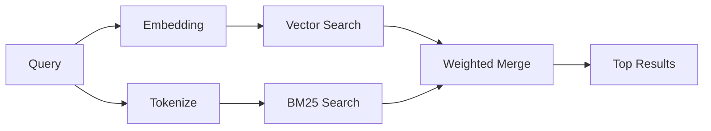

---
read_when:
    - Anda ingin memahami cara kerja memory_search
    - Anda ingin memilih penyedia sematan
    - Anda ingin menyesuaikan kualitas pencarian
summary: Cara pencarian memori menemukan catatan relevan menggunakan sematan dan pengambilan hibrida
title: Pencarian memori
x-i18n:
    generated_at: "2026-04-30T16:28:00Z"
    model: gpt-5.5
    provider: openai
    source_hash: 7f40bbe32453a28070ffc67f19a4c06e2fe59a24237a2aef353f4b9b8260bcf2
    source_path: concepts/memory-search.md
    workflow: 16
---

`memory_search` menemukan catatan yang relevan dari file memori Anda, bahkan ketika
susunannya berbeda dari teks aslinya. Ini bekerja dengan mengindeks memori menjadi
potongan-potongan kecil dan mencarinya menggunakan embedding, kata kunci, atau keduanya.

## Mulai cepat

Jika Anda memiliki langganan GitHub Copilot, kunci API OpenAI, Gemini, Voyage, atau Mistral
yang dikonfigurasi, pencarian memori berfungsi otomatis. Untuk mengatur penyedia
secara eksplisit:

```json5
{
  agents: {
    defaults: {
      memorySearch: {
        provider: "openai", // or "gemini", "local", "ollama", etc.
      },
    },
  },
}
```

Untuk penyiapan multi-endpoint, `provider` juga dapat berupa entri kustom
`models.providers.<id>`, seperti `ollama-5080`, ketika penyedia tersebut menetapkan
`api: "ollama"` atau pemilik adapter embedding lainnya.

Untuk embedding lokal tanpa kunci API, atur `provider: "local"`. Instalasi paket
mempertahankan runtime `node-llama-cpp` native di pohon runtime-deps plugin terkelola
OpenClaw; jalankan `openclaw doctor --fix` jika pohon tersebut perlu diperbaiki.

Beberapa endpoint embedding yang kompatibel dengan OpenAI memerlukan label asimetris seperti
`input_type: "query"` untuk pencarian dan `input_type: "document"` atau `"passage"`
untuk potongan yang diindeks. Konfigurasikan itu dengan `memorySearch.queryInputType` dan
`memorySearch.documentInputType`; lihat [referensi konfigurasi memori](/id/reference/memory-config#provider-specific-config).

## Penyedia yang didukung

| Penyedia       | ID               | Memerlukan kunci API | Catatan                                                |
| -------------- | ---------------- | -------------------- | ------------------------------------------------------ |
| Bedrock        | `bedrock`        | Tidak                | Terdeteksi otomatis ketika rantai kredensial AWS berhasil |
| Gemini         | `gemini`         | Ya                   | Mendukung pengindeksan gambar/audio                    |
| GitHub Copilot | `github-copilot` | Tidak                | Terdeteksi otomatis, menggunakan langganan Copilot     |
| Local          | `local`          | Tidak                | Model GGUF, unduhan ~0,6 GB                            |
| Mistral        | `mistral`        | Ya                   | Terdeteksi otomatis                                    |
| Ollama         | `ollama`         | Tidak                | Lokal, harus diatur secara eksplisit                   |
| OpenAI         | `openai`         | Ya                   | Terdeteksi otomatis, cepat                             |
| Voyage         | `voyage`         | Ya                   | Terdeteksi otomatis                                    |

## Cara kerja pencarian

OpenClaw menjalankan dua jalur pengambilan secara paralel dan menggabungkan hasilnya:



- **Pencarian vektor** menemukan catatan dengan makna serupa ("gateway host" cocok dengan
  "mesin yang menjalankan OpenClaw").
- **Pencarian kata kunci BM25** menemukan kecocokan persis (ID, string galat, kunci
  konfigurasi).

Jika hanya satu jalur yang tersedia (tanpa embedding atau tanpa FTS), jalur lainnya berjalan sendiri.

Ketika embedding tidak tersedia, OpenClaw tetap menggunakan pemeringkatan leksikal atas hasil FTS alih-alih hanya kembali ke urutan kecocokan persis mentah. Mode terdegradasi tersebut meningkatkan potongan dengan cakupan istilah kueri yang lebih kuat dan jalur file yang relevan, sehingga recall tetap berguna bahkan tanpa `sqlite-vec` atau penyedia embedding.

## Meningkatkan kualitas pencarian

Dua fitur opsional membantu ketika Anda memiliki riwayat catatan yang besar:

### Peluruhan temporal

Catatan lama secara bertahap kehilangan bobot peringkat sehingga informasi terbaru muncul lebih dulu.
Dengan half-life default 30 hari, catatan dari bulan lalu mendapat skor 50% dari
bobot aslinya. File yang selalu relevan seperti `MEMORY.md` tidak pernah diluruhkan.

<Tip>
Aktifkan peluruhan temporal jika agen Anda memiliki catatan harian selama berbulan-bulan dan informasi usang terus mengungguli konteks terbaru.
</Tip>

### MMR (keberagaman)

Mengurangi hasil yang berulang. Jika lima catatan semuanya menyebut konfigurasi router yang sama, MMR
memastikan hasil teratas mencakup topik berbeda alih-alih berulang.

<Tip>
Aktifkan MMR jika `memory_search` terus mengembalikan snippet yang hampir duplikat dari
catatan harian yang berbeda.
</Tip>

### Aktifkan keduanya

```json5
{
  agents: {
    defaults: {
      memorySearch: {
        query: {
          hybrid: {
            mmr: { enabled: true },
            temporalDecay: { enabled: true },
          },
        },
      },
    },
  },
}
```

## Memori multimodal

Dengan Gemini Embedding 2, Anda dapat mengindeks gambar dan file audio bersama
Markdown. Kueri pencarian tetap berupa teks, tetapi cocok dengan konten visual dan audio.
Lihat [referensi konfigurasi memori](/id/reference/memory-config) untuk
penyiapan.

## Pencarian memori sesi

Anda dapat secara opsional mengindeks transkrip sesi sehingga `memory_search` dapat mengingat
percakapan sebelumnya. Ini bersifat opt-in melalui
`memorySearch.experimental.sessionMemory`. Lihat
[referensi konfigurasi](/id/reference/memory-config) untuk detail.

## Pemecahan masalah

**Tidak ada hasil?** Jalankan `openclaw memory status` untuk memeriksa indeks. Jika kosong, jalankan
`openclaw memory index --force`.

**Hanya kecocokan kata kunci?** Penyedia embedding Anda mungkin belum dikonfigurasi. Periksa
`openclaw memory status --deep`.

**Embedding lokal mengalami timeout?** `ollama`, `lmstudio`, dan `local` menggunakan timeout batch inline yang lebih panjang secara default. Jika host memang lambat, atur
`agents.defaults.memorySearch.sync.embeddingBatchTimeoutSeconds` dan jalankan ulang
`openclaw memory index --force`.

**Teks CJK tidak ditemukan?** Bangun ulang indeks FTS dengan
`openclaw memory index --force`.

## Bacaan lanjutan

- [Active Memory](/id/concepts/active-memory) -- memori sub-agen untuk sesi chat interaktif
- [Memori](/id/concepts/memory) -- tata letak file, backend, alat
- [Referensi konfigurasi memori](/id/reference/memory-config) -- semua kenop konfigurasi

## Terkait

- [Ikhtisar memori](/id/concepts/memory)
- [Active Memory](/id/concepts/active-memory)
- [Mesin memori bawaan](/id/concepts/memory-builtin)
