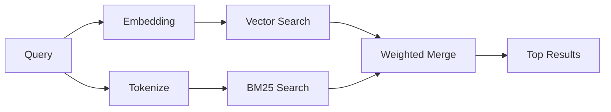

---
read_when:
    - Anda ingin memahami cara kerja memory_search
    - Anda ingin memilih penyedia embedding
    - Anda ingin menyetel kualitas pencarian
summary: Cara pencarian memori menemukan catatan yang relevan menggunakan embedding dan retrieval hibrida
title: Pencarian Memori
x-i18n:
    generated_at: "2026-04-05T13:51:24Z"
    model: gpt-5.4
    provider: openai
    source_hash: 87b1cb3469c7805f95bca5e77a02919d1e06d626ad3633bbc5465f6ab9db12a2
    source_path: concepts/memory-search.md
    workflow: 15
---

# Pencarian Memori

`memory_search` menemukan catatan yang relevan dari file memori Anda, bahkan ketika
redaksinya berbeda dari teks aslinya. Ini bekerja dengan mengindeks memori menjadi potongan-potongan
kecil dan mencarinya menggunakan embedding, kata kunci, atau keduanya.

## Mulai cepat

Jika Anda telah mengonfigurasi API key OpenAI, Gemini, Voyage, atau Mistral, pencarian memori
akan berfungsi secara otomatis. Untuk menetapkan penyedia secara eksplisit:

```json5
{
  agents: {
    defaults: {
      memorySearch: {
        provider: "openai", // atau "gemini", "local", "ollama", dll.
      },
    },
  },
}
```

Untuk embedding lokal tanpa API key, gunakan `provider: "local"` (memerlukan
node-llama-cpp).

## Penyedia yang didukung

| Penyedia | ID        | Memerlukan API key | Catatan                      |
| -------- | --------- | ------------------ | ---------------------------- |
| OpenAI   | `openai`  | Ya                 | Terdeteksi otomatis, cepat   |
| Gemini   | `gemini`  | Ya                 | Mendukung pengindeksan gambar/audio |
| Voyage   | `voyage`  | Ya                 | Terdeteksi otomatis          |
| Mistral  | `mistral` | Ya                 | Terdeteksi otomatis          |
| Ollama   | `ollama`  | Tidak              | Lokal, harus ditetapkan secara eksplisit |
| Local    | `local`   | Tidak              | Model GGUF, unduhan ~0,6 GB  |

## Cara kerja pencarian

OpenClaw menjalankan dua jalur retrieval secara paralel dan menggabungkan hasilnya:



- **Pencarian vektor** menemukan catatan dengan makna serupa ("gateway host" cocok dengan
  "mesin yang menjalankan OpenClaw").
- **Pencarian kata kunci BM25** menemukan kecocokan persis (ID, string error, kunci konfigurasi
  ).

Jika hanya satu jalur yang tersedia (tidak ada embedding atau tidak ada FTS), jalur lainnya berjalan sendiri.

## Meningkatkan kualitas pencarian

Dua fitur opsional membantu saat Anda memiliki riwayat catatan yang besar:

### Temporal decay

Catatan lama secara bertahap kehilangan bobot peringkat sehingga informasi terbaru muncul lebih dulu.
Dengan half-life default 30 hari, catatan dari bulan lalu diberi skor 50% dari
bobot aslinya. File evergreen seperti `MEMORY.md` tidak pernah mengalami decay.

<Tip>
Aktifkan temporal decay jika agen Anda memiliki catatan harian selama berbulan-bulan dan informasi
usang terus mengungguli konteks terbaru.
</Tip>

### MMR (keberagaman)

Mengurangi hasil yang redundan. Jika lima catatan semuanya menyebut konfigurasi router yang sama, MMR
memastikan hasil teratas mencakup topik yang berbeda, alih-alih berulang.

<Tip>
Aktifkan MMR jika `memory_search` terus mengembalikan cuplikan yang hampir duplikat dari
catatan harian yang berbeda.
</Tip>

### Aktifkan keduanya

```json5
{
  agents: {
    defaults: {
      memorySearch: {
        query: {
          hybrid: {
            mmr: { enabled: true },
            temporalDecay: { enabled: true },
          },
        },
      },
    },
  },
}
```

## Memori multimodal

Dengan Gemini Embedding 2, Anda dapat mengindeks file gambar dan audio bersama
Markdown. Kueri pencarian tetap berupa teks, tetapi cocok dengan konten visual dan audio.
Lihat [referensi konfigurasi Memori](/reference/memory-config) untuk
penyiapannya.

## Pencarian memori sesi

Anda dapat secara opsional mengindeks transkrip sesi sehingga `memory_search` dapat mengingat
percakapan sebelumnya. Ini bersifat opt-in melalui
`memorySearch.experimental.sessionMemory`. Lihat
[referensi konfigurasi](/reference/memory-config) untuk detailnya.

## Pemecahan masalah

**Tidak ada hasil?** Jalankan `openclaw memory status` untuk memeriksa indeks. Jika kosong, jalankan
`openclaw memory index --force`.

**Hanya cocok dengan kata kunci?** Penyedia embedding Anda mungkin belum dikonfigurasi. Periksa
`openclaw memory status --deep`.

**Teks CJK tidak ditemukan?** Bangun ulang indeks FTS dengan
`openclaw memory index --force`.

## Bacaan lanjutan

- [Memory](/concepts/memory) -- tata letak file, backend, alat
- [Referensi konfigurasi Memori](/reference/memory-config) -- semua opsi konfigurasi
