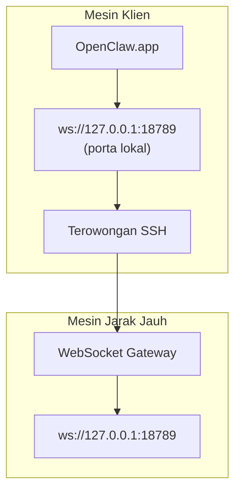

<Note>
Konten ini sekarang berada di [Akses Jarak Jauh](/id/gateway/remote#macos-persistent-ssh-tunnel-via-launchagent). Gunakan halaman tersebut untuk panduan terkini; halaman ini tetap tersedia sebagai target pengalihan.
</Note>

# Menjalankan OpenClaw.app dengan Gateway Jarak Jauh

OpenClaw.app mengakses Gateway jarak jauh melalui terowongan SSH: `LocalForward` SSH memetakan porta lokal ke porta WebSocket Gateway pada host jarak jauh.

## Penyiapan

1. Tambahkan entri konfigurasi SSH dengan `LocalForward 18789 127.0.0.1:18789` (lihat [Akses Jarak Jauh](/id/gateway/remote#macos-persistent-ssh-tunnel-via-launchagent) untuk blok konfigurasi lengkap).
2. Salin kunci SSH Anda ke host jarak jauh dengan `ssh-copy-id`.
3. Atur `gateway.remote.token` (atau `gateway.remote.password`) melalui `openclaw config set gateway.remote.token "<your-token>"`.
4. Mulai terowongan: `ssh -N remote-gateway &`.
5. Tutup dan buka kembali OpenClaw.app.

Untuk terowongan yang tetap berjalan setelah sistem dimulai ulang dan tersambung kembali secara otomatis, gunakan penyiapan LaunchAgent di halaman [Akses Jarak Jauh](/id/gateway/remote#macos-persistent-ssh-tunnel-via-launchagent), bukan menjalankan `ssh -N` secara manual.

## Cara kerjanya

| Komponen                             | Fungsinya                                                               |
| ------------------------------------ | ----------------------------------------------------------------------- |
| `LocalForward 18789 127.0.0.1:18789` | Meneruskan porta lokal 18789 ke porta jarak jauh 18789                   |
| `ssh -N`                             | SSH tanpa menjalankan perintah jarak jauh (hanya penerusan porta)        |
| `KeepAlive`                          | Memulai ulang terowongan secara otomatis jika terhenti (LaunchAgent)     |
| `RunAtLoad`                          | Memulai terowongan saat LaunchAgent dimuat (LaunchAgent)                 |

OpenClaw.app terhubung ke `ws://127.0.0.1:18789` pada klien. Terowongan meneruskan koneksi tersebut ke porta 18789 pada host jarak jauh yang menjalankan Gateway.

## Terkait

- [Akses jarak jauh](/id/gateway/remote)
- [Tailscale](/id/gateway/tailscale)
