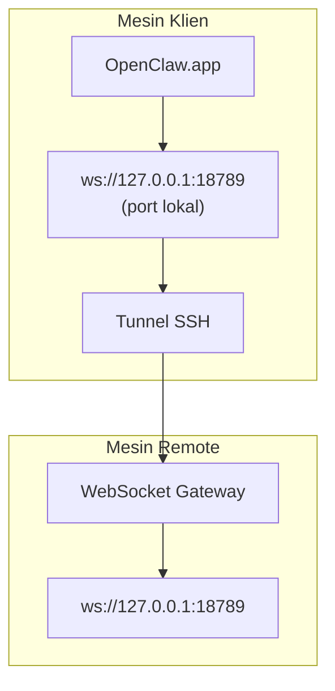

> Konten ini telah digabungkan ke [Akses Jarak Jauh](/id/gateway/remote#macos-persistent-ssh-tunnel-via-launchagent). Lihat halaman tersebut untuk panduan terbaru.

# Menjalankan OpenClaw.app dengan Gateway Remote

OpenClaw.app menggunakan tunneling SSH untuk terhubung ke gateway remote. Panduan ini menunjukkan cara menyiapkannya.

## Ikhtisar



## Penyiapan Cepat

### Langkah 1: Tambahkan Config SSH

Edit `~/.ssh/config` dan tambahkan:

```ssh
Host remote-gateway
    HostName <REMOTE_IP>          # mis. 172.27.187.184
    User <REMOTE_USER>            # mis. jefferson
    LocalForward 18789 127.0.0.1:18789
    IdentityFile ~/.ssh/id_rsa
```

Ganti `<REMOTE_IP>` dan `<REMOTE_USER>` dengan nilai Anda.

### Langkah 2: Salin Kunci SSH

Salin kunci publik Anda ke mesin remote (masukkan kata sandi sekali):

```bash
ssh-copy-id -i ~/.ssh/id_rsa <REMOTE_USER>@<REMOTE_IP>
```

### Langkah 3: Konfigurasikan Autentikasi Gateway Remote

```bash
openclaw config set gateway.remote.token "<your-token>"
```

Gunakan `gateway.remote.password` sebagai gantinya jika gateway remote Anda menggunakan autentikasi kata sandi.
`OPENCLAW_GATEWAY_TOKEN` tetap valid sebagai override tingkat shell, tetapi penyiapan klien remote yang persisten adalah `gateway.remote.token` / `gateway.remote.password`.

### Langkah 4: Mulai Tunnel SSH

```bash
ssh -N remote-gateway &
```

### Langkah 5: Mulai Ulang OpenClaw.app

```bash
# Keluar dari OpenClaw.app (⌘Q), lalu buka kembali:
open /path/to/OpenClaw.app
```

Aplikasi sekarang akan terhubung ke gateway remote melalui tunnel SSH.

---

## Mulai Otomatis Tunnel saat Login

Agar tunnel SSH mulai secara otomatis saat Anda login, buat Launch Agent.

### Buat file PLIST

Simpan ini sebagai `~/Library/LaunchAgents/ai.openclaw.ssh-tunnel.plist`:

```xml
<?xml version="1.0" encoding="UTF-8"?>
<!DOCTYPE plist PUBLIC "-//Apple//DTD PLIST 1.0//EN" "http://www.apple.com/DTDs/PropertyList-1.0.dtd">
<plist version="1.0">
<dict>
    <key>Label</key>
    <string>ai.openclaw.ssh-tunnel</string>
    <key>ProgramArguments</key>
    <array>
        <string>/usr/bin/ssh</string>
        <string>-N</string>
        <string>remote-gateway</string>
    </array>
    <key>KeepAlive</key>
    <true/>
    <key>RunAtLoad</key>
    <true/>
</dict>
</plist>
```

### Muat Launch Agent

```bash
launchctl bootstrap gui/$UID ~/Library/LaunchAgents/ai.openclaw.ssh-tunnel.plist
```

Tunnel sekarang akan:

- Mulai otomatis saat Anda login
- Mulai ulang jika crash
- Tetap berjalan di latar belakang

Catatan lama: hapus LaunchAgent `com.openclaw.ssh-tunnel` yang tersisa jika ada.

---

## Pemecahan Masalah

**Periksa apakah tunnel berjalan:**

```bash
ps aux | grep "ssh -N remote-gateway" | grep -v grep
lsof -i :18789
```

**Mulai ulang tunnel:**

```bash
launchctl kickstart -k gui/$UID/ai.openclaw.ssh-tunnel
```

**Hentikan tunnel:**

```bash
launchctl bootout gui/$UID/ai.openclaw.ssh-tunnel
```

---

## Cara Kerjanya

| Komponen                            | Fungsinya                                                    |
| ----------------------------------- | ------------------------------------------------------------ |
| `LocalForward 18789 127.0.0.1:18789` | Meneruskan port lokal 18789 ke port remote 18789             |
| `ssh -N`                            | SSH tanpa mengeksekusi perintah remote (hanya port forwarding) |
| `KeepAlive`                         | Otomatis memulai ulang tunnel jika crash                     |
| `RunAtLoad`                         | Memulai tunnel saat agen dimuat                              |

OpenClaw.app terhubung ke `ws://127.0.0.1:18789` pada mesin klien Anda. Tunnel SSH meneruskan koneksi itu ke port 18789 pada mesin remote tempat Gateway berjalan.

## Terkait

- [Akses jarak jauh](/id/gateway/remote)
- [Tailscale](/id/gateway/tailscale)
