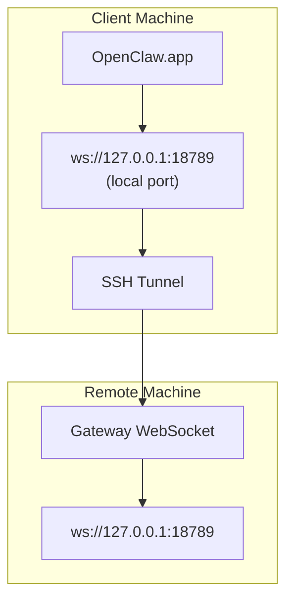

> Konten ini telah digabungkan ke [Akses Jarak Jauh](/id/gateway/remote#macos-persistent-ssh-tunnel-via-launchagent). Lihat halaman tersebut untuk panduan saat ini.

# Menjalankan OpenClaw.app dengan Gateway Jarak Jauh

OpenClaw.app menggunakan tunneling SSH untuk terhubung ke gateway jarak jauh. Panduan ini menunjukkan cara menyiapkannya.

## Ikhtisar



## Penyiapan cepat

### Langkah 1: Tambahkan Konfigurasi SSH

Edit `~/.ssh/config` dan tambahkan:

```ssh
Host remote-gateway
    HostName <REMOTE_IP>          # e.g., 172.27.187.184
    User <REMOTE_USER>            # e.g., jefferson
    LocalForward 18789 127.0.0.1:18789
    IdentityFile ~/.ssh/id_rsa
```

Ganti `<REMOTE_IP>` dan `<REMOTE_USER>` dengan nilai Anda.

### Langkah 2: Salin Kunci SSH

Salin kunci publik Anda ke mesin jarak jauh (masukkan kata sandi sekali):

```bash
ssh-copy-id -i ~/.ssh/id_rsa <REMOTE_USER>@<REMOTE_IP>
```

### Langkah 3: Konfigurasikan Autentikasi Gateway Jarak Jauh

```bash
openclaw config set gateway.remote.token "<your-token>"
```

Gunakan `gateway.remote.password` sebagai gantinya jika gateway jarak jauh Anda menggunakan autentikasi kata sandi.
`OPENCLAW_GATEWAY_TOKEN` masih valid sebagai override tingkat shell, tetapi penyiapan
klien jarak jauh yang tahan lama adalah `gateway.remote.token` / `gateway.remote.password`.

### Langkah 4: Mulai Tunnel SSH

```bash
ssh -N remote-gateway &
```

### Langkah 5: Mulai Ulang OpenClaw.app

```bash
# Quit OpenClaw.app (⌘Q), then reopen:
open /path/to/OpenClaw.app
```

Aplikasi sekarang akan terhubung ke gateway jarak jauh melalui tunnel SSH.

---

## Mulai Otomatis Tunnel saat Login

Agar tunnel SSH dimulai otomatis saat Anda login, buat Launch Agent.

### Buat file PLIST

Simpan ini sebagai `~/Library/LaunchAgents/ai.openclaw.ssh-tunnel.plist`:

```xml
<?xml version="1.0" encoding="UTF-8"?>
<!DOCTYPE plist PUBLIC "-//Apple//DTD PLIST 1.0//EN" "http://www.apple.com/DTDs/PropertyList-1.0.dtd">
<plist version="1.0">
<dict>
    <key>Label</key>
    <string>ai.openclaw.ssh-tunnel</string>
    <key>ProgramArguments</key>
    <array>
        <string>/usr/bin/ssh</string>
        <string>-N</string>
        <string>remote-gateway</string>
    </array>
    <key>KeepAlive</key>
    <true/>
    <key>RunAtLoad</key>
    <true/>
</dict>
</plist>
```

### Muat Launch Agent

```bash
launchctl bootstrap gui/$UID ~/Library/LaunchAgents/ai.openclaw.ssh-tunnel.plist
```

Tunnel sekarang akan:

- Dimulai otomatis saat Anda login
- Dimulai ulang jika crash
- Tetap berjalan di latar belakang

Catatan lama: hapus LaunchAgent `com.openclaw.ssh-tunnel` yang tersisa jika ada.

---

## Pemecahan masalah

**Periksa apakah tunnel sedang berjalan:**

```bash
ps aux | grep "ssh -N remote-gateway" | grep -v grep
lsof -i :18789
```

**Mulai ulang tunnel:**

```bash
launchctl kickstart -k gui/$UID/ai.openclaw.ssh-tunnel
```

**Hentikan tunnel:**

```bash
launchctl bootout gui/$UID/ai.openclaw.ssh-tunnel
```

---

## Cara kerjanya

| Komponen                             | Apa Fungsinya                                               |
| ------------------------------------ | ----------------------------------------------------------- |
| `LocalForward 18789 127.0.0.1:18789` | Meneruskan port lokal 18789 ke port jarak jauh 18789        |
| `ssh -N`                             | SSH tanpa menjalankan perintah jarak jauh (hanya penerusan port) |
| `KeepAlive`                          | Memulai ulang tunnel secara otomatis jika crash             |
| `RunAtLoad`                          | Memulai tunnel saat agen dimuat                             |

OpenClaw.app terhubung ke `ws://127.0.0.1:18789` di mesin klien Anda. Tunnel SSH meneruskan koneksi tersebut ke port 18789 pada mesin jarak jauh tempat Gateway berjalan.

## Terkait

- [Akses jarak jauh](/id/gateway/remote)
- [Tailscale](/id/gateway/tailscale)
