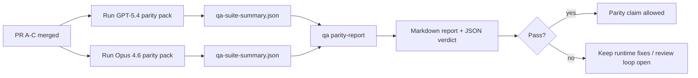

---
read_when:
    - Meninjau rangkaian PR paritas GPT-5.4 / Codex
    - Memelihara arsitektur agentik enam kontrak di balik program paritas
summary: Cara meninjau program paritas GPT-5.4 / Codex sebagai empat unit merge
title: Catatan maintainer paritas GPT-5.4 / Codex
x-i18n:
    generated_at: "2026-04-24T09:11:18Z"
    model: gpt-5.4
    provider: openai
    source_hash: 803b62bf5bb6b00125f424fa733e743ecdec7f8410dec0782096f9d1ddbed6c0
    source_path: help/gpt54-codex-agentic-parity-maintainers.md
    workflow: 15
---

Catatan ini menjelaskan cara meninjau program paritas GPT-5.4 / Codex sebagai empat unit merge tanpa kehilangan arsitektur enam kontrak aslinya.

## Unit merge

### PR A: eksekusi strict-agentic

Memiliki:

- `executionContract`
- tindak lanjut dalam giliran yang sama dengan GPT-5 sebagai yang utama
- `update_plan` sebagai pelacakan progres non-terminal
- status terblokir yang eksplisit alih-alih berhenti diam-diam hanya pada rencana

Tidak memiliki:

- klasifikasi kegagalan auth/runtime
- truthfulness izin
- redesign replay/continuation
- benchmarking paritas

### PR B: runtime truthfulness

Memiliki:

- kebenaran scope OAuth Codex
- klasifikasi kegagalan provider/runtime yang bertipe
- ketersediaan `/elevated full` yang jujur dan alasan pemblokiran

Tidak memiliki:

- normalisasi skema alat
- state replay/liveness
- gerbang benchmark

### PR C: execution correctness

Memiliki:

- kompatibilitas alat OpenAI/Codex yang dimiliki provider
- penanganan skema ketat tanpa parameter
- penampakan replay-invalid
- visibilitas state paused, blocked, dan abandoned untuk tugas panjang

Tidak memiliki:

- continuation yang dipilih sendiri
- perilaku dialek Codex generik di luar hook provider
- gerbang benchmark

### PR D: harness paritas

Memiliki:

- paket skenario gelombang pertama GPT-5.4 vs Opus 4.6
- dokumentasi paritas
- mekanisme laporan paritas dan gerbang rilis

Tidak memiliki:

- perubahan perilaku runtime di luar QA-lab
- simulasi auth/proxy/DNS di dalam harness

## Pemetaan kembali ke enam kontrak asli

| Original contract                        | Merge unit |
| ---------------------------------------- | ---------- |
| Kebenaran transport/auth provider        | PR B       |
| Kompatibilitas kontrak/skema alat        | PR C       |
| Eksekusi dalam giliran yang sama         | PR A       |
| Truthfulness izin                        | PR B       |
| Kebenaran replay/continuation/liveness   | PR C       |
| Benchmark/gerbang rilis                  | PR D       |

## Urutan peninjauan

1. PR A
2. PR B
3. PR C
4. PR D

PR D adalah lapisan pembuktian. PR ini tidak seharusnya menjadi alasan PR kebenaran runtime tertunda.

## Hal yang perlu dicari

### PR A

- Run GPT-5 bertindak atau gagal tertutup alih-alih berhenti pada komentar
- `update_plan` tidak lagi tampak sebagai progres dengan sendirinya
- perilaku tetap GPT-5-first dan dibatasi pada embedded-Pi

### PR B

- kegagalan auth/proxy/runtime berhenti runtuh menjadi penanganan generik “model failed”
- `/elevated full` hanya dijelaskan sebagai tersedia ketika benar-benar tersedia
- alasan pemblokiran terlihat baik bagi model maupun runtime yang menghadap pengguna

### PR C

- pendaftaran alat OpenAI/Codex yang ketat berperilaku secara dapat diprediksi
- alat tanpa parameter tidak gagal dalam pemeriksaan skema ketat
- hasil replay dan Compaction mempertahankan state liveness yang jujur

### PR D

- paket skenario dapat dipahami dan direproduksi
- paket mencakup lane replay-safety yang memutasi, bukan hanya alur baca-saja
- laporan dapat dibaca oleh manusia dan otomasi
- klaim paritas didukung bukti, bukan anekdot

Artefak yang diharapkan dari PR D:

- `qa-suite-report.md` / `qa-suite-summary.json` untuk setiap run model
- `qa-agentic-parity-report.md` dengan perbandingan agregat dan tingkat skenario
- `qa-agentic-parity-summary.json` dengan verdict yang dapat dibaca mesin

## Gerbang rilis

Jangan klaim paritas GPT-5.4 atau superioritas atas Opus 4.6 sampai:

- PR A, PR B, dan PR C telah di-merge
- PR D menjalankan paket paritas gelombang pertama dengan bersih
- suite regresi runtime-truthfulness tetap hijau
- laporan paritas tidak menunjukkan kasus sukses palsu dan tidak ada regresi dalam perilaku berhenti

Harness paritas bukan satu-satunya sumber bukti. Pertahankan pemisahan ini tetap eksplisit dalam peninjauan:

- PR D memiliki perbandingan berbasis skenario GPT-5.4 vs Opus 4.6
- suite deterministik PR B tetap memiliki bukti auth/proxy/DNS dan truthfulness akses penuh

## Peta tujuan ke bukti

| Completion gate item                     | Primary owner | Review artifact                                                     |
| ---------------------------------------- | ------------- | ------------------------------------------------------------------- |
| Tidak ada stall hanya-rencana            | PR A          | uji runtime strict-agentic dan `approval-turn-tool-followthrough`   |
| Tidak ada progres palsu atau penyelesaian alat palsu | PR A + PR D   | jumlah fake-success paritas plus detail laporan tingkat skenario    |
| Tidak ada panduan `/elevated full` palsu | PR B          | suite runtime-truthfulness deterministik                            |
| Kegagalan replay/liveness tetap eksplisit | PR C + PR D   | suite lifecycle/replay plus `compaction-retry-mutating-tool`        |
| GPT-5.4 menyamai atau mengalahkan Opus 4.6 | PR D         | `qa-agentic-parity-report.md` dan `qa-agentic-parity-summary.json`  |

## Singkatan peninjau: sebelum vs sesudah

| Masalah yang terlihat pengguna sebelumnya                  | Sinyal peninjauan sesudah                                                             |
| --------------------------------------------------------- | ------------------------------------------------------------------------------------- |
| GPT-5.4 berhenti setelah merencanakan                     | PR A menunjukkan perilaku act-or-block alih-alih penyelesaian hanya-komentar        |
| Penggunaan alat terasa rapuh dengan skema OpenAI/Codex ketat | PR C menjaga pendaftaran alat dan pemanggilan tanpa parameter tetap dapat diprediksi |
| Petunjuk `/elevated full` kadang menyesatkan              | PR B mengikat panduan ke kemampuan runtime aktual dan alasan pemblokiran             |
| Tugas panjang bisa hilang dalam ambiguitas replay/Compaction | PR C mengeluarkan state paused, blocked, abandoned, dan replay-invalid yang eksplisit |
| Klaim paritas bersifat anekdot                            | PR D menghasilkan laporan plus verdict JSON dengan cakupan skenario yang sama pada kedua model |

## Terkait

- [GPT-5.4 / Codex agentic parity](/id/help/gpt54-codex-agentic-parity)
