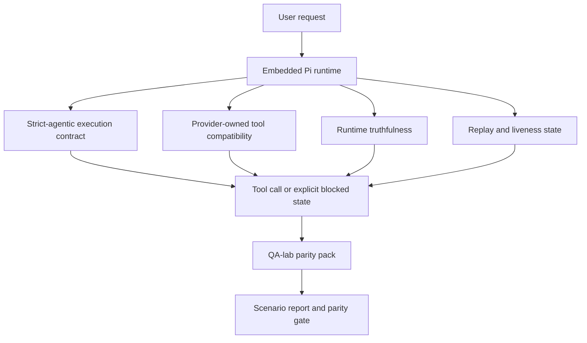
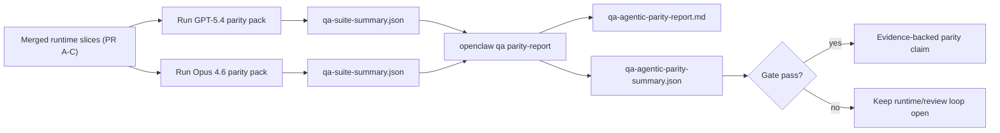

---
read_when:
    - Men-debug perilaku agen GPT-5.4 atau Codex
    - Membandingkan perilaku agentik OpenClaw di berbagai model frontier
    - Meninjau perbaikan strict-agentic, tool-schema, elevasi, dan replay
summary: Bagaimana OpenClaw menutup kesenjangan eksekusi agentik untuk GPT-5.4 dan model bergaya Codex
title: Paritas agentik GPT-5.4 / Codex
x-i18n:
    generated_at: "2026-04-24T09:11:22Z"
    model: gpt-5.4
    provider: openai
    source_hash: 9f8c7dcf21583e6dbac80da9ddd75f2dc9af9b80801072ade8fa14b04258d4dc
    source_path: help/gpt54-codex-agentic-parity.md
    workflow: 15
---

# Paritas Agentik GPT-5.4 / Codex di OpenClaw

OpenClaw sudah bekerja dengan baik dengan model frontier yang menggunakan tool, tetapi model GPT-5.4 dan bergaya Codex masih berkinerja kurang baik dalam beberapa hal praktis:

- mereka bisa berhenti setelah merencanakan alih-alih melakukan pekerjaannya
- mereka bisa menggunakan skema tool OpenAI/Codex yang ketat secara keliru
- mereka bisa meminta `/elevated full` bahkan ketika akses penuh tidak mungkin
- mereka bisa kehilangan state tugas yang berjalan lama selama replay atau Compaction
- klaim paritas terhadap Claude Opus 4.6 didasarkan pada anekdot, bukan skenario yang dapat diulang

Program paritas ini memperbaiki kesenjangan tersebut dalam empat bagian yang dapat ditinjau.

## Apa yang berubah

### PR A: eksekusi strict-agentic

Bagian ini menambahkan kontrak eksekusi `strict-agentic` opt-in untuk run Pi GPT-5 tertanam.

Saat diaktifkan, OpenClaw berhenti menerima giliran yang hanya berisi rencana sebagai penyelesaian yang “cukup baik”. Jika model hanya mengatakan apa yang ingin dilakukannya dan tidak benar-benar menggunakan tool atau membuat kemajuan, OpenClaw akan mencoba lagi dengan steer act-now lalu gagal tertutup dengan state blocked yang eksplisit alih-alih diam-diam mengakhiri tugas.

Ini paling meningkatkan pengalaman GPT-5.4 pada:

- tindak lanjut singkat “ok lakukan”
- tugas kode ketika langkah pertama sudah jelas
- alur di mana `update_plan` seharusnya menjadi pelacakan kemajuan, bukan teks pengisi

### PR B: kebenaran runtime

Bagian ini membuat OpenClaw mengatakan yang sebenarnya tentang dua hal:

- mengapa panggilan provider/runtime gagal
- apakah `/elevated full` benar-benar tersedia

Artinya GPT-5.4 mendapatkan sinyal runtime yang lebih baik untuk scope yang hilang, kegagalan refresh auth, kegagalan auth HTML 403, masalah proxy, kegagalan DNS atau timeout, dan mode akses penuh yang diblokir. Model menjadi lebih kecil kemungkinannya untuk berhalusinasi tentang remediasi yang salah atau terus meminta mode izin yang tidak dapat diberikan runtime.

### PR C: kebenaran eksekusi

Bagian ini meningkatkan dua jenis kebenaran:

- kompatibilitas skema tool OpenAI/Codex milik provider
- replay dan penampakan liveness tugas panjang

Pekerjaan kompatibilitas tool mengurangi friksi skema untuk pendaftaran tool OpenAI/Codex yang ketat, terutama di sekitar tool tanpa parameter dan ekspektasi root objek yang ketat. Pekerjaan replay/liveness membuat tugas yang berjalan lama lebih mudah diamati, sehingga state paused, blocked, dan abandoned terlihat alih-alih hilang ke dalam teks kegagalan generik.

### PR D: parity harness

Bagian ini menambahkan paket paritas qa-lab gelombang pertama sehingga GPT-5.4 dan Opus 4.6 dapat diuji melalui skenario yang sama dan dibandingkan menggunakan bukti bersama.

Paket paritas adalah lapisan pembuktian. Bagian ini tidak mengubah perilaku runtime dengan sendirinya.

Setelah Anda memiliki dua artefak `qa-suite-summary.json`, buat perbandingan release-gate dengan:

```bash
pnpm openclaw qa parity-report \
  --repo-root . \
  --candidate-summary .artifacts/qa-e2e/gpt54/qa-suite-summary.json \
  --baseline-summary .artifacts/qa-e2e/opus46/qa-suite-summary.json \
  --output-dir .artifacts/qa-e2e/parity
```

Perintah itu menulis:

- laporan Markdown yang dapat dibaca manusia
- verdict JSON yang dapat dibaca mesin
- hasil gate `pass` / `fail` yang eksplisit

## Mengapa ini meningkatkan GPT-5.4 dalam praktik

Sebelum pekerjaan ini, GPT-5.4 di OpenClaw bisa terasa kurang agentik daripada Opus dalam sesi coding nyata karena runtime mentoleransi perilaku yang sangat merugikan khususnya untuk model bergaya GPT-5:

- giliran yang hanya berisi komentar
- friksi skema di sekitar tool
- umpan balik izin yang kabur
- kerusakan replay atau Compaction yang diam

Tujuannya bukan membuat GPT-5.4 meniru Opus. Tujuannya adalah memberi GPT-5.4 kontrak runtime yang menghargai kemajuan nyata, menyediakan semantik tool dan izin yang lebih bersih, dan mengubah mode kegagalan menjadi state yang eksplisit dan dapat dibaca mesin maupun manusia.

Itu mengubah pengalaman pengguna dari:

- “model punya rencana yang bagus tetapi berhenti”

menjadi:

- “model entah bertindak, atau OpenClaw menampilkan alasan persis mengapa ia tidak bisa”

## Sebelum vs sesudah untuk pengguna GPT-5.4

| Sebelum program ini                                                                    | Setelah PR A-D                                                                            |
| -------------------------------------------------------------------------------------- | ----------------------------------------------------------------------------------------- |
| GPT-5.4 bisa berhenti setelah rencana yang masuk akal tanpa mengambil langkah tool berikutnya | PR A mengubah “hanya rencana” menjadi “bertindak sekarang atau tampilkan state blocked” |
| Skema tool yang ketat bisa menolak tool tanpa parameter atau berbentuk OpenAI/Codex dengan cara yang membingungkan | PR C membuat pendaftaran dan invokasi tool milik provider lebih dapat diprediksi |
| Panduan `/elevated full` bisa kabur atau salah di runtime yang diblokir                | PR B memberi GPT-5.4 dan pengguna petunjuk runtime dan izin yang jujur                    |
| Kegagalan replay atau Compaction bisa terasa seperti tugas diam-diam menghilang        | PR C secara eksplisit menampilkan hasil paused, blocked, abandoned, dan replay-invalid    |
| “GPT-5.4 terasa lebih buruk daripada Opus” sebagian besar hanya anekdot                | PR D mengubahnya menjadi paket skenario yang sama, metrik yang sama, dan gate pass/fail yang tegas |

## Arsitektur



## Alur rilis



## Paket skenario

Paket paritas gelombang pertama saat ini mencakup lima skenario:

### `approval-turn-tool-followthrough`

Memeriksa bahwa model tidak berhenti pada “Saya akan melakukannya” setelah persetujuan singkat. Model seharusnya mengambil aksi konkret pertama pada giliran yang sama.

### `model-switch-tool-continuity`

Memeriksa bahwa pekerjaan yang menggunakan tool tetap koheren melintasi batas peralihan model/runtime alih-alih reset menjadi komentar atau kehilangan konteks eksekusi.

### `source-docs-discovery-report`

Memeriksa bahwa model dapat membaca source dan dokumentasi, mensintesis temuan, dan melanjutkan tugas secara agentik alih-alih menghasilkan ringkasan tipis lalu berhenti terlalu awal.

### `image-understanding-attachment`

Memeriksa bahwa tugas mode campuran yang melibatkan lampiran tetap dapat ditindaklanjuti dan tidak runtuh menjadi narasi yang kabur.

### `compaction-retry-mutating-tool`

Memeriksa bahwa tugas dengan penulisan mutasi nyata menjaga replay-unsafety tetap eksplisit alih-alih diam-diam tampak replay-safe jika run mengalami compact, retry, atau kehilangan state balasan di bawah tekanan.

## Matriks skenario

| Skenario                           | Apa yang diuji                           | Perilaku GPT-5.4 yang baik                                                      | Sinyal kegagalan                                                                 |
| ---------------------------------- | ---------------------------------------- | -------------------------------------------------------------------------------- | -------------------------------------------------------------------------------- |
| `approval-turn-tool-followthrough` | Giliran persetujuan singkat setelah rencana | Memulai aksi tool konkret pertama segera alih-alih menyatakan ulang niat      | tindak lanjut hanya rencana, tidak ada aktivitas tool, atau giliran blocked tanpa blocker nyata |
| `model-switch-tool-continuity`     | Peralihan runtime/model saat memakai tool | Mempertahankan konteks tugas dan terus bertindak secara koheren                | reset menjadi komentar, kehilangan konteks tool, atau berhenti setelah switch   |
| `source-docs-discovery-report`     | Membaca source + sintesis + aksi          | Menemukan source, menggunakan tool, dan menghasilkan laporan yang berguna tanpa macet | ringkasan tipis, pekerjaan tool hilang, atau berhenti pada giliran yang tidak lengkap |
| `image-understanding-attachment`   | Pekerjaan agentik berbasis lampiran       | Menafsirkan lampiran, menghubungkannya ke tool, dan melanjutkan tugas          | narasi kabur, lampiran diabaikan, atau tidak ada aksi konkret berikutnya        |
| `compaction-retry-mutating-tool`   | Pekerjaan mutasi di bawah tekanan Compaction | Melakukan penulisan nyata dan menjaga replay-unsafety tetap eksplisit setelah efek samping | penulisan mutasi terjadi tetapi keamanan replay terkesan aman, hilang, atau kontradiktif |

## Gate rilis

GPT-5.4 hanya dapat dianggap setara atau lebih baik saat runtime gabungan lolos paket paritas dan regresi runtime-truthfulness pada saat yang sama.

Hasil yang diwajibkan:

- tidak ada macet hanya-rencana saat aksi tool berikutnya jelas
- tidak ada penyelesaian palsu tanpa eksekusi nyata
- tidak ada panduan `/elevated full` yang salah
- tidak ada pengabaian replay atau Compaction yang diam
- metrik paket paritas setidaknya sekuat baseline Opus 4.6 yang disepakati

Untuk harness gelombang pertama, gate membandingkan:

- completion rate
- unintended-stop rate
- valid-tool-call rate
- fake-success count

Bukti paritas sengaja dibagi ke dua lapisan:

- PR D membuktikan perilaku GPT-5.4 vs Opus 4.6 pada skenario yang sama dengan qa-lab
- suite deterministik PR B membuktikan kebenaran auth, proxy, DNS, dan `/elevated full` di luar harness

## Matriks tujuan-ke-bukti

| Item gate penyelesaian                                    | PR pemilik   | Sumber bukti                                                     | Sinyal lulus                                                                              |
| --------------------------------------------------------- | ------------ | ---------------------------------------------------------------- | ----------------------------------------------------------------------------------------- |
| GPT-5.4 tidak lagi macet setelah perencanaan              | PR A         | `approval-turn-tool-followthrough` plus suite runtime PR A       | giliran persetujuan memicu pekerjaan nyata atau state blocked yang eksplisit              |
| GPT-5.4 tidak lagi memalsukan kemajuan atau penyelesaian tool palsu | PR A + PR D | hasil skenario laporan paritas dan jumlah fake-success           | tidak ada hasil lulus yang mencurigakan dan tidak ada penyelesaian yang hanya komentar    |
| GPT-5.4 tidak lagi memberi panduan `/elevated full` palsu | PR B         | suite truthfulness deterministik                                 | alasan blocked dan petunjuk akses penuh tetap akurat terhadap runtime                     |
| Kegagalan replay/liveness tetap eksplisit                 | PR C + PR D  | suite lifecycle/replay PR C plus `compaction-retry-mutating-tool` | pekerjaan mutasi menjaga replay-unsafety tetap eksplisit alih-alih diam-diam menghilang |
| GPT-5.4 menyamai atau mengungguli Opus 4.6 pada metrik yang disepakati | PR D | `qa-agentic-parity-report.md` dan `qa-agentic-parity-summary.json` | cakupan skenario sama dan tidak ada regresi pada completion, perilaku berhenti, atau penggunaan tool yang valid |

## Cara membaca verdict paritas

Gunakan verdict dalam `qa-agentic-parity-summary.json` sebagai keputusan akhir yang dapat dibaca mesin untuk paket paritas gelombang pertama.

- `pass` berarti GPT-5.4 mencakup skenario yang sama seperti Opus 4.6 dan tidak mengalami regresi pada metrik agregat yang disepakati.
- `fail` berarti setidaknya satu gate keras terpicu: completion lebih lemah, unintended stop lebih buruk, penggunaan tool valid lebih lemah, ada kasus fake-success, atau cakupan skenario tidak cocok.
- “shared/base CI issue” bukanlah hasil paritas. Jika noise CI di luar PR D memblokir sebuah run, verdict harus menunggu eksekusi runtime gabungan yang bersih alih-alih disimpulkan dari log era branch.
- Kebenaran auth, proxy, DNS, dan `/elevated full` tetap berasal dari suite deterministik PR B, jadi klaim rilis akhir memerlukan keduanya: verdict paritas PR D yang lulus dan cakupan truthfulness PR B yang hijau.

## Siapa yang sebaiknya mengaktifkan `strict-agentic`

Gunakan `strict-agentic` ketika:

- agen diharapkan segera bertindak saat langkah berikutnya sudah jelas
- model keluarga GPT-5.4 atau Codex adalah runtime utama
- Anda lebih memilih state blocked yang eksplisit daripada balasan yang hanya berisi rangkuman “membantu”

Pertahankan kontrak default ketika:

- Anda menginginkan perilaku lama yang lebih longgar
- Anda tidak menggunakan model keluarga GPT-5
- Anda sedang menguji prompt alih-alih penegakan runtime

## Terkait

- [Catatan maintainer paritas GPT-5.4 / Codex](/id/help/gpt54-codex-agentic-parity-maintainers)
