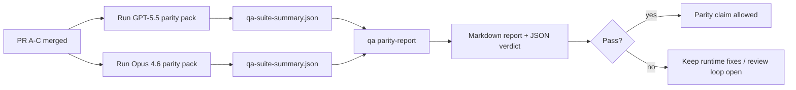

---
read_when:
    - Meninjau seri PR paritas GPT-5.5 / Codex
    - Menjaga arsitektur agentik enam kontrak di balik program paritas
summary: Cara meninjau program paritas GPT-5.5 / Codex sebagai empat unit penggabungan
title: Catatan pengelola paritas GPT-5.5 / Codex
x-i18n:
    generated_at: "2026-05-06T09:14:31Z"
    model: gpt-5.5
    provider: openai
    source_hash: 5752b4610f8b0d70b80d880ea10df75478b5f85ca431cdb73d3b61d745b23356
    source_path: help/gpt55-codex-agentic-parity-maintainers.md
    workflow: 16
---

Catatan ini menjelaskan cara meninjau program paritas GPT-5.5 / Codex sebagai empat unit penggabungan tanpa kehilangan arsitektur enam kontrak aslinya.

## Unit penggabungan

### PR A: eksekusi agentik ketat

Bertanggung jawab atas:

- `executionContract`
- tindak lanjut giliran yang sama dengan GPT-5 sebagai prioritas
- `update_plan` sebagai pelacakan progres non-terminal
- status terblokir eksplisit, bukan penghentian senyap yang hanya berupa rencana

Tidak bertanggung jawab atas:

- klasifikasi kegagalan auth/runtime
- kebenaran izin
- desain ulang replay/kelanjutan
- pembandingan paritas

### PR B: kebenaran runtime

Bertanggung jawab atas:

- kebenaran cakupan OAuth Codex
- klasifikasi kegagalan provider/runtime bertipe
- ketersediaan `/elevated full` yang jujur dan alasan terblokir

Tidak bertanggung jawab atas:

- normalisasi skema tool
- status replay/keaktifan
- gating benchmark

### PR C: kebenaran eksekusi

Bertanggung jawab atas:

- kompatibilitas tool OpenAI/Codex yang dimiliki provider
- penanganan skema ketat tanpa parameter
- pemunculan replay yang tidak valid
- visibilitas status tugas panjang yang dijeda, terblokir, dan ditinggalkan

Tidak bertanggung jawab atas:

- kelanjutan yang dipilih sendiri
- perilaku dialek Codex generik di luar hook provider
- gating benchmark

### PR D: harness paritas

Bertanggung jawab atas:

- paket skenario gelombang pertama GPT-5.5 vs Opus 4.6
- dokumentasi paritas
- laporan paritas dan mekanisme release-gate

Tidak bertanggung jawab atas:

- perubahan perilaku runtime di luar QA-lab
- simulasi auth/proxy/DNS di dalam harness

## Pemetaan kembali ke enam kontrak asli

| Kontrak asli                             | Unit penggabungan |
| ---------------------------------------- | ----------------- |
| Kebenaran transport/auth provider        | PR B              |
| Kompatibilitas kontrak/skema tool        | PR C              |
| Eksekusi giliran yang sama               | PR A              |
| Kebenaran izin                           | PR B              |
| Kebenaran replay/kelanjutan/keaktifan    | PR C              |
| Benchmark/gerbang rilis                  | PR D              |

## Urutan peninjauan

1. PR A
2. PR B
3. PR C
4. PR D

PR D adalah lapisan pembuktian. PR ini tidak boleh menjadi alasan PR kebenaran runtime tertunda.

## Yang perlu diperhatikan

### PR A

- Proses GPT-5 bertindak atau gagal tertutup, bukan berhenti pada komentar
- `update_plan` tidak lagi tampak seperti progres dengan sendirinya
- perilaku tetap memprioritaskan GPT-5 dan berada dalam cakupan Pi tertanam

### PR B

- kegagalan auth/proxy/runtime berhenti melebur ke penanganan generik "model gagal"
- `/elevated full` hanya dijelaskan tersedia ketika benar-benar tersedia
- alasan terblokir terlihat oleh model dan runtime yang menghadap pengguna

### PR C

- registrasi tool OpenAI/Codex ketat berperilaku dapat diprediksi
- tool tanpa parameter tidak gagal pada pemeriksaan skema ketat
- hasil replay dan Compaction mempertahankan status keaktifan yang jujur

### PR D

- paket skenario dapat dipahami dan direproduksi
- paket menyertakan jalur keamanan replay yang memutasi, bukan hanya alur baca-saja
- laporan dapat dibaca oleh manusia dan otomasi
- klaim paritas didukung bukti, bukan anekdot

Artefak yang diharapkan dari PR D:

- `qa-suite-report.md` / `qa-suite-summary.json` untuk setiap proses model
- `qa-agentic-parity-report.md` dengan perbandingan agregat dan tingkat skenario
- `qa-agentic-parity-summary.json` dengan putusan yang dapat dibaca mesin

## Gerbang rilis

Jangan mengklaim paritas atau keunggulan GPT-5.5 atas Opus 4.6 sampai:

- PR A, PR B, dan PR C sudah digabungkan
- PR D menjalankan paket paritas gelombang pertama dengan bersih
- suite regresi kebenaran runtime tetap hijau
- laporan paritas tidak menunjukkan kasus keberhasilan palsu dan tidak ada regresi dalam perilaku berhenti

Harness paritas bukan satu-satunya sumber bukti. Pertahankan pemisahan ini secara eksplisit dalam peninjauan:

- PR D bertanggung jawab atas perbandingan berbasis skenario GPT-5.5 vs Opus 4.6
- suite deterministik PR B tetap bertanggung jawab atas bukti kebenaran auth/proxy/DNS dan akses penuh

## Alur kerja penggabungan cepat untuk maintainer

Gunakan ini saat Anda siap mendaratkan PR paritas dan menginginkan urutan yang dapat diulang dengan risiko rendah.

1. Konfirmasi bar bukti terpenuhi sebelum penggabungan:
   - gejala yang dapat direproduksi atau pengujian yang gagal
   - akar penyebab terverifikasi dalam kode yang disentuh
   - perbaikan pada jalur yang terkait
   - pengujian regresi atau catatan verifikasi manual eksplisit
2. Triase/label sebelum penggabungan:
   - terapkan label auto-close `r:*` jika PR tidak boleh mendarat
   - pastikan kandidat penggabungan bebas dari utas blocker yang belum diselesaikan
3. Validasi secara lokal pada permukaan yang disentuh:
   - `pnpm check:changed`
   - `pnpm test:changed` saat pengujian berubah atau keyakinan perbaikan bug bergantung pada cakupan pengujian
4. Mendaratkan dengan alur maintainer standar (proses `/landpr`), lalu verifikasi:
   - perilaku auto-close issue tertaut
   - CI dan status pasca-penggabungan pada `main`
5. Setelah mendarat, jalankan pencarian duplikat untuk PR/issue terbuka terkait dan tutup hanya dengan referensi kanonis.

Jika salah satu item bar bukti tidak ada, minta perubahan alih-alih menggabungkan.

## Peta tujuan-ke-bukti

| Item gerbang penyelesaian                 | Pemilik utama | Artefak tinjauan                                                    |
| ----------------------------------------- | ------------- | ------------------------------------------------------------------- |
| Tidak ada macet yang hanya berupa rencana | PR A          | pengujian runtime agentik ketat dan `approval-turn-tool-followthrough` |
| Tidak ada progres palsu atau penyelesaian tool palsu | PR A + PR D   | jumlah keberhasilan palsu paritas plus detail laporan tingkat skenario |
| Tidak ada panduan `/elevated full` yang salah | PR B          | suite kebenaran runtime deterministik                               |
| Kegagalan replay/keaktifan tetap eksplisit | PR C + PR D   | suite siklus hidup/replay plus `compaction-retry-mutating-tool`      |
| GPT-5.5 menyamai atau mengungguli Opus 4.6 | PR D          | `qa-agentic-parity-report.md` dan `qa-agentic-parity-summary.json`   |

## Singkatan peninjau: sebelum vs sesudah

| Masalah yang terlihat pengguna sebelumnya                  | Sinyal tinjauan sesudah                                                              |
| ---------------------------------------------------------- | ------------------------------------------------------------------------------------ |
| GPT-5.5 berhenti setelah perencanaan                       | PR A menunjukkan perilaku bertindak-atau-terblokir, bukan penyelesaian hanya komentar |
| Penggunaan tool terasa rapuh dengan skema OpenAI/Codex ketat | PR C menjaga registrasi tool dan pemanggilan tanpa parameter tetap dapat diprediksi   |
| Petunjuk `/elevated full` terkadang menyesatkan            | PR B mengaitkan panduan dengan kemampuan runtime aktual dan alasan terblokir          |
| Tugas panjang dapat menghilang dalam ambiguitas replay/Compaction | PR C mengeluarkan status dijeda, terblokir, ditinggalkan, dan replay tidak valid yang eksplisit |
| Klaim paritas bersifat anekdot                             | PR D menghasilkan laporan plus putusan JSON dengan cakupan skenario yang sama pada kedua model |

## Terkait

- [Paritas agentik GPT-5.5 / Codex](/id/help/gpt55-codex-agentic-parity)
