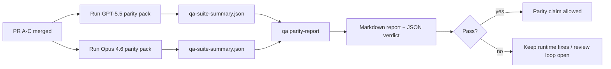

---
read_when:
    - Meninjau seri PR paritas GPT-5.5 / Codex
    - Memelihara arsitektur agentic enam-kontrak di balik program paritas
summary: Cara meninjau program paritas GPT-5.5 / Codex sebagai empat unit merge
title: Catatan maintainer paritas GPT-5.5 / Codex
x-i18n:
    generated_at: "2026-04-26T11:31:35Z"
    model: gpt-5.4
    provider: openai
    source_hash: 8de69081f5985954b88583880c36388dc47116c3351c15d135b8ab3a660058e3
    source_path: help/gpt55-codex-agentic-parity-maintainers.md
    workflow: 15
---

Catatan ini menjelaskan cara meninjau program paritas GPT-5.5 / Codex sebagai empat unit merge tanpa kehilangan arsitektur enam-kontrak aslinya.

## Unit merge

### PR A: eksekusi strict-agentic

Memiliki:

- `executionContract`
- follow-through giliran yang sama dengan GPT-5 sebagai prioritas
- `update_plan` sebagai pelacakan progres non-terminal
- state blocked eksplisit alih-alih berhenti diam-diam hanya dengan rencana

Tidak memiliki:

- klasifikasi kegagalan auth/runtime
- truthfulness izin
- perancangan ulang replay/continuation
- benchmarking paritas

### PR B: runtime truthfulness

Memiliki:

- kebenaran scope OAuth Codex
- klasifikasi kegagalan provider/runtime bertipe
- ketersediaan `/elevated full` yang jujur dan alasan blocked

Tidak memiliki:

- normalisasi skema tool
- state replay/liveness
- benchmark gating

### PR C: kebenaran eksekusi

Memiliki:

- kompatibilitas tool OpenAI/Codex milik provider
- penanganan skema strict tanpa parameter
- surfacing replay-invalid
- visibilitas state tugas panjang yang paused, blocked, dan abandoned

Tidak memiliki:

- continuation yang dipilih sendiri
- perilaku dialek Codex generik di luar hook provider
- benchmark gating

### PR D: harness paritas

Memiliki:

- paket skenario gelombang pertama GPT-5.5 vs Opus 4.6
- dokumentasi paritas
- mekanisme laporan paritas dan release gate

Tidak memiliki:

- perubahan perilaku runtime di luar QA-lab
- simulasi auth/proxy/DNS di dalam harness

## Pemetaan kembali ke enam kontrak asli

| Kontrak asli                             | Unit merge |
| ---------------------------------------- | ---------- |
| Kebenaran transport/auth provider        | PR B       |
| Kompatibilitas kontrak/skema tool        | PR C       |
| Eksekusi pada giliran yang sama          | PR A       |
| Truthfulness izin                        | PR B       |
| Kebenaran replay/continuation/liveness   | PR C       |
| Benchmark/release gate                   | PR D       |

## Urutan peninjauan

1. PR A
2. PR B
3. PR C
4. PR D

PR D adalah lapisan pembuktian. PR ini tidak boleh menjadi alasan PR kebenaran runtime tertunda.

## Hal yang perlu diperhatikan

### PR A

- Run GPT-5 bertindak atau gagal tertutup alih-alih berhenti pada komentar
- `update_plan` tidak lagi tampak seperti progres dengan sendirinya
- perilaku tetap berfokus pada GPT-5 dan bercakupan embedded-Pi

### PR B

- kegagalan auth/proxy/runtime berhenti runtuh menjadi penanganan generik “model failed”
- `/elevated full` hanya dijelaskan tersedia saat memang benar-benar tersedia
- alasan blocked terlihat oleh model maupun runtime yang menghadap pengguna

### PR C

- registrasi tool OpenAI/Codex strict berperilaku dapat diprediksi
- tool tanpa parameter tidak gagal pada pemeriksaan skema strict
- hasil replay dan Compaction mempertahankan state liveness yang jujur

### PR D

- paket skenario dapat dipahami dan direproduksi
- paket tersebut mencakup lane keamanan replay yang memutasi, bukan hanya alur read-only
- laporan dapat dibaca oleh manusia dan otomatisasi
- klaim paritas didukung bukti, bukan anekdotal

Artefak yang diharapkan dari PR D:

- `qa-suite-report.md` / `qa-suite-summary.json` untuk setiap run model
- `qa-agentic-parity-report.md` dengan perbandingan agregat dan level skenario
- `qa-agentic-parity-summary.json` dengan verdict yang dapat dibaca mesin

## Release gate

Jangan klaim paritas atau keunggulan GPT-5.5 atas Opus 4.6 sampai:

- PR A, PR B, dan PR C sudah di-merge
- PR D menjalankan paket paritas gelombang pertama dengan bersih
- suite regresi runtime-truthfulness tetap hijau
- laporan paritas tidak menunjukkan kasus fake-success dan tidak ada regresi dalam perilaku berhenti

Harness paritas bukan satu-satunya sumber bukti. Pertahankan pemisahan ini secara eksplisit dalam peninjauan:

- PR D memiliki perbandingan berbasis skenario GPT-5.5 vs Opus 4.6
- suite deterministik PR B tetap memiliki bukti auth/proxy/DNS dan truthfulness akses penuh

## Alur kerja merge maintainer cepat

Gunakan ini saat Anda siap melandaskan PR paritas dan menginginkan urutan yang dapat diulang serta berisiko rendah.

1. Konfirmasi bahwa standar bukti terpenuhi sebelum merge:
   - gejala yang dapat direproduksi atau pengujian yang gagal
   - akar penyebab yang terverifikasi dalam kode yang disentuh
   - perbaikan pada jalur yang terlibat
   - pengujian regresi atau catatan verifikasi manual yang eksplisit
2. Triage/beri label sebelum merge:
   - terapkan label auto-close `r:*` bila PR tidak boleh dilandaskan
   - jaga kandidat merge bebas dari thread pemblokir yang belum terselesaikan
3. Validasi secara lokal pada surface yang disentuh:
   - `pnpm check:changed`
   - `pnpm test:changed` saat pengujian berubah atau keyakinan perbaikan bug bergantung pada cakupan pengujian
4. Landaskan dengan alur maintainer standar (proses `/landpr`), lalu verifikasi:
   - perilaku auto-close issue yang terhubung
   - CI dan status pasca-merge di `main`
5. Setelah dilandaskan, jalankan pencarian duplikat untuk PR/issue terbuka terkait dan tutup hanya dengan referensi kanonis.

Jika salah satu item standar bukti hilang, minta perubahan alih-alih merge.

## Peta tujuan-ke-bukti

| Item gerbang penyelesaian                 | Pemilik utama | Artefak tinjauan                                                    |
| ---------------------------------------- | ------------- | ------------------------------------------------------------------- |
| Tidak ada macet hanya-rencana            | PR A          | pengujian runtime strict-agentic dan `approval-turn-tool-followthrough` |
| Tidak ada progres palsu atau penyelesaian tool palsu | PR A + PR D   | jumlah fake-success paritas ditambah detail laporan level skenario |
| Tidak ada panduan `/elevated full` yang salah | PR B       | suite runtime-truthfulness deterministik                           |
| Kegagalan replay/liveness tetap eksplisit | PR C + PR D | suite lifecycle/replay plus `compaction-retry-mutating-tool`       |
| GPT-5.5 menyamai atau melampaui Opus 4.6 | PR D         | `qa-agentic-parity-report.md` dan `qa-agentic-parity-summary.json` |

## Singkatan peninjau: sebelum vs sesudah

| Masalah yang terlihat pengguna sebelumnya                  | Sinyal tinjauan sesudahnya                                                              |
| ---------------------------------------------------------- | --------------------------------------------------------------------------------------- |
| GPT-5.5 berhenti setelah merencanakan                      | PR A menunjukkan perilaku bertindak-atau-block alih-alih penyelesaian hanya-komentar   |
| Penggunaan tool terasa rapuh dengan skema OpenAI/Codex strict | PR C menjaga registrasi tool dan pemanggilan tanpa parameter tetap dapat diprediksi |
| Petunjuk `/elevated full` terkadang menyesatkan            | PR B mengikat panduan ke kapabilitas runtime nyata dan alasan blocked                   |
| Tugas panjang dapat hilang dalam ambiguitas replay/Compaction | PR C mengeluarkan state paused, blocked, abandoned, dan replay-invalid yang eksplisit |
| Klaim paritas bersifat anekdotal                           | PR D menghasilkan laporan plus verdict JSON dengan cakupan skenario yang sama pada kedua model |

## Terkait

- [Paritas agentic GPT-5.5 / Codex](/id/help/gpt55-codex-agentic-parity)
