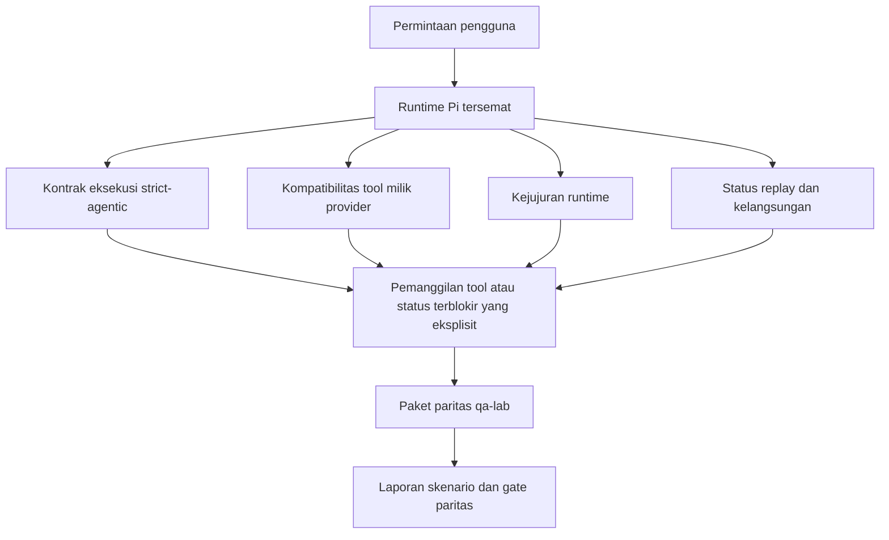
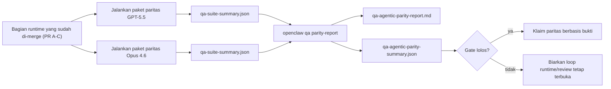

---
read_when:
    - Men-debug perilaku agen GPT-5.5 atau Codex
    - Membandingkan perilaku agentik OpenClaw di berbagai model frontier
    - Meninjau perbaikan strict-agentic, skema tool, elevation, dan replay
summary: Bagaimana OpenClaw menutup celah eksekusi agentik untuk GPT-5.5 dan model bergaya Codex
title: Paritas agentik GPT-5.5 / Codex
x-i18n:
    generated_at: "2026-04-26T11:31:39Z"
    model: gpt-5.4
    provider: openai
    source_hash: 8a3b9375cd9e9d95855c4a1135953e00fd7a939e52fb7b75342da3bde2d83fe1
    source_path: help/gpt55-codex-agentic-parity.md
    workflow: 15
---

# Paritas Agentik GPT-5.5 / Codex di OpenClaw

OpenClaw sudah bekerja dengan baik dengan model frontier yang menggunakan tool, tetapi GPT-5.5 dan model bergaya Codex masih berkinerja kurang baik dalam beberapa hal praktis:

- model dapat berhenti setelah membuat rencana alih-alih melakukan pekerjaannya
- model dapat menggunakan skema tool OpenAI/Codex yang strict secara tidak benar
- model dapat meminta `/elevated full` bahkan ketika akses penuh tidak memungkinkan
- model dapat kehilangan status tugas yang berjalan lama selama replay atau Compaction
- klaim paritas terhadap Claude Opus 4.6 didasarkan pada anekdot, bukan skenario yang dapat diulang

Program paritas ini menutup celah tersebut dalam empat bagian yang dapat ditinjau.

## Apa yang berubah

### PR A: eksekusi strict-agentic

Bagian ini menambahkan kontrak eksekusi `strict-agentic` opt-in untuk eksekusi Pi GPT-5 tersemat.

Saat diaktifkan, OpenClaw berhenti menerima giliran yang hanya berisi rencana sebagai penyelesaian yang “cukup baik”. Jika model hanya mengatakan apa yang ingin dilakukannya dan tidak benar-benar menggunakan tool atau membuat kemajuan, OpenClaw melakukan retry dengan steer act-now lalu gagal secara tertutup dengan status terblokir yang eksplisit alih-alih mengakhiri tugas secara diam-diam.

Ini paling meningkatkan pengalaman GPT-5.5 pada:

- tindak lanjut singkat “ok lakukan itu”
- tugas kode ketika langkah pertama sudah jelas
- alur di mana `update_plan` seharusnya menjadi pelacakan progres, bukan teks pengisi

### PR B: kejujuran runtime

Bagian ini membuat OpenClaw mengatakan yang sebenarnya tentang dua hal:

- mengapa pemanggilan provider/runtime gagal
- apakah `/elevated full` benar-benar tersedia

Artinya GPT-5.5 mendapatkan sinyal runtime yang lebih baik untuk scope yang hilang, kegagalan refresh auth, kegagalan auth HTML 403, masalah proxy, kegagalan DNS atau timeout, dan mode akses penuh yang diblokir. Model jadi lebih kecil kemungkinannya untuk berhalusinasi tentang remediasi yang salah atau terus meminta mode izin yang tidak dapat disediakan runtime.

### PR C: ketepatan eksekusi

Bagian ini meningkatkan dua jenis ketepatan:

- kompatibilitas skema tool OpenAI/Codex milik provider
- penampakan replay dan kelangsungan tugas panjang

Pekerjaan kompatibilitas tool mengurangi friksi skema untuk pendaftaran tool OpenAI/Codex yang strict, terutama di sekitar tool tanpa parameter dan ekspektasi root object yang strict. Pekerjaan replay/kelangsungan membuat tugas yang berjalan lama lebih mudah diamati, sehingga status jeda, terblokir, dan ditinggalkan terlihat alih-alih menghilang ke dalam teks kegagalan generik.

### PR D: harness paritas

Bagian ini menambahkan paket paritas qa-lab gelombang pertama sehingga GPT-5.5 dan Opus 4.6 dapat diuji melalui skenario yang sama dan dibandingkan menggunakan bukti bersama.

Paket paritas adalah lapisan pembuktian. Ini tidak mengubah perilaku runtime dengan sendirinya.

Setelah Anda memiliki dua artefak `qa-suite-summary.json`, buat perbandingan release-gate dengan:

```bash
pnpm openclaw qa parity-report \
  --repo-root . \
  --candidate-summary .artifacts/qa-e2e/gpt55/qa-suite-summary.json \
  --baseline-summary .artifacts/qa-e2e/opus46/qa-suite-summary.json \
  --output-dir .artifacts/qa-e2e/parity
```

Perintah tersebut menulis:

- laporan Markdown yang dapat dibaca manusia
- verdict JSON yang dapat dibaca mesin
- hasil gate `pass` / `fail` yang eksplisit

## Mengapa ini meningkatkan GPT-5.5 dalam praktik

Sebelum pekerjaan ini, GPT-5.5 di OpenClaw dapat terasa kurang agentik dibandingkan Opus dalam sesi coding nyata karena runtime mentoleransi perilaku yang sangat merugikan untuk model bergaya GPT-5:

- giliran yang hanya berisi komentar
- friksi skema di sekitar tool
- umpan balik izin yang samar
- kerusakan replay atau Compaction yang diam-diam

Tujuannya bukan membuat GPT-5.5 meniru Opus. Tujuannya adalah memberi GPT-5.5 kontrak runtime yang menghargai progres nyata, menyediakan semantik tool dan izin yang lebih bersih, dan mengubah mode kegagalan menjadi status yang eksplisit dan dapat dibaca manusia maupun mesin.

Itu mengubah pengalaman pengguna dari:

- “model punya rencana yang bagus tapi berhenti”

menjadi:

- “model bertindak, atau OpenClaw menampilkan alasan persis mengapa model tidak bisa”

## Sebelum vs sesudah untuk pengguna GPT-5.5

| Sebelum program ini                                                                         | Setelah PR A-D                                                                          |
| ------------------------------------------------------------------------------------------- | --------------------------------------------------------------------------------------- |
| GPT-5.5 dapat berhenti setelah rencana yang masuk akal tanpa mengambil langkah tool berikutnya | PR A mengubah “hanya rencana” menjadi “bertindak sekarang atau tampilkan status terblokir” |
| Skema tool strict dapat menolak tool tanpa parameter atau berbentuk OpenAI/Codex dengan cara yang membingungkan | PR C membuat pendaftaran dan pemanggilan tool milik provider lebih dapat diprediksi |
| Panduan `/elevated full` bisa samar atau salah pada runtime yang diblokir                  | PR B memberi GPT-5.5 dan pengguna petunjuk runtime dan izin yang jujur                 |
| Kegagalan replay atau Compaction bisa terasa seperti tugas diam-diam menghilang            | PR C menampilkan hasil paused, blocked, abandoned, dan replay-invalid secara eksplisit |
| “GPT-5.5 terasa lebih buruk daripada Opus” sebagian besar berupa anekdot                   | PR D mengubah itu menjadi paket skenario yang sama, metrik yang sama, dan gate pass/fail yang keras |

## Arsitektur



## Alur rilis



## Paket skenario

Paket paritas gelombang pertama saat ini mencakup lima skenario:

### `approval-turn-tool-followthrough`

Memeriksa bahwa model tidak berhenti pada “Saya akan melakukannya” setelah approval singkat. Model seharusnya mengambil aksi konkret pertama pada giliran yang sama.

### `model-switch-tool-continuity`

Memeriksa bahwa pekerjaan yang menggunakan tool tetap koheren melintasi batas perpindahan model/runtime alih-alih di-reset menjadi komentar atau kehilangan konteks eksekusi.

### `source-docs-discovery-report`

Memeriksa bahwa model dapat membaca source dan dokumen, menyintesis temuan, dan melanjutkan tugas secara agentik alih-alih menghasilkan ringkasan tipis dan berhenti terlalu awal.

### `image-understanding-attachment`

Memeriksa bahwa tugas mode campuran yang melibatkan lampiran tetap dapat ditindaklanjuti dan tidak runtuh menjadi narasi yang samar.

### `compaction-retry-mutating-tool`

Memeriksa bahwa tugas dengan penulisan mutasi nyata menjaga replay-unsafety tetap eksplisit alih-alih diam-diam tampak replay-safe jika eksekusi mengalami Compaction, retry, atau kehilangan status balasan di bawah tekanan.

## Matriks skenario

| Skenario                           | Apa yang diuji                          | Perilaku GPT-5.5 yang baik                                                    | Sinyal kegagalan                                                               |
| ---------------------------------- | --------------------------------------- | ----------------------------------------------------------------------------- | ------------------------------------------------------------------------------ |
| `approval-turn-tool-followthrough` | Giliran approval singkat setelah rencana | Segera memulai aksi tool konkret pertama alih-alih mengulangi niat          | tindak lanjut hanya rencana, tidak ada aktivitas tool, atau giliran terblokir tanpa pemblokir nyata |
| `model-switch-tool-continuity`     | Perpindahan runtime/model saat tool digunakan | Mempertahankan konteks tugas dan terus bertindak secara koheren            | di-reset menjadi komentar, kehilangan konteks tool, atau berhenti setelah perpindahan |
| `source-docs-discovery-report`     | Pembacaan source + sintesis + aksi      | Menemukan source, menggunakan tool, dan menghasilkan laporan berguna tanpa macet | ringkasan tipis, pekerjaan tool hilang, atau berhenti di giliran yang tidak lengkap |
| `image-understanding-attachment`   | Pekerjaan agentik berbasis lampiran     | Menafsirkan lampiran, menghubungkannya ke tool, dan melanjutkan tugas        | narasi samar, lampiran diabaikan, atau tidak ada aksi konkret berikutnya      |
| `compaction-retry-mutating-tool`   | Pekerjaan mutasi di bawah tekanan Compaction | Melakukan penulisan nyata dan menjaga replay-unsafety tetap eksplisit setelah efek samping | penulisan mutasi terjadi tetapi keamanan replay tersirat, hilang, atau kontradiktif |

## Gate rilis

GPT-5.5 hanya dapat dianggap setara atau lebih baik ketika runtime yang sudah di-merge lolos paket paritas dan regresi kejujuran runtime pada saat yang sama.

Hasil yang diwajibkan:

- tidak ada macet hanya-rencana saat aksi tool berikutnya jelas
- tidak ada penyelesaian palsu tanpa eksekusi nyata
- tidak ada panduan `/elevated full` yang salah
- tidak ada replay atau Compaction abandonment yang diam-diam
- metrik paket paritas yang setidaknya sekuat baseline Opus 4.6 yang disepakati

Untuk harness gelombang pertama, gate membandingkan:

- completion rate
- unintended-stop rate
- valid-tool-call rate
- fake-success count

Bukti paritas sengaja dipisah ke dua lapisan:

- PR D membuktikan perilaku GPT-5.5 vs Opus 4.6 pada skenario yang sama dengan qa-lab
- suite deterministik PR B membuktikan kejujuran auth, proxy, DNS, dan `/elevated full` di luar harness

## Matriks tujuan-ke-bukti

| Item gate penyelesaian                                    | PR pemilik   | Sumber bukti                                                       | Sinyal lolos                                                                             |
| --------------------------------------------------------- | ------------ | ------------------------------------------------------------------ | ---------------------------------------------------------------------------------------- |
| GPT-5.5 tidak lagi macet setelah membuat rencana          | PR A         | `approval-turn-tool-followthrough` plus suite runtime PR A         | giliran approval memicu pekerjaan nyata atau status terblokir yang eksplisit            |
| GPT-5.5 tidak lagi memalsukan progres atau penyelesaian tool palsu | PR A + PR D | hasil skenario laporan paritas dan fake-success count              | tidak ada hasil lolos yang mencurigakan dan tidak ada penyelesaian yang hanya komentar   |
| GPT-5.5 tidak lagi memberi panduan `/elevated full` palsu | PR B         | suite kejujuran deterministik                                      | alasan pemblokiran dan petunjuk akses penuh tetap akurat terhadap runtime                |
| Kegagalan replay/kelangsungan tetap eksplisit             | PR C + PR D  | suite siklus hidup/replay PR C plus `compaction-retry-mutating-tool` | pekerjaan mutasi menjaga replay-unsafety tetap eksplisit alih-alih diam-diam menghilang |
| GPT-5.5 menyamai atau melampaui Opus 4.6 pada metrik yang disepakati | PR D | `qa-agentic-parity-report.md` dan `qa-agentic-parity-summary.json` | cakupan skenario yang sama dan tidak ada regresi pada completion, perilaku berhenti, atau penggunaan tool yang valid |

## Cara membaca verdict paritas

Gunakan verdict dalam `qa-agentic-parity-summary.json` sebagai keputusan akhir yang dapat dibaca mesin untuk paket paritas gelombang pertama.

- `pass` berarti GPT-5.5 mencakup skenario yang sama seperti Opus 4.6 dan tidak mengalami regresi pada metrik agregat yang disepakati.
- `fail` berarti setidaknya satu gate keras terpicu: completion lebih lemah, unintended stop lebih buruk, penggunaan tool valid lebih lemah, ada kasus fake-success, atau cakupan skenario tidak cocok.
- “shared/base CI issue” bukan hasil paritas itu sendiri. Jika noise CI di luar PR D memblokir sebuah eksekusi, verdict seharusnya menunggu eksekusi runtime hasil merge yang bersih alih-alih disimpulkan dari log era branch.
- Kejujuran auth, proxy, DNS, dan `/elevated full` tetap berasal dari suite deterministik PR B, jadi klaim rilis final membutuhkan keduanya: verdict paritas PR D yang lulus dan cakupan kejujuran PR B yang hijau.

## Siapa yang sebaiknya mengaktifkan `strict-agentic`

Gunakan `strict-agentic` ketika:

- agen diharapkan bertindak segera saat langkah berikutnya sudah jelas
- model keluarga GPT-5.5 atau Codex adalah runtime utama
- Anda lebih memilih status terblokir yang eksplisit daripada balasan yang hanya berupa rekap “membantu”

Pertahankan kontrak default ketika:

- Anda menginginkan perilaku longgar yang sudah ada
- Anda tidak menggunakan model keluarga GPT-5
- Anda sedang menguji prompt alih-alih penegakan runtime

## Terkait

- [Catatan maintainer paritas GPT-5.5 / Codex](/id/help/gpt55-codex-agentic-parity-maintainers)
