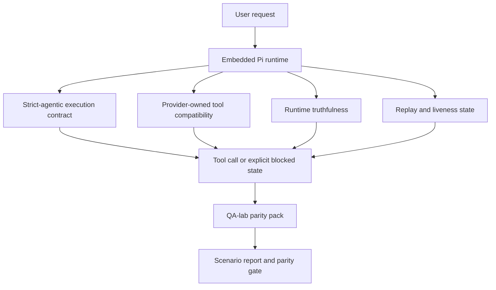
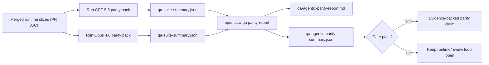

---
read_when:
    - Men-debug perilaku agen GPT-5.5 atau Codex
    - Membandingkan perilaku agentik OpenClaw di berbagai model terdepan
    - Meninjau perbaikan agentik ketat, skema alat, eskalasi, dan pemutaran ulang
summary: Bagaimana OpenClaw menutup kesenjangan eksekusi agentik untuk GPT-5.5 dan model bergaya Codex
title: Paritas agentik GPT-5.5 / Codex
x-i18n:
    generated_at: "2026-05-06T09:15:03Z"
    model: gpt-5.5
    provider: openai
    source_hash: bbc32f418dfffe2786093fa6b42b19f92a2d382c9408dfc55dd0154d67959390
    source_path: help/gpt55-codex-agentic-parity.md
    workflow: 16
---

OpenClaw sudah bekerja dengan baik dengan model frontier yang menggunakan alat, tetapi model bergaya GPT-5.5 dan Codex masih berkinerja kurang baik dalam beberapa cara praktis:

- model bisa berhenti setelah membuat rencana alih-alih mengerjakan tugas
- model bisa menggunakan skema alat OpenAI/Codex yang ketat secara keliru
- model bisa meminta `/elevated full` bahkan ketika akses penuh tidak mungkin
- model bisa kehilangan status tugas yang berjalan lama selama replay atau compaction
- klaim paritas terhadap Claude Opus 4.6 didasarkan pada anekdot, bukan skenario yang dapat diulang

Program paritas ini memperbaiki celah tersebut dalam empat bagian yang dapat ditinjau.

## Yang berubah

### PR A: eksekusi strict-agentic

Bagian ini menambahkan kontrak eksekusi `strict-agentic` opsional untuk proses Pi GPT-5 tertanam.

Saat diaktifkan, OpenClaw berhenti menerima giliran yang hanya berisi rencana sebagai penyelesaian yang "cukup baik". Jika model hanya mengatakan apa yang ingin dilakukannya dan tidak benar-benar menggunakan alat atau membuat kemajuan, OpenClaw mencoba ulang dengan arahan untuk bertindak sekarang, lalu gagal tertutup dengan status terblokir eksplisit alih-alih mengakhiri tugas secara diam-diam.

Ini paling meningkatkan pengalaman GPT-5.5 pada:

- tindak lanjut singkat seperti "ok lakukan"
- tugas kode ketika langkah pertama sudah jelas
- alur saat `update_plan` seharusnya menjadi pelacakan kemajuan, bukan teks pengisi

### PR B: kebenaran runtime

Bagian ini membuat OpenClaw menyampaikan kebenaran tentang dua hal:

- mengapa panggilan provider/runtime gagal
- apakah `/elevated full` benar-benar tersedia

Artinya, GPT-5.5 mendapat sinyal runtime yang lebih baik untuk cakupan yang hilang, kegagalan penyegaran auth, kegagalan auth HTML 403, masalah proxy, kegagalan DNS atau timeout, dan mode akses penuh yang diblokir. Model menjadi lebih kecil kemungkinannya menghalusinasikan perbaikan yang salah atau terus meminta mode izin yang tidak dapat disediakan runtime.

### PR C: ketepatan eksekusi

Bagian ini meningkatkan dua jenis ketepatan:

- kompatibilitas skema alat OpenAI/Codex yang dimiliki provider
- pemunculan liveness untuk replay dan tugas panjang

Pekerjaan kompatibilitas alat mengurangi gesekan skema untuk pendaftaran alat OpenAI/Codex yang ketat, terutama di sekitar alat tanpa parameter dan ekspektasi root objek yang ketat. Pekerjaan replay/liveness membuat tugas yang berjalan lama lebih mudah diamati, sehingga status dijeda, terblokir, dan ditinggalkan terlihat alih-alih menghilang ke dalam teks kegagalan generik.

### PR D: harness paritas

Bagian ini menambahkan paket paritas QA-lab gelombang pertama sehingga GPT-5.5 dan Opus 4.6 dapat dijalankan melalui skenario yang sama dan dibandingkan menggunakan bukti bersama.

Paket paritas adalah lapisan pembuktian. Paket ini tidak mengubah perilaku runtime dengan sendirinya.

Setelah Anda memiliki dua artefak `qa-suite-summary.json`, buat perbandingan release-gate dengan:

```bash
pnpm openclaw qa parity-report \
  --repo-root . \
  --candidate-summary .artifacts/qa-e2e/gpt55/qa-suite-summary.json \
  --baseline-summary .artifacts/qa-e2e/opus46/qa-suite-summary.json \
  --output-dir .artifacts/qa-e2e/parity
```

Perintah tersebut menulis:

- laporan Markdown yang dapat dibaca manusia
- putusan JSON yang dapat dibaca mesin
- hasil gate `pass` / `fail` yang eksplisit

## Mengapa ini meningkatkan GPT-5.5 dalam praktik

Sebelum pekerjaan ini, GPT-5.5 di OpenClaw bisa terasa kurang agentic dibanding Opus dalam sesi coding nyata karena runtime menoleransi perilaku yang sangat merugikan untuk model bergaya GPT-5:

- giliran yang hanya berisi komentar
- gesekan skema di sekitar alat
- umpan balik izin yang samar
- kerusakan replay atau compaction yang diam-diam

Tujuannya bukan membuat GPT-5.5 meniru Opus. Tujuannya adalah memberi GPT-5.5 kontrak runtime yang menghargai kemajuan nyata, menyediakan semantik alat dan izin yang lebih bersih, serta mengubah mode kegagalan menjadi status eksplisit yang dapat dibaca mesin dan manusia.

Itu mengubah pengalaman pengguna dari:

- "model punya rencana yang bagus tetapi berhenti"

menjadi:

- "model bertindak, atau OpenClaw memunculkan alasan persis mengapa model tidak bisa bertindak"

## Sebelum vs sesudah untuk pengguna GPT-5.5

| Sebelum program ini                                                                            | Setelah PR A-D                                                                             |
| ---------------------------------------------------------------------------------------------- | ---------------------------------------------------------------------------------------- |
| GPT-5.5 bisa berhenti setelah rencana yang masuk akal tanpa mengambil langkah alat berikutnya                   | PR A mengubah "hanya rencana" menjadi "bertindak sekarang atau munculkan status terblokir"                         |
| Skema alat yang ketat bisa menolak alat tanpa parameter atau berbentuk OpenAI/Codex dengan cara yang membingungkan | PR C membuat pendaftaran dan pemanggilan alat yang dimiliki provider lebih dapat diprediksi              |
| Panduan `/elevated full` bisa samar atau salah di runtime yang diblokir                          | PR B memberi GPT-5.5 dan pengguna petunjuk runtime dan izin yang benar                    |
| Kegagalan replay atau compaction bisa terasa seperti tugas menghilang secara diam-diam                    | PR C memunculkan hasil dijeda, terblokir, ditinggalkan, dan replay-invalid secara eksplisit         |
| "GPT-5.5 terasa lebih buruk daripada Opus" sebagian besar bersifat anekdotal                                           | PR D mengubahnya menjadi paket skenario yang sama, metrik yang sama, dan gate pass/fail yang tegas |

## Arsitektur



## Alur rilis



## Paket skenario

Paket paritas gelombang pertama saat ini mencakup lima skenario:

### `approval-turn-tool-followthrough`

Memeriksa bahwa model tidak berhenti di "I'll do that" setelah persetujuan singkat. Model harus mengambil tindakan konkret pertama dalam giliran yang sama.

### `model-switch-tool-continuity`

Memeriksa bahwa pekerjaan yang menggunakan alat tetap koheren melintasi batas pergantian model/runtime alih-alih direset menjadi komentar atau kehilangan konteks eksekusi.

### `source-docs-discovery-report`

Memeriksa bahwa model dapat membaca sumber dan dokumen, menyintesis temuan, serta melanjutkan tugas secara agentic alih-alih menghasilkan ringkasan tipis dan berhenti lebih awal.

### `image-understanding-attachment`

Memeriksa bahwa tugas mode campuran yang melibatkan lampiran tetap dapat ditindaklanjuti dan tidak runtuh menjadi narasi samar.

### `compaction-retry-mutating-tool`

Memeriksa bahwa tugas dengan penulisan mutasi nyata menjaga ketidakamanan replay tetap eksplisit alih-alih diam-diam tampak aman untuk replay jika proses mengalami compaction, mencoba ulang, atau kehilangan status balasan di bawah tekanan.

## Matriks skenario

| Skenario                           | Yang diuji                           | Perilaku GPT-5.5 yang baik                                                          | Sinyal kegagalan                                                                 |
| ---------------------------------- | --------------------------------------- | ------------------------------------------------------------------------------ | ------------------------------------------------------------------------------ |
| `approval-turn-tool-followthrough` | Giliran persetujuan singkat setelah rencana       | Segera memulai tindakan alat konkret pertama alih-alih menyatakan ulang niat  | tindak lanjut hanya rencana, tidak ada aktivitas alat, atau giliran terblokir tanpa pemblokir nyata  |
| `model-switch-tool-continuity`     | Pergantian runtime/model saat menggunakan alat  | Mempertahankan konteks tugas dan terus bertindak secara koheren                         | reset menjadi komentar, kehilangan konteks alat, atau berhenti setelah pergantian              |
| `source-docs-discovery-report`     | Pembacaan sumber + sintesis + tindakan     | Menemukan sumber, menggunakan alat, dan menghasilkan laporan yang berguna tanpa macet       | ringkasan tipis, pekerjaan alat hilang, atau penghentian giliran yang belum selesai                       |
| `image-understanding-attachment`   | Pekerjaan agentic berbasis lampiran          | Menafsirkan lampiran, menghubungkannya ke alat, dan melanjutkan tugas        | narasi samar, lampiran diabaikan, atau tidak ada tindakan konkret berikutnya                |
| `compaction-retry-mutating-tool`   | Pekerjaan mutasi di bawah tekanan compaction | Melakukan penulisan nyata dan menjaga ketidakamanan replay tetap eksplisit setelah efek samping | penulisan mutasi terjadi tetapi keamanan replay tersirat, hilang, atau kontradiktif |

## Gate rilis

GPT-5.5 hanya dapat dianggap setara atau lebih baik ketika runtime yang digabungkan melewati paket paritas dan regresi kebenaran runtime pada saat yang sama.

Hasil yang diperlukan:

- tidak ada macet hanya-rencana ketika tindakan alat berikutnya jelas
- tidak ada penyelesaian palsu tanpa eksekusi nyata
- tidak ada panduan `/elevated full` yang salah
- tidak ada pengabaian replay atau compaction secara diam-diam
- metrik paket paritas yang setidaknya sekuat baseline Opus 4.6 yang disepakati

Untuk harness gelombang pertama, gate membandingkan:

- tingkat penyelesaian
- tingkat penghentian tak disengaja
- tingkat panggilan alat yang valid
- jumlah fake-success

Bukti paritas sengaja dipisah dalam dua lapisan:

- PR D membuktikan perilaku GPT-5.5 vs Opus 4.6 pada skenario yang sama dengan QA-lab
- Suite deterministik PR B membuktikan kebenaran auth, proxy, DNS, dan `/elevated full` di luar harness

## Matriks tujuan-ke-bukti

| Item gate penyelesaian                                     | PR pemilik   | Sumber bukti                                                    | Sinyal lolos                                                                              |
| -------------------------------------------------------- | ----------- | ------------------------------------------------------------------ | ---------------------------------------------------------------------------------------- |
| GPT-5.5 tidak lagi macet setelah perencanaan                  | PR A        | `approval-turn-tool-followthrough` plus suite runtime PR A        | giliran persetujuan memicu pekerjaan nyata atau status terblokir eksplisit                            |
| GPT-5.5 tidak lagi memalsukan kemajuan atau penyelesaian alat palsu | PR A + PR D | hasil skenario laporan paritas dan jumlah fake-success             | tidak ada hasil lolos yang mencurigakan dan tidak ada penyelesaian hanya-komentar                             |
| GPT-5.5 tidak lagi memberi panduan `/elevated full` yang salah  | PR B        | suite kebenaran deterministik                                  | alasan terblokir dan petunjuk akses penuh tetap akurat terhadap runtime                              |
| Kegagalan replay/liveness tetap eksplisit                   | PR C + PR D | suite lifecycle/replay PR C plus `compaction-retry-mutating-tool` | pekerjaan mutasi menjaga ketidakamanan replay tetap eksplisit alih-alih menghilang secara diam-diam            |
| GPT-5.5 menyamai atau mengalahkan Opus 4.6 pada metrik yang disepakati  | PR D        | `qa-agentic-parity-report.md` dan `qa-agentic-parity-summary.json` | cakupan skenario yang sama dan tidak ada regresi pada penyelesaian, perilaku berhenti, atau penggunaan alat yang valid |

## Cara membaca putusan paritas

Gunakan putusan di `qa-agentic-parity-summary.json` sebagai keputusan akhir yang dapat dibaca mesin untuk paket paritas gelombang pertama.

- `pass` berarti GPT-5.5 mencakup skenario yang sama seperti Opus 4.6 dan tidak mengalami regresi pada metrik agregat yang disepakati.
- `fail` berarti setidaknya satu hard gate terpicu: penyelesaian yang lebih lemah, penghentian tidak disengaja yang lebih buruk, penggunaan alat valid yang lebih lemah, kasus keberhasilan palsu apa pun, atau cakupan skenario yang tidak cocok.
- "masalah CI bersama/dasar" bukan merupakan hasil paritas itu sendiri. Jika gangguan CI di luar PR D memblokir suatu run, putusan harus menunggu eksekusi runtime tergabung yang bersih, bukan disimpulkan dari log era branch.
- Autentikasi, proksi, DNS, dan kejujuran `/elevated full` masih berasal dari suite deterministik PR B, jadi klaim rilis final membutuhkan keduanya: putusan paritas PR D yang lulus dan cakupan kejujuran PR B yang hijau.

## Siapa yang harus mengaktifkan `strict-agentic`

Gunakan `strict-agentic` ketika:

- agen diharapkan bertindak segera ketika langkah berikutnya sudah jelas
- GPT-5.5 atau model keluarga Codex adalah runtime utama
- Anda lebih memilih status terblokir yang eksplisit daripada balasan yang "membantu" tetapi hanya berupa rangkuman ulang

Pertahankan kontrak default ketika:

- Anda menginginkan perilaku longgar yang sudah ada
- Anda tidak menggunakan model keluarga GPT-5
- Anda sedang menguji prompt, bukan penegakan runtime

## Terkait

- [Catatan maintainer paritas GPT-5.5 / Codex](/id/help/gpt55-codex-agentic-parity-maintainers)
