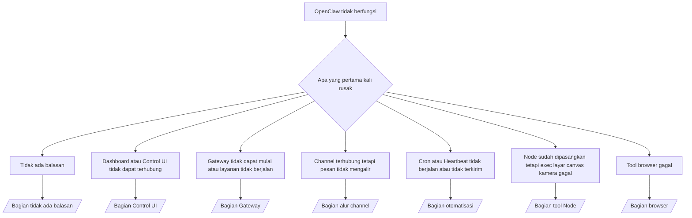

---
read_when:
    - OpenClaw tidak berfungsi dan Anda membutuhkan jalur tercepat menuju perbaikan
    - Anda menginginkan alur triase sebelum masuk ke runbook mendalam
summary: Hub pemecahan masalah berbasis gejala untuk OpenClaw
title: Pemecahan Masalah Umum
x-i18n:
    generated_at: "2026-04-20T09:28:16Z"
    model: gpt-5.4
    provider: openai
    source_hash: cc5d8c9f804084985c672c5a003ce866e8142ab99fe81abb7a0d38e22aea4b88
    source_path: help/troubleshooting.md
    workflow: 15
---

# Pemecahan Masalah

Jika Anda hanya punya 2 menit, gunakan halaman ini sebagai pintu masuk triase.

## 60 detik pertama

Jalankan urutan ini persis sesuai urutan:

```bash
openclaw status
openclaw status --all
openclaw gateway probe
openclaw gateway status
openclaw doctor
openclaw channels status --probe
openclaw logs --follow
```

Output yang baik dalam satu baris:

- `openclaw status` → menampilkan channel yang dikonfigurasi dan tidak ada error auth yang jelas.
- `openclaw status --all` → laporan lengkap tersedia dan dapat dibagikan.
- `openclaw gateway probe` → target gateway yang diharapkan dapat dijangkau (`Reachable: yes`). `Capability: ...` memberi tahu tingkat auth apa yang dapat dibuktikan probe, dan `Read probe: limited - missing scope: operator.read` adalah diagnostik yang menurun, bukan kegagalan koneksi.
- `openclaw gateway status` → `Runtime: running`, `Connectivity probe: ok`, dan baris `Capability: ...` yang masuk akal. Gunakan `--require-rpc` jika Anda juga memerlukan bukti RPC cakupan baca.
- `openclaw doctor` → tidak ada error konfigurasi/layanan yang memblokir.
- `openclaw channels status --probe` → gateway yang dapat dijangkau mengembalikan
  status transport per-akun secara live beserta hasil probe/audit seperti `works` atau `audit ok`; jika
  gateway tidak dapat dijangkau, perintah kembali ke ringkasan berbasis konfigurasi saja.
- `openclaw logs --follow` → aktivitas stabil, tanpa error fatal yang berulang.

## Anthropic long context 429

Jika Anda melihat:
`HTTP 429: rate_limit_error: Extra usage is required for long context requests`,
buka [/gateway/troubleshooting#anthropic-429-extra-usage-required-for-long-context](/id/gateway/troubleshooting#anthropic-429-extra-usage-required-for-long-context).

## Backend lokal yang kompatibel OpenAI bekerja secara langsung tetapi gagal di OpenClaw

Jika backend `/v1` lokal atau self-hosted Anda merespons probe langsung
`/v1/chat/completions` kecil tetapi gagal pada `openclaw infer model run` atau turn
agent normal:

1. Jika error menyebut `messages[].content` mengharapkan string, setel
   `models.providers.<provider>.models[].compat.requiresStringContent: true`.
2. Jika backend masih gagal hanya pada turn agent OpenClaw, setel
   `models.providers.<provider>.models[].compat.supportsTools: false` lalu coba lagi.
3. Jika panggilan langsung yang kecil tetap bekerja tetapi prompt OpenClaw yang lebih besar membuat
   backend crash, anggap masalah yang tersisa sebagai keterbatasan model/server upstream dan
   lanjutkan ke runbook mendalam:
   [/gateway/troubleshooting#local-openai-compatible-backend-passes-direct-probes-but-agent-runs-fail](/id/gateway/troubleshooting#local-openai-compatible-backend-passes-direct-probes-but-agent-runs-fail)

## Instalasi Plugin gagal dengan ekstensi openclaw yang hilang

Jika instalasi gagal dengan `package.json missing openclaw.extensions`, paket Plugin
menggunakan bentuk lama yang tidak lagi diterima oleh OpenClaw.

Perbaiki di paket Plugin:

1. Tambahkan `openclaw.extensions` ke `package.json`.
2. Arahkan entri ke file runtime hasil build (biasanya `./dist/index.js`).
3. Publikasikan ulang Plugin lalu jalankan `openclaw plugins install <package>` lagi.

Contoh:

```json
{
  "name": "@openclaw/my-plugin",
  "version": "1.2.3",
  "openclaw": {
    "extensions": ["./dist/index.js"]
  }
}
```

Referensi: [Arsitektur Plugin](/id/plugins/architecture)

## Pohon keputusan



<AccordionGroup>
  <Accordion title="Tidak ada balasan">
    ```bash
    openclaw status
    openclaw gateway status
    openclaw channels status --probe
    openclaw pairing list --channel <channel> [--account <id>]
    openclaw logs --follow
    ```

    Output yang baik terlihat seperti:

    - `Runtime: running`
    - `Connectivity probe: ok`
    - `Capability: read-only`, `write-capable`, atau `admin-capable`
    - Channel Anda menunjukkan transport terhubung dan, jika didukung, `works` atau `audit ok` di `channels status --probe`
    - Pengirim terlihat disetujui (atau kebijakan DM terbuka/allowlist)

    Signature log umum:

    - `drop guild message (mention required` → gating mention memblokir pesan di Discord.
    - `pairing request` → pengirim belum disetujui dan sedang menunggu persetujuan pairing DM.
    - `blocked` / `allowlist` di log channel → pengirim, room, atau grup difilter.

    Halaman mendalam:

    - [/gateway/troubleshooting#no-replies](/id/gateway/troubleshooting#no-replies)
    - [/channels/troubleshooting](/id/channels/troubleshooting)
    - [/channels/pairing](/id/channels/pairing)

  </Accordion>

  <Accordion title="Dashboard atau Control UI tidak dapat terhubung">
    ```bash
    openclaw status
    openclaw gateway status
    openclaw logs --follow
    openclaw doctor
    openclaw channels status --probe
    ```

    Output yang baik terlihat seperti:

    - `Dashboard: http://...` ditampilkan di `openclaw gateway status`
    - `Connectivity probe: ok`
    - `Capability: read-only`, `write-capable`, atau `admin-capable`
    - Tidak ada loop auth di log

    Signature log umum:

    - `device identity required` → HTTP/konteks non-aman tidak dapat menyelesaikan auth perangkat.
    - `origin not allowed` → browser `Origin` tidak diizinkan untuk target gateway
      Control UI.
    - `AUTH_TOKEN_MISMATCH` dengan petunjuk retry (`canRetryWithDeviceToken=true`) → satu retry device-token tepercaya dapat terjadi secara otomatis.
    - Retry token cache itu menggunakan kembali kumpulan scope cache yang disimpan bersama
      token perangkat yang dipasangkan. Pemanggil `deviceToken` eksplisit / `scopes` eksplisit mempertahankan
      kumpulan scope yang mereka minta.
    - Pada jalur async Tailscale Serve Control UI, upaya gagal untuk
      `{scope, ip}` yang sama diserialkan sebelum limiter mencatat kegagalan, sehingga
      retry buruk kedua yang bersamaan sudah bisa menampilkan `retry later`.
    - `too many failed authentication attempts (retry later)` dari origin browser localhost
      → kegagalan berulang dari `Origin` yang sama dikunci sementara; origin localhost lain menggunakan bucket terpisah.
    - `unauthorized` berulang setelah retry itu → token/password salah, mode auth tidak cocok, atau token perangkat yang dipasangkan sudah usang.
    - `gateway connect failed:` → UI menargetkan URL/port yang salah atau gateway tidak dapat dijangkau.

    Halaman mendalam:

    - [/gateway/troubleshooting#dashboard-control-ui-connectivity](/id/gateway/troubleshooting#dashboard-control-ui-connectivity)
    - [/web/control-ui](/web/control-ui)
    - [/gateway/authentication](/id/gateway/authentication)

  </Accordion>

  <Accordion title="Gateway tidak dapat mulai atau layanan terpasang tetapi tidak berjalan">
    ```bash
    openclaw status
    openclaw gateway status
    openclaw logs --follow
    openclaw doctor
    openclaw channels status --probe
    ```

    Output yang baik terlihat seperti:

    - `Service: ... (loaded)`
    - `Runtime: running`
    - `Connectivity probe: ok`
    - `Capability: read-only`, `write-capable`, atau `admin-capable`

    Signature log umum:

    - `Gateway start blocked: set gateway.mode=local` atau `existing config is missing gateway.mode` → mode gateway adalah remote, atau file konfigurasi tidak memiliki stamp mode lokal dan harus diperbaiki.
    - `refusing to bind gateway ... without auth` → bind non-loopback tanpa jalur auth gateway yang valid (token/password, atau trusted-proxy jika dikonfigurasi).
    - `another gateway instance is already listening` atau `EADDRINUSE` → port sudah digunakan.

    Halaman mendalam:

    - [/gateway/troubleshooting#gateway-service-not-running](/id/gateway/troubleshooting#gateway-service-not-running)
    - [/gateway/background-process](/id/gateway/background-process)
    - [/gateway/configuration](/id/gateway/configuration)

  </Accordion>

  <Accordion title="Channel terhubung tetapi pesan tidak mengalir">
    ```bash
    openclaw status
    openclaw gateway status
    openclaw logs --follow
    openclaw doctor
    openclaw channels status --probe
    ```

    Output yang baik terlihat seperti:

    - Transport channel terhubung.
    - Pemeriksaan pairing/allowlist lolos.
    - Mention terdeteksi jika diwajibkan.

    Signature log umum:

    - `mention required` → gating mention grup memblokir pemrosesan.
    - `pairing` / `pending` → pengirim DM belum disetujui.
    - `not_in_channel`, `missing_scope`, `Forbidden`, `401/403` → masalah token izin channel.

    Halaman mendalam:

    - [/gateway/troubleshooting#channel-connected-messages-not-flowing](/id/gateway/troubleshooting#channel-connected-messages-not-flowing)
    - [/channels/troubleshooting](/id/channels/troubleshooting)

  </Accordion>

  <Accordion title="Cron atau Heartbeat tidak berjalan atau tidak terkirim">
    ```bash
    openclaw status
    openclaw gateway status
    openclaw cron status
    openclaw cron list
    openclaw cron runs --id <jobId> --limit 20
    openclaw logs --follow
    ```

    Output yang baik terlihat seperti:

    - `cron.status` menunjukkan aktif dengan wake berikutnya.
    - `cron runs` menunjukkan entri `ok` terbaru.
    - Heartbeat aktif dan tidak berada di luar jam aktif.

    Signature log umum:

    - `cron: scheduler disabled; jobs will not run automatically` → Cron dinonaktifkan.
    - `heartbeat skipped` dengan `reason=quiet-hours` → di luar jam aktif yang dikonfigurasi.
    - `heartbeat skipped` dengan `reason=empty-heartbeat-file` → `HEARTBEAT.md` ada tetapi hanya berisi scaffolding kosong/header-only.
    - `heartbeat skipped` dengan `reason=no-tasks-due` → mode tugas `HEARTBEAT.md` aktif tetapi belum ada interval tugas yang jatuh tempo.
    - `heartbeat skipped` dengan `reason=alerts-disabled` → semua visibilitas heartbeat dinonaktifkan (`showOk`, `showAlerts`, dan `useIndicator` semuanya mati).
    - `requests-in-flight` → lane utama sibuk; wake heartbeat ditunda.
    - `unknown accountId` → target pengiriman heartbeat account tidak ada.

    Halaman mendalam:

    - [/gateway/troubleshooting#cron-and-heartbeat-delivery](/id/gateway/troubleshooting#cron-and-heartbeat-delivery)
    - [/automation/cron-jobs#troubleshooting](/id/automation/cron-jobs#troubleshooting)
    - [/gateway/heartbeat](/id/gateway/heartbeat)

    </Accordion>

    <Accordion title="Node sudah dipasangkan tetapi tool gagal pada camera canvas screen exec">
      ```bash
      openclaw status
      openclaw gateway status
      openclaw nodes status
      openclaw nodes describe --node <idOrNameOrIp>
      openclaw logs --follow
      ```

      Output yang baik terlihat seperti:

      - Node terdaftar sebagai terhubung dan dipasangkan untuk peran `node`.
      - Capability ada untuk perintah yang Anda jalankan.
      - Status izin diberikan untuk tool tersebut.

      Signature log umum:

      - `NODE_BACKGROUND_UNAVAILABLE` → bawa aplikasi node ke foreground.
      - `*_PERMISSION_REQUIRED` → izin OS ditolak/tidak ada.
      - `SYSTEM_RUN_DENIED: approval required` → persetujuan exec masih tertunda.
      - `SYSTEM_RUN_DENIED: allowlist miss` → perintah tidak ada di allowlist exec.

      Halaman mendalam:

      - [/gateway/troubleshooting#node-paired-tool-fails](/id/gateway/troubleshooting#node-paired-tool-fails)
      - [/nodes/troubleshooting](/id/nodes/troubleshooting)
      - [/tools/exec-approvals](/id/tools/exec-approvals)

    </Accordion>

    <Accordion title="Exec tiba-tiba meminta persetujuan">
      ```bash
      openclaw config get tools.exec.host
      openclaw config get tools.exec.security
      openclaw config get tools.exec.ask
      openclaw gateway restart
      ```

      Apa yang berubah:

      - Jika `tools.exec.host` tidak disetel, default-nya adalah `auto`.
      - `host=auto` akan di-resolve ke `sandbox` saat runtime sandbox aktif, dan ke `gateway` jika tidak.
      - `host=auto` hanya untuk routing; perilaku "YOLO" tanpa prompt berasal dari `security=full` plus `ask=off` pada gateway/node.
      - Pada `gateway` dan `node`, `tools.exec.security` yang tidak disetel default-nya adalah `full`.
      - `tools.exec.ask` yang tidak disetel default-nya adalah `off`.
      - Hasilnya: jika Anda melihat permintaan persetujuan, ada kebijakan lokal-host atau per-sesi yang memperketat exec dari default saat ini.

      Pulihkan perilaku tanpa persetujuan sesuai default saat ini:

      ```bash
      openclaw config set tools.exec.host gateway
      openclaw config set tools.exec.security full
      openclaw config set tools.exec.ask off
      openclaw gateway restart
      ```

      Alternatif yang lebih aman:

      - Setel hanya `tools.exec.host=gateway` jika Anda hanya menginginkan routing host yang stabil.
      - Gunakan `security=allowlist` dengan `ask=on-miss` jika Anda menginginkan host exec tetapi tetap ingin peninjauan saat terjadi miss pada allowlist.
      - Aktifkan mode sandbox jika Anda ingin `host=auto` kembali di-resolve ke `sandbox`.

      Signature log umum:

      - `Approval required.` → perintah sedang menunggu `/approve ...`.
      - `SYSTEM_RUN_DENIED: approval required` → persetujuan exec host-node masih tertunda.
      - `exec host=sandbox requires a sandbox runtime for this session` → pemilihan sandbox implisit/eksplisit tetapi mode sandbox nonaktif.

      Halaman mendalam:

      - [/tools/exec](/id/tools/exec)
      - [/tools/exec-approvals](/id/tools/exec-approvals)
      - [/gateway/security#what-the-audit-checks-high-level](/id/gateway/security#what-the-audit-checks-high-level)

    </Accordion>

    <Accordion title="Tool browser gagal">
      ```bash
      openclaw status
      openclaw gateway status
      openclaw browser status
      openclaw logs --follow
      openclaw doctor
      ```

      Output yang baik terlihat seperti:

      - Status browser menunjukkan `running: true` dan browser/profile yang dipilih.
      - `openclaw` berhasil mulai, atau `user` dapat melihat tab Chrome lokal.

      Signature log umum:

      - `unknown command "browser"` atau `unknown command 'browser'` → `plugins.allow` disetel dan tidak mencakup `browser`.
      - `Failed to start Chrome CDP on port` → peluncuran browser lokal gagal.
      - `browser.executablePath not found` → path biner yang dikonfigurasi salah.
      - `browser.cdpUrl must be http(s) or ws(s)` → URL CDP yang dikonfigurasi menggunakan skema yang tidak didukung.
      - `browser.cdpUrl has invalid port` → URL CDP yang dikonfigurasi memiliki port yang buruk atau di luar rentang.
      - `No Chrome tabs found for profile="user"` → profile attach Chrome MCP tidak memiliki tab Chrome lokal yang terbuka.
      - `Remote CDP for profile "<name>" is not reachable` → endpoint CDP remote yang dikonfigurasi tidak dapat dijangkau dari host ini.
      - `Browser attachOnly is enabled ... not reachable` atau `Browser attachOnly is enabled and CDP websocket ... is not reachable` → profile attach-only tidak memiliki target CDP live.
      - override viewport / dark-mode / locale / offline yang stale pada profile attach-only atau remote CDP → jalankan `openclaw browser stop --browser-profile <name>` untuk menutup sesi kontrol aktif dan melepaskan state emulasi tanpa me-restart gateway.

      Halaman mendalam:

      - [/gateway/troubleshooting#browser-tool-fails](/id/gateway/troubleshooting#browser-tool-fails)
      - [/tools/browser#missing-browser-command-or-tool](/id/tools/browser#missing-browser-command-or-tool)
      - [/tools/browser-linux-troubleshooting](/id/tools/browser-linux-troubleshooting)
      - [/tools/browser-wsl2-windows-remote-cdp-troubleshooting](/id/tools/browser-wsl2-windows-remote-cdp-troubleshooting)

    </Accordion>

  </AccordionGroup>

## Terkait

- [FAQ](/id/help/faq) — pertanyaan yang sering diajukan
- [Pemecahan Masalah Gateway](/id/gateway/troubleshooting) — masalah khusus gateway
- [Doctor](/id/gateway/doctor) — pemeriksaan kesehatan dan perbaikan otomatis
- [Pemecahan Masalah Channel](/id/channels/troubleshooting) — masalah konektivitas channel
- [Pemecahan Masalah Otomatisasi](/id/automation/cron-jobs#troubleshooting) — masalah Cron dan Heartbeat
