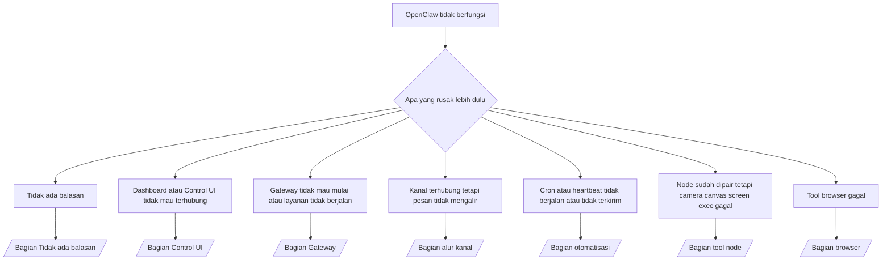

---
read_when:
    - OpenClaw tidak berfungsi dan Anda memerlukan jalur tercepat menuju perbaikan
    - Anda menginginkan alur triase sebelum masuk ke runbook mendalam
summary: Hub pemecahan masalah OpenClaw yang berfokus pada gejala
title: Pemecahan masalah umum
x-i18n:
    generated_at: "2026-04-24T09:11:52Z"
    model: gpt-5.4
    provider: openai
    source_hash: c832c3f7609c56a5461515ed0f693d2255310bf2d3958f69f57c482bcbef97f0
    source_path: help/troubleshooting.md
    workflow: 15
---

Jika Anda hanya punya 2 menit, gunakan halaman ini sebagai pintu depan triase.

## 60 detik pertama

Jalankan tangga ini persis sesuai urutan:

```bash
openclaw status
openclaw status --all
openclaw gateway probe
openclaw gateway status
openclaw doctor
openclaw channels status --probe
openclaw logs --follow
```

Output yang baik dalam satu baris:

- `openclaw status` → menampilkan kanal yang dikonfigurasi dan tidak ada error autentikasi yang jelas.
- `openclaw status --all` → laporan lengkap ada dan dapat dibagikan.
- `openclaw gateway probe` → target gateway yang diharapkan dapat dijangkau (`Reachable: yes`). `Capability: ...` memberi tahu tingkat autentikasi apa yang dapat dibuktikan oleh probe, dan `Read probe: limited - missing scope: operator.read` berarti diagnostik terdegradasi, bukan kegagalan koneksi.
- `openclaw gateway status` → `Runtime: running`, `Connectivity probe: ok`, dan baris `Capability: ...` yang masuk akal. Gunakan `--require-rpc` jika Anda juga memerlukan bukti RPC dengan scope baca.
- `openclaw doctor` → tidak ada error konfigurasi/layanan yang memblokir.
- `openclaw channels status --probe` → gateway yang dapat dijangkau mengembalikan status transport live per akun
  beserta hasil probe/audit seperti `works` atau `audit ok`; jika
  gateway tidak dapat dijangkau, perintah fallback ke ringkasan berbasis konfigurasi.
- `openclaw logs --follow` → aktivitas stabil, tidak ada error fatal yang berulang.

## Anthropic long context 429

Jika Anda melihat:
`HTTP 429: rate_limit_error: Extra usage is required for long context requests`,
buka [/gateway/troubleshooting#anthropic-429-extra-usage-required-for-long-context](/id/gateway/troubleshooting#anthropic-429-extra-usage-required-for-long-context).

## Backend lokal yang kompatibel dengan OpenAI berfungsi langsung tetapi gagal di OpenClaw

Jika backend `/v1` lokal atau self-hosted Anda menjawab probe langsung kecil
`/v1/chat/completions` tetapi gagal pada `openclaw infer model run` atau giliran
agen normal:

1. Jika error menyebut `messages[].content` mengharapkan string, setel
   `models.providers.<provider>.models[].compat.requiresStringContent: true`.
2. Jika backend masih gagal hanya pada giliran agen OpenClaw, setel
   `models.providers.<provider>.models[].compat.supportsTools: false` lalu coba lagi.
3. Jika panggilan kecil langsung masih berfungsi tetapi prompt OpenClaw yang lebih besar membuat
   backend crash, perlakukan masalah yang tersisa sebagai keterbatasan model/server upstream dan
   lanjutkan ke runbook mendalam:
   [/gateway/troubleshooting#local-openai-compatible-backend-passes-direct-probes-but-agent-runs-fail](/id/gateway/troubleshooting#local-openai-compatible-backend-passes-direct-probes-but-agent-runs-fail)

## Instalasi plugin gagal dengan openclaw extensions yang hilang

Jika instalasi gagal dengan `package.json missing openclaw.extensions`, paket plugin
menggunakan bentuk lama yang tidak lagi diterima OpenClaw.

Perbaiki pada paket plugin:

1. Tambahkan `openclaw.extensions` ke `package.json`.
2. Arahkan entri ke file runtime hasil build (biasanya `./dist/index.js`).
3. Publikasikan ulang plugin dan jalankan `openclaw plugins install <package>` lagi.

Contoh:

```json
{
  "name": "@openclaw/my-plugin",
  "version": "1.2.3",
  "openclaw": {
    "extensions": ["./dist/index.js"]
  }
}
```

Referensi: [Arsitektur Plugin](/id/plugins/architecture)

## Pohon keputusan



<AccordionGroup>
  <Accordion title="Tidak ada balasan">
    ```bash
    openclaw status
    openclaw gateway status
    openclaw channels status --probe
    openclaw pairing list --channel <channel> [--account <id>]
    openclaw logs --follow
    ```

    Output yang baik terlihat seperti:

    - `Runtime: running`
    - `Connectivity probe: ok`
    - `Capability: read-only`, `write-capable`, atau `admin-capable`
    - Kanal Anda menunjukkan transport terhubung dan, jika didukung, `works` atau `audit ok` dalam `channels status --probe`
    - Pengirim tampak disetujui (atau kebijakan DM terbuka/allowlist)

    Tanda umum di log:

    - `drop guild message (mention required` → gating mention memblokir pesan di Discord.
    - `pairing request` → pengirim belum disetujui dan sedang menunggu persetujuan pairing DM.
    - `blocked` / `allowlist` dalam log kanal → pengirim, room, atau grup difilter.

    Halaman mendalam:

    - [/gateway/troubleshooting#no-replies](/id/gateway/troubleshooting#no-replies)
    - [/channels/troubleshooting](/id/channels/troubleshooting)
    - [/channels/pairing](/id/channels/pairing)

  </Accordion>

  <Accordion title="Dashboard atau Control UI tidak mau terhubung">
    ```bash
    openclaw status
    openclaw gateway status
    openclaw logs --follow
    openclaw doctor
    openclaw channels status --probe
    ```

    Output yang baik terlihat seperti:

    - `Dashboard: http://...` ditampilkan di `openclaw gateway status`
    - `Connectivity probe: ok`
    - `Capability: read-only`, `write-capable`, atau `admin-capable`
    - Tidak ada loop autentikasi di log

    Tanda umum di log:

    - `device identity required` → HTTP/non-secure context tidak dapat menyelesaikan autentikasi perangkat.
    - `origin not allowed` → browser `Origin` tidak diizinkan untuk
      target gateway Control UI.
    - `AUTH_TOKEN_MISMATCH` dengan petunjuk retry (`canRetryWithDeviceToken=true`) → satu retry device-token tepercaya dapat terjadi secara otomatis.
    - Retry cached-token tersebut menggunakan ulang set scope yang di-cache bersama
      token perangkat yang dipair. Pemanggil `deviceToken` / `scopes` eksplisit mempertahankan
      set scope yang diminta.
    - Pada jalur async Tailscale Serve Control UI, percobaan gagal untuk `{scope, ip}` yang sama
      diserialkan sebelum limiter mencatat kegagalan, sehingga
      retry buruk kedua yang bersamaan dapat langsung menampilkan `retry later`.
    - `too many failed authentication attempts (retry later)` dari origin browser
      localhost → kegagalan berulang dari `Origin` yang sama dikunci sementara;
      origin localhost lain menggunakan bucket terpisah.
    - `unauthorized` berulang setelah retry itu → token/password salah, mode autentikasi tidak cocok, atau token perangkat yang dipair sudah usang.
    - `gateway connect failed:` → UI menargetkan URL/port yang salah atau gateway yang tidak dapat dijangkau.

    Halaman mendalam:

    - [/gateway/troubleshooting#dashboard-control-ui-connectivity](/id/gateway/troubleshooting#dashboard-control-ui-connectivity)
    - [/web/control-ui](/id/web/control-ui)
    - [/gateway/authentication](/id/gateway/authentication)

  </Accordion>

  <Accordion title="Gateway tidak mau mulai atau layanan terinstal tetapi tidak berjalan">
    ```bash
    openclaw status
    openclaw gateway status
    openclaw logs --follow
    openclaw doctor
    openclaw channels status --probe
    ```

    Output yang baik terlihat seperti:

    - `Service: ... (loaded)`
    - `Runtime: running`
    - `Connectivity probe: ok`
    - `Capability: read-only`, `write-capable`, atau `admin-capable`

    Tanda umum di log:

    - `Gateway start blocked: set gateway.mode=local` atau `existing config is missing gateway.mode` → mode gateway adalah remote, atau file konfigurasi kehilangan stempel mode lokal dan harus diperbaiki.
    - `refusing to bind gateway ... without auth` → bind non-loopback tanpa jalur autentikasi gateway yang valid (token/password, atau trusted-proxy jika dikonfigurasi).
    - `another gateway instance is already listening` atau `EADDRINUSE` → port sudah digunakan.

    Halaman mendalam:

    - [/gateway/troubleshooting#gateway-service-not-running](/id/gateway/troubleshooting#gateway-service-not-running)
    - [/gateway/background-process](/id/gateway/background-process)
    - [/gateway/configuration](/id/gateway/configuration)

  </Accordion>

  <Accordion title="Kanal terhubung tetapi pesan tidak mengalir">
    ```bash
    openclaw status
    openclaw gateway status
    openclaw logs --follow
    openclaw doctor
    openclaw channels status --probe
    ```

    Output yang baik terlihat seperti:

    - Transport kanal terhubung.
    - Pemeriksaan pairing/allowlist lolos.
    - Mention terdeteksi jika diwajibkan.

    Tanda umum di log:

    - `mention required` → gating mention grup memblokir pemrosesan.
    - `pairing` / `pending` → pengirim DM belum disetujui.
    - `not_in_channel`, `missing_scope`, `Forbidden`, `401/403` → masalah token izin kanal.

    Halaman mendalam:

    - [/gateway/troubleshooting#channel-connected-messages-not-flowing](/id/gateway/troubleshooting#channel-connected-messages-not-flowing)
    - [/channels/troubleshooting](/id/channels/troubleshooting)

  </Accordion>

  <Accordion title="Cron atau heartbeat tidak berjalan atau tidak terkirim">
    ```bash
    openclaw status
    openclaw gateway status
    openclaw cron status
    openclaw cron list
    openclaw cron runs --id <jobId> --limit 20
    openclaw logs --follow
    ```

    Output yang baik terlihat seperti:

    - `cron.status` menunjukkan aktif dengan next wake.
    - `cron runs` menunjukkan entri `ok` terbaru.
    - Heartbeat diaktifkan dan tidak berada di luar jam aktif.

    Tanda umum di log:

    - `cron: scheduler disabled; jobs will not run automatically` → Cron dinonaktifkan.
    - `heartbeat skipped` dengan `reason=quiet-hours` → di luar jam aktif yang dikonfigurasi.
    - `heartbeat skipped` dengan `reason=empty-heartbeat-file` → `HEARTBEAT.md` ada tetapi hanya berisi scaffolding kosong/header saja.
    - `heartbeat skipped` dengan `reason=no-tasks-due` → mode tugas `HEARTBEAT.md` aktif tetapi belum ada interval tugas yang jatuh tempo.
    - `heartbeat skipped` dengan `reason=alerts-disabled` → semua visibilitas heartbeat dinonaktifkan (`showOk`, `showAlerts`, dan `useIndicator` semuanya off).
    - `requests-in-flight` → jalur utama sibuk; wake heartbeat ditunda.
    - `unknown accountId` → akun target pengiriman heartbeat tidak ada.

    Halaman mendalam:

    - [/gateway/troubleshooting#cron-and-heartbeat-delivery](/id/gateway/troubleshooting#cron-and-heartbeat-delivery)
    - [/automation/cron-jobs#troubleshooting](/id/automation/cron-jobs#troubleshooting)
    - [/gateway/heartbeat](/id/gateway/heartbeat)

  </Accordion>

  <Accordion title="Node sudah dipair tetapi tool camera canvas screen exec gagal">
    ```bash
    openclaw status
    openclaw gateway status
    openclaw nodes status
    openclaw nodes describe --node <idOrNameOrIp>
    openclaw logs --follow
    ```

    Output yang baik terlihat seperti:

    - Node tercantum sebagai connected dan paired untuk role `node`.
    - Kapabilitas tersedia untuk perintah yang Anda panggil.
    - Status izin diberikan untuk tool tersebut.

    Tanda umum di log:

    - `NODE_BACKGROUND_UNAVAILABLE` → bawa aplikasi node ke foreground.
    - `*_PERMISSION_REQUIRED` → izin OS ditolak/hilang.
    - `SYSTEM_RUN_DENIED: approval required` → persetujuan exec tertunda.
    - `SYSTEM_RUN_DENIED: allowlist miss` → perintah tidak ada di allowlist exec.

    Halaman mendalam:

    - [/gateway/troubleshooting#node-paired-tool-fails](/id/gateway/troubleshooting#node-paired-tool-fails)
    - [/nodes/troubleshooting](/id/nodes/troubleshooting)
    - [/tools/exec-approvals](/id/tools/exec-approvals)

  </Accordion>

  <Accordion title="Exec tiba-tiba meminta persetujuan">
    ```bash
    openclaw config get tools.exec.host
    openclaw config get tools.exec.security
    openclaw config get tools.exec.ask
    openclaw gateway restart
    ```

    Yang berubah:

    - Jika `tools.exec.host` tidak diatur, default-nya adalah `auto`.
    - `host=auto` diselesaikan ke `sandbox` saat runtime sandbox aktif, `gateway` jika tidak.
    - `host=auto` hanya untuk routing; perilaku no-prompt "YOLO" berasal dari `security=full` plus `ask=off` pada gateway/node.
    - Pada `gateway` dan `node`, `tools.exec.security` yang tidak diatur default-nya adalah `full`.
    - `tools.exec.ask` yang tidak diatur default-nya adalah `off`.
    - Hasilnya: jika Anda melihat persetujuan, berarti ada kebijakan host-local atau per-sesi yang memperketat exec dari default saat ini.

    Pulihkan perilaku tanpa persetujuan sesuai default saat ini:

    ```bash
    openclaw config set tools.exec.host gateway
    openclaw config set tools.exec.security full
    openclaw config set tools.exec.ask off
    openclaw gateway restart
    ```

    Alternatif yang lebih aman:

    - Setel hanya `tools.exec.host=gateway` jika Anda hanya ingin routing host yang stabil.
    - Gunakan `security=allowlist` dengan `ask=on-miss` jika Anda ingin host exec tetapi tetap ingin peninjauan saat terjadi allowlist miss.
    - Aktifkan mode sandbox jika Anda ingin `host=auto` diselesaikan kembali ke `sandbox`.

    Tanda umum di log:

    - `Approval required.` → perintah sedang menunggu `/approve ...`.
    - `SYSTEM_RUN_DENIED: approval required` → persetujuan exec node-host sedang tertunda.
    - `exec host=sandbox requires a sandbox runtime for this session` → pemilihan sandbox implisit/eksplisit tetapi mode sandbox nonaktif.

    Halaman mendalam:

    - [/tools/exec](/id/tools/exec)
    - [/tools/exec-approvals](/id/tools/exec-approvals)
    - [/gateway/security#what-the-audit-checks-high-level](/id/gateway/security#what-the-audit-checks-high-level)

  </Accordion>

  <Accordion title="Tool browser gagal">
    ```bash
    openclaw status
    openclaw gateway status
    openclaw browser status
    openclaw logs --follow
    openclaw doctor
    ```

    Output yang baik terlihat seperti:

    - Status browser menampilkan `running: true` dan browser/profile yang dipilih.
    - `openclaw` berhasil mulai, atau `user` dapat melihat tab Chrome lokal.

    Tanda umum di log:

    - `unknown command "browser"` atau `unknown command 'browser'` → `plugins.allow` diatur dan tidak menyertakan `browser`.
    - `Failed to start Chrome CDP on port` → peluncuran browser lokal gagal.
    - `browser.executablePath not found` → path binary yang dikonfigurasi salah.
    - `browser.cdpUrl must be http(s) or ws(s)` → URL CDP yang dikonfigurasi menggunakan skema yang tidak didukung.
    - `browser.cdpUrl has invalid port` → URL CDP yang dikonfigurasi memiliki port yang buruk atau di luar rentang.
    - `No Chrome tabs found for profile="user"` → profil attach Chrome MCP tidak memiliki tab Chrome lokal yang terbuka.
    - `Remote CDP for profile "<name>" is not reachable` → endpoint CDP remote yang dikonfigurasi tidak dapat dijangkau dari host ini.
    - `Browser attachOnly is enabled ... not reachable` atau `Browser attachOnly is enabled and CDP websocket ... is not reachable` → profil attach-only tidak memiliki target CDP live.
    - override viewport / dark-mode / locale / offline yang usang pada profil attach-only atau remote CDP → jalankan `openclaw browser stop --browser-profile <name>` untuk menutup sesi kontrol aktif dan melepaskan status emulasi tanpa merestart gateway.

    Halaman mendalam:

    - [/gateway/troubleshooting#browser-tool-fails](/id/gateway/troubleshooting#browser-tool-fails)
    - [/tools/browser#missing-browser-command-or-tool](/id/tools/browser#missing-browser-command-or-tool)
    - [/tools/browser-linux-troubleshooting](/id/tools/browser-linux-troubleshooting)
    - [/tools/browser-wsl2-windows-remote-cdp-troubleshooting](/id/tools/browser-wsl2-windows-remote-cdp-troubleshooting)

  </Accordion>

</AccordionGroup>

## Terkait

- [FAQ](/id/help/faq) — pertanyaan yang sering diajukan
- [Gateway Troubleshooting](/id/gateway/troubleshooting) — masalah khusus gateway
- [Doctor](/id/gateway/doctor) — pemeriksaan kesehatan dan perbaikan otomatis
- [Channel Troubleshooting](/id/channels/troubleshooting) — masalah konektivitas kanal
- [Automation Troubleshooting](/id/automation/cron-jobs#troubleshooting) — masalah cron dan heartbeat
