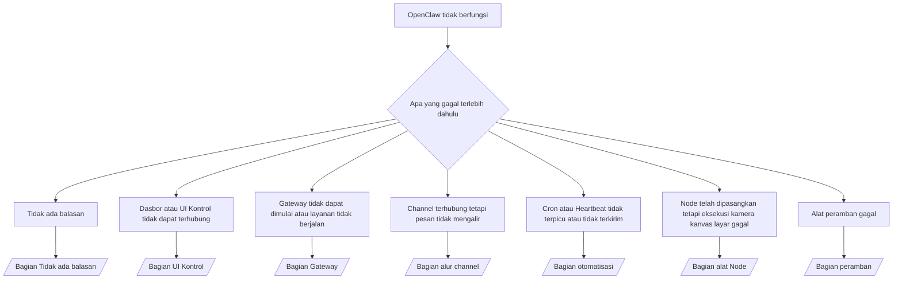

---
read_when:
    - OpenClaw tidak berfungsi dan Anda membutuhkan cara tercepat untuk memperbaikinya
    - Anda menginginkan alur triase sebelum mendalami panduan operasional terperinci
summary: Pusat pemecahan masalah OpenClaw berdasarkan gejala terlebih dahulu
title: Pemecahan masalah umum
x-i18n:
    generated_at: "2026-07-12T14:18:06Z"
    model: gpt-5.6
    postprocess_version: locale-links-v1
    provider: openai
    source_hash: db50e0cdf4d11f3aa6196be445358d904a2b9c40c89243f1b124c77167f6dd85
    source_path: help/troubleshooting.md
    workflow: 16
---

Pintu masuk triase. 2 menit untuk mendapatkan diagnosis, lalu lanjutkan ke halaman mendalam.

## 60 detik pertama

Jalankan urutan ini secara berurutan:

```bash
openclaw status
openclaw status --all
openclaw gateway probe
openclaw gateway status
openclaw doctor
openclaw channels status --probe
openclaw logs --follow
```

Keluaran yang baik, masing-masing satu baris:

- `openclaw status` menampilkan channel yang dikonfigurasi, tanpa kesalahan autentikasi.
- `openclaw status --all` menghasilkan laporan lengkap yang dapat dibagikan.
- `openclaw gateway probe` menampilkan `Reachable: yes`. `Capability: ...` adalah
  tingkat autentikasi yang dibuktikan oleh pemeriksaan; `Read probe: limited - missing scope:
operator.read` menunjukkan diagnostik yang menurun, bukan kegagalan koneksi.
- `openclaw gateway status` menampilkan `Runtime: running`, `Connectivity probe:
ok`, dan `Capability: ...` yang masuk akal. Tambahkan `--require-rpc` agar juga mewajibkan
  bukti RPC dengan cakupan baca.
- `openclaw doctor` melaporkan tidak ada kesalahan konfigurasi/layanan yang menghambat.
- `openclaw channels status --probe` mengembalikan status transport langsung per akun
  (`works` / `audit ok`) saat Gateway dapat dijangkau; kembali ke
  ringkasan khusus konfigurasi saat tidak dapat dijangkau.
- `openclaw logs --follow` menampilkan aktivitas stabil, tanpa kesalahan fatal berulang.

## Asisten terasa terbatas atau kehilangan alat

Periksa profil alat yang berlaku:

```bash
openclaw status
openclaw status --all
openclaw doctor
```

Penyebab umum:

- `tools.profile: "minimal"` hanya mengizinkan `session_status`.
- `tools.profile: "messaging"` bersifat terbatas, untuk agen khusus percakapan.
- `tools.profile: "coding"` adalah nilai bawaan untuk konfigurasi lokal baru (pekerjaan repositori, berkas,
  shell, dan runtime).
- `tools.profile: "full"` menghapus pembatasan profil; batasi penggunaannya untuk agen tepercaya
  yang dikendalikan operator.
- `agents.list[].tools` per agen menimpa profil akar dengan mempersempit atau memperluasnya
  untuk satu agen.

Ubah profil, mulai ulang atau muat ulang Gateway, lalu periksa kembali dengan
`openclaw status --all`. Tabel profil/grup lengkap: [Profil alat](/id/gateway/config-tools#tool-profiles).

## Konteks panjang Anthropic mengalami 429

`HTTP 429: rate_limit_error: Extra usage is required for long context requests`
→ [Anthropic 429 memerlukan penggunaan tambahan untuk konteks panjang](/id/gateway/troubleshooting#anthropic-429-extra-usage-required-for-long-context).

## Backend lokal yang kompatibel dengan OpenAI berfungsi secara langsung tetapi gagal di OpenClaw

Backend `/v1` lokal/dihosting sendiri menjawab pemeriksaan langsung `/v1/chat/completions`,
tetapi gagal pada `openclaw infer model run` atau giliran agen normal:

1. Kesalahan menyebutkan bahwa `messages[].content` mengharapkan string: atur
   `models.providers.<provider>.models[].compat.requiresStringContent: true`.
2. Masih gagal hanya pada giliran agen OpenClaw: atur
   `models.providers.<provider>.models[].compat.supportsTools: false` lalu coba lagi.
3. Panggilan langsung berukuran kecil berhasil, tetapi prompt OpenClaw yang lebih besar membuat backend mogok:
   ini adalah batas model/server hulu, bukan bug OpenClaw. Lanjutkan di
   [Backend lokal yang kompatibel dengan OpenAI lolos pemeriksaan langsung tetapi eksekusi agen gagal](/id/gateway/troubleshooting#local-openai-compatible-backend-passes-direct-probes-but-agent-runs-fail).

## Instalasi Plugin gagal karena ekstensi openclaw tidak ada

`package.json missing openclaw.extensions` berarti paket Plugin menggunakan
struktur yang tidak lagi diterima OpenClaw.

Perbaiki dalam paket Plugin:

1. Tambahkan `openclaw.extensions` ke `package.json`, yang menunjuk ke berkas runtime
   hasil build (biasanya `./dist/index.js`).
2. Publikasikan ulang, lalu jalankan kembali `openclaw plugins install <package>`.

```json
{
  "name": "@openclaw/my-plugin",
  "version": "1.2.3",
  "openclaw": {
    "extensions": ["./dist/index.js"]
  }
}
```

Referensi: [Arsitektur Plugin](/id/plugins/architecture)

## Kebijakan instalasi memblokir instalasi atau pembaruan Plugin

Pembaruan selesai, tetapi Plugin sudah usang, dinonaktifkan, atau menampilkan `blocked by install
policy`, `install policy failed closed`, atau `Disabled "<plugin>" after plugin
update failure`: periksa `security.installPolicy`.

Kebijakan instalasi dijalankan saat Plugin diinstal dan diperbarui. Versi Plugin
`@openclaw/*` biasanya berubah mengikuti rilis OpenClaw, sehingga pembaruan OpenClaw dapat
memerlukan pembaruan Plugin yang sesuai selama sinkronisasi pascapembaruan.

Hindari bentuk kebijakan berikut kecuali Anda juga memelihara aturan peningkatan yang sesuai:

- Membekukan Plugin milik OpenClaw pada satu versi lama tertentu (misalnya, hanya
  `@openclaw/*@2026.5.3`).
- Memblokir hanya berdasarkan jenis sumber (setiap permintaan npm, jaringan, atau `request.mode:
"update"`).
- Menganggap perintah kebijakan sebagai opsional: saat `security.installPolicy`
  diaktifkan, berkas kebijakan yang dapat dieksekusi yang hilang, lambat, tidak dapat dibaca, atau diblokir izin
  akan ditolak secara tertutup.
- Menyetujui versi tanpa memeriksa `openclawVersion` permintaan terhadap
  metadata kandidat Plugin.

Utamakan aturan yang mengizinkan pembaruan `@openclaw/*` tepercaya yang kompatibel dengan
host saat ini, alih-alih menyematkan satu rilis selamanya. Jika Anda memblokir npm secara
bawaan, tambahkan pengecualian terbatas untuk ID Plugin yang Anda gunakan, dan terapkan aturan
kepercayaan yang sama pada `request.mode: "update"` seperti pada instalasi.

Pemulihan:

```bash
openclaw doctor --deep
openclaw plugins update --all
openclaw status --all
```

Jika kebijakan memang sengaja dibuat ketat, longgarkan selama jendela peningkatan
tepercaya, jalankan kembali `openclaw plugins update --all`, lalu pulihkan aturan yang lebih ketat.
Jika kegagalan pembaruan menonaktifkan Plugin, periksa sebelum mengaktifkannya kembali:

```bash
openclaw plugins inspect <plugin-id> --runtime --json
openclaw plugins enable <plugin-id>
```

Referensi: [Kebijakan instalasi operator](/id/tools/skills-config#operator-install-policy-securityinstallpolicy)

## Plugin tersedia tetapi diblokir karena kepemilikan yang mencurigakan

Peringatan `openclaw doctor`, penyiapan, atau saat memulai menampilkan:

```text
blocked plugin candidate: suspicious ownership (... uid=1000, expected uid=0 or root)
plugin present but blocked
```

Berkas Plugin dimiliki oleh pengguna Unix yang berbeda dari proses yang memuatnya.
Jangan hapus konfigurasi Plugin; perbaiki kepemilikan berkas, atau jalankan
OpenClaw sebagai pengguna yang memiliki direktori status.

Instalasi Docker berjalan sebagai `node` (uid `1000`). Perbaiki bind mount host:

```bash
sudo chown -R 1000:1000 /path/to/openclaw-config /path/to/openclaw-workspace
openclaw doctor --fix
```

Jika Anda sengaja menjalankan OpenClaw sebagai root, perbaiki akar Plugin terkelola
sebagai gantinya:

```bash
sudo chown -R root:root /path/to/openclaw-config/npm
openclaw doctor --fix
```

Dokumentasi lebih mendalam: [Kepemilikan jalur Plugin yang diblokir](/id/tools/plugin#blocked-plugin-path-ownership), [Docker: Izin dan EACCES](/id/install/docker#shell-helpers-optional)

## Pohon keputusan



<AccordionGroup>
  <Accordion title="Tidak ada balasan">
    ```bash
    openclaw status
    openclaw gateway status
    openclaw channels status --probe
    openclaw pairing list --channel <channel> [--account <id>]
    openclaw logs --follow
    ```

    Keluaran yang baik:

    - `Runtime: running`
    - `Connectivity probe: ok`
    - `Capability: read-only`, `write-capable`, atau `admin-capable`
    - Channel menampilkan transport terhubung dan, jika didukung, `works` atau
      `audit ok` dalam `channels status --probe`
    - Pengirim disetujui (atau kebijakan DM terbuka/daftar izin)

    Ciri log:

    - `drop guild message (mention required` → pembatasan penyebutan Discord memblokir pesan.
    - `pairing request` → pengirim belum disetujui, menunggu persetujuan pemasangan DM.
    - `blocked` / `allowlist` dalam log channel → pengirim, ruang, atau grup difilter.

    Halaman mendalam: [Tidak ada balasan](/id/gateway/troubleshooting#no-replies), [Pemecahan masalah channel](/id/channels/troubleshooting), [Pemasangan](/id/channels/pairing)

  </Accordion>

  <Accordion title="Dasbor atau UI Kontrol tidak dapat terhubung">
    ```bash
    openclaw status
    openclaw gateway status
    openclaw logs --follow
    openclaw doctor
    openclaw channels status --probe
    ```

    Keluaran yang baik:

    - `Dashboard: http://...` ditampilkan dalam `openclaw gateway status`
    - `Connectivity probe: ok`
    - `Capability: read-only`, `write-capable`, atau `admin-capable`
    - Tidak ada perulangan autentikasi dalam log

    Ciri log:

    - `device identity required` → konteks HTTP/tidak aman tidak dapat menyelesaikan autentikasi perangkat.
    - `origin not allowed` → `Origin` peramban tidak diizinkan untuk target Gateway UI Kontrol.
    - `AUTH_TOKEN_MISMATCH` dengan `canRetryWithDeviceToken=true` → satu percobaan ulang token perangkat tepercaya dapat terjadi secara otomatis, dengan menggunakan kembali cakupan token pasangan yang tersimpan dalam cache.
    - `unauthorized` berulang setelah percobaan ulang tersebut → token/kata sandi salah, mode autentikasi tidak cocok, atau token perangkat pasangan sudah usang.
    - `too many failed authentication attempts (retry later)` → kegagalan berulang dari `Origin` peramban tersebut dikunci sementara; origin localhost lainnya menggunakan kelompok terpisah. Lihat [Konektivitas Dasbor/UI Kontrol](/id/gateway/troubleshooting#dashboard-control-ui-connectivity) untuk nuansa percobaan ulang bersamaan Tailscale Serve.
    - `gateway connect failed:` → UI menargetkan URL/port yang salah, atau Gateway tidak dapat dijangkau.

    Halaman mendalam: [Konektivitas Dasbor/UI Kontrol](/id/gateway/troubleshooting#dashboard-control-ui-connectivity), [UI Kontrol](/id/web/control-ui), [Autentikasi](/id/gateway/authentication)

  </Accordion>

  <Accordion title="Gateway tidak dapat dimulai atau layanan terinstal tetapi tidak berjalan">
    ```bash
    openclaw status
    openclaw gateway status
    openclaw logs --follow
    openclaw doctor
    openclaw channels status --probe
    ```

    Keluaran yang baik:

    - `Service: ... (loaded)`
    - `Runtime: running`
    - `Connectivity probe: ok`
    - `Capability: read-only`, `write-capable`, atau `admin-capable`

    Ciri log:

    - `Gateway start blocked: set gateway.mode=local` atau `existing config is missing gateway.mode` → mode Gateway adalah jarak jauh, atau konfigurasi tidak memiliki penanda mode lokal dan perlu diperbaiki.
    - `refusing to bind gateway ... without auth` → pengikatan non-loopback tanpa jalur autentikasi yang valid (token/kata sandi, atau proksi tepercaya jika dikonfigurasi).
    - `another gateway instance is already listening` atau `EADDRINUSE` → port sudah digunakan.

    Halaman mendalam: [Layanan Gateway tidak berjalan](/id/gateway/troubleshooting#gateway-service-not-running), [Proses latar belakang](/id/gateway/background-process), [Konfigurasi](/id/gateway/configuration)

  </Accordion>

  <Accordion title="Channel terhubung tetapi pesan tidak mengalir">
    ```bash
    openclaw status
    openclaw gateway status
    openclaw logs --follow
    openclaw doctor
    openclaw channels status --probe
    ```

    Keluaran yang baik:

    - Transport channel terhubung.
    - Pemeriksaan pemasangan/daftar izin berhasil.
    - Penyebutan terdeteksi jika diwajibkan.

    Ciri log:

    - `mention required` → pembatasan penyebutan grup memblokir pemrosesan.
    - `pairing` / `pending` → pengirim DM belum disetujui.
    - `not_in_channel`, `missing_scope`, `Forbidden`, `401/403` → masalah izin token channel.

    Halaman mendalam: [Channel terhubung, pesan tidak mengalir](/id/gateway/troubleshooting#channel-connected-messages-not-flowing), [Pemecahan masalah channel](/id/channels/troubleshooting)

  </Accordion>

  <Accordion title="Cron atau Heartbeat tidak terpicu atau tidak terkirim">
    ```bash
    openclaw status
    openclaw gateway status
    openclaw cron status
    openclaw cron list
    openclaw cron runs --id <jobId> --limit 20
    openclaw logs --follow
    ```

    Keluaran yang baik:

    - `cron status` menunjukkan penjadwal diaktifkan dengan waktu bangun berikutnya.
    - `cron runs` menampilkan entri `ok` terbaru.
    - Heartbeat diaktifkan dan berada dalam jam aktif.

    Ciri log:

    - `cron: scheduler disabled; jobs will not run automatically` → Cron dinonaktifkan.
    - `heartbeat skipped` dengan alasan `quiet-hours` → di luar jam aktif yang dikonfigurasi.
    - `heartbeat skipped` dengan alasan `empty-heartbeat-file` → `HEARTBEAT.md` ada, tetapi hanya berisi struktur awal kosong berupa baris kosong, komentar, tajuk, pagar, atau daftar periksa kosong.
    - `heartbeat skipped` dengan alasan `no-tasks-due` → mode tugas aktif, tetapi belum ada interval tugas yang jatuh tempo.
    - `heartbeat skipped` dengan alasan `alerts-disabled` → `showOk`, `showAlerts`, dan `useIndicator` semuanya dinonaktifkan.
    - `requests-in-flight` → jalur utama sibuk; pengaktifan Heartbeat ditunda.
    - `unknown accountId` → akun target pengiriman Heartbeat tidak ada.

    Halaman mendalam: [Pengiriman Cron dan Heartbeat](/id/gateway/troubleshooting#cron-and-heartbeat-delivery), [Tugas terjadwal: Pemecahan masalah](/id/automation/cron-jobs#troubleshooting), [Heartbeat](/id/gateway/heartbeat)

  </Accordion>

  <Accordion title="Node telah dipasangkan, tetapi alat kamera, kanvas, layar, atau eksekusi gagal">
    ```bash
    openclaw status
    openclaw gateway status
    openclaw nodes status
    openclaw nodes describe --node <idOrNameOrIp>
    openclaw logs --follow
    ```

    Keluaran yang benar:

    - Node tercantum sebagai tersambung dan dipasangkan untuk peran `node`.
    - Kapabilitas tersedia untuk perintah yang Anda jalankan.
    - Status izin diberikan untuk alat tersebut.

    Penanda log:

    - `NODE_BACKGROUND_UNAVAILABLE` → bawa aplikasi Node ke latar depan.
    - `*_PERMISSION_REQUIRED` → izin OS ditolak/tidak ada.
    - `SYSTEM_RUN_DENIED: approval required` → persetujuan eksekusi masih tertunda.
    - `SYSTEM_RUN_DENIED: allowlist miss` → perintah tidak ada dalam daftar izin eksekusi.

    Halaman mendalam: [Node dipasangkan, alat gagal](/id/gateway/troubleshooting#node-paired-tool-fails), [Pemecahan masalah Node](/id/nodes/troubleshooting), [Persetujuan eksekusi](/id/tools/exec-approvals)

  </Accordion>

  <Accordion title="Eksekusi tiba-tiba meminta persetujuan">
    ```bash
    openclaw config get tools.exec.host
    openclaw config get tools.exec.security
    openclaw config get tools.exec.ask
    openclaw gateway restart
    ```

    Yang berubah:

    - `tools.exec.host` yang tidak ditetapkan secara default menjadi `auto`, yang ditetapkan sebagai `sandbox`
      saat lingkungan waktu proses sandbox aktif, dan `gateway` jika tidak.
    - `host=auto` hanya mengatur perutean; perilaku tanpa permintaan konfirmasi berasal dari
      `security=full` bersama `ask=off` pada gateway/node.
    - `tools.exec.security` yang tidak ditetapkan secara default menjadi `full` pada `gateway`/`node`.
    - `tools.exec.ask` yang tidak ditetapkan secara default menjadi `off`.
    - Jika Anda melihat permintaan persetujuan, berarti suatu kebijakan lokal host atau per sesi
      telah memperketat eksekusi dari nilai-nilai default tersebut.

    Pulihkan nilai default saat ini yang tidak memerlukan persetujuan:

    ```bash
    openclaw config set tools.exec.host gateway
    openclaw config set tools.exec.security full
    openclaw config set tools.exec.ask off
    openclaw gateway restart
    ```

    Alternatif yang lebih aman:

    - Tetapkan hanya `tools.exec.host=gateway` untuk perutean host yang stabil.
    - Gunakan `security=allowlist` bersama `ask=on-miss` untuk eksekusi host dengan peninjauan saat
      perintah tidak ditemukan dalam daftar izin.
    - Aktifkan mode sandbox agar `host=auto` kembali ditetapkan sebagai `sandbox`.

    Penanda log:

    - `Approval required.` → perintah sedang menunggu `/approve ...`.
    - `SYSTEM_RUN_DENIED: approval required` → persetujuan eksekusi pada host Node masih tertunda.
    - `exec host=sandbox requires a sandbox runtime for this session` → sandbox dipilih secara implisit/eksplisit, tetapi mode sandbox dinonaktifkan.

    Halaman mendalam: [Eksekusi](/id/tools/exec), [Persetujuan eksekusi](/id/tools/exec-approvals), [Keamanan: Hal yang diperiksa audit](/id/gateway/security#what-the-audit-checks-high-level)

  </Accordion>

  <Accordion title="Alat peramban gagal">
    ```bash
    openclaw status
    openclaw gateway status
    openclaw browser status
    openclaw logs --follow
    openclaw doctor
    ```

    Keluaran yang benar:

    - Status peramban menampilkan `running: true` serta peramban/profil yang dipilih.
    - Profil `openclaw` dimulai, atau profil `user` melihat tab Chrome lokal.

    Penanda log:

    - `unknown command "browser"` → `plugins.allow` ditetapkan dan tidak menyertakan `browser`.
    - `Failed to start Chrome CDP on port` → peluncuran peramban lokal gagal.
    - `browser.executablePath not found` → jalur biner yang dikonfigurasi salah.
    - `browser.cdpUrl must be http(s) or ws(s)` → URL CDP yang dikonfigurasi menggunakan skema yang tidak didukung.
    - `browser.cdpUrl has invalid port` → URL CDP yang dikonfigurasi memiliki porta yang salah atau di luar rentang.
    - `No Chrome tabs found for profile="user"` → profil pelampiran Chrome MCP tidak memiliki tab Chrome lokal yang terbuka.
    - `Remote CDP for profile "<name>" is not reachable` → titik akhir CDP jarak jauh yang dikonfigurasi tidak dapat dijangkau dari host ini.
    - `Browser attachOnly is enabled ... not reachable` → profil khusus pelampiran tidak memiliki target CDP aktif.
    - Penggantian usang untuk area pandang/mode gelap/lokal/luring pada profil khusus pelampiran atau CDP jarak jauh → jalankan `openclaw browser stop --browser-profile <name>` untuk menutup sesi kontrol dan melepaskan status emulasi tanpa memulai ulang Gateway.

    Halaman mendalam: [Alat peramban gagal](/id/gateway/troubleshooting#browser-tool-fails), [Perintah atau alat peramban tidak ada](/id/tools/browser#missing-browser-command-or-tool), [Peramban: Pemecahan masalah Linux](/id/tools/browser-linux-troubleshooting), [Peramban: Pemecahan masalah CDP jarak jauh WSL2/Windows](/id/tools/browser-wsl2-windows-remote-cdp-troubleshooting)

  </Accordion>

</AccordionGroup>

## Terkait

- [Tanya jawab umum](/id/help/faq) — pertanyaan yang sering diajukan
- [Pemecahan Masalah Gateway](/id/gateway/troubleshooting) — masalah khusus Gateway
- [Doctor](/id/gateway/doctor) — pemeriksaan kesehatan dan perbaikan otomatis
- [Pemecahan Masalah Saluran](/id/channels/troubleshooting) — masalah konektivitas saluran
- [Tugas terjadwal: Pemecahan masalah](/id/automation/cron-jobs#troubleshooting) — masalah Cron dan Heartbeat
