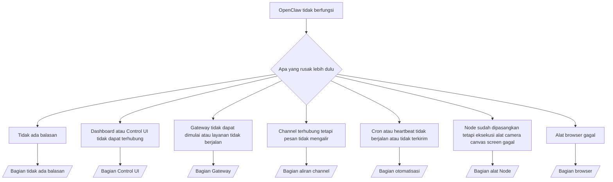

---
read_when:
    - OpenClaw tidak berfungsi dan Anda memerlukan cara tercepat untuk memperbaikinya
    - Anda menginginkan alur triase sebelum mendalami panduan operasional yang terperinci
summary: Pusat pemecahan masalah berbasis gejala untuk OpenClaw
title: Pemecahan masalah umum
x-i18n:
    generated_at: "2026-05-06T09:15:43Z"
    model: gpt-5.5
    provider: openai
    source_hash: 624fa34cda3b440fa9cc636beb3fe6e3608a77a332933fa593097ebc556ac745
    source_path: help/troubleshooting.md
    workflow: 16
---

Jika Anda hanya punya 2 menit, gunakan halaman ini sebagai pintu masuk triase.

## 60 detik pertama

Jalankan urutan persis ini secara berurutan:

```bash
openclaw status
openclaw status --all
openclaw gateway probe
openclaw gateway status
openclaw doctor
openclaw channels status --probe
openclaw logs --follow
```

Output baik dalam satu baris:

- `openclaw status` → menampilkan channel yang dikonfigurasi dan tidak ada kesalahan autentikasi yang jelas.
- `openclaw status --all` → laporan lengkap tersedia dan dapat dibagikan.
- `openclaw gateway probe` → target gateway yang diharapkan dapat dijangkau (`Reachable: yes`). `Capability: ...` memberi tahu tingkat autentikasi apa yang dapat dibuktikan oleh probe, dan `Read probe: limited - missing scope: operator.read` adalah diagnostik yang menurun, bukan kegagalan koneksi.
- `openclaw gateway status` → `Runtime: running`, `Connectivity probe: ok`, dan baris `Capability: ...` yang masuk akal. Gunakan `--require-rpc` jika Anda juga perlu bukti RPC dengan cakupan baca.
- `openclaw doctor` → tidak ada kesalahan konfigurasi/layanan yang memblokir.
- `openclaw channels status --probe` → gateway yang dapat dijangkau mengembalikan status transport per akun secara langsung plus hasil probe/audit seperti `works` atau `audit ok`; jika gateway tidak dapat dijangkau, perintah kembali ke ringkasan khusus konfigurasi.
- `openclaw logs --follow` → aktivitas stabil, tidak ada kesalahan fatal yang berulang.

## Konteks panjang Anthropic 429

Jika Anda melihat:
`HTTP 429: rate_limit_error: Extra usage is required for long context requests`,
buka [/gateway/troubleshooting#anthropic-429-extra-usage-required-for-long-context](/id/gateway/troubleshooting#anthropic-429-extra-usage-required-for-long-context).

## Backend lokal yang kompatibel dengan OpenAI berfungsi langsung tetapi gagal di OpenClaw

Jika backend lokal atau self-hosted `/v1` Anda menjawab probe kecil
`/v1/chat/completions` secara langsung tetapi gagal pada `openclaw infer model run` atau giliran
agen normal:

1. Jika kesalahan menyebut `messages[].content` mengharapkan string, atur
   `models.providers.<provider>.models[].compat.requiresStringContent: true`.
2. Jika backend masih gagal hanya pada giliran agen OpenClaw, atur
   `models.providers.<provider>.models[].compat.supportsTools: false` dan coba lagi.
3. Jika panggilan langsung kecil masih berfungsi tetapi prompt OpenClaw yang lebih besar membuat
   backend crash, perlakukan masalah tersisa sebagai keterbatasan model/server upstream dan
   lanjutkan di runbook mendalam:
   [/gateway/troubleshooting#local-openai-compatible-backend-passes-direct-probes-but-agent-runs-fail](/id/gateway/troubleshooting#local-openai-compatible-backend-passes-direct-probes-but-agent-runs-fail)

## Instalasi Plugin gagal karena openclaw extensions hilang

Jika instalasi gagal dengan `package.json missing openclaw.extensions`, paket plugin
menggunakan bentuk lama yang tidak lagi diterima OpenClaw.

Perbaiki di paket plugin:

1. Tambahkan `openclaw.extensions` ke `package.json`.
2. Arahkan entri ke file runtime hasil build (biasanya `./dist/index.js`).
3. Publikasikan ulang plugin dan jalankan `openclaw plugins install <package>` lagi.

Contoh:

```json
{
  "name": "@openclaw/my-plugin",
  "version": "1.2.3",
  "openclaw": {
    "extensions": ["./dist/index.js"]
  }
}
```

Referensi: [Arsitektur Plugin](/id/plugins/architecture)

## Plugin ada tetapi diblokir oleh kepemilikan yang mencurigakan

Jika `openclaw doctor`, penyiapan, atau peringatan startup menampilkan:

```text
blocked plugin candidate: suspicious ownership (... uid=1000, expected uid=0 or root)
plugin present but blocked
```

file plugin dimiliki oleh pengguna Unix yang berbeda dari proses yang memuat
file tersebut. Jangan hapus konfigurasi plugin. Perbaiki kepemilikan file atau jalankan OpenClaw sebagai
pengguna yang sama yang memiliki direktori status.

Instalasi Docker biasanya berjalan sebagai `node` (uid `1000`). Untuk penyiapan Docker
default, perbaiki bind mount host:

```bash
sudo chown -R 1000:1000 /path/to/openclaw-config /path/to/openclaw-workspace
openclaw doctor --fix
```

Jika Anda sengaja menjalankan OpenClaw sebagai root, perbaiki root plugin terkelola agar
dimiliki root sebagai gantinya:

```bash
sudo chown -R root:root /path/to/openclaw-config/npm
openclaw doctor --fix
```

Dokumentasi lebih mendalam:

- [Kepemilikan path Plugin](/id/tools/plugin#blocked-plugin-path-ownership)
- [Izin Docker](/id/install/docker#permissions-and-eacces)

## Pohon keputusan



<AccordionGroup>
  <Accordion title="Tidak ada balasan">
    ```bash
    openclaw status
    openclaw gateway status
    openclaw channels status --probe
    openclaw pairing list --channel <channel> [--account <id>]
    openclaw logs --follow
    ```

    Output baik terlihat seperti:

    - `Runtime: running`
    - `Connectivity probe: ok`
    - `Capability: read-only`, `write-capable`, atau `admin-capable`
    - Channel Anda menampilkan transport terhubung dan, jika didukung, `works` atau `audit ok` di `channels status --probe`
    - Pengirim tampak disetujui (atau kebijakan DM terbuka/allowlist)

    Tanda umum di log:

    - `drop guild message (mention required` → gating mention memblokir pesan di Discord.
    - `pairing request` → pengirim belum disetujui dan menunggu persetujuan pairing DM.
    - `blocked` / `allowlist` di log channel → pengirim, room, atau grup difilter.

    Halaman mendalam:

    - [/gateway/troubleshooting#no-replies](/id/gateway/troubleshooting#no-replies)
    - [/channels/troubleshooting](/id/channels/troubleshooting)
    - [/channels/pairing](/id/channels/pairing)

  </Accordion>

  <Accordion title="Dashboard atau Control UI tidak dapat terhubung">
    ```bash
    openclaw status
    openclaw gateway status
    openclaw logs --follow
    openclaw doctor
    openclaw channels status --probe
    ```

    Output baik terlihat seperti:

    - `Dashboard: http://...` ditampilkan di `openclaw gateway status`
    - `Connectivity probe: ok`
    - `Capability: read-only`, `write-capable`, atau `admin-capable`
    - Tidak ada loop autentikasi di log

    Tanda umum di log:

    - `device identity required` → konteks HTTP/tidak aman tidak dapat menyelesaikan autentikasi perangkat.
    - `origin not allowed` → `Origin` browser tidak diizinkan untuk target gateway Control UI.
    - `AUTH_TOKEN_MISMATCH` dengan petunjuk coba lagi (`canRetryWithDeviceToken=true`) → satu percobaan ulang token perangkat tepercaya dapat terjadi otomatis.
    - Percobaan ulang token cache tersebut menggunakan kembali set cakupan cache yang disimpan dengan token perangkat yang dipasangkan. Pemanggil `deviceToken` eksplisit / `scopes` eksplisit tetap menggunakan set cakupan yang diminta.
    - Pada jalur Control UI async Tailscale Serve, upaya gagal untuk
      `{scope, ip}` yang sama diserialkan sebelum limiter mencatat kegagalan, sehingga
      percobaan ulang buruk kedua yang konkuren sudah dapat menampilkan `retry later`.
    - `too many failed authentication attempts (retry later)` dari origin browser localhost → kegagalan berulang dari `Origin` yang sama dikunci sementara; origin localhost lain menggunakan bucket terpisah.
    - `unauthorized` berulang setelah percobaan ulang tersebut → token/kata sandi salah, mode autentikasi tidak cocok, atau token perangkat yang dipasangkan sudah usang.
    - `gateway connect failed:` → UI menargetkan URL/port yang salah atau gateway tidak dapat dijangkau.

    Halaman mendalam:

    - [/gateway/troubleshooting#dashboard-control-ui-connectivity](/id/gateway/troubleshooting#dashboard-control-ui-connectivity)
    - [/web/control-ui](/id/web/control-ui)
    - [/gateway/authentication](/id/gateway/authentication)

  </Accordion>

  <Accordion title="Gateway tidak dapat dimulai atau layanan terinstal tetapi tidak berjalan">
    ```bash
    openclaw status
    openclaw gateway status
    openclaw logs --follow
    openclaw doctor
    openclaw channels status --probe
    ```

    Output baik terlihat seperti:

    - `Service: ... (loaded)`
    - `Runtime: running`
    - `Connectivity probe: ok`
    - `Capability: read-only`, `write-capable`, atau `admin-capable`

    Tanda umum di log:

    - `Gateway start blocked: set gateway.mode=local` atau `existing config is missing gateway.mode` → mode gateway adalah remote, atau file konfigurasi kehilangan penanda mode lokal dan harus diperbaiki.
    - `refusing to bind gateway ... without auth` → bind non-loopback tanpa jalur autentikasi gateway yang valid (token/kata sandi, atau trusted-proxy jika dikonfigurasi).
    - `another gateway instance is already listening` atau `EADDRINUSE` → port sudah digunakan.

    Halaman mendalam:

    - [/gateway/troubleshooting#gateway-service-not-running](/id/gateway/troubleshooting#gateway-service-not-running)
    - [/gateway/background-process](/id/gateway/background-process)
    - [/gateway/configuration](/id/gateway/configuration)

  </Accordion>

  <Accordion title="Channel terhubung tetapi pesan tidak mengalir">
    ```bash
    openclaw status
    openclaw gateway status
    openclaw logs --follow
    openclaw doctor
    openclaw channels status --probe
    ```

    Output baik terlihat seperti:

    - Transport channel terhubung.
    - Pemeriksaan pairing/allowlist lolos.
    - Mention terdeteksi jika diperlukan.

    Tanda umum di log:

    - `mention required` → gating mention grup memblokir pemrosesan.
    - `pairing` / `pending` → pengirim DM belum disetujui.
    - `not_in_channel`, `missing_scope`, `Forbidden`, `401/403` → masalah token izin channel.

    Halaman mendalam:

    - [/gateway/troubleshooting#channel-connected-messages-not-flowing](/id/gateway/troubleshooting#channel-connected-messages-not-flowing)
    - [/channels/troubleshooting](/id/channels/troubleshooting)

  </Accordion>

  <Accordion title="Cron atau heartbeat tidak berjalan atau tidak terkirim">
    ```bash
    openclaw status
    openclaw gateway status
    openclaw cron status
    openclaw cron list
    openclaw cron runs --id <jobId> --limit 20
    openclaw logs --follow
    ```

    Output baik terlihat seperti:

    - `cron.status` menampilkan aktif dengan wake berikutnya.
    - `cron runs` menampilkan entri `ok` terbaru.
    - Heartbeat diaktifkan dan tidak berada di luar jam aktif.

    Tanda umum di log:

    - `cron: scheduler disabled; jobs will not run automatically` → cron dinonaktifkan.
    - `heartbeat skipped` dengan `reason=quiet-hours` → di luar jam aktif yang dikonfigurasi.
    - `heartbeat skipped` dengan `reason=empty-heartbeat-file` → `HEARTBEAT.md` ada tetapi hanya berisi scaffolding kosong/hanya header.
    - `heartbeat skipped` dengan `reason=no-tasks-due` → mode tugas `HEARTBEAT.md` aktif tetapi belum ada interval tugas yang jatuh tempo.
    - `heartbeat skipped` dengan `reason=alerts-disabled` → semua visibilitas heartbeat dinonaktifkan (`showOk`, `showAlerts`, dan `useIndicator` semuanya off).
    - `requests-in-flight` → lane utama sibuk; wake heartbeat ditunda.
    - `unknown accountId` → akun target pengiriman heartbeat tidak ada.

    Halaman mendalam:

    - [/gateway/troubleshooting#cron-and-heartbeat-delivery](/id/gateway/troubleshooting#cron-and-heartbeat-delivery)
    - [/automation/cron-jobs#troubleshooting](/id/automation/cron-jobs#troubleshooting)
    - [/gateway/heartbeat](/id/gateway/heartbeat)

  </Accordion>

  <Accordion title="Node sudah dipasangkan tetapi alat camera canvas screen exec gagal">
    ```bash
    openclaw status
    openclaw gateway status
    openclaw nodes status
    openclaw nodes describe --node <idOrNameOrIp>
    openclaw logs --follow
    ```

    Output baik terlihat seperti:

    - Node tercantum sebagai terhubung dan dipasangkan untuk peran `node`.
    - Capability tersedia untuk perintah yang Anda panggil.
    - Status izin diberikan untuk alat tersebut.

    Tanda umum di log:

    - `NODE_BACKGROUND_UNAVAILABLE` → bawa aplikasi Node ke latar depan.
    - `*_PERMISSION_REQUIRED` → izin OS ditolak/tidak ada.
    - `SYSTEM_RUN_DENIED: approval required` → persetujuan exec sedang tertunda.
    - `SYSTEM_RUN_DENIED: allowlist miss` → perintah tidak ada di allowlist exec.

    Halaman mendalam:

    - [/gateway/troubleshooting#node-paired-tool-fails](/id/gateway/troubleshooting#node-paired-tool-fails)
    - [/nodes/troubleshooting](/id/nodes/troubleshooting)
    - [/tools/exec-approvals](/id/tools/exec-approvals)

  </Accordion>

  <Accordion title="Exec tiba-tiba meminta persetujuan">
    ```bash
    openclaw config get tools.exec.host
    openclaw config get tools.exec.security
    openclaw config get tools.exec.ask
    openclaw gateway restart
    ```

    Apa yang berubah:

    - Jika `tools.exec.host` belum diatur, default-nya adalah `auto`.
    - `host=auto` diselesaikan menjadi `sandbox` saat runtime sandbox aktif, selain itu menjadi `gateway`.
    - `host=auto` hanya untuk routing; perilaku "YOLO" tanpa prompt berasal dari `security=full` plus `ask=off` pada Gateway/Node.
    - Pada `gateway` dan `node`, `tools.exec.security` yang belum diatur default ke `full`.
    - `tools.exec.ask` yang belum diatur default ke `off`.
    - Hasilnya: jika Anda melihat persetujuan, beberapa kebijakan host-lokal atau per-sesi memperketat exec dari default saat ini.

    Pulihkan perilaku default saat ini tanpa persetujuan:

    ```bash
    openclaw config set tools.exec.host gateway
    openclaw config set tools.exec.security full
    openclaw config set tools.exec.ask off
    openclaw gateway restart
    ```

    Alternatif yang lebih aman:

    - Atur hanya `tools.exec.host=gateway` jika Anda hanya menginginkan routing host yang stabil.
    - Gunakan `security=allowlist` dengan `ask=on-miss` jika Anda menginginkan exec host tetapi tetap ingin peninjauan saat allowlist tidak cocok.
    - Aktifkan mode sandbox jika Anda ingin `host=auto` diselesaikan kembali menjadi `sandbox`.

    Tanda log umum:

    - `Approval required.` → perintah sedang menunggu `/approve ...`.
    - `SYSTEM_RUN_DENIED: approval required` → persetujuan exec host Node sedang tertunda.
    - `exec host=sandbox requires a sandbox runtime for this session` → pemilihan sandbox implisit/eksplisit tetapi mode sandbox nonaktif.

    Halaman mendalam:

    - [/tools/exec](/id/tools/exec)
    - [/tools/exec-approvals](/id/tools/exec-approvals)
    - [/gateway/security#what-the-audit-checks-high-level](/id/gateway/security#what-the-audit-checks-high-level)

  </Accordion>

  <Accordion title="Alat browser gagal">
    ```bash
    openclaw status
    openclaw gateway status
    openclaw browser status
    openclaw logs --follow
    openclaw doctor
    ```

    Output yang baik terlihat seperti:

    - Status browser menampilkan `running: true` dan browser/profil yang dipilih.
    - `openclaw` dimulai, atau `user` dapat melihat tab Chrome lokal.

    Tanda log umum:

    - `unknown command "browser"` atau `unknown command 'browser'` → `plugins.allow` diatur dan tidak menyertakan `browser`.
    - `Failed to start Chrome CDP on port` → peluncuran browser lokal gagal.
    - `browser.executablePath not found` → jalur biner yang dikonfigurasi salah.
    - `browser.cdpUrl must be http(s) or ws(s)` → URL CDP yang dikonfigurasi menggunakan skema yang tidak didukung.
    - `browser.cdpUrl has invalid port` → URL CDP yang dikonfigurasi memiliki port yang buruk atau di luar rentang.
    - `No Chrome tabs found for profile="user"` → profil attach MCP Chrome tidak memiliki tab Chrome lokal yang terbuka.
    - `Remote CDP for profile "<name>" is not reachable` → endpoint CDP jarak jauh yang dikonfigurasi tidak dapat dijangkau dari host ini.
    - `Browser attachOnly is enabled ... not reachable` atau `Browser attachOnly is enabled and CDP websocket ... is not reachable` → profil khusus attach tidak memiliki target CDP aktif.
    - override viewport / mode gelap / lokal / offline yang usang pada profil khusus attach atau CDP jarak jauh → jalankan `openclaw browser stop --browser-profile <name>` untuk menutup sesi kontrol aktif dan melepaskan status emulasi tanpa memulai ulang Gateway.

    Halaman mendalam:

    - [/gateway/troubleshooting#browser-tool-fails](/id/gateway/troubleshooting#browser-tool-fails)
    - [/tools/browser#missing-browser-command-or-tool](/id/tools/browser#missing-browser-command-or-tool)
    - [/tools/browser-linux-troubleshooting](/id/tools/browser-linux-troubleshooting)
    - [/tools/browser-wsl2-windows-remote-cdp-troubleshooting](/id/tools/browser-wsl2-windows-remote-cdp-troubleshooting)

  </Accordion>

</AccordionGroup>

## Terkait

- [FAQ](/id/help/faq) — pertanyaan yang sering diajukan
- [Pemecahan Masalah Gateway](/id/gateway/troubleshooting) — masalah khusus Gateway
- [Doctor](/id/gateway/doctor) — pemeriksaan kesehatan dan perbaikan otomatis
- [Pemecahan Masalah Channel](/id/channels/troubleshooting) — masalah konektivitas channel
- [Pemecahan Masalah Otomasi](/id/automation/cron-jobs#troubleshooting) — masalah Cron dan Heartbeat
