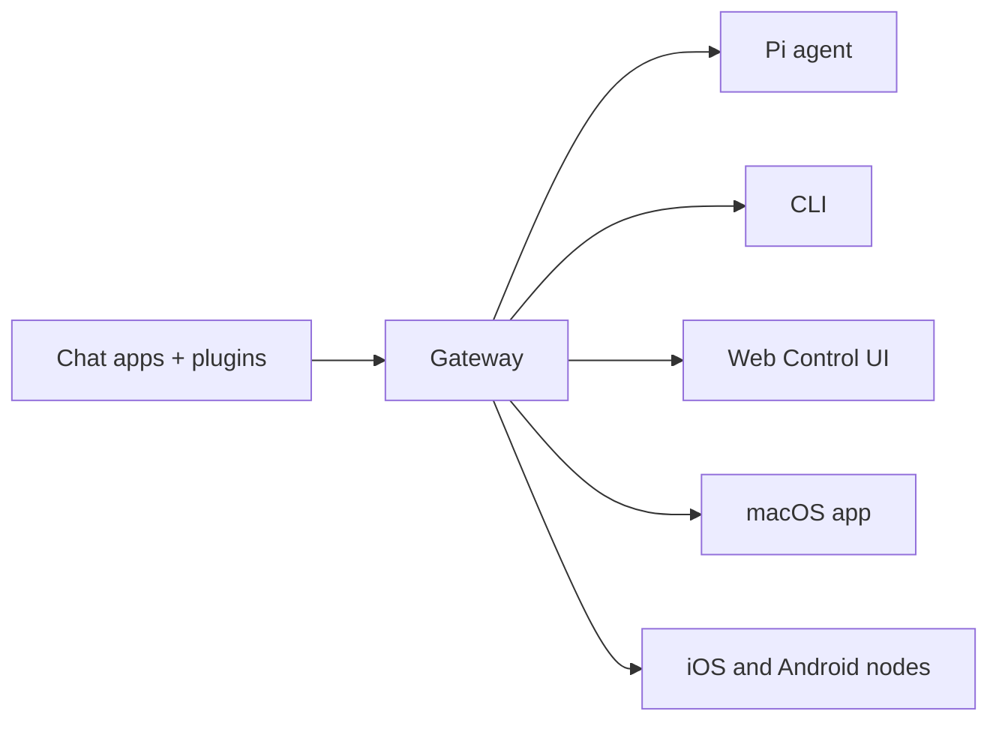

---
read_when:
    - Memperkenalkan OpenClaw kepada pengguna baru
summary: OpenClaw adalah Gateway multikanal untuk agen AI yang berjalan di sistem operasi apa pun.
title: OpenClaw
x-i18n:
    generated_at: "2026-05-07T13:19:50Z"
    model: gpt-5.5
    provider: openai
    source_hash: 7bf82c8551703257e55289d2b82f6436c9900a8afae7ab9b6a655332716ff37b
    source_path: index.md
    workflow: 16
---

# OpenClaw 🦞

<p align="center">
    
    
</p>

> _"EKSFOLIASI! EKSFOLIASI!"_ — Seekor lobster luar angkasa, mungkin

<p align="center">
  <strong>Gateway OS apa pun untuk agen AI di Discord, Google Chat, iMessage, Matrix, Microsoft Teams, Signal, Slack, Telegram, WhatsApp, Zalo, dan lainnya.</strong><br />
  Kirim pesan, dapatkan respons agen dari saku Anda. Jalankan satu Gateway di seluruh kanal bawaan, Plugin kanal terbundel, WebChat, dan Node seluler.
</p>

<Columns>
  <Card title="Mulai" href="/id/start/getting-started" icon="rocket">
    Instal OpenClaw dan jalankan Gateway dalam hitungan menit.
  </Card>
  <Card title="Jalankan Onboarding" href="/id/start/wizard" icon="sparkles">
    Penyiapan terpandu dengan `openclaw onboard` dan alur pemasangan.
  </Card>
  <Card title="Buka UI Kontrol" href="/id/web/control-ui" icon="layout-dashboard">
    Luncurkan dasbor browser untuk chat, konfigurasi, dan sesi.
  </Card>
</Columns>

## Apa itu OpenClaw?

OpenClaw adalah **gateway yang di-host sendiri** yang menghubungkan aplikasi chat dan permukaan kanal favorit Anda — kanal bawaan ditambah Plugin kanal terbundel atau eksternal seperti Discord, Google Chat, iMessage, Matrix, Microsoft Teams, Signal, Slack, Telegram, WhatsApp, Zalo, dan lainnya — ke agen coding AI seperti Pi. Anda menjalankan satu proses Gateway di mesin Anda sendiri (atau server), dan proses itu menjadi jembatan antara aplikasi pesan Anda dan asisten AI yang selalu tersedia.

**Untuk siapa ini?** Developer dan pengguna tingkat lanjut yang menginginkan asisten AI pribadi yang bisa mereka kirimi pesan dari mana saja — tanpa melepaskan kendali atas data mereka atau bergantung pada layanan yang di-host.

**Apa yang membuatnya berbeda?**

- **Di-host sendiri**: berjalan di perangkat keras Anda, dengan aturan Anda
- **Multi-kanal**: satu Gateway melayani kanal bawaan ditambah Plugin kanal terbundel atau eksternal secara bersamaan
- **Native untuk agen**: dibuat untuk agen coding dengan penggunaan alat, sesi, memori, dan perutean multi-agen
- **Sumber terbuka**: berlisensi MIT, digerakkan oleh komunitas

**Apa yang Anda perlukan?** Node 24 (direkomendasikan), atau Node 22 LTS (`22.16+`) untuk kompatibilitas, kunci API dari penyedia pilihan Anda, dan 5 menit. Untuk kualitas dan keamanan terbaik, gunakan model generasi terbaru terkuat yang tersedia.

## Cara kerjanya



Gateway adalah sumber kebenaran tunggal untuk sesi, perutean, dan koneksi kanal.

## Kemampuan utama

<Columns>
  <Card title="Gateway multi-kanal" icon="network" href="/id/channels">
    Discord, iMessage, Signal, Slack, Telegram, WhatsApp, WebChat, dan lainnya dengan satu proses Gateway.
  </Card>
  <Card title="Kanal Plugin" icon="plug" href="/id/tools/plugin">
    Plugin terbundel menambahkan Matrix, Nostr, Twitch, Zalo, dan lainnya dalam rilis terkini normal.
  </Card>
  <Card title="Perutean multi-agen" icon="route" href="/id/concepts/multi-agent">
    Sesi terisolasi per agen, ruang kerja, atau pengirim.
  </Card>
  <Card title="Dukungan media" icon="image" href="/id/nodes/images">
    Kirim dan terima gambar, audio, dan dokumen.
  </Card>
  <Card title="UI Kontrol Web" icon="monitor" href="/id/web/control-ui">
    Dasbor browser untuk chat, konfigurasi, sesi, dan Node.
  </Card>
  <Card title="Node seluler" icon="smartphone" href="/id/nodes">
    Pasangkan Node iOS dan Android untuk alur kerja yang mendukung Canvas, kamera, dan suara.
  </Card>
</Columns>

## Mulai cepat

<Steps>
  <Step title="Instal OpenClaw">
    ```bash
    npm install -g openclaw@latest
    ```
  </Step>
  <Step title="Onboard dan instal layanan">
    ```bash
    openclaw onboard --install-daemon
    ```
  </Step>
  <Step title="Chat">
    Buka UI Kontrol di browser Anda dan kirim pesan:

    ```bash
    openclaw dashboard
    ```

    Atau hubungkan kanal ([Telegram](/id/channels/telegram) adalah yang tercepat) dan chat dari ponsel Anda.

  </Step>
</Steps>

Perlu penyiapan instalasi dan dev lengkap? Lihat [Mulai](/id/start/getting-started).

## Dasbor

Buka UI Kontrol browser setelah Gateway dimulai.

- Default lokal: [http://127.0.0.1:18789/](http://127.0.0.1:18789/)
- Akses jarak jauh: [Permukaan web](/id/web) dan [Tailscale](/id/gateway/tailscale)

<p align="center">
  
</p>

## Konfigurasi (opsional)

Konfigurasi berada di `~/.openclaw/openclaw.json`.

- Jika Anda **tidak melakukan apa pun**, OpenClaw menggunakan biner Pi terbundel dalam mode RPC dengan sesi per pengirim.
- Jika Anda ingin menguncinya, mulai dengan `channels.whatsapp.allowFrom` dan (untuk grup) aturan penyebutan.

Contoh:

```json5
{
  channels: {
    whatsapp: {
      allowFrom: ["+15555550123"],
      groups: { "*": { requireMention: true } },
    },
  },
  messages: { groupChat: { mentionPatterns: ["@openclaw"] } },
}
```

## Mulai di sini

<Columns>
  <Card title="Hub dokumentasi" href="/id/start/hubs" icon="book-open">
    Semua dokumentasi dan panduan, diatur berdasarkan kasus penggunaan.
  </Card>
  <Card title="Konfigurasi" href="/id/gateway/configuration" icon="settings">
    Pengaturan Gateway inti, token, dan konfigurasi penyedia.
  </Card>
  <Card title="Akses jarak jauh" href="/id/gateway/remote" icon="globe">
    Pola akses SSH dan tailnet.
  </Card>
  <Card title="Kanal" href="/id/channels/telegram" icon="message-square">
    Penyiapan khusus kanal untuk Feishu, Microsoft Teams, WhatsApp, Telegram, Discord, dan lainnya.
  </Card>
  <Card title="Node" href="/id/nodes" icon="smartphone">
    Node iOS dan Android dengan pemasangan, Canvas, kamera, dan tindakan perangkat.
  </Card>
  <Card title="Bantuan" href="/id/help" icon="life-buoy">
    Titik awal untuk perbaikan umum dan pemecahan masalah.
  </Card>
</Columns>

## Pelajari lebih lanjut

<Columns>
  <Card title="Daftar fitur lengkap" href="/id/concepts/features" icon="list">
    Kemampuan kanal, perutean, dan media yang lengkap.
  </Card>
  <Card title="Perutean multi-agen" href="/id/concepts/multi-agent" icon="route">
    Isolasi ruang kerja dan sesi per agen.
  </Card>
  <Card title="Keamanan" href="/id/gateway/security" icon="shield">
    Token, daftar izin, dan kontrol keselamatan.
  </Card>
  <Card title="Pemecahan masalah" href="/id/gateway/troubleshooting" icon="wrench">
    Diagnostik Gateway dan kesalahan umum.
  </Card>
  <Card title="Tentang dan kredit" href="/id/reference/credits" icon="info">
    Asal-usul proyek, kontributor, dan lisensi.
  </Card>
</Columns>
