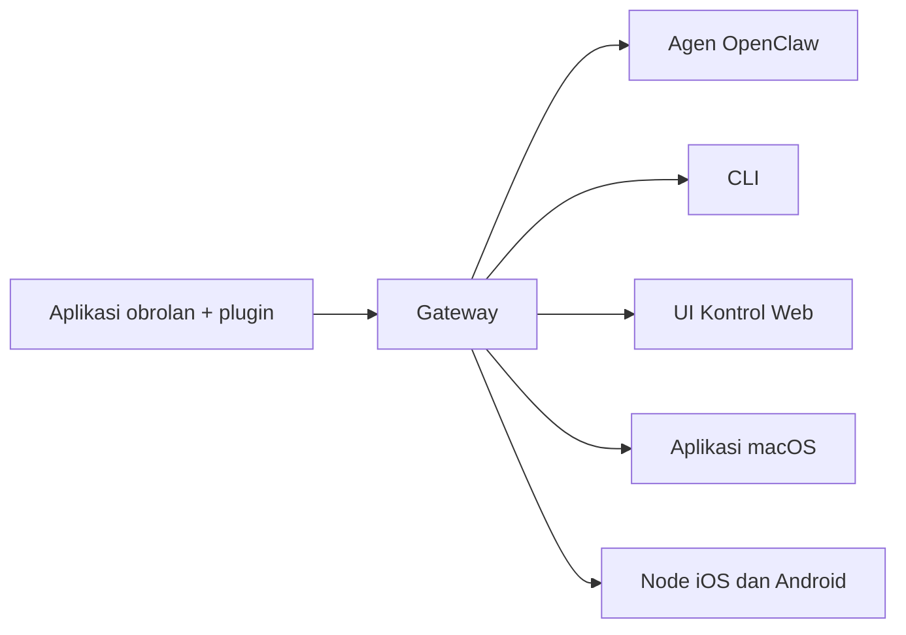

---
read_when:
    - Memperkenalkan OpenClaw kepada pengguna baru
summary: OpenClaw adalah gateway multisaluran untuk agen AI yang berjalan di sistem operasi apa pun.
title: OpenClaw
x-i18n:
    generated_at: "2026-07-16T18:12:17Z"
    model: gpt-5.6
    postprocess_version: locale-links-v1
    prompt_version: 32
    provider: openai
    source_hash: fe97e7299be4855fd9af21838e0626b5a5c8aafe46d982859e9033f0efec2443
    source_path: index.md
    workflow: 16
---

# OpenClaw 🦞

<p align="center">
    
    
</p>

> _"EKSFOLIASI! EKSFOLIASI!"_ — Seekor lobster luar angkasa, mungkin

<p align="center">
  <strong>Gateway untuk semua OS bagi agen AI di Discord, Google Chat, iMessage, Matrix, Microsoft Teams, Signal, Slack, Telegram, WhatsApp, Zalo, dan lainnya.</strong><br />
  Kirim pesan, dapatkan respons agen langsung dari saku Anda. Jalankan satu Gateway untuk berbagai plugin saluran, WebChat, dan node seluler.
</p>

<Columns>
  <Card title="Mulai" href="/id/start/getting-started" icon="rocket">
    Instal OpenClaw dan aktifkan Gateway dalam hitungan menit.
  </Card>
  <Card title="Jalankan Orientasi" href="/id/start/wizard" icon="list-checks">
    Penyiapan terpandu dengan `openclaw onboard` dan alur pemasangan.
  </Card>
  <Card title="Hubungkan Saluran" href="/id/channels" icon="message-circle">
    Tautkan Discord, Signal, Telegram, WhatsApp, dan lainnya untuk mengobrol dari mana saja.
  </Card>
  <Card title="Buka UI Kontrol" href="/id/web/control-ui" icon="layout-dashboard">
    Luncurkan dasbor peramban untuk obrolan, konfigurasi, dan sesi.
  </Card>
</Columns>

## Jelajahi dokumentasi

Peramban seluler mungkin menampilkan menu bagian tanpa bilah tab desktop lengkap. Gunakan
tautan hub berikut untuk menjangkau area dokumentasi tingkat teratas yang sama dari isi halaman.

<Columns>
  <Card title="Mulai" href="/id" icon="rocket">
    Ikhtisar, etalase, langkah pertama, dan panduan penyiapan.
  </Card>
  <Card title="Instalasi" href="/id/install" icon="download">
    Jalur instalasi, pembaruan, kontainer, hosting, dan penyiapan lanjutan.
  </Card>
  <Card title="Saluran" href="/id/channels" icon="messages-square">
    Saluran perpesanan, pemasangan, perutean, grup akses, dan QA saluran.
  </Card>
  <Card title="Agen" href="/id/concepts/architecture" icon="bot">
    Arsitektur, sesi, konteks, memori, dan perutean multiagen.
  </Card>
  <Card title="Kemampuan" href="/id/tools" icon="wand-sparkles">
    Alat, keahlian, cron, webhook, dan kemampuan otomatisasi.
  </Card>
  <Card title="ClawHub" href="/id/clawhub" icon="store">
    Marketplace Plugin, penerbitan, kurasi, dan panduan kepercayaan.
  </Card>
  <Card title="Model" href="/id/providers" icon="brain">
    Penyedia, konfigurasi model, pengalihan saat gagal, dan layanan model lokal.
  </Card>
  <Card title="Platform" href="/id/platforms" icon="monitor-smartphone">
    macOS, Windows, iOS, Android, node, dan antarmuka web.
  </Card>
  <Card title="Gateway & Operasi" href="/id/gateway" icon="server">
    Konfigurasi, keamanan, diagnostik, dan operasi Gateway.
  </Card>
  <Card title="Referensi" href="/id/cli" icon="terminal">
    Referensi CLI, skema, RPC, catatan rilis, dan templat.
  </Card>
  <Card title="Bantuan" href="/id/help" icon="life-buoy">
    Pemecahan masalah, FAQ, pengujian, diagnostik, dan pemeriksaan lingkungan.
  </Card>
</Columns>

## Apa itu OpenClaw?

OpenClaw adalah **gateway yang dihosting sendiri** yang menghubungkan aplikasi obrolan favorit Anda — Discord, Google Chat, iMessage, Matrix, Microsoft Teams, Signal, Slack, Telegram, WhatsApp, Zalo, dan lainnya melalui plugin saluran — dengan agen pengodean AI. Anda menjalankan satu proses Gateway di mesin Anda sendiri (atau server), lalu proses tersebut menjadi penghubung antara aplikasi perpesanan Anda dan asisten AI yang selalu tersedia.

**Untuk siapa produk ini?** Pengembang dan pengguna mahir yang menginginkan asisten AI pribadi yang dapat mereka kirimi pesan dari mana saja — tanpa melepaskan kendali atas data mereka atau bergantung pada layanan yang dihosting.

**Apa yang membuatnya berbeda?**

- **Dihosting sendiri**: berjalan di perangkat keras Anda, mengikuti aturan Anda
- **Multisaluran**: satu Gateway melayani semua plugin saluran yang dikonfigurasi secara bersamaan
- **Berorientasi agen**: dibuat untuk agen pengodean dengan penggunaan alat, sesi, memori, dan perutean multiagen
- **Sumber terbuka**: berlisensi MIT, digerakkan oleh komunitas

**Apa yang Anda perlukan?** Node 24.15+ (direkomendasikan), Node 22 LTS (`22.22.3+`) untuk kompatibilitas, atau Node 25.9+, kunci API dari penyedia pilihan Anda, dan waktu 5 menit. Untuk kualitas dan keamanan terbaik, gunakan model generasi terbaru terkuat yang tersedia.

## Cara kerjanya



Gateway merupakan satu-satunya sumber kebenaran untuk sesi, perutean, dan koneksi saluran.

## Kemampuan utama

<Columns>
  <Card title="Gateway multisaluran" icon="network" href="/id/channels">
    Discord, iMessage, Signal, Slack, Telegram, WhatsApp, WebChat, dan lainnya dengan satu proses Gateway.
  </Card>
  <Card title="Saluran Plugin" icon="plug" href="/id/tools/plugin">
    Plugin saluran menambahkan Matrix, Nostr, Twitch, Zalo, dan lainnya; plugin resmi diinstal sesuai permintaan.
  </Card>
  <Card title="Perutean multiagen" icon="route" href="/id/concepts/multi-agent">
    Sesi terisolasi untuk setiap agen, ruang kerja, atau pengirim.
  </Card>
  <Card title="Dukungan media" icon="image" href="/id/nodes/images">
    Kirim dan terima gambar, audio, dan dokumen.
  </Card>
  <Card title="UI Kontrol Web" icon="monitor" href="/id/web/control-ui">
    Dasbor peramban untuk obrolan, konfigurasi, sesi, dan node.
  </Card>
  <Card title="Node seluler" icon="smartphone" href="/id/nodes">
    Pasangkan node iOS dan Android untuk alur kerja Canvas, kamera, dan dukungan suara.
  </Card>
</Columns>

## Mulai cepat

<Steps>
  <Step title="Instal OpenClaw">
    ```bash
    npm install -g openclaw@latest
    ```
  </Step>
  <Step title="Lakukan orientasi dan instal layanan">
    ```bash
    openclaw onboard --install-daemon
    ```
  </Step>
  <Step title="Mengobrol">
    Buka UI Kontrol di peramban Anda dan kirim pesan:

    ```bash
    openclaw dashboard
    ```

    Atau hubungkan saluran ([Telegram](/id/channels/telegram) adalah yang tercepat) dan mengobrol dari ponsel Anda.

  </Step>
</Steps>

Memerlukan penyiapan instalasi dan pengembangan lengkap? Lihat [Memulai](/id/start/getting-started).

## Dasbor

Buka UI Kontrol di peramban setelah Gateway dimulai.

- Default lokal: [http://127.0.0.1:18789/](http://127.0.0.1:18789/)
- Akses jarak jauh: [Antarmuka web](/id/web) dan [Tailscale](/id/gateway/tailscale)

<p align="center">
  
</p>

## Konfigurasi (opsional)

Konfigurasi berada di `~/.openclaw/openclaw.json`.

- Jika Anda **tidak melakukan apa pun**, OpenClaw menggunakan runtime agen OpenClaw bawaan; pesan langsung berbagi sesi utama agen, dan setiap obrolan grup mendapatkan sesinya sendiri.
- Jika Anda ingin membatasi aksesnya, mulailah dengan `channels.whatsapp.allowFrom` dan aturan penyebutan (untuk grup).

Contoh:

```json5
{
  channels: {
    whatsapp: {
      allowFrom: ["+15555550123"],
      groups: { "*": { requireMention: true } },
    },
  },
  messages: { groupChat: { mentionPatterns: ["@openclaw"] } },
}
```

## Mulai di sini

<Columns>
  <Card title="Hub dokumentasi" href="/id/start/hubs" icon="book-open">
    Semua dokumentasi dan panduan, disusun berdasarkan kasus penggunaan.
  </Card>
  <Card title="Konfigurasi" href="/id/gateway/configuration" icon="settings">
    Pengaturan inti Gateway, token, dan konfigurasi penyedia.
  </Card>
  <Card title="Akses jarak jauh" href="/id/gateway/remote" icon="globe">
    Pola akses SSH dan tailnet.
  </Card>
  <Card title="Saluran" href="/id/channels/telegram" icon="message-square">
    Penyiapan khusus saluran untuk Discord, Feishu, Microsoft Teams, Telegram, WhatsApp, dan lainnya.
  </Card>
  <Card title="Node" href="/id/nodes" icon="smartphone">
    Node iOS dan Android dengan pemasangan, Canvas, kamera, dan tindakan perangkat.
  </Card>
  <Card title="Bantuan" href="/id/help" icon="life-buoy">
    Perbaikan umum dan titik masuk pemecahan masalah.
  </Card>
</Columns>

## Pelajari lebih lanjut

<Columns>
  <Card title="Daftar fitur lengkap" href="/id/concepts/features" icon="list">
    Kemampuan saluran, perutean, dan media yang lengkap.
  </Card>
  <Card title="Perutean multiagen" href="/id/concepts/multi-agent" icon="route">
    Isolasi ruang kerja dan sesi per agen.
  </Card>
  <Card title="Keamanan" href="/id/gateway/security" icon="shield">
    Token, daftar izin, dan kontrol keamanan.
  </Card>
  <Card title="Pemecahan masalah" href="/id/gateway/troubleshooting" icon="wrench">
    Diagnostik Gateway dan kesalahan umum.
  </Card>
  <Card title="Tentang dan kredit" href="/id/reference/credits" icon="info">
    Asal-usul proyek, kontributor, dan lisensi.
  </Card>
</Columns>
