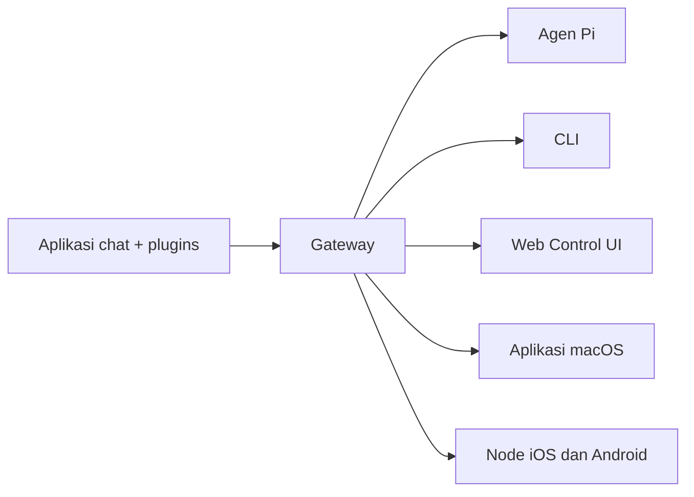

---
read_when:
    - Memperkenalkan OpenClaw kepada pendatang baru
summary: OpenClaw adalah gateway multi-channel untuk agen AI yang berjalan di sistem operasi apa pun.
title: OpenClaw
x-i18n:
    generated_at: "2026-04-05T13:56:47Z"
    model: gpt-5.4
    provider: openai
    source_hash: 9c29a8d9fc41a94b650c524bb990106f134345560e6d615dac30e8815afff481
    source_path: index.md
    workflow: 15
---

# OpenClaw 🦞

<p align="center">
    
    
</p>

> _"KELUPAS! KELUPAS!"_ — Seekor lobster luar angkasa, mungkin

<p align="center">
  <strong>Gateway untuk agen AI di sistem operasi apa pun yang mencakup Discord, Google Chat, iMessage, Matrix, Microsoft Teams, Signal, Slack, Telegram, WhatsApp, Zalo, dan lainnya.</strong><br />
  Kirim pesan, dapatkan respons agen dari saku Anda. Jalankan satu Gateway di berbagai channel bawaan, plugins channel bawaan, WebChat, dan node seluler.
</p>

<Columns>
  <Card title="Mulai" href="/start/getting-started" icon="rocket">
    Instal OpenClaw dan jalankan Gateway dalam hitungan menit.
  </Card>
  <Card title="Jalankan Onboarding" href="/start/wizard" icon="sparkles">
    Penyiapan terpandu dengan `openclaw onboard` dan alur pairing.
  </Card>
  <Card title="Buka Control UI" href="/web/control-ui" icon="layout-dashboard">
    Luncurkan dasbor browser untuk chat, konfigurasi, dan sesi.
  </Card>
</Columns>

## Apa itu OpenClaw?

OpenClaw adalah **gateway yang di-host sendiri** yang menghubungkan aplikasi chat favorit Anda dan permukaan channel — channel bawaan ditambah plugins channel bawaan atau eksternal seperti Discord, Google Chat, iMessage, Matrix, Microsoft Teams, Signal, Slack, Telegram, WhatsApp, Zalo, dan lainnya — ke agen coding AI seperti Pi. Anda menjalankan satu proses Gateway di mesin Anda sendiri (atau server), dan itu menjadi jembatan antara aplikasi perpesanan Anda dan asisten AI yang selalu tersedia.

**Untuk siapa ini?** Developer dan power user yang menginginkan asisten AI pribadi yang bisa mereka kirimi pesan dari mana saja — tanpa melepaskan kendali atas data mereka atau bergantung pada layanan yang di-host.

**Apa yang membuatnya berbeda?**

- **Di-host sendiri**: berjalan di perangkat keras Anda, dengan aturan Anda
- **Multi-channel**: satu Gateway melayani channel bawaan plus plugins channel bawaan atau eksternal secara bersamaan
- **Native untuk agen**: dibangun untuk agen coding dengan penggunaan alat, sesi, memori, dan routing multi-agen
- **Open source**: berlisensi MIT, digerakkan oleh komunitas

**Apa yang Anda butuhkan?** Node 24 (disarankan), atau Node 22 LTS (`22.14+`) untuk kompatibilitas, API key dari provider pilihan Anda, dan 5 menit. Untuk kualitas dan keamanan terbaik, gunakan model generasi terbaru terkuat yang tersedia.

## Cara kerjanya



Gateway adalah sumber kebenaran tunggal untuk sesi, routing, dan koneksi channel.

## Kemampuan utama

<Columns>
  <Card title="Gateway multi-channel" icon="network">
    Discord, iMessage, Signal, Slack, Telegram, WhatsApp, WebChat, dan lainnya dengan satu proses Gateway.
  </Card>
  <Card title="Plugin channel" icon="plug">
    Plugins bawaan menambahkan Matrix, Nostr, Twitch, Zalo, dan lainnya dalam rilis normal saat ini.
  </Card>
  <Card title="Routing multi-agen" icon="route">
    Sesi terisolasi per agen, workspace, atau pengirim.
  </Card>
  <Card title="Dukungan media" icon="image">
    Kirim dan terima gambar, audio, dan dokumen.
  </Card>
  <Card title="Web Control UI" icon="monitor">
    Dasbor browser untuk chat, konfigurasi, sesi, dan node.
  </Card>
  <Card title="Node seluler" icon="smartphone">
    Pair node iOS dan Android untuk alur kerja Canvas, kamera, dan yang mendukung suara.
  </Card>
</Columns>

## Mulai cepat

<Steps>
  <Step title="Instal OpenClaw">
    ```bash
    npm install -g openclaw@latest
    ```
  </Step>
  <Step title="Lakukan onboarding dan instal layanan">
    ```bash
    openclaw onboard --install-daemon
    ```
  </Step>
  <Step title="Chat">
    Buka Control UI di browser Anda dan kirim pesan:

    ```bash
    openclaw dashboard
    ```

    Atau hubungkan sebuah channel ([Telegram](/id/channels/telegram) paling cepat) dan chat dari ponsel Anda.

  </Step>
</Steps>

Butuh penyiapan instalasi dan pengembangan lengkap? Lihat [Memulai](/start/getting-started).

## Dasbor

Buka browser Control UI setelah Gateway dimulai.

- Default lokal: [http://127.0.0.1:18789/](http://127.0.0.1:18789/)
- Akses jarak jauh: [Permukaan web](/web) dan [Tailscale](/id/gateway/tailscale)

<p align="center">
  
</p>

## Konfigurasi (opsional)

Konfigurasi berada di `~/.openclaw/openclaw.json`.

- Jika Anda **tidak melakukan apa pun**, OpenClaw menggunakan biner Pi bawaan dalam mode RPC dengan sesi per pengirim.
- Jika Anda ingin menguncinya, mulailah dengan `channels.whatsapp.allowFrom` dan (untuk grup) aturan mention.

Contoh:

```json5
{
  channels: {
    whatsapp: {
      allowFrom: ["+15555550123"],
      groups: { "*": { requireMention: true } },
    },
  },
  messages: { groupChat: { mentionPatterns: ["@openclaw"] } },
}
```

## Mulai dari sini

<Columns>
  <Card title="Pusat dokumentasi" href="/start/hubs" icon="book-open">
    Semua dokumen dan panduan, diatur berdasarkan kasus penggunaan.
  </Card>
  <Card title="Konfigurasi" href="/id/gateway/configuration" icon="settings">
    Pengaturan inti Gateway, token, dan konfigurasi provider.
  </Card>
  <Card title="Akses jarak jauh" href="/id/gateway/remote" icon="globe">
    Pola akses SSH dan tailnet.
  </Card>
  <Card title="Channels" href="/id/channels/telegram" icon="message-square">
    Penyiapan khusus channel untuk Feishu, Microsoft Teams, WhatsApp, Telegram, Discord, dan lainnya.
  </Card>
  <Card title="Node" href="/nodes" icon="smartphone">
    Node iOS dan Android dengan pairing, Canvas, kamera, dan tindakan perangkat.
  </Card>
  <Card title="Bantuan" href="/help" icon="life-buoy">
    Perbaikan umum dan titik masuk pemecahan masalah.
  </Card>
</Columns>

## Pelajari lebih lanjut

<Columns>
  <Card title="Daftar fitur lengkap" href="/id/concepts/features" icon="list">
    Kemampuan lengkap untuk channel, routing, dan media.
  </Card>
  <Card title="Routing multi-agen" href="/id/concepts/multi-agent" icon="route">
    Isolasi workspace dan sesi per agen.
  </Card>
  <Card title="Keamanan" href="/gateway/security" icon="shield">
    Token, allowlist, dan kontrol keselamatan.
  </Card>
  <Card title="Pemecahan masalah" href="/gateway/troubleshooting" icon="wrench">
    Diagnostik Gateway dan error umum.
  </Card>
  <Card title="Tentang dan kredit" href="/reference/credits" icon="info">
    Asal-usul proyek, kontributor, dan lisensi.
  </Card>
</Columns>
