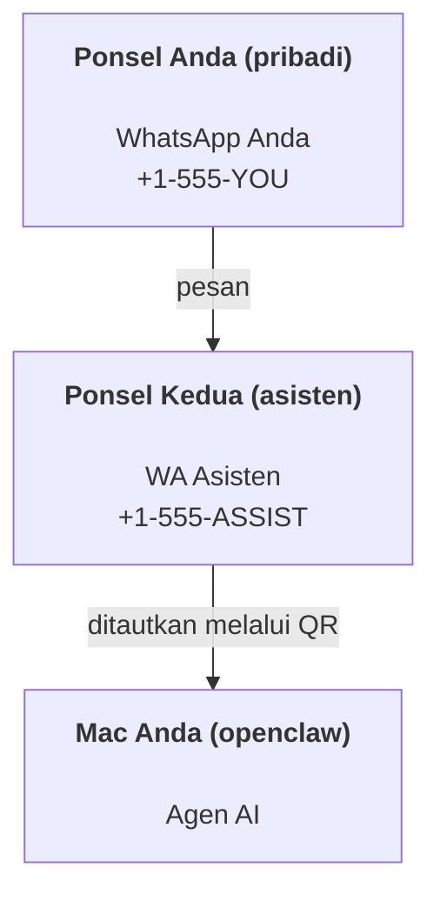

---
read_when:
    - Orientasi awal instans asisten baru
    - Meninjau implikasi keselamatan/perizinan
summary: Panduan menyeluruh untuk menjalankan OpenClaw sebagai asisten pribadi dengan peringatan keselamatan
title: Penyiapan asisten pribadi
x-i18n:
    generated_at: "2026-07-16T18:42:43Z"
    model: gpt-5.6
    postprocess_version: locale-links-v1
    prompt_version: 32
    provider: openai
    source_hash: e8c34e31314f55647059fd600935330110add27b338a675bc0ce1529bebb207d
    source_path: start/openclaw.md
    workflow: 16
---

OpenClaw adalah Gateway yang dihosting sendiri yang menghubungkan Discord, Google Chat, iMessage, Matrix, Microsoft Teams, Signal, Slack, Telegram, WhatsApp, Zalo, dan lainnya ke agen AI. Panduan ini mencakup penyiapan "asisten pribadi": nomor WhatsApp khusus yang berfungsi seperti asisten AI Anda yang selalu aktif.

## Utamakan keamanan

Memberikan kanal kepada agen menempatkannya dalam posisi untuk menjalankan perintah di mesin Anda (bergantung pada kebijakan alat Anda), membaca/menulis file di ruang kerja Anda, dan mengirim pesan keluar melalui kanal mana pun yang terhubung. Mulailah secara konservatif:

- Selalu tetapkan `channels.whatsapp.allowFrom` (jangan pernah menjalankannya secara terbuka untuk seluruh dunia di Mac pribadi Anda).
- Gunakan nomor WhatsApp khusus untuk asisten.
- Secara default, Heartbeat dijalankan setiap 30 menit. Nonaktifkan sampai Anda memercayai penyiapan ini dengan menetapkan `agents.defaults.heartbeat.every: "0m"`.

## Prasyarat

- OpenClaw telah diinstal dan melalui orientasi awal - lihat [Memulai](/id/start/getting-started) jika Anda belum melakukannya
- Nomor telepon kedua (SIM/eSIM/prabayar) untuk asisten

## Penyiapan dua ponsel (direkomendasikan)

Hasil yang diinginkan:



Jika Anda menautkan WhatsApp pribadi ke OpenClaw, setiap pesan yang ditujukan kepada Anda menjadi "masukan agen". Biasanya bukan itu yang Anda inginkan.

## Mulai cepat dalam 5 menit

1. Pasangkan WhatsApp Web (menampilkan QR; pindai dengan ponsel asisten):

```bash
openclaw channels login
```

2. Jalankan Gateway (biarkan tetap berjalan):

```bash
openclaw gateway --port 18789
```

3. Masukkan konfigurasi minimal ke `~/.openclaw/openclaw.json`:

```json5
{
  gateway: { mode: "local" },
  channels: { whatsapp: { allowFrom: ["+15555550123"] } },
}
```

Sekarang kirim pesan ke nomor asisten dari ponsel yang ada dalam daftar yang diizinkan.

Saat orientasi awal selesai, OpenClaw otomatis membuka dasbor dan mencetak tautan bersih (tanpa token). Jika dasbor meminta autentikasi, tempel rahasia bersama yang dikonfigurasi ke pengaturan Control UI. Orientasi awal menggunakan token secara default (`gateway.auth.token`), tetapi autentikasi kata sandi juga berfungsi jika Anda mengubah `gateway.auth.mode` menjadi `password`. Untuk membukanya kembali nanti: `openclaw dashboard`.

## Berikan ruang kerja kepada agen (AGENTS)

OpenClaw membaca petunjuk pengoperasian dan "memori" dari direktori ruang kerjanya.

Secara default, OpenClaw menggunakan `~/.openclaw/workspace` sebagai ruang kerja agen dan membuatnya (beserta file awal `AGENTS.md`, `SOUL.md`, `TOOLS.md`, `IDENTITY.md`, `USER.md`, `HEARTBEAT.md`) secara otomatis saat orientasi awal atau saat agen pertama kali dijalankan. `BOOTSTRAP.md` hanya dibuat untuk ruang kerja yang benar-benar baru dan tidak akan muncul kembali setelah Anda menghapusnya. `MEMORY.md` bersifat opsional dan tidak pernah dibuat secara otomatis; jika tersedia, file tersebut dimuat untuk sesi normal. Sesi subagen hanya memasukkan `AGENTS.md` dan `TOOLS.md`.

<Tip>
Perlakukan folder ini seperti memori OpenClaw dan jadikan sebagai repositori git (idealnya privat) agar `AGENTS.md` dan file memori Anda dicadangkan. Jika git terinstal, ruang kerja yang benar-benar baru otomatis diinisialisasi dengan `git init`.
</Tip>

Untuk membuat folder ruang kerja dan konfigurasi tanpa menjalankan seluruh wizard orientasi awal:

```bash
openclaw setup --baseline
```

(`openclaw setup` tanpa opsi adalah alias untuk `openclaw onboard` dan menjalankan seluruh wizard interaktif.)

Tata letak lengkap ruang kerja + panduan pencadangan: [Ruang kerja agen](/id/concepts/agent-workspace)
Alur kerja memori: [Memori](/id/concepts/memory)

Opsional: pilih ruang kerja lain dengan `agents.defaults.workspace` (mendukung `~`).

```json5
{
  agents: {
    defaults: {
      workspace: "~/.openclaw/workspace",
    },
  },
}
```

Jika Anda sudah menyediakan file ruang kerja sendiri dari repositori, Anda dapat menonaktifkan pembuatan file bootstrap sepenuhnya:

```json5
{
  agents: {
    defaults: {
      skipBootstrap: true,
    },
  },
}
```

## Konfigurasi yang mengubahnya menjadi "asisten"

Secara default, OpenClaw menggunakan penyiapan asisten yang baik, tetapi biasanya Anda perlu menyesuaikan:

- persona/petunjuk di [`SOUL.md`](/id/concepts/soul)
- default penalaran (jika diinginkan)
- Heartbeat (setelah Anda memercayainya)

Contoh:

```json5
{
  logging: { level: "info" },
  agents: {
    defaults: {
      model: { primary: "anthropic/claude-opus-4-8" },
      workspace: "~/.openclaw/workspace",
      thinkingDefault: "high",
      timeoutSeconds: 1800,
      // Mulai dengan 0; aktifkan nanti.
      heartbeat: { every: "0m" },
    },
    list: [
      {
        id: "main",
        default: true,
        groupChat: {
          mentionPatterns: ["@openclaw", "openclaw"],
        },
      },
    ],
  },
  channels: {
    whatsapp: {
      allowFrom: ["+15555550123"],
      groups: {
        "*": { requireMention: true },
      },
    },
  },
  session: {
    scope: "per-sender",
    resetTriggers: ["/new", "/reset"],
    reset: {
      mode: "daily",
      atHour: 4,
      idleMinutes: 10080,
    },
  },
}
```

## Sesi dan memori

- Baris sesi, baris transkrip, dan metadata (penggunaan token, rute terakhir, dan sebagainya): `~/.openclaw/agents/<agentId>/agent/openclaw-agent.sqlite`
- Artefak transkrip lama/arsip: `~/.openclaw/agents/<agentId>/sessions/`
- Sumber migrasi baris lama: `~/.openclaw/agents/<agentId>/sessions/sessions.json`
- `/new` atau `/reset` memulai sesi baru untuk percakapan tersebut (dapat dikonfigurasi melalui `session.resetTriggers`). Jika dikirim sendiri, OpenClaw mengonfirmasi pengaturan ulang tanpa memanggil model.
- `/compact [instructions]` memadatkan konteks sesi dan melaporkan sisa anggaran konteks.

## Heartbeat (mode proaktif)

Secara default, OpenClaw menjalankan Heartbeat setiap 30 menit dengan prompt:
`Read HEARTBEAT.md if it exists (workspace context). Follow it strictly. Do not infer or repeat old tasks from prior chats. If nothing needs attention, reply HEARTBEAT_OK.`
Tetapkan `agents.defaults.heartbeat.every: "0m"` untuk menonaktifkannya.

- Jika `HEARTBEAT.md` tersedia tetapi pada dasarnya kosong (hanya baris kosong, komentar Markdown/HTML, judul Markdown seperti `# Heading`, penanda pagar, atau stub daftar periksa kosong), OpenClaw melewati pelaksanaan Heartbeat untuk menghemat panggilan API.
- Jika file tersebut tidak ada, Heartbeat tetap berjalan dan model menentukan tindakan yang perlu dilakukan.
- Jika agen membalas dengan `HEARTBEAT_OK` (opsional dengan isian singkat; lihat `agents.defaults.heartbeat.ackMaxChars`), OpenClaw mencegah pengiriman keluar untuk Heartbeat tersebut.
- Secara default, pengiriman Heartbeat ke target `user:<id>` bergaya DM diizinkan. Tetapkan `agents.defaults.heartbeat.directPolicy: "block"` untuk mencegah pengiriman ke target langsung sambil mempertahankan pelaksanaan Heartbeat.
- Heartbeat menjalankan giliran agen secara penuh - interval yang lebih pendek menghabiskan lebih banyak token.

```json5
{
  agents: {
    defaults: {
      heartbeat: { every: "30m" },
    },
  },
}
```

## Media masuk dan keluar

Lampiran masuk (gambar/audio/dokumen) dapat disediakan untuk perintah Anda melalui templat:

- `{{MediaPath}}` (jalur file sementara lokal)
- `{{MediaUrl}}` (URL semu)
- `{{Transcript}}` (jika transkripsi audio diaktifkan)

Lampiran keluar dari agen menggunakan bidang media terstruktur pada alat pesan atau payload balasan, seperti `media`, `mediaUrl`, `mediaUrls`, `path`, atau `filePath`. Contoh argumen alat pesan:

```json
{
  "message": "Berikut tangkapan layarnya.",
  "mediaUrl": "https://example.com/screenshot.png"
}
```

OpenClaw mengirim media terstruktur bersama teks. Balasan akhir asisten versi lama mungkin masih dinormalisasi untuk kompatibilitas, tetapi keluaran alat, keluaran peramban, blok streaming, dan tindakan pesan tidak menguraikan teks sebagai perintah lampiran.

Perilaku jalur lokal mengikuti model kepercayaan pembacaan file yang sama seperti agen:

- Jika `tools.fs.workspaceOnly` adalah `true`, jalur media lokal keluar tetap dibatasi ke root sementara OpenClaw, cache media, jalur ruang kerja agen, dan file yang dihasilkan sandbox.
- Jika `tools.fs.workspaceOnly` adalah `false`, media lokal keluar dapat menggunakan file lokal host yang sudah diizinkan untuk dibaca oleh agen.
- Jalur lokal dapat berupa jalur absolut, relatif terhadap ruang kerja, atau relatif terhadap direktori home dengan `~/`.
- Pengiriman dari lokal host tetap hanya mengizinkan media dan jenis dokumen yang aman (gambar, audio, video, PDF, dokumen Office, serta dokumen teks tervalidasi seperti Markdown/MD, TXT, JSON, YAML, dan YML). Ini merupakan perluasan batas kepercayaan pembacaan host yang sudah ada, bukan pemindai rahasia: jika agen dapat membaca `secret.txt` atau `config.json` lokal host, agen dapat melampirkan file tersebut ketika ekstensi dan validasi kontennya sesuai.

Simpan file sensitif di luar sistem file yang dapat dibaca agen, atau pertahankan `tools.fs.workspaceOnly: true` untuk pengiriman jalur lokal yang lebih ketat.

## Daftar periksa operasional

```bash
openclaw status          # status lokal (kredensial, sesi, peristiwa dalam antrean)
openclaw status --all    # diagnosis lengkap (hanya baca, dapat ditempel)
openclaw status --deep   # periksa kanal (WhatsApp Web + Telegram + Discord + Slack + Signal)
openclaw health --json   # cuplikan kesehatan Gateway melalui koneksi WS
```

Log berada di bawah `/tmp/openclaw/` (default: `openclaw-YYYY-MM-DD.log`).

## Langkah berikutnya

- WebChat: [WebChat](/id/web/webchat)
- Operasional Gateway: [Panduan operasional Gateway](/id/gateway)
- Cron + pengaktifan: [Tugas Cron](/id/automation/cron-jobs)
- Pendamping bilah menu macOS: [Aplikasi OpenClaw macOS](/id/platforms/macos)
- Aplikasi node iOS: [Aplikasi iOS](/id/platforms/ios)
- Aplikasi node Android: [Aplikasi Android](/id/platforms/android)
- Hub Windows: [Windows](/id/platforms/windows)
- Status Linux: [Aplikasi Linux](/id/platforms/linux)
- Keamanan: [Keamanan](/id/gateway/security)

## Terkait

- [Memulai](/id/start/getting-started)
- [Penyiapan](/id/start/setup)
- [Ikhtisar kanal](/id/channels)
