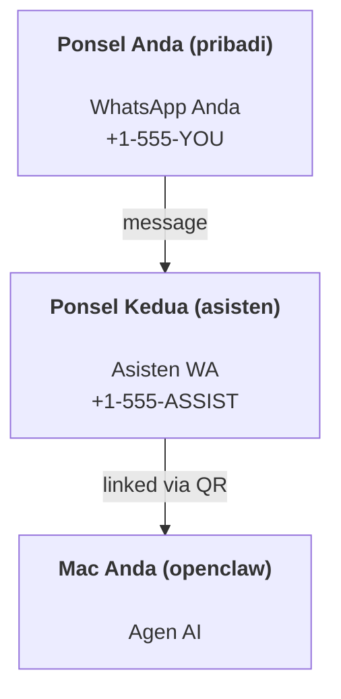

---
read_when:
    - Memulai onboarding instans asisten baru
    - Meninjau implikasi keamanan/izin
summary: Panduan end-to-end untuk menjalankan OpenClaw sebagai asisten pribadi dengan peringatan keselamatan
title: Pengaturan asisten pribadi
x-i18n:
    generated_at: "2026-06-27T18:14:57Z"
    model: gpt-5.5
    postprocess_version: locale-links-v1
    provider: openai
    source_hash: b0cd640872a2a60fd88d2dc3df6d038ef8574163430d8683ef9b67921b0c87f4
    source_path: start/openclaw.md
    workflow: 16
---

OpenClaw adalah gateway yang di-host sendiri yang menghubungkan Discord, Google Chat, iMessage, Matrix, Microsoft Teams, Signal, Slack, Telegram, WhatsApp, Zalo, dan lainnya ke agen AI. Panduan ini mencakup penyiapan "asisten pribadi": nomor WhatsApp khusus yang berperilaku seperti asisten AI Anda yang selalu aktif.

## ⚠️ Keselamatan terlebih dahulu

Anda menempatkan agen pada posisi untuk:

- menjalankan perintah di mesin Anda (tergantung kebijakan tool Anda)
- membaca/menulis file di workspace Anda
- mengirim pesan kembali melalui WhatsApp/Telegram/Discord/Mattermost dan channel bundel lainnya

Mulailah secara konservatif:

- Selalu tetapkan `channels.whatsapp.allowFrom` (jangan pernah menjalankan terbuka-untuk-dunia di Mac pribadi Anda).
- Gunakan nomor WhatsApp khusus untuk asisten.
- Heartbeat sekarang secara default berjalan setiap 30 menit. Nonaktifkan sampai Anda memercayai penyiapan ini dengan menetapkan `agents.defaults.heartbeat.every: "0m"`.

## Prasyarat

- OpenClaw sudah diinstal dan di-onboarding - lihat [Memulai](/id/start/getting-started) jika Anda belum melakukannya
- Nomor telepon kedua (SIM/eSIM/prabayar) untuk asisten

## Penyiapan dua ponsel (direkomendasikan)

Anda menginginkan ini:



Jika Anda menautkan WhatsApp pribadi Anda ke OpenClaw, setiap pesan kepada Anda menjadi "input agen". Itu jarang yang Anda inginkan.

## Mulai cepat 5 menit

1. Pasangkan WhatsApp Web (menampilkan QR; pindai dengan ponsel asisten):

```bash
openclaw channels login
```

2. Mulai Gateway (biarkan tetap berjalan):

```bash
openclaw gateway --port 18789
```

3. Letakkan konfigurasi minimal di `~/.openclaw/openclaw.json`:

```json5
{
  gateway: { mode: "local" },
  channels: { whatsapp: { allowFrom: ["+15555550123"] } },
}
```

Sekarang kirim pesan ke nomor asisten dari ponsel Anda yang masuk allowlist.

Saat onboarding selesai, OpenClaw otomatis membuka dashboard dan mencetak tautan bersih (tanpa token). Jika dashboard meminta autentikasi, tempelkan shared secret yang dikonfigurasi ke pengaturan Control UI. Onboarding menggunakan token secara default (`gateway.auth.token`), tetapi autentikasi kata sandi juga berfungsi jika Anda mengganti `gateway.auth.mode` ke `password`. Untuk membuka kembali nanti: `openclaw dashboard`.

## Beri agen workspace (AGENTS)

OpenClaw membaca instruksi operasi dan "memori" dari direktori workspace-nya.

Secara default, OpenClaw menggunakan `~/.openclaw/workspace` sebagai workspace agen, dan akan membuatnya (ditambah starter `AGENTS.md`, `SOUL.md`, `TOOLS.md`, `IDENTITY.md`, `USER.md`, `HEARTBEAT.md`) secara otomatis saat penyiapan/agent run pertama. `BOOTSTRAP.md` hanya dibuat saat workspace benar-benar baru (seharusnya tidak muncul kembali setelah Anda menghapusnya). `MEMORY.md` bersifat opsional (tidak dibuat otomatis); saat ada, file ini dimuat untuk sesi normal. Sesi subagen hanya menyuntikkan `AGENTS.md` dan `TOOLS.md`.

<Tip>
Perlakukan folder ini seperti memori OpenClaw dan jadikan repo git (idealnya privat) agar `AGENTS.md` dan file memori Anda dicadangkan. Jika git terinstal, workspace yang benar-benar baru akan diinisialisasi otomatis.
</Tip>

```bash
openclaw setup
```

Tata letak workspace lengkap + panduan pencadangan: [Workspace agen](/id/concepts/agent-workspace)
Alur kerja memori: [Memori](/id/concepts/memory)

Opsional: pilih workspace yang berbeda dengan `agents.defaults.workspace` (mendukung `~`).

```json5
{
  agents: {
    defaults: {
      workspace: "~/.openclaw/workspace",
    },
  },
}
```

Jika Anda sudah mengirim file workspace sendiri dari repo, Anda dapat menonaktifkan pembuatan file bootstrap sepenuhnya:

```json5
{
  agents: {
    defaults: {
      skipBootstrap: true,
    },
  },
}
```

## Konfigurasi yang mengubahnya menjadi "asisten"

OpenClaw secara default memakai penyiapan asisten yang baik, tetapi biasanya Anda ingin menyesuaikan:

- persona/instruksi di [`SOUL.md`](/id/concepts/soul)
- default berpikir (jika diinginkan)
- heartbeat (setelah Anda memercayainya)

Contoh:

```json5
{
  logging: { level: "info" },
  agents: {
    defaults: {
      model: { primary: "anthropic/claude-opus-4-6" },
      workspace: "~/.openclaw/workspace",
      thinkingDefault: "high",
      timeoutSeconds: 1800,
      // Start with 0; enable later.
      heartbeat: { every: "0m" },
    },
    list: [
      {
        id: "main",
        default: true,
        groupChat: {
          mentionPatterns: ["@openclaw", "openclaw"],
        },
      },
    ],
  },
  channels: {
    whatsapp: {
      allowFrom: ["+15555550123"],
      groups: {
        "*": { requireMention: true },
      },
    },
  },
  session: {
    scope: "per-sender",
    resetTriggers: ["/new", "/reset"],
    reset: {
      mode: "daily",
      atHour: 4,
      idleMinutes: 10080,
    },
  },
}
```

## Sesi dan memori

- File sesi: `~/.openclaw/agents/<agentId>/sessions/{{SessionId}}.jsonl`
- Metadata sesi (penggunaan token, route terakhir, dll): `~/.openclaw/agents/<agentId>/sessions/sessions.json` (legacy: `~/.openclaw/sessions/sessions.json`)
- `/new` atau `/reset` memulai sesi baru untuk chat tersebut (dapat dikonfigurasi melalui `resetTriggers`). Jika dikirim sendiri, OpenClaw mengakui reset tanpa memanggil model.
- `/compact [instructions]` memadatkan konteks sesi dan melaporkan sisa anggaran konteks.

## Heartbeat (mode proaktif)

Secara default, OpenClaw menjalankan heartbeat setiap 30 menit dengan prompt:
`Read HEARTBEAT.md if it exists (workspace context). Follow it strictly. Do not infer or repeat old tasks from prior chats. If nothing needs attention, reply HEARTBEAT_OK.`
Tetapkan `agents.defaults.heartbeat.every: "0m"` untuk menonaktifkan.

- Jika `HEARTBEAT.md` ada tetapi secara efektif kosong (hanya baris kosong, komentar Markdown/HTML, heading Markdown seperti `# Heading`, penanda fence, atau stub checklist kosong), OpenClaw melewati heartbeat run untuk menghemat panggilan API.
- Jika file tidak ada, heartbeat tetap berjalan dan model memutuskan apa yang harus dilakukan.
- Jika agen membalas dengan `HEARTBEAT_OK` (opsional dengan padding singkat; lihat `agents.defaults.heartbeat.ackMaxChars`), OpenClaw menekan pengiriman keluar untuk heartbeat tersebut.
- Secara default, pengiriman heartbeat ke target bergaya DM `user:<id>` diizinkan. Tetapkan `agents.defaults.heartbeat.directPolicy: "block"` untuk menekan pengiriman target langsung sambil menjaga heartbeat run tetap aktif.
- Heartbeat menjalankan agent turn penuh - interval lebih pendek menghabiskan lebih banyak token.

```json5
{
  agents: {
    defaults: {
      heartbeat: { every: "30m" },
    },
  },
}
```

## Media masuk dan keluar

Lampiran masuk (gambar/audio/dokumen) dapat disajikan ke perintah Anda melalui template:

- `{{MediaPath}}` (path file sementara lokal)
- `{{MediaUrl}}` (pseudo-URL)
- `{{Transcript}}` (jika transkripsi audio diaktifkan)

Lampiran keluar dari agen menggunakan field media terstruktur pada tool pesan atau payload balasan, seperti `media`, `mediaUrl`, `mediaUrls`, `path`, atau `filePath`. Contoh argumen tool pesan:

```json
{
  "message": "Here's the screenshot.",
  "mediaUrl": "https://example.com/screenshot.png"
}
```

OpenClaw mengirim media terstruktur bersama teks. Balasan asisten final legacy mungkin masih dinormalisasi untuk kompatibilitas, tetapi output tool, output browser, blok streaming, dan tindakan pesan tidak mem-parse teks sebagai perintah lampiran.

Perilaku path lokal mengikuti model kepercayaan baca-file yang sama dengan agen:

- Jika `tools.fs.workspaceOnly` adalah `true`, path media lokal keluar tetap dibatasi ke root temp OpenClaw, cache media, path workspace agen, dan file yang dihasilkan sandbox.
- Jika `tools.fs.workspaceOnly` adalah `false`, media lokal keluar dapat menggunakan file host-lokal yang sudah diizinkan untuk dibaca oleh agen.
- Path lokal dapat berupa absolut, relatif-workspace, atau relatif-home dengan `~/`.
- Pengiriman host-lokal tetap hanya mengizinkan media dan jenis dokumen aman (gambar, audio, video, PDF, dokumen Office, dan dokumen teks tervalidasi seperti Markdown/MD, TXT, JSON, YAML, dan YML). Ini adalah perluasan dari batas kepercayaan host-read yang ada, bukan pemindai rahasia: jika agen dapat membaca `secret.txt` atau `config.json` host-lokal, agen dapat melampirkan file tersebut saat ekstensi dan validasi kontennya cocok.

Itu berarti gambar/file yang dihasilkan di luar workspace sekarang dapat dikirim saat kebijakan fs Anda sudah mengizinkan pembacaan tersebut, sementara ekstensi teks host-lokal arbitrer tetap diblokir. Simpan file sensitif di luar sistem file yang dapat dibaca agen, atau pertahankan `tools.fs.workspaceOnly=true` untuk pengiriman path lokal yang lebih ketat.

## Checklist operasi

```bash
openclaw status          # local status (creds, sessions, queued events)
openclaw status --all    # full diagnosis (read-only, pasteable)
openclaw status --deep   # asks the gateway for a live health probe with channel probes when supported
openclaw health --json   # gateway health snapshot (WS; default can return a fresh cached snapshot)
```

Log berada di bawah `/tmp/openclaw/` (default: `openclaw-YYYY-MM-DD.log`).

## Langkah berikutnya

- WebChat: [WebChat](/id/web/webchat)
- Operasi Gateway: [Runbook Gateway](/id/gateway)
- Cron + wakeup: [Pekerjaan Cron](/id/automation/cron-jobs)
- Pendamping bilah menu macOS: [Aplikasi OpenClaw macOS](/id/platforms/macos)
- Aplikasi node iOS: [Aplikasi iOS](/id/platforms/ios)
- Aplikasi node Android: [Aplikasi Android](/id/platforms/android)
- Windows Hub: [Windows](/id/platforms/windows)
- Status Linux: [Aplikasi Linux](/id/platforms/linux)
- Keamanan: [Keamanan](/id/gateway/security)

## Terkait

- [Memulai](/id/start/getting-started)
- [Penyiapan](/id/start/setup)
- [Ikhtisar channel](/id/channels)
