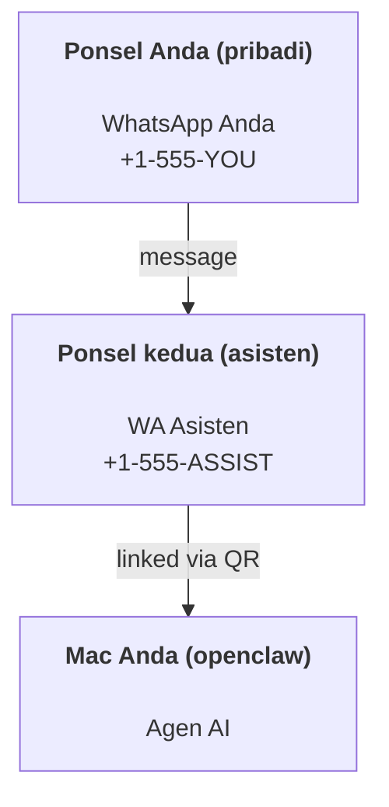

---
read_when:
    - Onboarding instance asisten baru
    - Meninjau implikasi keamanan/izin
summary: Panduan end-to-end untuk menjalankan OpenClaw sebagai asisten pribadi dengan peringatan keamanan
title: Penyiapan asisten pribadi
x-i18n:
    generated_at: "2026-04-24T09:28:24Z"
    model: gpt-5.4
    provider: openai
    source_hash: 3048f2faae826fc33d962f1fac92da3c0ce464d2de803fee381c897eb6c76436
    source_path: start/openclaw.md
    workflow: 15
---

# Membangun asisten pribadi dengan OpenClaw

OpenClaw adalah gateway self-hosted yang menghubungkan Discord, Google Chat, iMessage, Matrix, Microsoft Teams, Signal, Slack, Telegram, WhatsApp, Zalo, dan lainnya ke agen AI. Panduan ini membahas penyiapan "asisten pribadi": nomor WhatsApp khusus yang berperilaku seperti asisten AI Anda yang selalu aktif.

## ⚠️ Utamakan keamanan

Anda menempatkan agen pada posisi untuk:

- menjalankan perintah di mesin Anda (bergantung pada kebijakan tool Anda)
- membaca/menulis file di workspace Anda
- mengirim pesan kembali melalui WhatsApp/Telegram/Discord/Mattermost dan channel bawaan lainnya

Mulailah dengan konservatif:

- Selalu atur `channels.whatsapp.allowFrom` (jangan pernah menjalankan secara terbuka ke seluruh dunia di Mac pribadi Anda).
- Gunakan nomor WhatsApp khusus untuk asisten.
- Heartbeat sekarang default setiap 30 menit. Nonaktifkan sampai Anda memercayai penyiapannya dengan mengatur `agents.defaults.heartbeat.every: "0m"`.

## Prasyarat

- OpenClaw sudah terinstal dan onboarding selesai — lihat [Memulai](/id/start/getting-started) jika Anda belum melakukannya
- Nomor telepon kedua (SIM/eSIM/prabayar) untuk asisten

## Penyiapan dua ponsel (direkomendasikan)

Yang Anda inginkan adalah ini:



Jika Anda menautkan WhatsApp pribadi Anda ke OpenClaw, setiap pesan yang masuk ke Anda akan menjadi “input agen”. Itu jarang menjadi yang Anda inginkan.

## Mulai cepat 5 menit

1. Pair WhatsApp Web (menampilkan QR; pindai dengan ponsel asisten):

```bash
openclaw channels login
```

2. Jalankan Gateway (biarkan tetap berjalan):

```bash
openclaw gateway --port 18789
```

3. Letakkan config minimal di `~/.openclaw/openclaw.json`:

```json5
{
  gateway: { mode: "local" },
  channels: { whatsapp: { allowFrom: ["+15555550123"] } },
}
```

Sekarang kirim pesan ke nomor asisten dari ponsel yang ada di allowlist Anda.

Saat onboarding selesai, OpenClaw otomatis membuka dashboard dan mencetak tautan bersih (tanpa token). Jika dashboard meminta auth, tempelkan shared secret yang dikonfigurasi ke pengaturan Control UI. Onboarding menggunakan token secara default (`gateway.auth.token`), tetapi auth password juga berfungsi jika Anda mengubah `gateway.auth.mode` ke `password`. Untuk membuka lagi nanti: `openclaw dashboard`.

## Beri agen sebuah workspace (AGENTS)

OpenClaw membaca instruksi operasional dan “memory” dari direktori workspace-nya.

Secara default, OpenClaw menggunakan `~/.openclaw/workspace` sebagai workspace agen, dan akan membuatnya (ditambah `AGENTS.md`, `SOUL.md`, `TOOLS.md`, `IDENTITY.md`, `USER.md`, `HEARTBEAT.md` awal) secara otomatis saat setup/run agen pertama. `BOOTSTRAP.md` hanya dibuat saat workspace benar-benar baru (file ini tidak akan muncul lagi setelah Anda menghapusnya). `MEMORY.md` bersifat opsional (tidak dibuat otomatis); jika ada, file ini dimuat untuk sesi normal. Sesi subagen hanya menyuntikkan `AGENTS.md` dan `TOOLS.md`.

Tip: perlakukan folder ini sebagai “memory” OpenClaw dan jadikan repo git (idealnya privat) agar `AGENTS.md` + file memory Anda memiliki cadangan. Jika git terinstal, workspace yang benar-benar baru akan diinisialisasi otomatis.

```bash
openclaw setup
```

Tata letak workspace lengkap + panduan cadangan: [Workspace agen](/id/concepts/agent-workspace)  
Alur kerja memory: [Memory](/id/concepts/memory)

Opsional: pilih workspace yang berbeda dengan `agents.defaults.workspace` (mendukung `~`).

```json5
{
  agent: {
    workspace: "~/.openclaw/workspace",
  },
}
```

Jika Anda sudah menyediakan file workspace sendiri dari sebuah repo, Anda dapat menonaktifkan pembuatan file bootstrap sepenuhnya:

```json5
{
  agent: {
    skipBootstrap: true,
  },
}
```

## Config yang mengubahnya menjadi "asisten"

Default OpenClaw sudah cocok untuk penyiapan asisten yang baik, tetapi biasanya Anda ingin menyetel:

- persona/instruksi di [`SOUL.md`](/id/concepts/soul)
- default thinking (jika diinginkan)
- Heartbeat (setelah Anda mempercayainya)

Contoh:

```json5
{
  logging: { level: "info" },
  agent: {
    model: "anthropic/claude-opus-4-6",
    workspace: "~/.openclaw/workspace",
    thinkingDefault: "high",
    timeoutSeconds: 1800,
    // Mulai dari 0; aktifkan nanti.
    heartbeat: { every: "0m" },
  },
  channels: {
    whatsapp: {
      allowFrom: ["+15555550123"],
      groups: {
        "*": { requireMention: true },
      },
    },
  },
  routing: {
    groupChat: {
      mentionPatterns: ["@openclaw", "openclaw"],
    },
  },
  session: {
    scope: "per-sender",
    resetTriggers: ["/new", "/reset"],
    reset: {
      mode: "daily",
      atHour: 4,
      idleMinutes: 10080,
    },
  },
}
```

## Sesi dan memory

- File sesi: `~/.openclaw/agents/<agentId>/sessions/{{SessionId}}.jsonl`
- Metadata sesi (penggunaan token, rute terakhir, dll.): `~/.openclaw/agents/<agentId>/sessions/sessions.json` (lama: `~/.openclaw/sessions/sessions.json`)
- `/new` atau `/reset` memulai sesi baru untuk chat itu (dapat dikonfigurasi melalui `resetTriggers`). Jika dikirim sendiri, agen membalas dengan sapaan singkat untuk mengonfirmasi reset.
- `/compact [instructions]` melakukan Compaction konteks sesi dan melaporkan anggaran konteks yang tersisa.

## Heartbeat (mode proaktif)

Secara default, OpenClaw menjalankan Heartbeat setiap 30 menit dengan prompt:
`Read HEARTBEAT.md if it exists (workspace context). Follow it strictly. Do not infer or repeat old tasks from prior chats. If nothing needs attention, reply HEARTBEAT_OK.`
Atur `agents.defaults.heartbeat.every: "0m"` untuk menonaktifkan.

- Jika `HEARTBEAT.md` ada tetapi secara efektif kosong (hanya berisi baris kosong dan header markdown seperti `# Heading`), OpenClaw melewati run Heartbeat untuk menghemat panggilan API.
- Jika file tidak ada, Heartbeat tetap berjalan dan model memutuskan apa yang harus dilakukan.
- Jika agen membalas dengan `HEARTBEAT_OK` (opsional dengan padding pendek; lihat `agents.defaults.heartbeat.ackMaxChars`), OpenClaw menekan pengiriman keluar untuk Heartbeat tersebut.
- Secara default, pengiriman Heartbeat ke target gaya DM `user:<id>` diizinkan. Atur `agents.defaults.heartbeat.directPolicy: "block"` untuk menekan pengiriman target langsung sambil tetap mempertahankan run Heartbeat aktif.
- Heartbeat menjalankan giliran agen penuh — interval yang lebih singkat akan menghabiskan lebih banyak token.

```json5
{
  agent: {
    heartbeat: { every: "30m" },
  },
}
```

## Media masuk dan keluar

Lampiran masuk (gambar/audio/dokumen) dapat dimunculkan ke perintah Anda melalui template:

- `{{MediaPath}}` (path file temp lokal)
- `{{MediaUrl}}` (pseudo-URL)
- `{{Transcript}}` (jika transkripsi audio diaktifkan)

Lampiran keluar dari agen: sertakan `MEDIA:<path-or-url>` pada barisnya sendiri (tanpa spasi). Contoh:

```
Ini screenshot-nya.
MEDIA:https://example.com/screenshot.png
```

OpenClaw mengekstraknya dan mengirimnya sebagai media bersama teks.

Perilaku path lokal mengikuti model kepercayaan baca file yang sama seperti agen:

- Jika `tools.fs.workspaceOnly` bernilai `true`, path lokal `MEDIA:` keluar tetap dibatasi ke root temp OpenClaw, cache media, path workspace agen, dan file yang dihasilkan sandbox.
- Jika `tools.fs.workspaceOnly` bernilai `false`, `MEDIA:` keluar dapat menggunakan file lokal host yang memang sudah diizinkan dibaca agen.
- Pengiriman lokal host tetap hanya mengizinkan media dan jenis dokumen aman (gambar, audio, video, PDF, dan dokumen Office). File teks biasa dan file yang menyerupai secret tidak diperlakukan sebagai media yang bisa dikirim.

Artinya gambar/file yang dihasilkan di luar workspace sekarang dapat dikirim ketika kebijakan fs Anda sudah mengizinkan pembacaan tersebut, tanpa membuka kembali eksfiltrasi lampiran teks host yang sewenang-wenang.

## Daftar periksa operasi

```bash
openclaw status          # status lokal (kredensial, sesi, peristiwa dalam antrean)
openclaw status --all    # diagnosis penuh (read-only, bisa ditempel)
openclaw status --deep   # meminta gateway melakukan probe kesehatan live dengan probe channel bila didukung
openclaw health --json   # snapshot kesehatan gateway (WS; default dapat mengembalikan snapshot cache baru)
```

Log berada di `/tmp/openclaw/` (default: `openclaw-YYYY-MM-DD.log`).

## Langkah berikutnya

- WebChat: [WebChat](/id/web/webchat)
- Operasi Gateway: [Runbook Gateway](/id/gateway)
- Cron + wakeup: [Pekerjaan Cron](/id/automation/cron-jobs)
- Pendamping bilah menu macOS: [Aplikasi macOS OpenClaw](/id/platforms/macos)
- Aplikasi node iOS: [Aplikasi iOS](/id/platforms/ios)
- Aplikasi node Android: [Aplikasi Android](/id/platforms/android)
- Status Windows: [Windows (WSL2)](/id/platforms/windows)
- Status Linux: [Aplikasi Linux](/id/platforms/linux)
- Keamanan: [Keamanan](/id/gateway/security)

## Terkait

- [Memulai](/id/start/getting-started)
- [Setup](/id/start/setup)
- [Ikhtisar channel](/id/channels)
