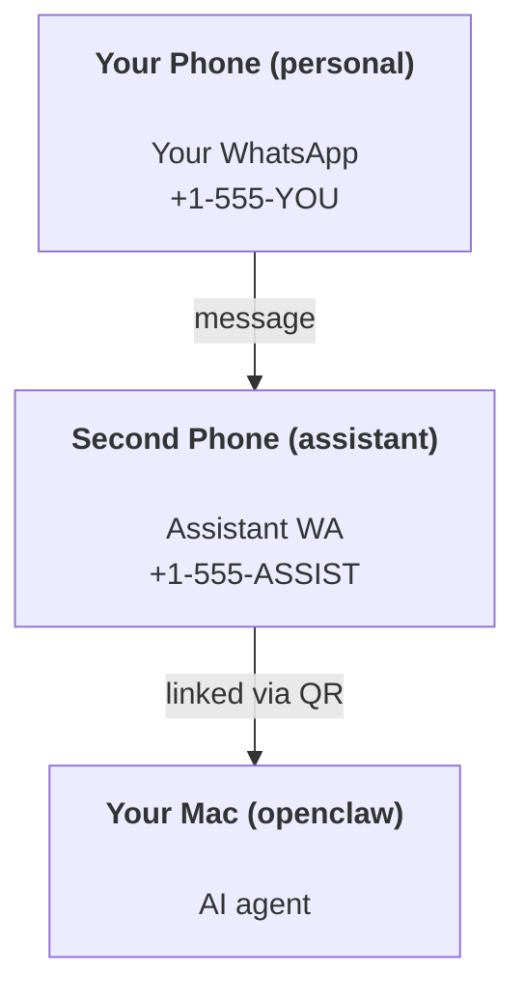

---
read_when:
    - Orientasi instans asisten baru
    - Meninjau implikasi keamanan/izin
summary: Panduan menyeluruh untuk menjalankan OpenClaw sebagai asisten pribadi dengan peringatan keselamatan
title: Penyiapan asisten pribadi
x-i18n:
    generated_at: "2026-04-30T10:12:33Z"
    model: gpt-5.5
    provider: openai
    source_hash: b0614272f9a2b30e0900c55b39a8bd6a2b71b9f5d5fbf0fe00c534b91193e6a0
    source_path: start/openclaw.md
    workflow: 16
---

# Membangun asisten pribadi dengan OpenClaw

OpenClaw adalah Gateway yang di-host sendiri yang menghubungkan Discord, Google Chat, iMessage, Matrix, Microsoft Teams, Signal, Slack, Telegram, WhatsApp, Zalo, dan lainnya ke agen AI. Panduan ini membahas penyiapan "asisten pribadi": nomor WhatsApp khusus yang berperilaku seperti asisten AI Anda yang selalu aktif.

## ⚠️ Utamakan keselamatan

Anda menempatkan agen dalam posisi untuk:

- menjalankan perintah di mesin Anda (tergantung kebijakan alat Anda)
- membaca/menulis file di workspace Anda
- mengirim pesan kembali melalui WhatsApp/Telegram/Discord/Mattermost dan channel bawaan lainnya

Mulai secara konservatif:

- Selalu tetapkan `channels.whatsapp.allowFrom` (jangan pernah menjalankan yang terbuka untuk semua orang di Mac pribadi Anda).
- Gunakan nomor WhatsApp khusus untuk asisten.
- Heartbeat kini default setiap 30 menit. Nonaktifkan sampai Anda memercayai penyiapan dengan menetapkan `agents.defaults.heartbeat.every: "0m"`.

## Prasyarat

- OpenClaw sudah terpasang dan selesai onboarding — lihat [Memulai](/id/start/getting-started) jika Anda belum melakukannya
- Nomor telepon kedua (SIM/eSIM/prabayar) untuk asisten

## Penyiapan dua ponsel (direkomendasikan)

Yang Anda inginkan adalah ini:



Jika Anda menautkan WhatsApp pribadi Anda ke OpenClaw, setiap pesan kepada Anda menjadi “input agen”. Itu jarang menjadi hal yang Anda inginkan.

## Mulai cepat 5 menit

1. Pasangkan WhatsApp Web (menampilkan QR; pindai dengan ponsel asisten):

```bash
openclaw channels login
```

2. Mulai Gateway (biarkan tetap berjalan):

```bash
openclaw gateway --port 18789
```

3. Letakkan konfigurasi minimal di `~/.openclaw/openclaw.json`:

```json5
{
  gateway: { mode: "local" },
  channels: { whatsapp: { allowFrom: ["+15555550123"] } },
}
```

Sekarang kirim pesan ke nomor asisten dari ponsel yang ada di daftar izin Anda.

Saat onboarding selesai, OpenClaw otomatis membuka dashboard dan mencetak tautan yang bersih (tanpa token). Jika dashboard meminta auth, tempelkan shared secret yang dikonfigurasi ke pengaturan Control UI. Onboarding menggunakan token secara default (`gateway.auth.token`), tetapi auth password juga berfungsi jika Anda mengubah `gateway.auth.mode` ke `password`. Untuk membuka lagi nanti: `openclaw dashboard`.

## Berikan workspace kepada agen (AGENTS)

OpenClaw membaca instruksi operasi dan “memori” dari direktori workspace-nya.

Secara default, OpenClaw menggunakan `~/.openclaw/workspace` sebagai workspace agen, dan akan membuatnya (plus starter `AGENTS.md`, `SOUL.md`, `TOOLS.md`, `IDENTITY.md`, `USER.md`, `HEARTBEAT.md`) secara otomatis saat penyiapan/eksekusi agen pertama. `BOOTSTRAP.md` hanya dibuat ketika workspace benar-benar baru (file itu seharusnya tidak muncul kembali setelah Anda menghapusnya). `MEMORY.md` bersifat opsional (tidak dibuat otomatis); jika ada, file ini dimuat untuk sesi normal. Sesi subagen hanya menyuntikkan `AGENTS.md` dan `TOOLS.md`.

<Tip>
Perlakukan folder ini seperti memori OpenClaw dan jadikan repo git (idealnya privat) agar `AGENTS.md` dan file memori Anda dicadangkan. Jika git terpasang, workspace yang benar-benar baru akan diinisialisasi otomatis.
</Tip>

```bash
openclaw setup
```

Tata letak workspace lengkap + panduan pencadangan: [Workspace agen](/id/concepts/agent-workspace)
Alur kerja memori: [Memori](/id/concepts/memory)

Opsional: pilih workspace lain dengan `agents.defaults.workspace` (mendukung `~`).

```json5
{
  agents: {
    defaults: {
      workspace: "~/.openclaw/workspace",
    },
  },
}
```

Jika Anda sudah mengirimkan file workspace sendiri dari repo, Anda dapat menonaktifkan pembuatan file bootstrap sepenuhnya:

```json5
{
  agents: {
    defaults: {
      skipBootstrap: true,
    },
  },
}
```

## Konfigurasi yang mengubahnya menjadi "asisten"

OpenClaw default ke penyiapan asisten yang baik, tetapi biasanya Anda ingin menyesuaikan:

- persona/instruksi di [`SOUL.md`](/id/concepts/soul)
- default berpikir (jika diinginkan)
- Heartbeat (setelah Anda memercayainya)

Contoh:

```json5
{
  logging: { level: "info" },
  agent: {
    model: "anthropic/claude-opus-4-6",
    workspace: "~/.openclaw/workspace",
    thinkingDefault: "high",
    timeoutSeconds: 1800,
    // Start with 0; enable later.
    heartbeat: { every: "0m" },
  },
  channels: {
    whatsapp: {
      allowFrom: ["+15555550123"],
      groups: {
        "*": { requireMention: true },
      },
    },
  },
  routing: {
    groupChat: {
      mentionPatterns: ["@openclaw", "openclaw"],
    },
  },
  session: {
    scope: "per-sender",
    resetTriggers: ["/new", "/reset"],
    reset: {
      mode: "daily",
      atHour: 4,
      idleMinutes: 10080,
    },
  },
}
```

## Sesi dan memori

- File sesi: `~/.openclaw/agents/<agentId>/sessions/{{SessionId}}.jsonl`
- Metadata sesi (penggunaan token, rute terakhir, dll.): `~/.openclaw/agents/<agentId>/sessions/sessions.json` (legacy: `~/.openclaw/sessions/sessions.json`)
- `/new` atau `/reset` memulai sesi baru untuk chat tersebut (dapat dikonfigurasi melalui `resetTriggers`). Jika dikirim sendirian, OpenClaw mengakui reset tanpa memanggil model.
- `/compact [instructions]` memadatkan konteks sesi dan melaporkan sisa anggaran konteks.

## Heartbeat (mode proaktif)

Secara default, OpenClaw menjalankan Heartbeat setiap 30 menit dengan prompt:
`Read HEARTBEAT.md if it exists (workspace context). Follow it strictly. Do not infer or repeat old tasks from prior chats. If nothing needs attention, reply HEARTBEAT_OK.`
Tetapkan `agents.defaults.heartbeat.every: "0m"` untuk menonaktifkan.

- Jika `HEARTBEAT.md` ada tetapi secara efektif kosong (hanya baris kosong dan header markdown seperti `# Heading`), OpenClaw melewati eksekusi Heartbeat untuk menghemat panggilan API.
- Jika file tidak ada, Heartbeat tetap berjalan dan model memutuskan apa yang harus dilakukan.
- Jika agen membalas dengan `HEARTBEAT_OK` (opsional dengan padding singkat; lihat `agents.defaults.heartbeat.ackMaxChars`), OpenClaw menekan pengiriman keluar untuk Heartbeat tersebut.
- Secara default, pengiriman Heartbeat ke target bergaya DM `user:<id>` diizinkan. Tetapkan `agents.defaults.heartbeat.directPolicy: "block"` untuk menekan pengiriman target langsung sambil tetap menjaga eksekusi Heartbeat aktif.
- Heartbeat menjalankan giliran agen penuh — interval yang lebih pendek menghabiskan lebih banyak token.

```json5
{
  agent: {
    heartbeat: { every: "30m" },
  },
}
```

## Media masuk dan keluar

Lampiran masuk (gambar/audio/dokumen) dapat ditampilkan ke perintah Anda melalui template:

- `{{MediaPath}}` (path file temp lokal)
- `{{MediaUrl}}` (URL semu)
- `{{Transcript}}` (jika transkripsi audio diaktifkan)

Lampiran keluar dari agen: sertakan `MEDIA:<path-or-url>` pada barisnya sendiri (tanpa spasi). Contoh:

```
Here’s the screenshot.
MEDIA:https://example.com/screenshot.png
```

OpenClaw mengekstraknya dan mengirimkannya sebagai media bersama teks.

Perilaku path lokal mengikuti model kepercayaan baca file yang sama dengan agen:

- Jika `tools.fs.workspaceOnly` adalah `true`, path lokal `MEDIA:` keluar tetap dibatasi ke root temp OpenClaw, cache media, path workspace agen, dan file yang dihasilkan sandbox.
- Jika `tools.fs.workspaceOnly` adalah `false`, `MEDIA:` keluar dapat menggunakan file lokal host yang sudah diizinkan untuk dibaca oleh agen.
- Pengiriman lokal host tetap hanya mengizinkan media dan jenis dokumen aman (gambar, audio, video, PDF, dan dokumen Office). File teks biasa dan file yang tampak seperti rahasia tidak diperlakukan sebagai media yang dapat dikirim.

Artinya gambar/file yang dihasilkan di luar workspace kini dapat dikirim ketika kebijakan fs Anda sudah mengizinkan pembacaan tersebut, tanpa membuka kembali eksfiltrasi lampiran teks host sembarangan.

## Checklist operasi

```bash
openclaw status          # local status (creds, sessions, queued events)
openclaw status --all    # full diagnosis (read-only, pasteable)
openclaw status --deep   # asks the gateway for a live health probe with channel probes when supported
openclaw health --json   # gateway health snapshot (WS; default can return a fresh cached snapshot)
```

Log berada di bawah `/tmp/openclaw/` (default: `openclaw-YYYY-MM-DD.log`).

## Langkah berikutnya

- WebChat: [WebChat](/id/web/webchat)
- Operasi Gateway: [Runbook Gateway](/id/gateway)
- Cron + wakeup: [Cron jobs](/id/automation/cron-jobs)
- Pendamping menu bar macOS: [Aplikasi macOS OpenClaw](/id/platforms/macos)
- Aplikasi Node iOS: [Aplikasi iOS](/id/platforms/ios)
- Aplikasi Node Android: [Aplikasi Android](/id/platforms/android)
- Status Windows: [Windows (WSL2)](/id/platforms/windows)
- Status Linux: [Aplikasi Linux](/id/platforms/linux)
- Keamanan: [Keamanan](/id/gateway/security)

## Terkait

- [Memulai](/id/start/getting-started)
- [Penyiapan](/id/start/setup)
- [Ikhtisar channel](/id/channels)
